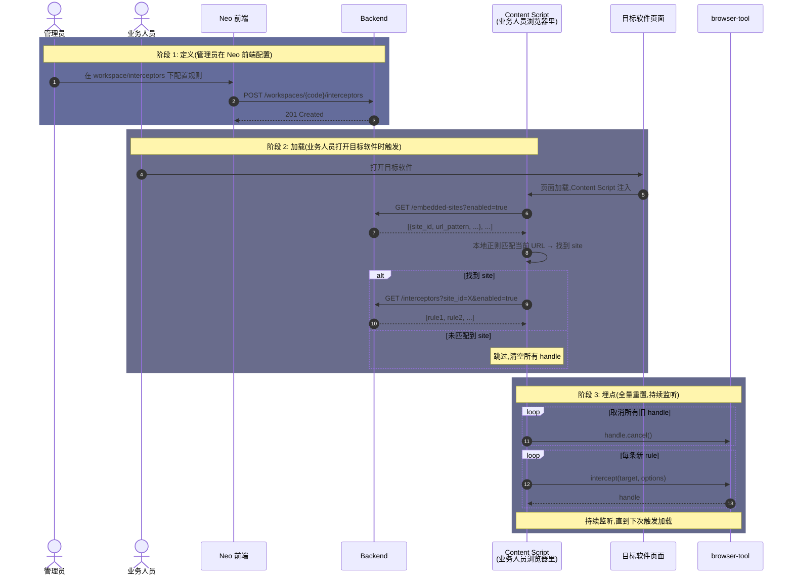

# Intercept 拦截器技术设计

> **browser-tool 的能力扩展** —— 与 `click` / `fill` / `type` 同级的原子操作,只是语义更重(持续监听 + 自动决策)。

---

## 1. 背景

[browser-tool.md](./browser-tool.md) 定义了 `click` / `fill` / `type` / `press` / `hover` / `drag` / `select` / `scroll` 等原子操作。这些操作都是"调用方发一次指令,CS 立即在目标元素上执行一次动作"。

但**业务事件采集**和**敏感操作二次确认**需要的能力是反过来的:

- 不是"我去点这个按钮",而是"**这个按钮被点时**通知我(或阻止)"
- 不是"立刻发生",而是"**持续监听**直到我取消"
- 不是"无脑执行",而是"按 before / after 流程编排动作"

这就是 `intercept` 这个原子操作 —— **抽象层级跟 `click` 完全一致,只是从"主动执行"变成"被动监听 + 决策编排"**。

把它独立成"模块"会引入不必要的心智负担;放进 `browser-tool` 是更合理的位置。

---

## 2. 目标

1. **API 形态对齐 `click` / `fill`**: `intercept(target, options)` 是底层原子操作,上层"规则引擎"是业务概念,不在 API 层体现
2. **支持 DOM 元素 + 网络请求两种 target**: 统一抽象,不同实现
3. **模式支持按 target 区分**:
   - **DOM 拦截**:`observe` / `intercept` 两种模式(`observe` 默认)
   - **网络拦截**:**仅支持 `observe` 模式**,intercept 模式永久不做(见 §6.4)
4. **before / after Action 编排**: 跟 product 文档定义的 Event/Status 采集流程对齐
5. **可取消**: 返回 `InterceptHandle`,调用方随时 `cancel()` 停止监听

---

## 3. 抽象签名

```ts
// 与 click(target) / fill(target, value) / type(target, text) 同级

// DOM 拦截
function intercept(
  target: DomTarget,
  options: InterceptOptions
): Promise<InterceptHandle>;

// 网络拦截
function intercept(
  target: NetworkTarget,
  options: InterceptOptions
): Promise<InterceptHandle>;
```

**API 风格对比**:

| 操作 | 抽象签名 | 触发时机 | 阻塞原行为 |
|------|---------|---------|----------|
| `fill(target, value)` | `action(target, value)` | 立即一次 | 是(主动执行) |
| `intercept(target, opts)` | `action(target, options)` | 持续监听 | DOM: observe 否 / intercept 是 / **网络: 否(永久)** |

---

## 4. API 设计

### 4.1 Options

```ts
interface InterceptOptions {
  /** 事件名,after 动作里生成 Event 时使用 */
  eventName: string;

  /** 拦截模式,默认 'observe' */
  mode?: 'observe' | 'intercept';

  /** 被拦截/操作的实体名(主语)。必填,后续 collect_event / collect_status 直接用作 Event.entity_name / Status.entity_name,不再动态抽取 */
  entityName: string;

  /** 操作的目标实体名(宾语)。选填,只有"操作另一个实体"的场景需要(如"把线索分配给张三") */
  targetEntityName?: string;

  /** before 动作:target 触发前执行 */
  beforeActions?: Action[];

  /** after 动作:target 触发后执行 */
  afterActions?: Action[];

  /** 页面 URL 正则,限定生效范围(DOM 模式) */
  pageUrlPattern?: string;

  /** 触发后,是否锁定一段时间防重入(ms),默认 1000 */
  debounceMs?: number;
}
```

> **entityName / targetEntityName 是静态字符串**(不动态抽取)。如果将来要支持动态(如"每次点不同 lead,lead_id 从 URL 提取"),再加模板变量机制——见 §8.4 未决问题。

### 4.2 Action 类型(与 product 文档对齐)

```ts
type Action =
  | { type: 'collect_event', config: { actor: string, metadata?: Record<string, any> } }
  | { type: 'collect_status', config: { entityName: string, attributes: Record<string, string> } }
  | { type: 'call_agent', config: { endpoint: string, timeoutMs?: number } }
  | { type: 'show_confirm', config: { title: string, body: string, confirmLabel?: string, cancelLabel?: string } }
  | { type: 'show_toast', config: { message: string, level?: 'info'|'warn'|'error' } };
```

`attributes: Record<string, string>` 的 value 是 XPath 表达式(从 DOM 提取状态字段),后端 schema 跟 product 文档一致。

### 4.3 Target 格式

```ts
// DOM Target 沿用 browser-tool 现有格式
type DomTarget = string | Element | (() => Element | null);
//  - string: CSS selector / id (e1/e2...)
//  - Element: 直接传元素
//  - function: lazy 解析(适合动态元素)

// Network Target
type NetworkTarget =
  | string                            // 简写: URL pattern
  | { urlPattern: string, method?: 'GET'|'POST'|'PUT'|'DELETE'|'PATCH' };
```

### 4.4 返回值

```ts
interface InterceptHandle {
  /** 取消监听 */
  cancel(): void;

  /** 已触发次数(observe: 实际触发;intercept: 放行次数) */
  readonly triggered: number;

  /** 最后一次触发的 before/after 执行结果 */
  readonly lastResult?: {
    beforeOk: boolean;
    afterOk: boolean;
    error?: string;
  };
}
```

---

## 5. 内部架构

### 5.1 DOM 拦截(Content Script 内自洽)

跟 `click` 实现思路一致,**只是把"主动执行"换成"被动监听 + 决策编排"**。

**核心伪代码**:

```
interceptDom(target, options) → handle:
  handler = (e) =>
    if 防重入锁定 in effect     → return
    if URL pattern 不匹配       → return
    if mode == 'intercept':
      e.preventDefault(); e.stopPropagation()
    await runActions(beforeActions)             # 同步,失败则中断
    if mode == 'intercept':
      browser-tool.click(target)                # 编程式重放,isTrusted: true
    runActions(afterActions)                    # 异步 fire-and-forget
    设防重入锁 1s

  document.addEventListener('click', handler, { capture, passive: false })
  return handle { cancel(), triggered }
```

**关键点**:

- 事件委托挂在 `document`,XPath/CSS selector 都不需要重绑,SPA 路由自动适配
- `observe` 不调 `preventDefault`,原 click 正常走
- `intercept` 调 `preventDefault` + `stopPropagation`,after 完成后用 `browser-tool.click()` 编程式重放(保留 `isTrusted: true`)
- 防重入:1s 内同元素重复 click 第二次起忽略
- `handle` 通过闭包暴露 `triggered` 计数器和 `cancel()`

### 5.2 网络拦截(需 Page World 注入)

**为什么不能直接在 Content Script 实现**:

Content Script 跑在 isolated world,重写 `window.fetch` / `XMLHttpRequest` **对页面代码无效** —— 页面访问的是 page world 的原始 fetch,扩展重写的是孤立的引用。这是浏览器扩展拦截网络最容易踩的坑。

**正确做法**: 用 `chrome.scripting.executeScript({ world: 'MAIN' })` 把 hook 脚本注入到 page world。

```
┌─────────────────────────────────────────────────────────────┐
│ Isolated World (Content Script)                              │
│   - browser-tool.intercept({type:'network', ...})           │
│   - 监听 window.message                                      │
│   - 匹配规则,执行 before/after actions                      │
└────────────────────────────────────┬────────────────────────┘
                                     │ window.postMessage
                                     ▼
┌─────────────────────────────────────────────────────────────┐
│ Main World (Page JS)                                         │
│   - hook.js 替换 window.fetch / XHR                         │
│   - 每次请求 fire-and-forget postMessage                     │
│   - 拦截决策(仅 intercept 模式需要): 等 CS 决策再放行         │
└─────────────────────────────────────────────────────────────┘
```

### 5.3 Page World Hook 脚本

作为独立 chunk 通过 WXT `defineUnlistedScript` 注入,`document_start` 阶段执行。

**核心逻辑(伪代码)**:

```
// 替换 window.fetch
originalFetch = window.fetch
window.fetch = (input, init) =>
  postMessage({ tag, phase: 'before', kind: 'fetch', method, url, body })   # fire-and-forget
  return originalFetch(input, init)                                          # 放行,不等决策

// 替换 XMLHttpRequest
originalOpen = XMLHttpRequest.prototype.open
originalSend = XMLHttpRequest.prototype.send
XMLHttpRequest.prototype.open = (method, url, ...) =>
  this.__meta__ = { method, url }                                            # 暂存供 send 读取
  originalOpen.call(this, method, url, ...)

XMLHttpRequest.prototype.send = (body) =>
  if this.__meta__:
    postMessage({ tag, phase: 'before', kind: 'xhr', method, url, body })   # fire-and-forget
  return originalSend.call(this, body)                                       # 放行
```

**关键点**:

- 用 `defineUnlistedScript` 注入,`document_start` 执行,在页面脚本之前
- 替换前**必须**保存原函数引用,否则陷入无限递归
- 替换后**只**追加 `postMessage`,原 fetch/XHR 调用**完全透传**,hook 不影响正常业务
- `postMessage` 用 namespace tag(如 `__neo_intercept__`),Content Script 端按 tag 过滤
- body 序列化要小心(FormData、Blob、ReadableStream 不可直接结构化克隆,需走简化提取)
- **不放行不阻断**的设计让 hook 永远是零风险:即使 CS 崩了、扩展被禁用、消息发不出去,原请求都不受影响

**关于 intercept 模式的 async 决策**:

observe 模式 fire-and-forget 即可(默认行为,零风险);intercept 模式需要 hook 脚本**同步等待** CS 决策 —— 这会把异步传染到所有 fetch,性能开销大,默认不开。详见 §6.4。

### 5.4 跨世界通信协议

由于网络拦截永久不做 intercept 模式(见 §6.4),CS 端不主动决策,**只需要 Page World 单向通知** CS。

```ts
// Page World → Content Script(单向,无响应)
type FromPage =
  | { tag: '__neo_intercept__', phase: 'before', kind: 'fetch'|'xhr', method: string, url: string, body: any, requestId: string }
  | { tag: '__neo_intercept__', phase: 'after',  kind: 'fetch'|'xhr', requestId: string, status: number };
```

**关键约定**:

- `tag` 字段是 namespace,Content Script 端 `addEventListener('message')` 按 tag 过滤
- `requestId` 是 UUID v4,用于把"before"和"after"配对
- `phase: 'after'` **不是为 intercept 模式准备**,observe 模式也需要 —— 用于记录请求完成状态(成功/失败/响应码),让 Event 采集更完整
- **没有** `FromCS` 方向的消息(无决策需要回写),`after` 消息也是单向
- Content Script 端不主动向 page world 写消息,降低被 page world 恶意代码伪造或干扰的风险

---

## 6. 设计决策

- 扩展browser-tool, 增加`intercept`方法，不做独立模块
- 默认采用observe模式，如需intecept模式, 显示调用
- 网络拦截必须 page world 注入, 这是浏览器扩展的标准安全模型,没有绕过方式。`chrome.scripting.executeScript({ world: 'MAIN' })` 是唯一标准做法。
- 网络拦截: 仅 observe 模式,intercept 永久不做, 这是目前的产品决策，主要考虑的是投入产出较低
- DOM intercept 模式下,如果 `show_confirm` / `call_agent` 一直不响应,必须超时放行,避免页面卡死。**默认超时 5s**,放行原行为并写一条 warn 日志。

- Action 编排的执行语义
  - before 动作: 顺序执行(可用 await 串起来),任一失败则中断
  - 原行为触发: observe 不阻断 / intercept 编程式重放
  - after 动作:  fire-and-forget 异步执行,不阻塞 handle
  - 设计取舍: before 必须同步成功(否则原行为没有依据);after 是"事后补全",失败也无所谓。

---

## 7. 限制

| 限制 | 说明 |
|------|------|
| ❌ 跨域 iframe | 浏览器安全边界,Content Script 注入受限(跟现有 browser-tool 一致) |
| ❌ network intercept 模式 | **永久不做**,网络拦截仅 observe 模式,见 §6.4 |
| ❌ response body 改写 | 同上,observe 模式只读,不改写 |
| ❌ 改写 request body | 同上,observe 模式只读,不改写 |
| ⚠️ Shadow DOM 边界 | closed shadow root 不可访问,open shadow root 可访问 |
| ⚠️ Performance | 网络 hook 注入后所有 fetch/XHR 都过一遍 message 通道,毫秒级开销 |
| ⚠️ 重复绑定 | 同 target 多次 `intercept` 不会去重,各自触发,调用方自己管理 |
| ⚠️ 防重入窗口 | 默认 1s,防止快速连点;如需更短/更长,显式传 `debounceMs` |

---

## 8. 管理过程

interceptor 跟其他 workspace 数据对象(embedded-sites / events / status)一样,需要**定义 → 加载 → 埋点**三个阶段。本章聚焦"agent-steer 怎么用本 API 完成管理",不涉及 Neo 前端/后端的产品设计(那是产品文档的事)。

### 8.1 三阶段职责

| 阶段 | 做什么 | 在哪做 | 谁触发 |
|------|--------|--------|--------|
| **定义** | 在 Neo 前端 workspace 下的 `interceptors` 菜单配置规则 | Neo 前端 + 后端 API | **管理员** |
| **加载** | 业务人员浏览器里,Content Script 拉取当前页面匹配的 interceptors | 业务人员浏览器的 Content Script | **业务人员** 打开目标软件页面 |
| **埋点** | 调 browser-tool 的 `intercept()` 注册监听 | 业务人员浏览器的 Content Script + browser-tool | 加载阶段自动衔接 |

### 8.2 数据流(时序图)



### 8.3 关键设计决策(本节定调)

| 决策 | 结论 | 理由 |
|------|------|------|
| **数据模型** | `Interceptor = Rule`(平铺) | 单表,心智简单 |
| **归属** | Interceptor 挂在 Site 下(`site_id` 外键) | 隔离天然,加载逻辑清晰 |
| **URL → Site 匹配** | Content Script 本地缓存 site 列表,本地正则 | site 列表变化频率低,避免每次都查后端 |
| **加载策略** | **全量重置** | 每次拉取都 `cancel()` 所有旧 handle + 重新 `intercept()`。实现简单,保证"前端状态 = 后端状态",不会出现"已禁用规则还在触发"或"重复监听" |
| **加载时机** | (1) Content Script 启动 (2) URL 变化 (3) 30s 定时刷新 | 覆盖"首次进入 / SPA 路由 / 后端规则更新" |
| **网络拦截模式** | **永久 observe,intercept 不做** | 详见 §6.4 |

### 8.4 未决问题(留待后续,本节不展开)

- Action 字段值的填法:静态字符串 / DOM XPath 提取 / URL 模板提取 —— 怎么统一表达
- Action 扩展机制:硬编码 / 注册表 / 插件化
- 启用/禁用 UI、测试工具、审计日志
- 动态 entityName:目前是静态字符串,如果业务上需要"每次拦截不同实体"(如"每次分配不同 lead"),需加模板变量或 context 抽取机制

> **Action Player 的设计与各 action 实现方案**已迁到独立文档 [Action Player (AP) 技术设计](./action-player)。本节(§8)只讲管理过程,§8.5 不再单独存在。

---

## 9. 相关文档

- [browser-tool 技术设计](./browser-tool) - 现有原子操作 API 列表、Target 格式
- [Browser Bridge 详细设计](./browser-bridge) - 与 agent-server 的通信协议
- [Agent Steer 产品设计](../../product/agent-steer) - Event / Status / Interception 三元组定义
- [neo-agents 工程架构](./neo-agents) - agent-server 集成方式
- [Action Player (AP) 技术设计](./action-player) - action 执行器(§8.5 迁移到这里)
