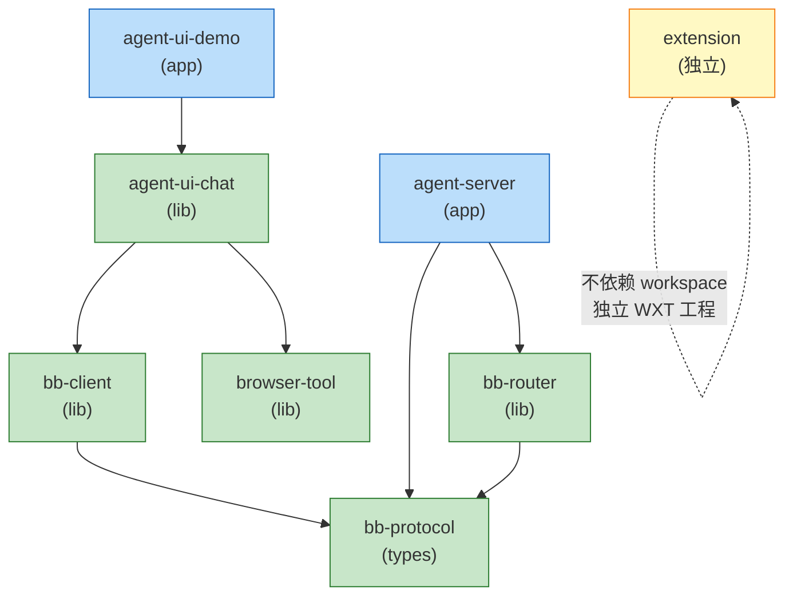

# Neo Agents 工程描述

> `neo-agents/` 是构建 agent-steer 产品的**工程 monorepo**。本文档讲**工程结构**:目录、技术栈、依赖、构建命令,不讲具体组件设计。

---

## 1. 物理目录

```
neo-agents/
├── agent-server/             # @agegr/pi-web-backend (Next.js API)
├── extension/                # Chrome Extension (WXT, npm name: agent-steer)
├── agent-ui/                 # ⏳ 规划中(仅 AGENTS.md,无 package.json)
├── agent-ui-chat/            # @agegr/agent-ui-chat (Vite library)
├── agent-ui-demo/            # agent-ui-chat 的测试应用
├── browser-tool/             # @agegr/browser-tool (Vite library)
├── browser-bridge/           # WS 协议层
│   ├── bb-protocol/          # @agegr/bb-protocol (类型,3 个包的单一源)
│   ├── bb-client/            # @agegr/bb-client (浏览器端 WS 客户端)
│   └── bb-router/            # @agegr/bb-router (agent-server 内置模块)
├── websocket-example/        # BBP 协议验证 example
├── docs/                     # 工程内文档
├── hooks/                    # git hooks (pre-commit: typecheck + lint + test)
├── script/                   # 启动脚本
├── package.json              # monorepo 根 + 公共 scripts
├── pnpm-workspace.yaml       # workspace 声明
└── Makefile                  # 顶层构建入口
```

`extension/` 是 monorepo 的 git 子模块(从历史 `agent-steer/` 改名,git mv 保留历史)。

---

## 2. 技术栈

| 维度 | 选型 |
|------|------|
| 包管理 | pnpm workspace(7 个包在 `pnpm-workspace.yaml` 内) |
| 后端 | Next.js 16 + TypeScript |
| 前端库 | Vite 6 + React 19 + TypeScript (strict) |
| Chrome Extension | WXT |
| 样式 | Tailwind v4 + Radix UI |
| LLM SDK | `@earendil-works/pi-coding-agent` (^0.79.0) |
| 协议 | 自研 BBP (WebSocket + JSON) |
| 测试 | vitest + happy-dom(库),Playwright(E2E) |
| Node | >= 20 |

**全 monorepo 强制单一 TypeScript 版本**:`pnpm-workspace.yaml` 的 `overrides.typescript: "^5.9.0"`,避免 lib.dom.d.ts 版本错位。

---

## 3. workspace 依赖关系



**关键点**:

- `bb-protocol` 是**类型单一源**,`bb-client` / `bb-router` / `agent-server` 都依赖它
- `agent-server` 集成 `bb-router` 作为内置模块(同进程,不走网络)
- `agent-ui-chat` 同时依赖 `bb-client`(通信) + `browser-tool`(DOM 操作)
- **`extension/` 不在 pnpm-workspace 内**——独立 WXT 工程,通过 npm 引用 `@agegr/bb-client` / `@agegr/bb-router` 的预构建产物(或本地路径)
- `agent-ui/` **不在 workspace 内**——规划中,无 package.json

---

## 4. 构建命令(Makefile 顶层)

| 命令 | 作用 |
|------|------|
| `make help` | 列出所有 target |
| `make install` / `make deps` | `pnpm install` 装所有依赖 |
| `make dev` | 并行跑 `agent-server` (`:30141`) + `agent-ui-demo` (`:30145`) |
| `make dev-server` / `make dev-demo` / `make dev-browser-tool` | 单跑某个服务 |
| `make dev-bb-client` / `make dev-bb-router` | 监视模式构建 bb-* 包 |
| `make build` | 构建所有包 |
| `make typecheck` | 全 monorepo `tsc --noEmit` |
| `make lint` | 全 monorepo `eslint .` |
| `make test` | 跑 `browser-tool` + `bb-protocol` 单元测试 |
| `make start` | 跑生产构建的 `agent-server` (`:30141`) |
| `make clean` | 删 `dist/` 和 `.next/` |
| `make tree` | 打印目录树(深度 3,排除 `node_modules/`) |
| `make info` | 打印各包 name / version / port |

**质量门禁**:`hooks/pre-commit` 自动跑 `agent-server` typecheck + `browser-tool` lint + `agent-server` test,通过才允许 commit。

---

## 5. 包与端口速查

| 包 | npm name | 版本 | 类型 | 端口 |
|----|----------|------|------|------|
| `agent-server/` | `@agegr/pi-web-backend` | 0.6.16 | app | **30141** |
| `extension/` | `agent-steer` | 0.0.0 | ext | dev **3030** |
| `agent-ui-chat/` | `@agegr/agent-ui-chat` | 0.1.0 | lib | — |
| `browser-tool/` | `@agegr/browser-tool` | 0.3.0 | lib | demo **30148** |
| `browser-bridge/bb-client/` | `@agegr/bb-client` | 0.2.0 | lib | — |
| `agent-ui-demo/` | `agent-ui-demo` | (从 package.json) | app | **30145** |

`agent-ui/` (规划中,`:30143`) / `bb-protocol` / `bb-router` 版本见各自 `package.json`。
