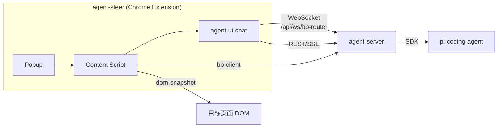
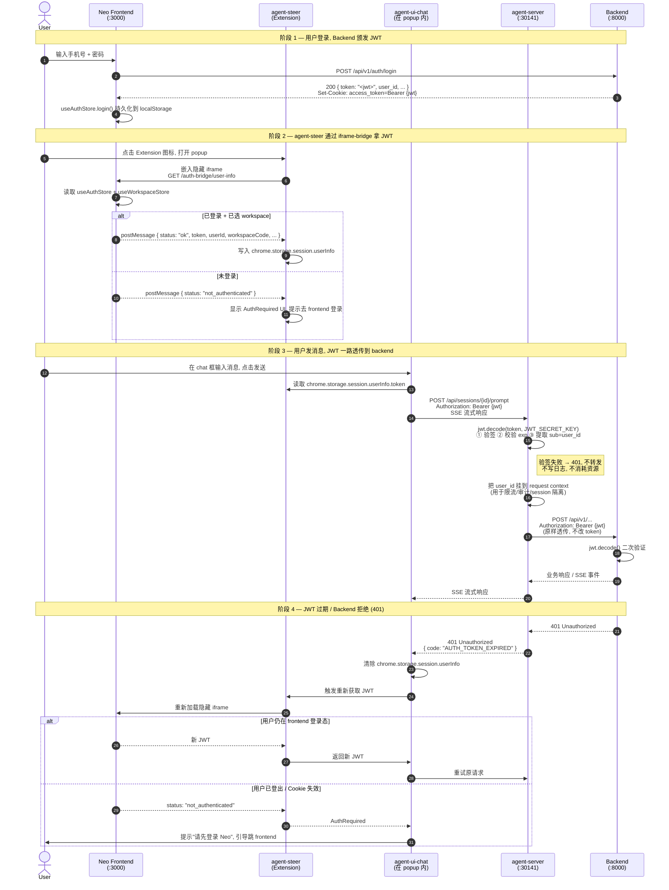

# Neo Agents 工程架构

## 1. 项目定位

Neo Agents 是封装 **pi-coding-agent SDK** 的 Web UI 桥接层，提供 AI 编程智能体能力，供 Neo 平台其他模块（如 agent-steer）集成使用。

## 2. 模块结构

```
neo-agents/
├── agent-server/              # 后端服务 (30141)
├── agent-ui-chat/            # 可复用聊天组件库
├── agent-ui-demo/            # 组件测试应用 (30145)
└── dom-snapshot/             # DOM 操作工具库
```

| 模块 | 类型 | 说明 |
|------|------|------|
| **agent-server** | 后端 (Next.js) | 封装 pi-coding-agent SDK，提供 REST API + SSE + WebSocket |
| **agent-ui-chat** | 组件库 | 可复用的聊天 UI + 通信能力 |
| **agent-ui-demo** | 测试应用 | agent-ui-chat 集成演示 |
| **dom-snapshot** | 工具库 | LLM 友好的 DOM 快照 + 操作（click/fill） |

## 3. 组件职责

### 3.1 agent-server

封装 pi-coding-agent SDK，提供统一 API：

| 组件 | 职责 |
|------|------|
| **rpc-manager** | AgentSession 包装 + 命令派发（prompt/abort/fork/compact） |
| **BB Router** | WebSocket 路由 + Session 管理 + 心跳保活 |
| **session-reader** | 会话文件系统读写 |

**端口**：30141（REST + SSE + WebSocket）

### 3.2 agent-ui-chat

可复用的聊天组件库，供外部应用集成：

```typescript
// 集成示例
import { ChatWindow } from '@agegr/agent-ui-chat';

<ChatWindow
  apiBaseUrl="http://localhost:30141"
  backendUrl="http://localhost:8000"
/>
```

**集成方只需提供**：

- `apiBaseUrl` — agent-server 地址
- `backendUrl` — Neo backend 地址（可选）

| 组件 | 说明 |
|------|------|
| **ChatWindow** | 顶级聊天组件 |
| **useAgentSession** | SSE 订阅 + 流式状态机 |
| **ChatInput** | 输入框（图片/@引用/命令预设） |
| **ChatMinimap** | 对话小地图 |

**通信能力已内置**，无需外部实现 WebSocket/SSE 连接。

### 3.3 dom-snapshot

LLM 友好的 DOM 工具库：

| 模块 | 职责 |
|------|------|
| **snapshot.ts** | DOM → 扁平节点数组（id 按 DFS 顺序） |
| **operations.ts** | click / fill 操作（兼容 React/Vue） |
| **role.ts / name.ts** | ARIA role + accessible name 计算 |

## 4. 与 agent-steer 的集成



**集成方式**：

1. `npm install @agegr/agent-ui-chat` — 引入聊天组件
2. `npm install @agegr/dom-snapshot` — 引入 DOM 操作工具
3. `npm install @agegr/bb-client` — 引入 bb-client（独立包）
4. 渲染 `<ChatWindow apiBaseUrl="..." backendUrl="..." />`

**agent-steer 的角色变化**：

- 不再需要自己实现聊天 UI
- 不再需要自己实现与 agent-server 的通信
- 专注于 rrweb 录制 + 页面事件采集

## 5. 端口分配

| 服务 | 端口 | 说明 |
|------|------|------|
| agent-server | **30141** | REST + SSE + WebSocket |
| agent-ui-demo | **30145** | 组件测试应用 |
| dom-snapshot demo | **30147** | DOM 工具演示 |

## 6. 认证与授权设计

### 6.1 设计目标

让 JWT 从 Neo Frontend 一路安全地传递到 Backend，期间不引入独立的登录流程、刷新机制或服务账号体系。整体思路是**「复用 backend 签发的 JWT，agent-server 只做验证和透传」**。

### 6.2 设计决策

| 决策点 | 选择 | 理由 |
|--------|------|------|
| agent-chat-ui 形态 | agent-steer 弹窗组件 | 与 agent-steer 共享 `chrome.storage.session`，天然获得 JWT |
| agent-server 是否验签 | **必须验签** | 防止外部伪造请求进入 agent-server；为限流/审计/会话隔离提供 user_id |
| 服务间身份 | 用用户 JWT 透传 | backend 看到的就是真实用户身份，零额外配置 |
| Token 刷新 | **不主动刷新** | 24h 过期后让用户重新登录，简单可靠 |

### 6.3 JWT 生命周期

```mermaid
flowchart LR
    A[用户登录 Frontend] -->|POST /api/v1/auth/login| B[Backend 颁发 JWT<br/>HS256, exp=24h]
    B -->|Set-Cookie + Response Body| C[Frontend<br/>useAuthStore<br/>+ HttpOnly Cookie]
    C -->|iframe + postMessage<br/>origin 严格校验| D[agent-steer<br/>chrome.storage.session]
    D -->|同 storage 直读| E[agent-ui-chat]
    E -->|Authorization: Bearer| F[agent-server<br/>jwt.decode 验签]
    F -->|Authorization: Bearer<br/>原样透传| G[Backend<br/>jwt.decode 二次验签]
    G -->|业务响应| F
    F -->|SSE / JSON| E
```



### 6.4 完整认证时序



### 6.5 各组件职责

| 组件 | 职责 | 不做的事 |
|------|------|----------|
| **Frontend** | 登录获取 JWT，持久化到 store | 不参与 agent-server 通信 |
| **agent-steer** | iframe-bridge 拉 JWT，写入 `chrome.storage.session` | 不验签（trust frontend） |
| **agent-ui-chat** | 读 `chrome.storage.session.token`，附 `Authorization` 头 | 不缓存（每次读 storage） |
| **agent-server** | `jwt.decode()` 验签 + 提取 `user_id` 注入 context + 透传 | 不签发 token，不存 token |
| **Backend** | `jwt.decode()` 二次验签，处理业务 | 不感知 agent-server 存在 |

### 6.6 HTTP Header 约定

| 调用方 | 被调方 | Header |
|--------|--------|--------|
| Frontend | Backend | `Cookie: access_token=Bearer {jwt}`（HttpOnly）或 `Authorization: Bearer {jwt}` |
| agent-ui-chat | agent-server | `Authorization: Bearer {jwt}` |
| agent-server | Backend | `Authorization: Bearer {jwt}`（**原样透传, 不替换**） |

> **关键约束**: agent-server 收到的 JWT 和转发给 backend 的 JWT **必须字节级一致**。如果 agent-server 需要注入服务身份（场景 a/b），必须显式使用不同的 header（如 `X-Service-Token`），绝不能替换用户的 `Authorization`。

### 6.7 配置要求

`agent-server` 启动时需要和 Backend 共享 JWT 验签参数：

```bash
# agent-server/.env
JWT_SECRET_KEY="<与 backend 完全相同的密钥>"
JWT_ALGORITHM="HS256"
```

| 部署环境 | JWT_SECRET_KEY 来源 |
|----------|---------------------|
| 本地开发 | 两个服务共用 `.env` 文件, 或 docker-compose 注入 |
| 测试环境 | CI 变量, 每次部署随机生成 |
| 生产环境 | K8s Secret, 由运维统一注入, **禁止** 写入 git |

> **安全性约束**: agent-server 启动时必须校验 `JWT_SECRET_KEY` 非默认值；与 backend 不一致时启动失败。

### 6.8 WebSocket 认证

`/api/ws/bb-router` 的 WebSocket 握手复用同一套 JWT：

```
GET /api/ws/bb-router?sessionId=xxx
Authorization: Bearer {jwt}
Sec-WebSocket-Protocol: ...
```

- 握手时 `agent-server` 验签, 失败直接 401 拒绝升级
- WebSocket 期间不再校验（连接建立后信任连接）
- **不**在 URL query 里传 token（避免被 access log 记录）

### 6.9 安全考量

1. **storage 选型**: 用 `chrome.storage.session` 而非 `local` / `sync` —— 浏览器关闭后自动清除, 减少泄漏面
2. **不写盘**: agent-server 内存中不缓存 token, 每次请求独立 decode
3. **不打印 token**: 日志/错误堆栈中不出现 JWT 原文, 出现 `sub` user_id 即可
4. **HTTPS only**: 生产环境 frontend / agent-server / backend 之间全部 HTTPS
5. **CORS**: agent-server 的 `Access-Control-Allow-Origin` 只允许 frontend 域名, 不允许 `*`
6. **CVE 监控**: `python-jose` 库 (Backend 使用) 历史上有多个 CVE, 需关注升级

### 6.10 错误码约定

| 错误码 | HTTP | 触发场景 | chat-ui 处理 |
|--------|------|----------|--------------|
| `AUTH_TOKEN_MISSING` | 401 | header 无 token | 触发重新获取 JWT |
| `AUTH_TOKEN_INVALID` | 401 | 签名错误 / 格式错误 | 触发重新获取 JWT |
| `AUTH_TOKEN_EXPIRED` | 401 | exp 已过 | 触发重新获取 JWT |
| `BACKEND_UNAUTHORIZED` | 502 | backend 返回 401 | 触发重新获取 JWT |
| `BACKEND_FORBIDDEN` | 403 | 用户无权限 (与认证无关) | 提示用户权限不足 |

> `chat-ui` 收到 **任何** 401 错误码都执行同一动作: 清除本地 token + 重新触发 iframe-bridge。统一处理, 不做差异化分支。

## 🔗 相关文档

- [Neo 技术架构总览](../arch/arch-overview)
- [Browser Bridge 详细设计](./browser-bridge)
- [Browser Bridge 消息协议](./browser-bridge-protocol)
- [agent-steer 技术设计](./index)
- [iframe Bridge 认证桥接设计](../auth/iframe-bridge)
