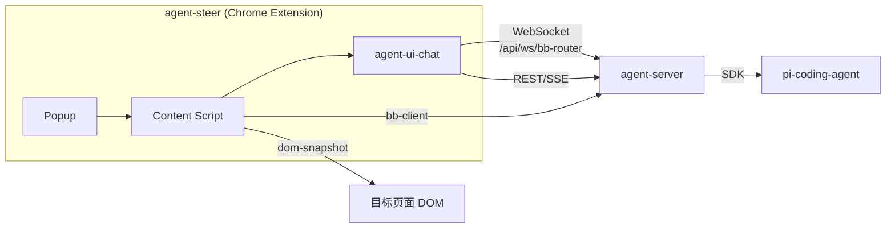

# Neo Agents 工程架构

## 1. 项目定位

Neo Agents 是封装 **pi-coding-agent SDK** 的 Web UI 桥接层，提供 AI 编程智能体能力，供 Neo 平台其他模块（如 agent-steer）集成使用。

## 2. 模块结构

```
neo-agents/
├── agent-server/              # 后端服务 (30141)
├── agent-ui-chat/            # 可复用聊天组件库
├── agent-ui-demo/            # 组件测试应用 (30145)
└── dom-snapshot/             # DOM 操作工具库
```

| 模块 | 类型 | 说明 |
|------|------|------|
| **agent-server** | 后端 (Next.js) | 封装 pi-coding-agent SDK，提供 REST API + SSE + WebSocket |
| **agent-ui-chat** | 组件库 | 可复用的聊天 UI + 通信能力 |
| **agent-ui-demo** | 测试应用 | agent-ui-chat 集成演示 |
| **dom-snapshot** | 工具库 | LLM 友好的 DOM 快照 + 操作（click/fill） |

## 3. 组件职责

### 3.1 agent-server

封装 pi-coding-agent SDK，提供统一 API：

| 组件 | 职责 |
|------|------|
| **rpc-manager** | AgentSession 包装 + 命令派发（prompt/abort/fork/compact） |
| **BB Router** | WebSocket 路由 + Session 管理 + 心跳保活 |
| **session-reader** | 会话文件系统读写 |

**端口**：30141（REST + SSE + WebSocket）

### 3.2 agent-ui-chat

可复用的聊天组件库，供外部应用集成：

```typescript
// 集成示例
import { ChatWindow } from '@agegr/agent-ui-chat';

<ChatWindow
  apiBaseUrl="http://localhost:30141"
  backendUrl="http://localhost:8000"
/>
```

**集成方只需提供**：

- `apiBaseUrl` — agent-server 地址
- `backendUrl` — Neo backend 地址（可选）

| 组件 | 说明 |
|------|------|
| **ChatWindow** | 顶级聊天组件 |
| **useAgentSession** | SSE 订阅 + 流式状态机 |
| **ChatInput** | 输入框（图片/@引用/命令预设） |
| **ChatMinimap** | 对话小地图 |

**通信能力已内置**，无需外部实现 WebSocket/SSE 连接。

### 3.3 dom-snapshot

LLM 友好的 DOM 工具库：

| 模块 | 职责 |
|------|------|
| **snapshot.ts** | DOM → 扁平节点数组（id 按 DFS 顺序） |
| **operations.ts** | click / fill 操作（兼容 React/Vue） |
| **role.ts / name.ts** | ARIA role + accessible name 计算 |

## 4. 与 agent-steer 的集成



**集成方式**：

1. `npm install @agegr/agent-ui-chat` — 引入聊天组件
2. `npm install @agegr/dom-snapshot` — 引入 DOM 操作工具
3. `npm install @agegr/bb-client` — 引入 bb-client（独立包）
4. 渲染 `<ChatWindow apiBaseUrl="..." backendUrl="..." />`

**agent-steer 的角色变化**：

- 不再需要自己实现聊天 UI
- 不再需要自己实现与 agent-server 的通信
- 专注于 rrweb 录制 + 页面事件采集

## 5. 端口分配

| 服务 | 端口 | 说明 |
|------|------|------|
| agent-server | **30141** | REST + SSE + WebSocket |
| agent-ui-demo | **30145** | 组件测试应用 |
| dom-snapshot demo | **30147** | DOM 工具演示 |

## 🔗 相关文档

- [Neo 技术架构总览](../arch/arch-overview)
- [Browser Bridge 详细设计](./browser-bridge)
- [agent-steer 技术设计](./index)
