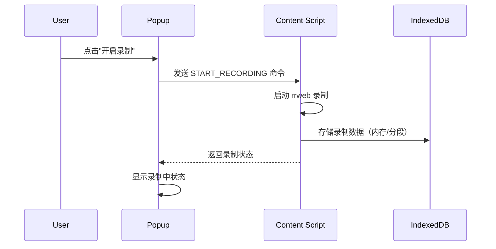
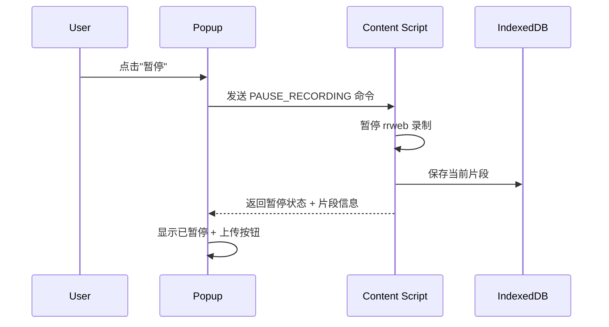
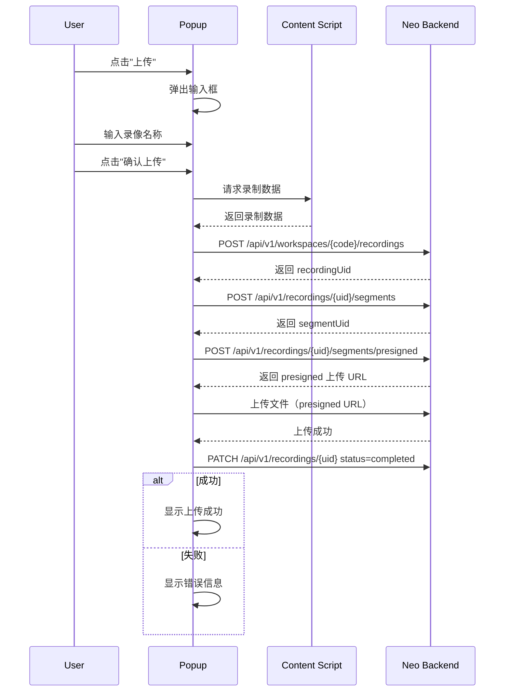
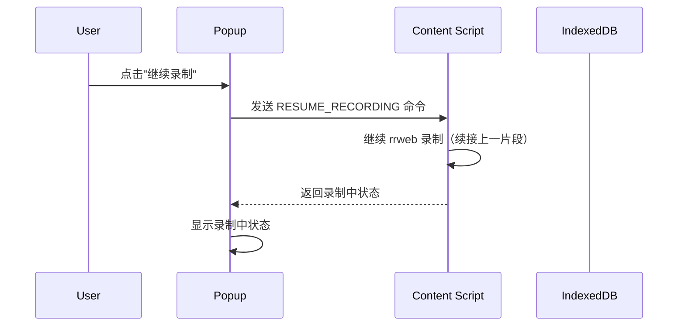

## 1. 录像上传时序图

本文档描述 Chrome 扩展录像上传功能的详细时序设计。

### 1.1 开始录制



### 1.2 暂停录制



### 1.3 上传录像



### 1.4 继续录制



### 1.5 消息示例

#### 开始录制

```typescript
// Popup → CS
{
  type: 'recording.start',
  version: 1,
  direction: 'command',
  timestamp: 1717852800000,
  messageId: 'cmd_001'
}

// CS → Popup
{
  type: 'recording.state',
  version: 1,
  direction: 'event',
  timestamp: 1717852800100,
  messageId: 'evt_001',
  payload: {
    isRecording: true,
    isPaused: false,
    duration: 0,
    segmentCount: 1,
    eventCount: 0
  }
}
```

#### 请求录制数据（上传前）

```typescript
// Popup → CS
{
  type: 'recording.fetch',
  version: 1,
  direction: 'command',
  timestamp: 1717852800000,
  messageId: 'cmd_005'
}

// CS → Popup
{
  type: 'recording.data',
  version: 1,
  direction: 'event',
  timestamp: 1717852800100,
  messageId: 'evt_005',
  payload: {
    segments: [
      { uid: 'seg_001', duration: 600000, eventCount: 128 },
      { uid: 'seg_002', duration: 600000, eventCount: 96 }
    ]
  }
}
```

---

## 🔗 相关文档

- [Agent Steer 技术设计](./index) - 系统架构和消息协议
- [软件操作录像与回放](../../product/agent-steer/recording) - 功能详细设计（产品设计）