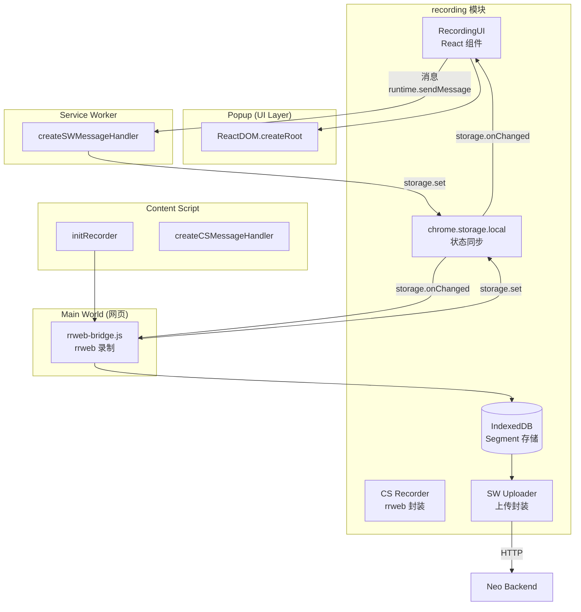
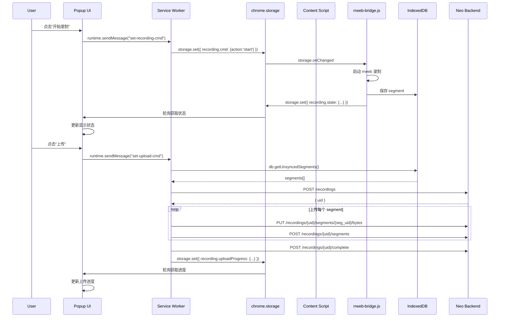

## 1. 设计理念

**声明式组件化**：将录制功能封装为独立模块，各扩展页面只需调用对应入口即可使用，无需关心内部实现。

```typescript
// Popup 使用 React 组件
import { RecordingUI } from '@/recording';
<RecordingUI />

// Content Script 初始化
import { initRecorder, createCSMessageHandler } from '@/recording';
initRecorder();

// Service Worker 注册监听
import { createSWMessageHandler } from '@/recording';
chrome.runtime.onMessage.addListener(createSWMessageHandler());
```

---

## 2. 组件架构



### 2.1 组件职责

| 组件 | 职责 | 运行环境 |
|------|------|----------|
| `RecordingUI` | 录制控制界面（按钮、状态展示） | Popup |
| `CS Recorder` | 轮询 storage 命令，转发到 rrweb-bridge | Content Script |
| `rrweb-bridge.js` | rrweb 录制、事件存储到 IndexedDB | Main World |
| `SW Uploader` | 从 IndexedDB 读取，上传到 Backend | Service Worker |
| `chrome.storage.local` | 状态同步通道 | 共享 |

---

## 3. 模块 API

### 3.1 类型定义

```typescript
// recording/types.ts

/** 录制状态 */
interface RecordingState {
  isRecording: boolean;
  isPaused: boolean;
  duration: number;       // 录制时长（毫秒）
  segmentCount: number;   // 片段数量
  eventCount: number;     // 事件总数
  sessionId?: string;      // 当前会话 ID
}

/** 录制命令 */
interface RecordingCmd {
  action: 'start' | 'pause' | 'resume' | 'stop';
  sessionId?: string;
}

/** 上传命令 */
interface UploadCmd {
  name: string;
  workspaceCode: string;
}

/** 上传进度 */
interface UploadProgress {
  taskId: string;
  status: 'pending' | 'uploading' | 'completed' | 'failed' | 'cancelled';
  progress: number;
  currentSegment?: number;
  totalSegments?: number;
  error?: string;
  recordingUid?: string;
}

/** 录制片段 (IndexedDB) */
interface Segment {
  uid: string;
  sessionId: string;
  sequence: number;
  startTime: number;
  endTime: number;
  eventCount: number;
  events: string;         // JSON 序列化的 rrweb 事件
  pageUrls: string[];
  createdAt: number;
  synced: boolean;
}

/** 消息类型 */
type MessageType =
  | 'recording.start' | 'recording.pause' | 'recording.resume' | 'recording.stop'
  | 'recording.fetch' | 'recording.state' | 'recording.data'
  | 'recording.upload' | 'recording.cancel'
  | 'recording.get-state' | 'recording.set-cmd'
  | 'recording.get-upload-progress' | 'recording.set-upload-cmd'
  | 'recording.open-neo' | 'recording.save-config'
  | 'recording.get-auth-token';
```

### 3.2 导出接口

```typescript
// recording/index.ts

/**
 * Content Script 初始化
 * 在 content script 的 main() 中调用
 */
export function initRecorder(): Promise<void>;

/**
 * Content Script 消息监听器工厂
 * 在 content script 中注册到 chrome.runtime.onMessage
 */
export function createCSMessageHandler(): (message: RecordingMessage) => Promise<RecordingMessageResponse>;

/**
 * Service Worker 消息监听器工厂
 * 在 background service worker 中注册到 chrome.runtime.onMessage
 */
export function createSWMessageHandler(): (message: RecordingMessage) => Promise<RecordingMessageResponse>;

/**
 * 获取当前录制状态
 */
export function getRecordingState(): Promise<RecordingState | null>;

/**
 * Popup 使用的 React 组件
 */
export const RecordingUI: React.FC<RecordingUIProps>;

/**
 * Service Worker 上传模块
 */
export { initUploader, getProgress, cleanup as cleanupUploader } from "./sw/uploader";

/**
 * Content Script 录制模块
 */
export { initRecorder, cleanup as cleanupRecorder } from "./cs/recorder";

/**
 * IndexedDB 数据库操作
 */
export * as db from "./db/indexeddb";
```

### 3.3 消息类型常量

```typescript
export const MESSAGE_TYPES = {
  RECORDING_START: "recording.start",
  RECORDING_PAUSE: "recording.pause",
  RECORDING_RESUME: "recording.resume",
  RECORDING_STOP: "recording.stop",
  RECORDING_FETCH: "recording.fetch",
  RECORDING_STATE: "recording.state",
  RECORDING_DATA: "recording.data",
  RECORDING_GET_STATE: "recording.get-state",
  RECORDING_SET_CMD: "recording.set-cmd",
  RECORDING_UPLOAD: "recording.upload",
  RECORDING_CANCEL: "recording.cancel",
  RECORDING_GET_UPLOAD_PROGRESS: "recording.get-upload-progress",
  RECORDING_SET_UPLOAD_CMD: "recording.set-upload-cmd",
  RECORDING_OPEN_NEO: "recording.open-neo",
  RECORDING_SAVE_CONFIG: "recording.save-config",
  RECORDING_GET_AUTH_TOKEN: "recording.get-auth-token",
} as const;
```

### 3.4 Storage Keys

```typescript
export const STORAGE_KEYS = {
  RECORDING_CMD: "recording.cmd",          // UI → rrweb-bridge 命令
  RECORDING_STATE: "recording.state",       // rrweb-bridge → UI 状态
  UPLOAD_CMD: "recording.uploadCmd",       // UI → SW 命令
  UPLOAD_PROGRESS: "recording.uploadProgress", // SW → UI 进度
  CONFIG: "recording.config",
  AUTH_TOKEN: "auth.token",
  AUTH_USER_INFO: "auth.userInfo",
} as const;
```

### 3.5 组件 Props

```typescript
interface RecordingUIProps {
  /** 自定义 className */
  className?: string;
  
  /** 隐藏上传按钮（默认 false） */
  hideUpload?: boolean;
  
  /** 上传前回调 */
  onBeforeUpload?: (name: string) => void | Promise<void>;
  
  /** 上传成功回调 */
  onUploadSuccess?: (recordingUid: string) => void;
  
  /** 上传失败回调 */
  onUploadError?: (error: string) => void;
}
```

---

## 4. 各运行环境使用方式

### 4.1 Popup (React)

```typescript
// entrypoints/popup/main.tsx
import { RecordingUI } from '@/recording';

export default defineUnlistedScript(() => {
  const root = ReactDOM.createRoot(document.getElementById('root')!);
  root.render(<RecordingUI />);
});
```

Popup 通过 `runtime.sendMessage` 与 Background Script 通信，因为 Popup 是独立页面，无法直接访问 `chrome.storage`。

### 4.2 Content Script

```typescript
// entrypoints/content.ts
import { initRecorder, createCSMessageHandler } from '@/recording';

export default defineContentScript({
  matches: ['<all_urls>'],
  runAt: 'document_start',
  async main() {
    // 初始化录制模块
    await initRecorder();
    
    // 注册消息监听
    browser.runtime.onMessage.addListener((message, _sender, sendResponse) => {
      const handler = createCSMessageHandler();
      handler(message).then(sendResponse);
      return true;
    });
  },
});
```

### 4.3 Service Worker

```typescript
// entrypoints/background.ts
import { createSWMessageHandler, initUploader } from '@/recording';

export default defineBackground(() => {
  initUploader();
  
  browser.runtime.onMessage.addListener((message, _sender, sendResponse) => {
    const handler = createSWMessageHandler();
    handler(message).then(sendResponse);
    return true;
  });
});
```

### 4.4 Main World (rrweb-bridge.js)

`public/rrweb-bridge.js` 在页面加载时通过 Background Script 注入到 Main World：

```typescript
// entrypoints/background.ts
browser.webNavigation?.onCommitted?.addListener(async (details) => {
  if (details.frameId !== 0) return;
  
  await browser.scripting.executeScript({
    target: { tabId: details.tabId },
    files: ["/rrweb-bridge.js"],
    world: "MAIN",  // 注入到主世界
  });
});
```

---

## 5. 消息协议

### 5.1 消息流



### 5.2 消息类型

| 消息类型 | 来源 | 目标 | 说明 |
|----------|------|------|------|
| `recording.get-state` | Popup | SW | 获取录制状态 |
| `recording.set-cmd` | Popup | SW | 设置录制命令 |
| `recording.get-upload-progress` | Popup | SW | 获取上传进度 |
| `recording.set-upload-cmd` | Popup | SW | 设置上传命令 |
| `recording.open-neo` | Popup | SW | 打开 Neo 页面 |
| `recording.save-config` | Popup | SW | 保存配置 |
| `recording.get-auth-token` | Popup | SW | 获取认证 Token |

---

## 6. 数据存储

### 6.1 IndexedDB Schema

```typescript
// database: "recording-db"

// Object Store: "segments"
{
  uid: string,           // 主键，UUID
  sessionId: string,    // 会话 ID
  sequence: number,      // 片段序号
  startTime: number,    // 开始时间
  endTime: number,      // 结束时间
  eventCount: number,   // 事件数
  events: string,       // JSON 序列化的事件
  pageUrls: string[],   // 访问的 URL
  createdAt: number,     // 创建时间
  synced: boolean,       // 是否已上传
}

// Object Store: "sessions"
{
  uid: string,          // 主键，UUID
  startTime: number,   // 开始时间
  endTime: number,     // 结束时间
  active: boolean,     // 是否活跃
  createdAt: number,   // 创建时间
}
```

### 6.2 Segment 生命周期

1. **创建**: rrweb-bridge.js 每 10 分钟自动 flush，保存 segment 到 IndexedDB
2. **存储**: segment.synced = false
3. **上传**: SW 从 IndexedDB 读取未同步的 segment，上传到 Backend
4. **标记**: 上传成功后，segment.synced = true

### 6.3 Storage Keys

```typescript
const STORAGE_KEYS = {
  RECORDING_CMD: 'recording.cmd',        // UI → Bridge 命令
  RECORDING_STATE: 'recording.state',   // Bridge → UI 状态
  UPLOAD_CMD: 'recording.uploadCmd',    // UI → SW 命令
  UPLOAD_PROGRESS: 'recording.uploadProgress', // SW → UI 进度
  CONFIG: 'recording.config',          // 配置
  AUTH_TOKEN: 'auth.token',            // 认证 Token
  AUTH_USER_INFO: 'auth.userInfo',    // 用户信息
};
```

---

## 7. 文件结构

```
agent-steer/
├── public/
│   └── rrweb-bridge.js              # Main World rrweb 脚本
├── src/
│   └── recording/
│       ├── index.ts                 # 主入口，导出所有 API
│       ├── types.ts                 # 类型定义
│       ├── messages.ts              # 消息处理和常量
│       ├── cs/
│       │   └── recorder.ts          # Content Script 录制逻辑
│       ├── sw/
│       │   └── uploader.ts          # Service Worker 上传逻辑
│       ├── db/
│       │   └── indexeddb.ts         # IndexedDB 操作
│       └── ui/
│           ├── RecordingUI.tsx      # 主 UI 组件
│           ├── hooks/
│           │   └── useRecordingState.ts
│           └── *.tsx                # 各视图组件
├── entrypoints/
│   ├── content.ts                  # Content Script 入口
│   ├── background.ts                # Service Worker 入口
│   └── popup/
│       └── main.tsx                 # Popup 入口
└── lib/
    ├── storage.ts                  # chrome.storage 封装 (legacy)
    ├── messages.ts                 # 消息 API (legacy)
    └── auth/
        └── iframe-bridge.ts         # iframe 认证桥接
```

---

## 8. 测试认证模式

在开发/测试环境中，使用测试用户进行认证：

```typescript
// recording/messages.ts
export const TEST_USER_INFO: UserInfo = {
  type: "user_info",
  version: 1,
  status: "ok",
  token: "1234567890",
  userId: 3,
  username: "测试用户",
  workspaceCode: "default",
  workspaceId: 9,
  acquiredAt: Date.now(),
};
```

Backend 配置：
```python
# .env
ENV=test
TEST_TOKEN=1234567890
TEST_USER_ID=3
```

---

## 🔗 相关文档

- [Agent Steer 技术设计](./index) - 系统架构总览
- [软件操作录像与回放](../../product/agent-steer/recording) - 功能详细设计（产品设计）