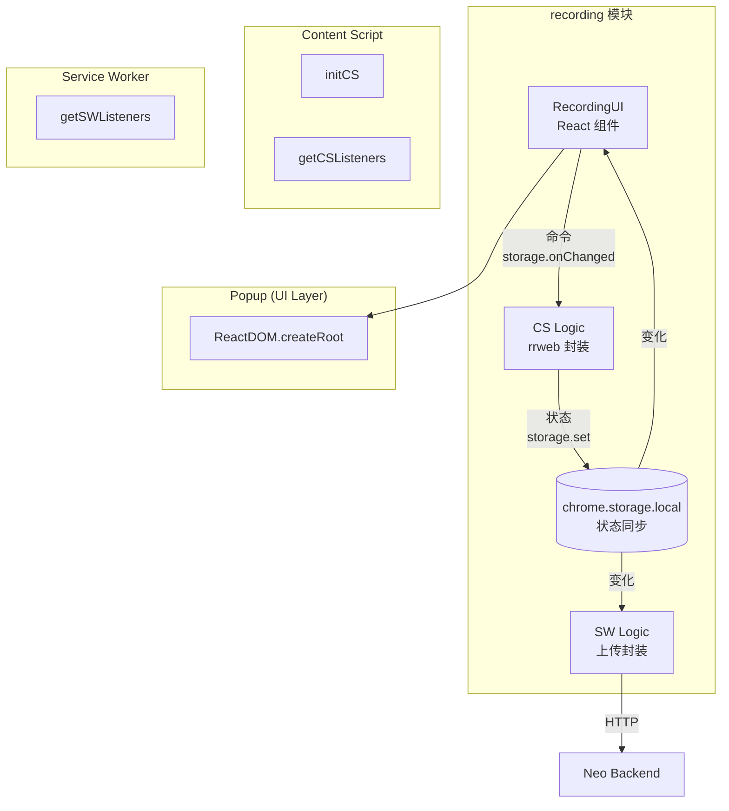
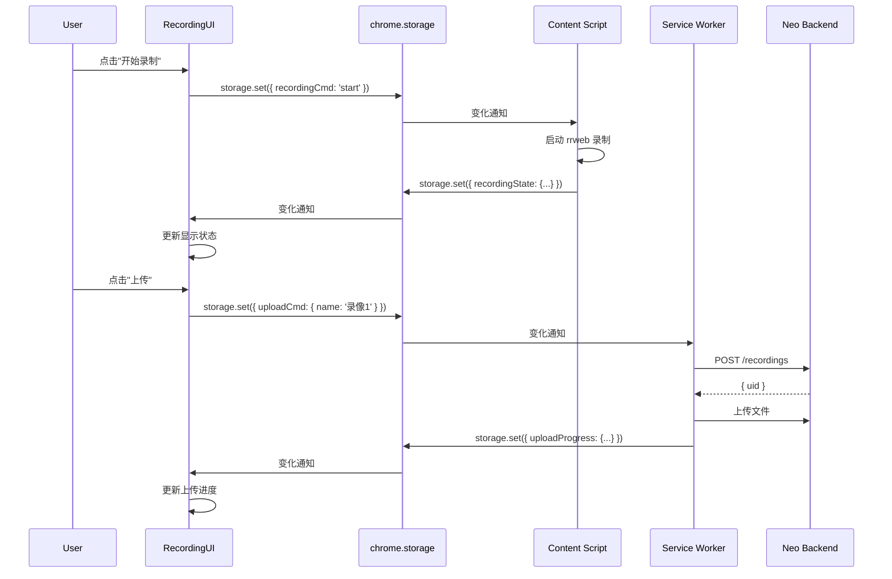

## 1. 设计理念

**声明式组件化**：将录制功能封装为独立模块，各扩展页面只需调用对应入口即可使用，无需关心内部实现。

```typescript
// Popup 使用 React 组件
import { RecordingUI } from '@/recording';
<RecordingUI />

// Content Script 初始化
import { initCS, getCSListeners } from '@/recording';
initCS();

// Service Worker 注册监听
import { getSWListeners } from '@/recording';
chrome.runtime.onMessage.addListener(handler);
```

---

## 2. 组件架构



### 2.1 组件职责

| 组件 | 职责 | 运行环境 |
|------|------|----------|
| `RecordingUI` | 录制控制界面（按钮、状态展示） | Popup |
| `CS Logic` | rrweb 录制、事件存储 | Content Script |
| `SW Logic` | 上传录像到 Backend | Service Worker |
| `chrome.storage` | 状态同步通道 | 共享 |

---

## 3. 模块 API

### 3.1 类型定义

```typescript
// recording/types.ts

/** 录制状态 */
interface RecordingState {
  isRecording: boolean;
  isPaused: boolean;
  duration: number;       // 录制时长（毫秒）
  segmentCount: number;   // 片段数量
  eventCount: number;    // 事件总数
}

/** 录制片段 */
interface Segment {
  uid: string;
  startTime: number;
  endTime: number;
  eventCount: number;
  data: ArrayBuffer;
}

/** 上传进度 */
interface UploadProgress {
  taskId: string;
  status: 'pending' | 'uploading' | 'completed' | 'failed';
  progress: number;      // 0-100
  error?: string;
}

/** 消息类型 */
type MessageType =
  | 'recording.start' | 'recording.pause' | 'recording.resume' | 'recording.stop'
  | 'recording.fetch' | 'recording.state' | 'recording.data'
  | 'recording.upload' | 'recording.cancel';
```

### 3.2 导出接口

```typescript
// recording/index.ts

/**
 * Popup 使用的 React 组件
 */
export const RecordingUI: React.FC<RecordingUIProps>;

/**
 * Content Script 初始化
 * 在 content script 的 main() 中调用
 */
export function initCS(): void;

/**
 * Content Script 消息监听器
 * 在 content script 中注册到 chrome.runtime.onMessage
 */
export function getCSListeners(): Record<MessageType, MessageHandler>;

/**
 * Service Worker 消息监听器
 * 在 background service worker 中注册到 chrome.runtime.onMessage
 */
export function getSWListeners(): Record<MessageType, MessageHandler>;

/**
 * 获取当前录制状态
 */
export function getState(): Promise<RecordingState>;
```

### 3.3 组件 Props

```typescript
interface RecordingUIProps {
  /** 自定义 className */
  className?: string;
  
  /** 隐藏上传按钮（默认 false） */
  hideUpload?: boolean;
  
  /** 上传前回调 */
  onBeforeUpload?: (name: string) => void | Promise<void>;
  
  /** 上传成功回调 */
  onUploadSuccess?: (recordingUid: string) => void;
  
  /** 上传失败回调 */
  onUploadError?: (error: string) => void;
}
```

---

## 4. 各运行环境使用方式

### 4.1 Popup (React)

```typescript
// popup/main.tsx
import React from 'react';
import ReactDOM from 'react-dom/client';
import { RecordingUI } from '@/recording';

export default defineUnlistedScript(() => {
  const root = ReactDOM.createRoot(document.getElementById('root')!);
  root.render(
    <RecordingUI
      onUploadSuccess={(uid) => console.log('上传成功:', uid)}
      onUploadError={(err) => console.error('上传失败:', err)}
    />
  );
});
```

### 4.2 Content Script

```typescript
// content/content.ts
import { initCS, getCSListeners } from '@/recording';

export default defineContentScript({
  matches: ['<all_urls>'],
  runAt: 'document_start',
  main() {
    // 初始化录制逻辑
    initCS();
    
    // 注册消息监听
    chrome.runtime.onMessage.addListener((message, sender, sendResponse) => {
      const handlers = getCSListeners();
      const handler = handlers[message.type as MessageType];
      if (handler) {
        handler(message, sender).then(sendResponse);
        return true; // 异步响应
      }
    });
  },
});
```

### 4.3 Service Worker

```typescript
// background/sw.ts
import { getSWListeners } from '@/recording';

chrome.runtime.onMessage.addListener((message, sender, sendResponse) => {
  const handlers = getSWListeners();
  const handler = handlers[message.type as MessageType];
  if (handler) {
    handler(message, sender).then(sendResponse);
    return true;
  }
});
```

---

## 5. 消息协议

### 5.1 消息流



### 5.2 消息类型

| 消息类型 | 来源 | 目标 | 说明 |
|----------|------|------|------|
| `recording.start` | UI | CS | 开始录制 |
| `recording.pause` | UI | CS | 暂停录制 |
| `recording.resume` | UI | CS | 继续录制 |
| `recording.stop` | UI | CS | 停止录制 |
| `recording.fetch` | UI | CS | 获取录制数据 |
| `recording.state` | CS | UI | 状态上报 |
| `recording.data` | CS | SW | 录制数据（用于上传） |
| `recording.upload` | SW | API | 上传到 Backend |
| `recording.cancel` | UI | SW | 取消上传 |

---

## 6. 状态管理

### 6.1 Storage Keys

```typescript
const STORAGE_KEYS = {
  RECORDING_CMD: 'recording.cmd',      // UI → CS 命令
  RECORDING_STATE: 'recording.state', // CS → UI 状态
  UPLOAD_CMD: 'recording.uploadCmd',  // UI → SW 命令
  UPLOAD_PROGRESS: 'recording.uploadProgress', // SW → UI 进度
} as const;
```

### 6.2 状态结构

```typescript
// 录制命令
interface RecordingCmd {
  action: 'start' | 'pause' | 'resume' | 'stop';
}

// 录制状态
interface RecordingState {
  isRecording: boolean;
  isPaused: boolean;
  duration: number;
  segmentCount: number;
  eventCount: number;
}

// 上传命令
interface UploadCmd {
  name: string;           // 录像名称
  workspaceCode: string; // 工作空间代码
}

// 上传进度
interface UploadProgress {
  taskId: string;
  status: 'pending' | 'uploading' | 'completed' | 'failed';
  progress: number;
  error?: string;
}
```

---

## 7. 文件结构

```
agent-steer/
├── src/
│   ├── recording/
│   │   ├── index.ts          # 主入口，导出所有 API
│   │   ├── types.ts          # 类型定义
│   │   ├── cs.ts             # Content Script 逻辑
│   │   ├── sw.ts             # Service Worker 逻辑
│   │   ├── storage.ts        # chrome.storage 封装
│   │   ├── rrweb.ts          # rrweb 封装
│   │   └── ui/
│   │       ├── RecordingUI.tsx
│   │       ├── ControlButton.tsx
│   │       ├── StatusDisplay.tsx
│   │       └── UploadPanel.tsx
│   ├── content/
│   │   └── content.ts        # content script 入口
│   ├── popup/
│   │   └── main.tsx         # popup 入口
│   └── background/
│       └── sw.ts            # service worker 入口
```

---

## 🔗 相关文档

- [Agent Steer 技术设计](./index) - 系统架构总览
- [软件操作录像与回放](../../product/agent-steer/recording) - 功能详细设计（产品设计）