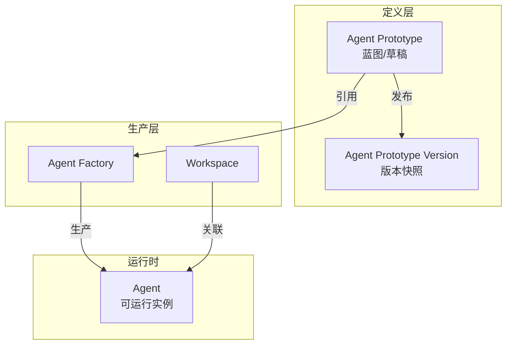
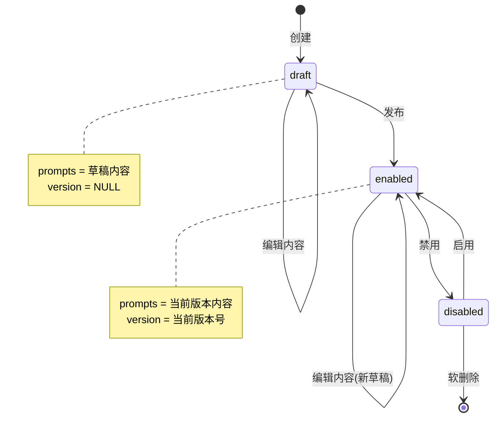
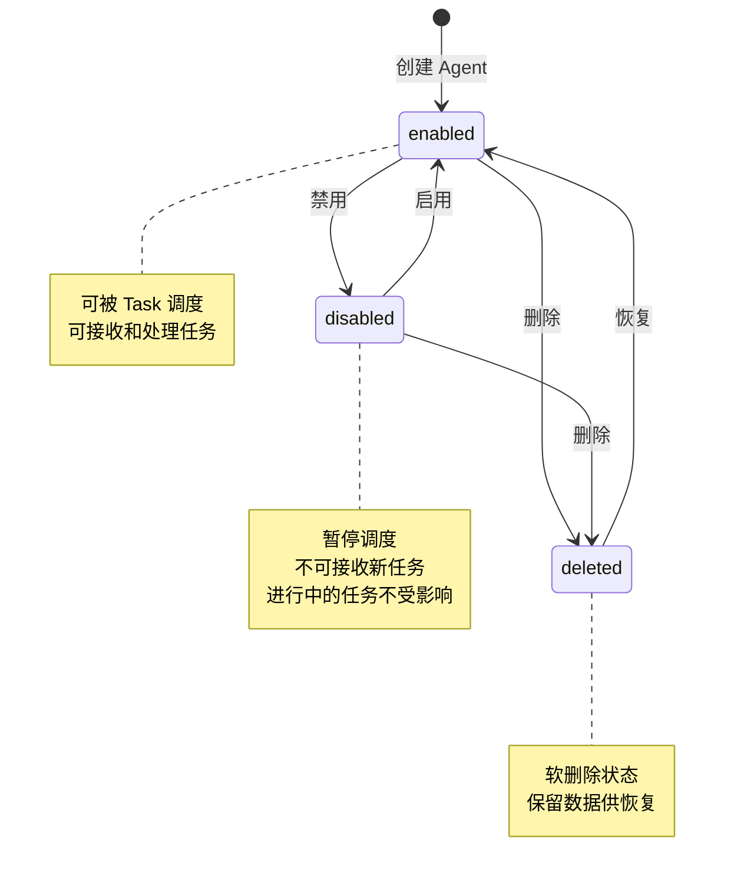

## 📊 数据模型

### 核心实体关系



---

### 1.1 Agent Prototype 实体

| 属性          | 类型              | 约束                    | 说明                       |
| ------------- | ----------------- | ----------------------- | -------------------------- |
| `id`          | BigInteger        | PK, 自增                | 唯一标识符                 |
| `code`        | String(32)        | UK, NOT NULL, 索引      | Agent Prototype 唯一标识符 |
| `name`        | String(64)        | NOT NULL                | 展示名称                   |
| `description` | Text              | NULL                    | 描述信息                   |
| `version`     | String(32)        | NULL                    | 当前发布的版本号           |
| `model`       | String(64)        | NOT NULL                | 模型配置                   |
| `prompts`     | JSON              | NOT NULL, 默认 `{}`     | 提示词配置                 |
| `status`      | Enum(AgentStatus) | NOT NULL, 默认 draft    | 状态                       |
| `created_by`  | Integer           | FK → users.id, NOT NULL | 创建人                     |
| `created_at`  | DateTime          | NOT NULL                | 创建时间                   |
| `updated_at`  | DateTime          | NOT NULL                | 更新时间                   |

**索引设计**：

| 索引名                    | 字段         | 类型   | 说明             |
| ------------------------- | ------------ | ------ | ---------------- |
| `idx_agent_pt_code`       | `code`       | UNIQUE | 按 code 快速查找 |
| `idx_agent_pt_status`     | `status`     | INDEX  | 按状态筛选       |
| `idx_agent_pt_created_by` | `created_by` | INDEX  | 按创建人筛选     |

---

### 1.2 AgentPrototypeVersion 实体

| 属性                 | 类型       | 约束                              | 说明                   |
| -------------------- | ---------- | --------------------------------- | ---------------------- |
| `id`                 | Integer    | PK, 自增                          | 唯一标识符             |
| `agent_prototype_id` | Integer    | FK → agent_prototype.id, NOT NULL | 关联的 Agent Prototype |
| `version`            | String(32) | NOT NULL                          | 版本号，如 `1.0.0`     |
| `prompts_snapshot`   | JSON       | NOT NULL                          | 发布时的提示词快照     |
| `config_snapshot`    | JSON       | NOT NULL                          | 发布时的配置快照       |
| `change_summary`     | Text       | NULL                              | 变更说明               |
| `created_by`         | Integer    | FK → users.id, NOT NULL           | 发布人                 |
| `created_at`         | DateTime   | NOT NULL                          | 发布时间               |

**索引设计**：

| 索引名                      | 字段                 | 类型  | 说明                  |
| --------------------------- | -------------------- | ----- | --------------------- |
| `idx_agent_version_agent`   | `agent_prototype_id` | INDEX | 按 Agent 快速查找版本 |
| `idx_agent_version_created` | `created_at`         | INDEX | 按时间排序            |

---

### 1.3 Agent 实体

Agent 由 Factory 根据 **Agent Prototype** + **Workspace** 生成，是真正可运行的实例。

| 属性                | 类型              | 约束                              | 说明                         |
| ------------------- | ----------------- | --------------------------------- | ---------------------------- |
| `id`                | BigInteger        | PK, 自增                          | 唯一标识符                   |
| `name`              | String(32)        | UK, NOT NULL, 索引                | Agent 名称标识符             |
| `description`       | Text              | NULL                              | 描述信息                     |
| `prototype_id`      | Integer           | FK → agent_prototype.id           | 引用的 Prototype ID          |
| `prototype_version` | String(32)        | NOT NULL                          | 基于的 Prototype 版本号      |
| `workspace_id`      | Integer           | FK → workspace.id, NOT NULL, 索引 | 所属 Workspace               |
| `model`             | String(64)        | NOT NULL                          | 模型配置（可覆盖 Prototype） |
| `skills`            | JSON              | NOT NULL, 默认 `[]`               | 启用的技能列表               |
| `config`            | JSON              | NOT NULL, 默认 `{}`               | 运行时配置                   |
| `status`            | Enum(AgentStatus) | NOT NULL, 默认 enabled            | 状态                         |
| `created_by`        | Integer           | FK → users.id, NOT NULL           | 创建人                       |
| `created_at`        | DateTime          | NOT NULL                          | 创建时间                     |
| `updated_at`        | DateTime          | NOT NULL                          | 更新时间                     |

**索引设计**：

| 索引名                 | 字段           | 类型   | 说明              |
| ---------------------- | -------------- | ------ | ----------------- |
| `idx_agent_name`       | `name`         | UNIQUE | 按 name 快速查找  |
| `idx_agent_workspace`  | `workspace_id` | INDEX  | 按 Workspace 筛选 |
| `idx_agent_prototype`  | `prototype_id` | INDEX  | 按 Prototype 筛选 |
| `idx_agent_status`     | `status`       | INDEX  | 按状态筛选        |
| `idx_agent_created_by` | `created_by`   | INDEX  | 按创建人筛选      |

---

### 1.4 AgentConfig 运行时配置

`config` 字段 JSON 结构：

```json
{
  "temperature": 0.7,
  "max_tokens": 4096,
  "thinking": "high",
  "timeout": 60,
  "retry": {
    "max_attempts": 3,
    "backoff": "exponential"
  }
}
```

| 属性                 | 类型    | 默认值   | 说明                           |
| -------------------- | ------- | -------- | ------------------------------ |
| `temperature`        | Float   | 0.7      | 模型温度参数                   |
| `max_tokens`         | Integer | 4096     | 最大输出 token 数              |
| `thinking`           | Enum    | "low"    | 思考深度: low / medium / high  |
| `timeout`            | Integer | 60       | 单次执行超时（秒）             |
| `retry.max_attempts` | Integer | 3        | 最大重试次数                   |
| `retry.backoff`      | Enum    | "linear" | 重试策略: linear / exponential |

---

## 🔄 状态机

### 2.1 枚举值说明

#### AgentStatus (状态枚举)

| 值         | 说明                      | 适用实体                |
| ---------- | ------------------------- | ----------------------- |
| `draft`    | 草稿 - 初始状态，可编辑   | Agent Prototype         |
| `enabled`  | 启用 - 可正常调度和执行   | Agent Prototype / Agent |
| `disabled` | 禁用 - 暂停调度，不可执行 | Agent Prototype / Agent |
| `deleted`  | 已删除 - 软删除，可恢复   | Agent                   |

---

### 2.2 Agent Prototype 状态流转



---

### 2.3 Agent 状态流转



**状态操作说明**：

| 操作     | 前置状态           | 后置效果                         |
| -------- | ------------------ | -------------------------------- |
| **创建** | -                  | 直接创建为 enabled 状态          |
| **启用** | disabled           | 恢复调度，Agent 可接收新任务     |
| **禁用** | enabled            | 暂停调度，已接收任务继续执行完毕 |
| **删除** | enabled / disabled | 软删除，保留数据供恢复           |
| **恢复** | deleted            | 恢复为 enabled 状态              |

**状态影响说明**：

| 状态       | Task 调度 | 接收新任务 | 正在执行的任务 |
| ---------- | --------- | ---------- | -------------- |
| `enabled`  | ✅ 允许   | ✅ 允许    | ✅ 继续执行    |
| `disabled` | ❌ 暂停   | ❌ 拒绝    | ✅ 继续执行    |
| `deleted`  | ❌ 禁止   | ❌ 拒绝    | ❌ 中断执行    |

---

## 🔧 设计决策

### 3.1 Prompts 直接存储

**决定**：Agent 表直接用 `prompts: JSON` 字段存储所有提示词内容，不再单独关联表。

**理由**：

- Prompts 和 Agent 版本天然一致，无需单独维护映射关系
- 简化数据模型，减少关联查询
- 编辑时无需关心版本管理

### 3.2 使用 BIGINT 自增主键

**决定**：所有表使用 BIGINT 自增主键，替代 UUID。

**理由**：

- 更简洁的 API URL
- 更易调试
- MySQL 索引性能更好

### 3.3 版本快照分离

**决定**：AgentVersion 表独立存储 prompts_snapshot 和 config_snapshot。

**理由**：

- 发布时的完整状态可追溯
- 支持任意版本回滚
- 快照不可变，保证数据一致性

### 3.4 配置继承机制

**决定**：Agent 创建时可覆盖 Prototype 的 model/config 配置。

**理由**：

- 同一 Prototype 可生成不同配置的 Agent
- 支持运行时动态调整
- 保留 Prototype 版本锁定

---

## ⚠️ 设计约束

| 约束                 | 说明                                                    |
| -------------------- | ------------------------------------------------------- |
| ** Prompts 长度**    | 使用 TEXT 类型，最大 65535 字节；超长内容需考虑压缩     |
| ** JSON 验证**       | 应用层校验 prompts 必须包含所有必需 type                |
| ** Prototype 删除**  | 仅 draft 状态的 Agent Prototype 可删除                  |
| ** Agent Workspace** | Agent 必须属于某个 Workspace，不可单独存在              |
| ** Agent Prototype** | Agent 必须基于已发布的 Prototype 版本（status=enabled） |
| ** 命名空间**        | Agent.name 在 Workspace 内唯一                          |
| ** 配置继承**        | 若未指定 config，默认继承 Prototype 的配置              |
| ** 删除限制**        | 删除 Agent 前需确保无进行中的 Task                      |

---

## 🔗 相关文档

- [Agent Factory 产品设计](../../product/workspaces/agent-factory) - 产品功能概述
- [Agent Prototype 管理设计](../../product/admin/agent-prototype-management) - Prototype 定义和版本管理
- [Agent 概述](../../product/agents/agents-overview) - Agent 创建流程
