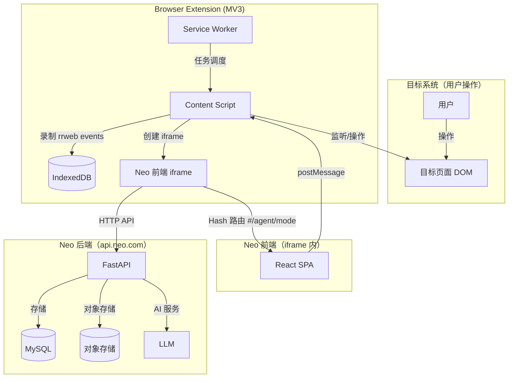
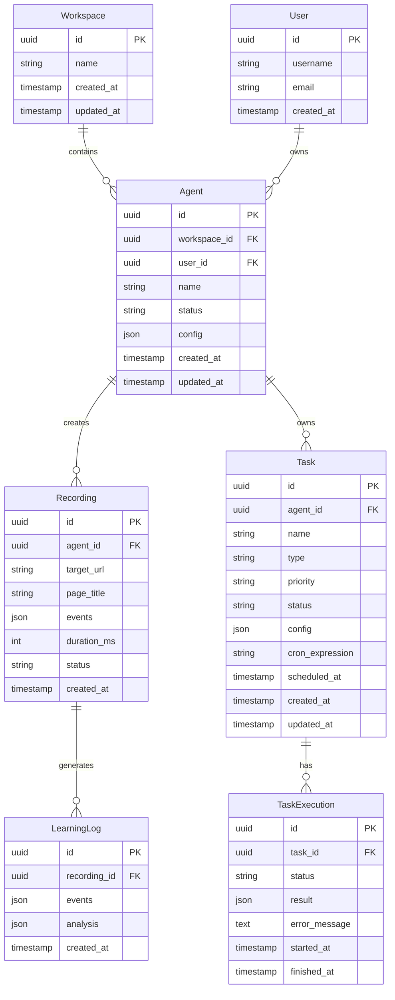
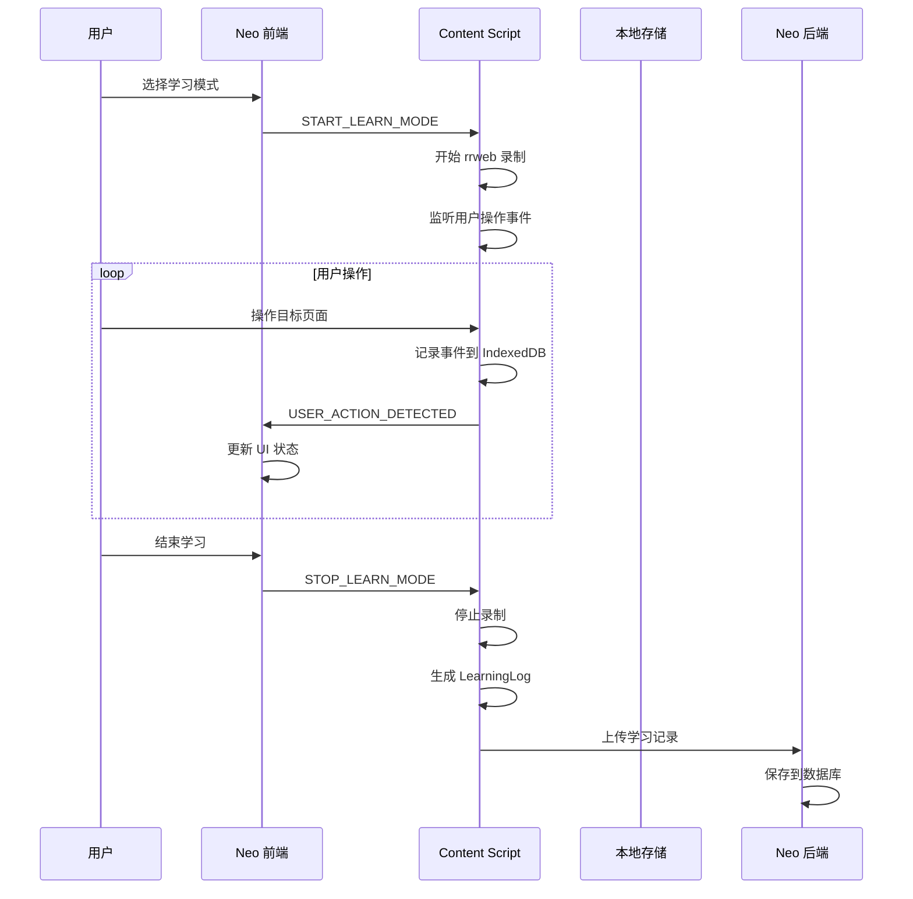
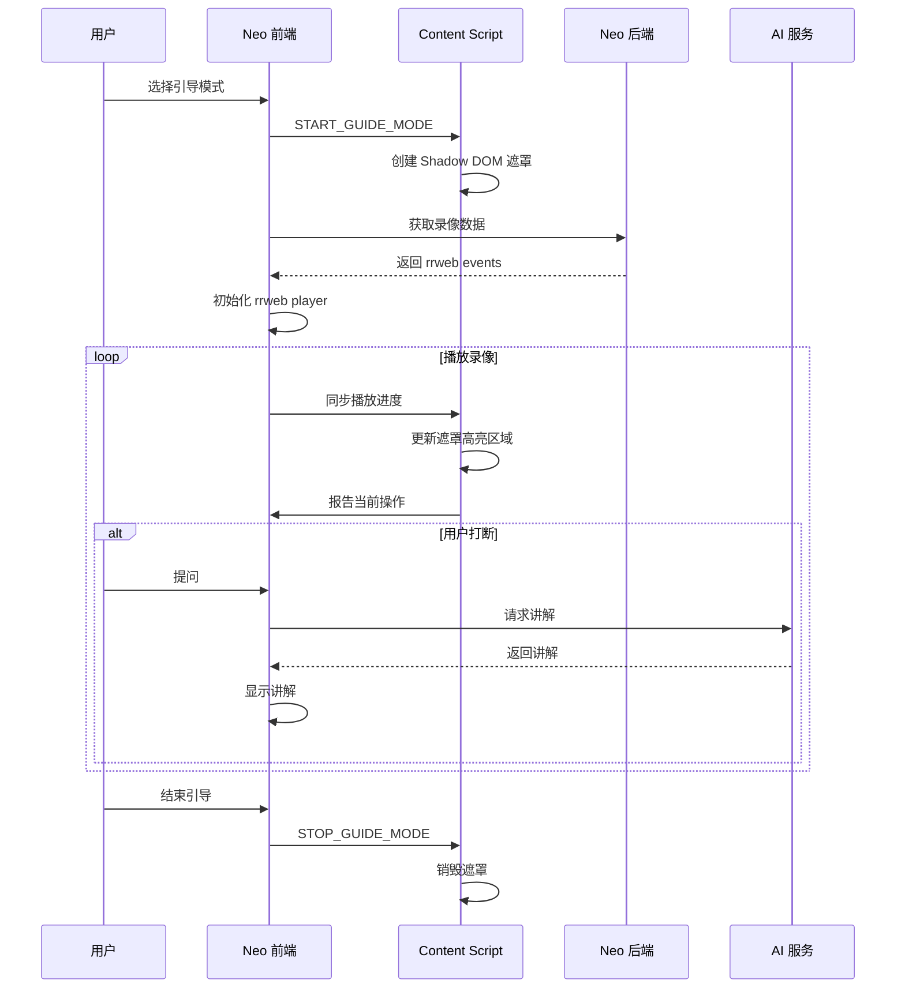
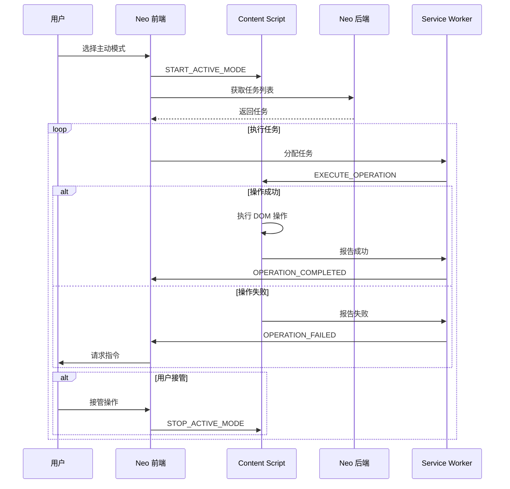
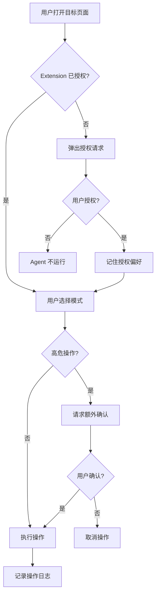
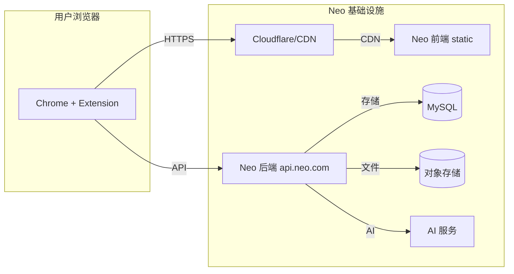

## 更新日志

| 日期 | 版本 | 更新内容 | 作者 |
|------|------|----------|------|
| 2026-06-07 | 1.1.0 | 修正 API 响应格式，增加错误码体系，补充 Extension 内部路由说明 | Claude |
| 2026-05-23 | 1.0.0 | 初始版本 | Joky.Zhao |

## 1. 系统架构概览

### 1.1 整体架构图



> **说明**：路由 `#/agent/mode` 为 Extension 内部路由，属于 iframe 内的 SPA Hash 路由，不属于 Neo 前端路由体系，无需同步到 routing-table.md。

### 1.2 组件职责

| 组件 | 职责 | 技术选型 |
|------|------|----------|
| **Content Script** | DOM 操作、事件监听、rrweb 录制、遮罩层 | TypeScript |
| **Service Worker** | 任务调度、消息路由、离线缓存管理 | TypeScript |
| **Neo 前端 iframe** | UI 展示、用户交互、后端通信 | React SPA |
| **Neo 后端** | API、数据库、任务调度、AI 讲解 | Python FastAPI |

---

## 2. 技术选型

| 项目 | 选型 | 说明 |
|------|------|------|
| 浏览器扩展 | Chrome Extension MV3 | 新扩展必须用 MV3 |
| 扩展分发 | Chrome Web Store + 开发模式 | 开发阶段用开发者模式 |
| 录像格式 | rrweb event 直接存储 | 体积小，rrweb player 回放 |
| 通信机制 | postMessage + BroadcastChannel | 跨域 iframe 通信 |
| 遮罩层 | Shadow DOM | 完全隔离，不受目标页面样式影响 |
| 存储 | localStorage (元数据) + IndexedDB (录像) | 混合存储，离线优先 |
| Neo 前端 | 复用现有前端 | 改造支持嵌入模式 |
| Neo 后端 | Python FastAPI | 高性能，AI 集成方便 |
| 后端部署 | 独立域名 api.neo.com | 需配置 CORS |

---

## 3. 模块架构

### 3.1 Extension 模块划分

```
extension/
├── manifest.json           # MV3 配置
├── src/
│   ├── background/         # Service Worker
│   │   ├── service-worker.ts
│   │   ├── task-scheduler.ts
│   │   └── message-router.ts
│   ├── content/           # Content Script
│   │   ├── index.ts
│   │   ├── recorder.ts      # rrweb 录制
│   │   ├── operator.ts      # DOM 操作
│   │   ├── overlay.ts        # Shadow DOM 遮罩
│   │   └── iframe-manager.ts # iframe 创建管理
│   └── shared/            # 共享类型
│       └── types.ts
├── public/
│   ├── icon.png
│   └── shadow-container.html
└── _locales/
```

### 3.2 Extension 与 iframe 职责划分

| 层级 | 组件 | 职责 |
|------|------|------|
| **底层** | Content Script | rrweb 录制、DOM 操作、事件监听、遮罩管理 |
| **底层** | Service Worker | 任务调度、离线缓存、消息路由 |
| **上层** | Neo iframe | UI 展示、用户交互、后端通信、状态管理 |
| **上层** | Neo 后端 | API 服务、数据库、AI 讲解 |

---

## 4. 通信协议

### 4.1 消息格式

Extension 和 Neo iframe 之间通过 postMessage 通信，统一消息格式：

```typescript
interface AgentMessage {
  type: MessageType;      // 消息类型枚举
  payload: object;        // 消息内容
  timestamp: number;      // 时间戳（毫秒）
  messageId: string;      // 消息唯一 ID
  correlationId?: string; // 关联 ID（用于请求响应配对）
}

type MessageType =
  // Extension → iframe
  | 'AGENT_STATE_CHANGED'
  | 'PAGE_CONTEXT_UPDATED'
  | 'RECORDING_COMPLETED'
  | 'OPERATION_COMPLETED'
  | 'OPERATION_FAILED'
  | 'USER_ACTION_DETECTED'
  
  // iframe → Extension
  | 'START_LEARN_MODE'
  | 'STOP_LEARN_MODE'
  | 'START_GUIDE_MODE'
  | 'STOP_GUIDE_MODE'
  | 'START_ACTIVE_MODE'
  | 'STOP_ACTIVE_MODE'
  | 'EXECUTE_OPERATION'
  | 'GET_PAGE_CONTEXT'
  | 'UPLOAD_RECORDING';
```

### 4.2 消息示例

```typescript
// Extension → iframe: 状态变更
{
  type: 'AGENT_STATE_CHANGED',
  payload: {
    previousState: 'idle',
    currentState: 'learning'
  },
  timestamp: 1716432000000,
  messageId: 'msg_abc123'
}

// iframe → Extension: 执行操作
{
  type: 'EXECUTE_OPERATION',
  payload: {
    operationType: 'click',
    selector: '#submit-button',
    selectorType: 'css',
    fallbackSelector: 'button[type="submit"]'
  },
  timestamp: 1716432000000,
  messageId: 'msg_def456',
  correlationId: 'msg_abc123'
}
```

### 4.3 消息通道

```typescript
// iframe 内
const channel = new BroadcastChannel('neo-agent-channel');

// 监听消息
channel.addEventListener('message', (event) => {
  const message: AgentMessage = event.data;
  handleMessage(message);
});

// 发送消息
channel.postMessage(message);
```

---

## 5. 数据模型

### 5.1 实体关系图



### 5.2 核心数据表

#### 5.2.1 Agent 表

| 字段 | 类型 | 说明 |
|------|------|------|
| id | UUID | 主键 |
| workspace_id | UUID | 关联 workspace |
| user_id | UUID | 拥有者用户 |
| name | VARCHAR(255) | Agent 名称 |
| status | ENUM | idle/learning/guiding/active/error |
| config | JSON | 配置信息 |
| created_at | TIMESTAMP | 创建时间 |
| updated_at | TIMESTAMP | 更新时间 |

#### 5.2.2 Recording 表

| 字段 | 类型 | 说明 |
|------|------|------|
| id | UUID | 主键 |
| agent_id | UUID | 关联 Agent |
| target_url | VARCHAR(2048) | 录制页面 URL |
| page_title | VARCHAR(512) | 页面标题 |
| events | JSON | rrweb event 数组 |
| duration_ms | INT | 录像时长（毫秒） |
| status | ENUM | pending/completed/failed |
| created_at | TIMESTAMP | 创建时间 |

#### 5.2.3 Task 表

| 字段 | 类型 | 说明 |
|------|------|------|
| id | UUID | 主键 |
| agent_id | UUID | 关联 Agent |
| name | VARCHAR(255) | 任务名称 |
| type | ENUM | periodic/dispatched/temporary |
| priority | INT | 优先级（1-10） |
| status | ENUM | pending/running/completed/failed |
| config | JSON | 任务配置（操作步骤等） |
| cron_expression | VARCHAR(64) | 周期任务 cron 表达式 |
| scheduled_at | TIMESTAMP | 计划执行时间 |
| created_at | TIMESTAMP | 创建时间 |
| updated_at | TIMESTAMP | 更新时间 |

#### 5.2.4 TaskExecution 表

| 字段 | 类型 | 说明 |
|------|------|------|
| id | UUID | 主键 |
| task_id | UUID | 关联 Task |
| status | ENUM | running/completed/failed |
| result | JSON | 执行结果 |
| error_message | TEXT | 错误信息 |
| started_at | TIMESTAMP | 开始时间 |
| finished_at | TIMESTAMP | 结束时间 |

---

## 6. API 设计

### 6.1 API 概览

| 类别 | 端点 | 说明 |
|------|------|------|
| **认证** | `POST /api/v1/auth/token/verify` | 验证 token |
| **录像** | `POST /api/v1/recordings` | 上传录像 |
| | `GET /api/v1/recordings` | 列表录像 |
| | `GET /api/v1/recordings/{id}` | 获取录像详情 |
| | `DELETE /api/v1/recordings/{id}` | 删除录像 |
| **任务** | `POST /api/v1/tasks` | 创建任务 |
| | `GET /api/v1/tasks` | 列表任务 |
| | `GET /api/v1/tasks/{id}` | 获取任务详情 |
| | `PATCH /api/v1/tasks/{id}` | 更新任务 |
| | `DELETE /api/v1/tasks/{id}` | 删除任务 |
| | `GET /api/v1/tasks/{id}/executions` | 任务执行历史 |
| **学习记录** | `POST /api/v1/learning-logs` | 上传学习记录 |
| | `GET /api/v1/learning-logs` | 列表学习记录 |
| **AI 讲解** | `POST /api/v1/ai/explain` | 请求讲解内容 |
| | `GET /api/v1/ai/explain/{recording_id}` | 获取讲解历史 |

### 6.2 认证 API

```
POST /api/v1/auth/token/verify
```

请求：
```json
{
  "token": "eyJhbGciOiJIUzI1NiIsInR5cCI6IkpXVCJ9..."
}
```

响应：
```json
{
  "code": 0,
  "message": "ok",
  "data": {
    "valid": true,
    "user_id": "uuid-xxx",
    "workspace_id": "uuid-yyy",
    "expires_at": "2026-05-24T00:00:00Z"
  },
  "traceId": "abc-123",
  "timestamp": 1716432000000
}
```

### 6.3 录像 API

```
POST /api/v1/recordings
```

请求：
```json
{
  "agent_id": "uuid-xxx",
  "target_url": "https://example.com/page",
  "page_title": "用户列表页",
  "events": [...],
  "duration_ms": 30000
}
```

响应：
```json
{
  "code": 0,
  "message": "ok",
  "data": {
    "id": "uuid-recording",
    "status": "completed",
    "created_at": "2026-05-23T10:00:00Z"
  },
  "traceId": "abc-124",
  "timestamp": 1716432000000
}
```

### 6.4 任务 API

```
POST /api/v1/tasks
```

请求：
```json
{
  "agent_id": "uuid-xxx",
  "name": "每日数据同步",
  "type": "periodic",
  "priority": 5,
  "config": {
    "target_url": "https://example.com/admin",
    "steps": [
      {"action": "navigate", "url": "https://example.com/admin"},
      {"action": "click", "selector": "#sync-button"}
    ]
  },
  "cron_expression": "0 8 * * *"
}
```

响应：
```json
{
  "code": 0,
  "message": "ok",
  "data": {
    "id": "uuid-task",
    "status": "pending",
    "scheduled_at": "2026-05-24T08:00:00Z",
    "created_at": "2026-05-23T10:00:00Z"
  },
  "traceId": "abc-125",
  "timestamp": 1716432000000
}
```

### 6.5 AI 讲解 API

```
POST /api/v1/ai/explain
```

请求：
```json
{
  "recording_id": "uuid-recording",
  "current_time": 15000,
  "context": {
    "operation_type": "click",
    "element_selector": "#submit-button",
    "page_url": "https://example.com/form"
  }
}
```

响应：
```json
{
  "code": 0,
  "message": "ok",
  "data": {
    "explanation": "用户点击了提交按钮，表单数据将被发送到服务器进行处理。",
    "confidence": 0.95,
    "suggestions": ["确认表单数据是否完整"]
  },
  "traceId": "abc-126",
  "timestamp": 1716432000000
}
```

### 6.6 错误码体系

| 错误码 | 说明 |
| ------ | ---- |
| 0 | OK |
| 1001 | Invalid Parameter |
| 1002 | Unauthorized |
| 2001 | Resource Not Found |
| 2002 | Resource Already Exists |
| 2003 | Permission Denied |
| 3001 | Recording Upload Failed |
| 3002 | Recording Not Found |
| 4001 | Task Create Failed |
| 4002 | Task Not Found |
| 5001 | AI Explain Failed |
| 9001 | Internal Server Error |

---

## 7. 功能模块设计

### 7.1 学习模式



**边界情况处理**：
- 网络中断：事件暂存 IndexedDB，联网后自动同步
- 长时间无操作：暂停录制，超时提醒用户
- 退出网站/关闭浏览器：localStorage 缓存，下次启动后同步

### 7.2 引导模式



**遮罩层实现**：
- 使用 Shadow DOM 创建完全隔离的遮罩层
- 遮罩状态跟随录像时间轴同步
- 高亮区域使用 Canvas 绘制，支持动画效果

### 7.3 主动模式



**任务调度**：
- 周期任务：后端 cron 调度，生成任务推送到 Extension
- 临时任务：用户随时添加，立即执行
- 离线场景：任务缓存本地，联网后同步执行

---

## 8. 安全设计

### 8.1 安全措施

| 措施 | 说明 |
|------|------|
| **白名单模式** | Agent 只能操作特定域名/页面 |
| **运行时授权** | 首次使用时请求用户授权 |
| **用户主动触发** | Agent 只在用户选择模式后运行 |
| **高危操作确认** | 表单提交、删除等操作需额外确认 |
| **操作日志审计** | 所有操作记录到日志供审计 |
| **Token 验证** | 所有 API 请求验证 JWT token |

### 8.2 权限控制流程



---

## 9. 部署架构

### 9.1 组件部署



### 9.2 CORS 配置

```python
# FastAPI CORS 配置
from fastapi import FastAPI
from fastapi.middleware.cors import CORSMiddleware

app = FastAPI()

app.add_middleware(
    CORSMiddleware,
    allow_origins=[
        "https://neo.example.com",
        "https://*.neo.example.com",
    ],
    allow_credentials=True,
    allow_methods=["*"],
    allow_headers=["*"],
)
```

### 9.3 扩展分发

| 环境 | 分发方式 | 更新方式 |
|------|----------|----------|
| 开发环境 | Chrome 开发者模式加载源码 | 本地更新 |
| 生产环境 | Chrome Web Store 发布 | 自动更新 |
| 企业环境 | CRX 文件分发 | IT 手动更新 |

---

## 10. 开发里程碑

### 10.1 Phase 1: 基础能力（MVP）

| 任务 | 描述 | 优先级 |
|------|------|--------|
| Extension 骨架 | MV3 项目结构、manifest 配置 | P0 |
| Content Script 基础 | DOM 注入、事件监听 | P0 |
| iframe 嵌入 | Neo 前端加载、postMessage 通信 | P0 |
| 用户认证 | URL token 传递、后端验证 | P0 |
| 学习模式 | rrweb 录制、本地存储 | P0 |
| 录像上传 | 上传到 Neo 后端 | P0 |
| 基础 API | 录像 CRUD、认证 | P0 |

**交付物**：
- 可安装的 Chrome Extension
- 支持学习模式的 MVP

### 10.2 Phase 2: 引导模式

| 任务 | 描述 | 优先级 |
|------|------|--------|
| 引导模式 UI | iframe 内的引导界面 | P0 |
| 遮罩层实现 | Shadow DOM 遮罩 + 高亮 | P0 |
| rrweb 回放 | 录像播放 + 遮罩同步 | P0 |
| AI 讲解 | 实时 LLM 生成讲解 | P1 |
| 问答记录 | Agent 与用户对话存储 | P1 |

**交付物**：
- 完整的引导模式功能

### 10.3 Phase 3: 主动模式

| 任务 | 描述 | 优先级 |
|------|------|--------|
| 任务管理 | CRUD API + 界面 | P0 |
| 任务调度 | 后端 cron + 前端触发 | P0 |
| 操作执行 | 选择器定位 + DOM 操作 | P0 |
| 实时监控 | 操作进度可视化 | P1 |
| 用户接管 | 随时接管能力 | P1 |

**交付物**：
- 完整的主动模式功能

### 10.4 Phase 4: 完善与优化

| 任务 | 描述 | 优先级 |
|------|------|--------|
| 离线能力 | IndexedDB 缓存、同步 | P1 |
| 日志系统 | 分级日志、上报、分析 | P1 |
| 安全加固 | 权限控制、审计 | P1 |
| 性能优化 | 加载速度、内存占用 | P2 |
| 企业版 | CRX 分发、私有部署 | P2 |

---

## 11. 技术债务与后续优化

### 11.1 已知技术债务

| 项目 | 说明 | 优先级 |
|------|------|--------|
| rrweb 依赖 | 录像格式依赖 rrweb，后续考虑标准化 | P2 |
| 选择器脆弱 | 页面改版可能导致选择器失效 | P2 |
| LLM 成本 | AI 讲解调用频繁，成本需优化 | P2 |

### 11.2 后续优化方向

- **视觉识别兜底**：基于 AI 视觉识别元素位置，作为选择器失效时的兜底方案
- **操作预测**：基于历史学习数据，预测用户下一步操作
- **自我优化**：Agent 根据执行结果自动优化操作策略

---

## 🔗 相关文档

- [ Agent 嵌入产品需求文档 ](../product/agents/agent-ingest)
- [ Agent 数据库设计 ](./agent-database-design)
- [ Agent 任务系统设计 ](./agent-task)
