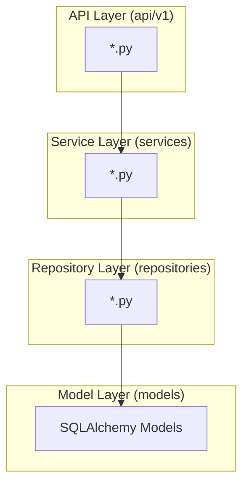

# Backend 工程架构

本文档定义 Neo Agent 后端工程的架构设计，参考 CDP Backend 技术架构构建。

## 1. 技术栈

### 1.1 技术选型

| 类别 | 技术 | 版本 |
|------|------|------|
| **框架** | FastAPI | 0.109+ |
| **服务器** | uvicorn | 0.27+ |
| **ORM** | SQLAlchemy | 2.0+ |
| **迁移** | Alembic | 1.13+ |
| **验证** | Pydantic | 2.5+ |
| **认证** | python-jose + bcrypt | 3.3+ |
| **数据库** | MySQL | 8.0 |
| **缓存** | Redis | latest |
| **AI 服务** | 多 Provider 架构 | - |
| **包管理** | uv | latest |
| **代码检查** | ruff | latest |
| **类型检查** | mypy | latest |
| **测试** | pytest + pytest-asyncio | latest |

### 1.2 技术说明

| 技术 | 说明 |
|------|------|
| **FastAPI** | 高性能异步框架，自动 OpenAPI 文档 |
| **SQLAlchemy 2.0** | 类型安全 ORM，支持异步操作 |
| **Alembic** | 数据库迁移管理 |
| **Pydantic** | 数据验证，settings 管理 |
| **python-jose** | JWT token 生成和验证 |
| **Redis** | 缓存、Session、AI 限流 |
| **多 Provider 架构** | 支持 OpenAI/Claude/本地模型可切换 |

---

## 2. 目录结构

> 目录结构基于 `neo/cdp/backend` 项目构建，参考其技术栈和配置。

### 2.1 整体结构

```
backend/
├── src/
│   └── app/
│       ├── __init__.py
│       ├── main.py              # 应用入口
│       ├── config.py            # 配置管理
│       ├── database.py          # 数据库连接
│       ├── dependencies.py      # 依赖注入
│       │
│       ├── api/                 # API 路由
│       │   ├── __init__.py
│       │   └── v1/
│       │       └── *.py         # 功能模块路由
│       │
│       ├── models/              # SQLAlchemy 模型
│       │   ├── __init__.py
│       │   └── *.py             # 数据模型
│       │
│       ├── schemas/             # Pydantic 模型
│       │   ├── __init__.py
│       │   ├── response.py      # 统一响应格式
│       │   └── *.py             # 请求/响应模型
│       │
│       ├── services/            # 业务逻辑层
│       │   ├── __init__.py
│       │   └── *.py             # 服务模块
│       │
│       ├── repositories/        # 数据访问层
│       │   ├── __init__.py
│       │   └── *.py             # Repository 模块
│       │
│       ├── core/                # 核心工具
│       │   ├── __init__.py
│       │   ├── security.py      # JWT / 密码加密
│       │   ├── exceptions.py    # 自定义异常
│       │   ├── error_codes.py  # 错误码
│       │   └── logging.py      # 日志配置
│       │
│       ├── middleware/          # 中间件
│       │   ├── __init__.py
│       │   └── *.py             # 中间件模块
│       │
│       └── providers/           # AI Provider 抽象
│           ├── __init__.py
│           ├── base.py          # Provider 基类
│           └── *.py             # 具体 Provider 实现
│
├── tests/                       # 测试
│   ├── __init__.py
│   ├── conftest.py
│   └── *.py                    # 测试模块
│
├── alembic/                     # 数据库迁移
│   ├── versions/
│   └── env.py
│
├── logs/                        # 日志文件
│
├── pyproject.toml               # 项目配置（继承 cdp/backend）
├── uv.lock                      # 依赖锁定
├── alembic.ini                  # Alembic 配置
├── .env                         # 环境变量
├── .env.example
└── Makefile                     # 继承 cdp/backend 配置
```

### 2.2 目录说明

| 目录 | 说明 |
|------|------|
| `api/v1/` | REST API 路由，按功能模块划分 |
| `models/` | SQLAlchemy ORM 模型，对应数据库表 |
| `schemas/` | Pydantic 请求/响应模型，数据验证 |
| `services/` | 业务逻辑层，编排 repository 和外部服务 |
| `repositories/` | 数据访问层，封装数据库操作 |
| `core/` | 核心工具：security、exceptions、error_codes |
| `providers/` | AI 服务 Provider 抽象，支持多模型切换 |

---

## 3. 分层架构

### 3.1 分层职责



### 3.2 数据流

```
Request → API Route → Service → Repository → Database
                ↓
            Schema Validation
                ↓
Response ← Service ← Schema Validation
```

---

## 4. 开发命令

| 命令 | 说明 |
|------|------|
| `make install` | 安装依赖 (uv sync) |
| `make dev` | 启动开发服务器 (port 8000) |
| `make test` | 运行测试 |
| `make lint` | 代码检查 (ruff) |
| `make format` | 代码格式化 (ruff) |
| `make type-check` | 类型检查 (mypy) |
| `make clean` | 清理临时文件 |
| `make migrate` | 运行数据库迁移 |
| `make migrate-gen MSG="描述"` | 生成新迁移 |

---

## 5. 部署配置

### 5.1 环境变量

| 变量 | 说明 |
|------|------|
| `DATABASE_URL` | MySQL 数据库连接 |
| `REDIS_URL` | Redis 连接 |
| `JWT_SECRET_KEY` | JWT 密钥 |
| `JWT_ALGORITHM` | JWT 算法 |
| `JWT_EXPIRE_MINUTES` | Token 过期时间 |
| `OPENAI_API_KEY` | OpenAI API Key |
| `CLAUDE_API_KEY` | Claude API Key |
| `AI_RATE_LIMIT_*` | AI 限流配置 |

### 5.2 CORS 配置

后端需配置允许 frontend 和 extension 域名跨域访问：

```python
# main.py
from fastapi.middleware.cors import CORSMiddleware

app.add_middleware(
    CORSMiddleware,
    allow_origins=[
        "http://localhost:3000",
        "https://neo.example.com",
    ],
    allow_credentials=True,
    allow_methods=["*"],
    allow_headers=["*"],
)
```

---

## 🔗 相关文档

- [ 技术架构总览 ](./arch-overview)
- [ frontend 工程架构 ](./arch-frontend)
- [ agent-steer 工程架构 ](./agent-steer)
