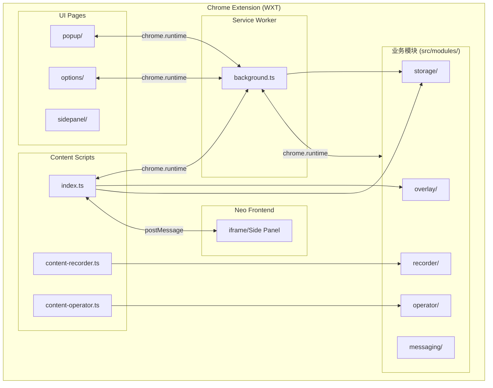

# Chrome Extension 工程架构

本文档定义 Neo Agent Chrome Extension（基于 WXT 框架）的工程架构设计。

## 1. 技术栈

### 1.1 技术选型

| 类别 | 技术 | 版本 |
|------|------|------|
| **核心框架** | WXT | 0.20.x |
| **构建工具** | Vite | 5.x |
| **语言** | TypeScript | 5.x |
| **Manifest** | MV3 | 3 |
| **前端框架** | React  | - |
| **样式** | TailwindCSS / UnoCSS | - |
| **录像** | rrweb | 2.x |
| **存储** | @wxt-dev/storage | - |
| **通信** | chrome.runtime + @webext-core/messaging | - |
| **样式隔离** | Shadow DOM (WXT 内置) | - |
| **包管理** | pnpm | latest |
| **代码检查** | ESLint | 9.x |
| **格式化** | Prettier | 3.x |
| **测试** | Vitest | 1.x |

### 1.2 技术说明

| 技术 | 说明 |
|------|------|
| **WXT** | Next-gen Web Extension Framework，提供 HMR、自动构建、模块系统 |
| **vite-plugin-crx** | Vite 插件，支持 Chrome Extension MV3 构建 |
| **rrweb** | 录制用户操作事件，支持回放 |
| **@wxt-dev/storage** | WXT 内置存储 API，支持版本迁移和类型安全 |
| **Shadow DOM** | 遮罩层样式隔离，不受目标页面影响（使用 WXT createShadowRootUi） |
| **@webext-core/messaging** | 类型安全的跨上下文通信 |

---

## 2. 目录结构

### 2.1 整体结构

```
chrome-extension/
├── src/
│   ├── entrypoints/           # WXT 入口点（自动发现）
│   │   ├── background.ts     # Service Worker
│   │   ├── popup/            # Popup 弹窗
│   │   │   ├── index.html
│   │   │   ├── App.tsx
│   │   │   └── style.css
│   │   ├── options/          # 选项页
│   │   │   └── index.html
│   │   ├── content.ts        # 主内容脚本
│   │   ├── content-recorder.ts # 录制内容脚本
│   │   ├── content-operator.ts # 操作内容脚本
│   │   └── sidepanel/        # 侧边栏（Chrome 114+）
│   │       └── index.html
│   │
│   ├── components/            # 共享组件
│   ├── composables/           # 共享组合式函数
│   ├── hooks/                 # React/Vue Hooks
│   ├── modules/               # 业务模块
│   │   ├── recorder/          # rrweb 录制模块
│   │   ├── operator/          # DOM 操作模块
│   │   ├── overlay/          # 遮罩层模块
│   │   ├── storage/          # 存储模块
│   │   └── messaging/         # 消息通信模块
│   ├── utils/                 # 工具函数
│   ├── types/                 # 类型定义
│   │   ├── messages.ts       # 消息类型
│   │   └── agent.ts          # Agent 类型
│   └── modules/               # 本地 WXT 模块
│
├── public/                    # 静态资源
│   ├── icon-16.png
│   ├── icon-48.png
│   └── icon-128.png
│
├── wxt.config.ts             # WXT 配置
├── package.json
├── tsconfig.json
├── .env                      # 环境变量
├── .env.publish              # 发布环境变量
└── Makefile
```

### 2.2 目录说明

| 目录 | 说明 |
|------|------|
| `src/entrypoints/` | WXT 入口点，基于文件名的自动发现机制 |
| `src/modules/` | 业务逻辑模块（recorder、operator、overlay 等） |
| `src/components/` | 共享 UI 组件 |
| `src/composables/` | 共享组合式函数（Vue）或 Hooks（React） |
| `src/types/` | 类型定义 |
| `src/utils/` | 工具函数 |
| `public/` | 静态资源（WXT 自动发现图标） |

### 2.3 WXT 入口点约定

| 入口点类型 | 文件名模式 | 说明 |
|------------|-----------|------|
| Background | `background.ts` | Service Worker |
| Popup | `popup/index.html` | 点击图标弹出的 UI |
| Options | `options/index.html` | 选项页面 |
| Side Panel | `sidepanel/index.html` | 侧边栏面板 |
| Content Script | `*.content.ts` | 内容脚本 |
| Devtools | `devtools/index.html` | 开发者工具面板 |
| Bookmark | `bookmarks.html` | 覆盖书签页 |
| New Tab | `newtab.html` | 覆盖新标签页 |

---

## 3. 模块架构

### 3.1 整体架构



### 3.2 模块职责

| 模块 | 职责 | 入口点 |
|------|------|--------|
| **modules/recorder** | rrweb 录像录制，事件收集 | content-recorder.ts |
| **modules/operator** | DOM 操作执行（点击、输入等） | content-operator.ts |
| **modules/overlay** | Shadow DOM 遮罩层，样式隔离 | content.ts |
| **modules/storage** | 数据持久化，带版本迁移 | 所有入口点 |
| **modules/messaging** | 类型安全的消息通信 | 所有入口点 |

---

## 4. WXT 配置

### 4.1 wxt.config.ts

```typescript
// wxt.config.ts
import { defineConfig } from 'wxt';

export default defineConfig({
  // 源码目录
  srcDir: 'src',

  // 浏览器目标
  browser: 'chrome',

  // Manifest V3
  manifestVersion: 3,

  // Manifest 配置
  manifest: {
    name: '__MSG_extName__',
    description: '__MSG_extDescription__',
    default_locale: 'en',

    permissions: [
      'storage',
      'activeTab',
      'scripting',
      'tabs',
    ],

    host_permissions: ['<all_urls>'],

    action: {
      default_popup: 'popup/index.html',
      default_icon: {
        '16': '/icon-16.png',
        '24': '/icon-24.png',
        '32': '/icon-32.png',
        '48': '/icon-48.png',
        '128': '/icon-128.png',
      },
    },
  },

  // 环境变量
  env: {
    development: {
      apiUrl: 'http://localhost:8000',
      frontendUrl: 'http://localhost:3300',
    },
    production: {
      apiUrl: 'https://api.neo.ai',
      frontendUrl: 'https://neo.ai',
    },
  },
});
```

### 4.2 关键权限

| 权限 | 用途 |
|------|------|
| `storage` | 扩展本地存储 |
| `activeTab` | 访问当前活动标签页 |
| `scripting` | 执行脚本、注入 CSS |
| `tabs` | 访问标签页信息 |
| `<all_urls>` | 访问所有网站（host_permissions） |

---

## 5. 入口点定义示例

### 5.1 Background Service Worker

```typescript
// src/entrypoints/background.ts
export default defineBackground({
  type: 'module',  // MV3 支持 ES Module

  main() {
    // 监听扩展安装
    chrome.runtime.onInstalled.addListener((details) => {
      console.log('Installed:', details.reason);
    });

    // 监听消息
    chrome.runtime.onMessage.addListener((message, sender, sendResponse) => {
      handleMessage(message, sender)
        .then(sendResponse)
        .catch((error) => sendResponse({ error: error.message }));
      return true;
    });
  }
});
```

### 5.2 Content Script（带 UI）

```typescript
// src/entrypoints/content.ts
import './style.css';

export default defineContentScript({
  matches: ['<all_urls>'],
  runAt: 'document_start',
  cssInjectionMode: 'ui',  // 使用 Shadow DOM 注入样式

  async main(ctx) {
    const ui = await createShadowRootUi(ctx, {
      name: 'neo-agent',
      position: 'inline',
      anchor: 'body',
      onMount(container) {
        // 创建 UI
        const app = document.createElement('div');
        app.textContent = 'Neo Agent';
        container.appendChild(app);
        return app;
      },
      onRemove(app) {
        // 清理
      }
    });

    ui.mount();
  }
});
```

### 5.3 Content Script（无 UI，仅录制）

```typescript
// src/entrypoints/content-recorder.ts
import { recorder } from '@/modules/recorder';

export default defineContentScript({
  matches: ['<all_urls>'],
  runAt: 'document_start',

  main(ctx) {
    // SPA 路由监听
    ctx.locationWatcher.run();

    ctx.addEventListener(window, 'wxt:locationchange', () => {
      recorder.reinitialize();
    });

    recorder.start();
  }
});
```

---

## 6. 存储设计

### 6.1 WXT Storage 模块

```typescript
// src/modules/storage/index.ts
import { storage } from 'wxt/storage';

// Agent 配置
export const configStorage = storage.defineItem<AgentConfig>('local:config', {
  fallback: DEFAULT_CONFIG,
  version: 1,
});

// 录像列表
export const recordingsStorage = storage.defineItem<Recording[]>('local:recordings', {
  fallback: [],
});

// API Key
export const apiKeyStorage = storage.defineItem<string>('local:apiKey', {
  fallback: '',
  init: () => generateApiKey(),
});
```

### 6.2 版本迁移

```typescript
export const configStorage = storage.defineItem<AgentConfig>('local:config', {
  fallback: DEFAULT_CONFIG,
  version: 2,
  migrations: {
    2: (old: AgentConfigV1): AgentConfig => ({
      ...old,
      newField: 'default-value',
    }),
  },
});
```

---

## 7. 通信协议

### 7.1 消息类型

```typescript
// src/types/messages.ts
export enum MessageType {
  START_RECORDING = 'START_RECORDING',
  STOP_RECORDING = 'STOP_RECORDING',
  SET_MODE = 'SET_MODE',
  GET_STATE = 'GET_STATE',
  STATE_UPDATE = 'STATE_UPDATE',
  EXECUTE_OPERATION = 'EXECUTE_OPERATION',
  UPDATE_CONFIG = 'UPDATE_CONFIG',
}

export interface AgentMessage<T = unknown> {
  type: MessageType;
  payload: T;
  timestamp: number;
  messageId: string;
  correlationId?: string;
}
```

### 7.2 消息通道

| 通道 | 用途 |
|------|------|
| **chrome.runtime** | popup ↔ background ↔ content script |
| **postMessage** | content script ↔ iframe (Frontend) |
| **WXT createShadowRootUi** | content script ↔ Shadow DOM UI |

---

## 8. 开发命令

| 命令 | 说明 |
|------|------|
| `make install` | 安装依赖 (pnpm install) |
| `make dev` | 开发模式（WXT 自动打开浏览器） |
| `make dev:firefox` | Firefox 开发模式 |
| `make build` | 生产构建 |
| `make build:firefox` | Firefox 生产构建 |
| `make zip` | 打包 ZIP |
| `make submit` | 提交到 Chrome Web Store |
| `make lint` | 代码检查 |
| `make format` | 代码格式化 |
| `make typecheck` | 类型检查 |
| `make test` | 运行测试 |
| `make clean` | 清理构建产物 |

### 8.1 Makefile 示例

```makefile
.PHONY: install dev dev-firefox build build-firefox zip zip-firefox lint format typecheck test clean rebuild

# 安装依赖
install:
	pnpm install --ignore-scripts
	pnpm exec wxt prepare

# 开发模式
dev:
	pnpm dev

# Firefox 开发模式
dev-firefox:
	pnpm dev:firefox

# 生产构建
build:
	pnpm build

# Firefox 生产构建
build-firefox:
	pnpm build:firefox

# 打包 ZIP
zip:
	pnpm zip

# Firefox 打包
zip-firefox:
	pnpm zip:firefox

# 代码检查
lint:
	pnpm lint

# 代码格式化
format:
	pnpm format

# 类型检查
typecheck:
	pnpm typecheck

# 运行测试
test:
	pnpm test

# 清理构建产物
clean:
	rm -rf .output .wxt dev

# 完整构建
rebuild: clean install build

# 提交到 Chrome Web Store
submit:
	pnpm exec wxt submit
```

### 8.2 重要说明

> ⚠️ **注意**: WXT 命令应该通过 `pnpm dev`、`pnpm build` 等 npm scripts 调用，而不是直接使用 `pnpm exec wxt dev`。这是因为：
> - `pnpm dev` 会执行 `package.json` 中 `scripts.dev` 的 `wxt` 命令
> - 直接 `pnpm exec wxt dev` 可能因环境差异导致问题

---

## 9. SPA 支持

### 9.1 路由监听

```typescript
export default defineContentScript({
  matches: ['*://*.youtube.com/*', '*://*.twitter.com/*'],

  main(ctx) {
    // 启用路由监听
    ctx.locationWatcher.run();

    ctx.addEventListener(window, 'wxt:locationchange', ({ newUrl }) => {
      console.log('Navigation to:', newUrl);
      recorder.reinitialize();
    });
  }
});
```

### 9.2 Context 失效处理

```typescript
export default defineContentScript({
  main(ctx) {
    // 使用 ctx 的方法，自动处理 context 失效
    const timerId = ctx.setTimeout(() => {
      // 这个定时器会在 context 失效时自动取消
    }, 5000);

    // 检查有效性
    if (ctx.isValid) {
      // 安全执行异步操作
    }
  }
});
```

---

## 10. 发布流程

### 10.1 构建产物

```
.output/
├── chrome-mv3-prod/      # Chrome 生产构建
│   ├── manifest.json
│   ├── background.js
│   ├── content-scripts/
│   ├── popup/
│   └── ...
└── firefox-prod/         # Firefox 生产构建
    └── ...
```

### 10.2 发布流程

```
代码提交 → GitHub Actions CI → wxt build → wxt zip → wxt submit → 审核通过 → 自动更新
```

---

## 🔗 相关文档

- [技术架构总览](./arch-overview)
- [frontend 工程架构](./arch-frontend)
- [backend 工程架构](./arch-backend)
- [Agent 嵌入技术设计](../agents/agent-embedded)
- [WXT 官方文档](https://wxt.dev)
