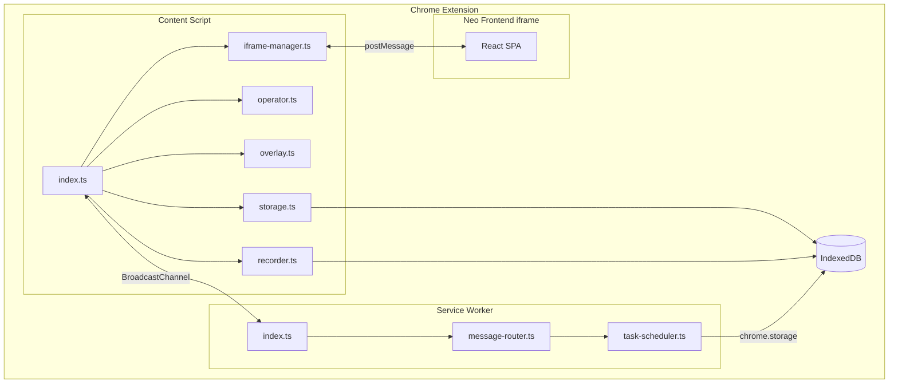

# Chrome Extension 工程架构

本文档定义 Neo Agent Chrome Extension（MV3）的工程架构设计。

## 1. 技术栈

### 1.1 技术选型

| 类别 | 技术 | 版本 |
|------|------|------|
| **语言** | TypeScript | 5.x |
| **构建工具** | Vite | 5.x |
| **构建插件** | vite-plugin-crx | latest |
| **Manifest** | MV3 | 3 |
| **录像** | rrweb | 2.x |
| **存储** | localStorage + IndexedDB | - |
| **通信** | postMessage + BroadcastChannel | - |
| **样式隔离** | Shadow DOM | - |
| **包管理** | pnpm | latest |
| **代码检查** | ESLint | 9.x |
| **格式化** | Prettier | 3.x |

### 1.2 技术说明

| 技术 | 说明 |
|------|------|
| **vite-plugin-crx** | Vite 插件，支持 Chrome Extension MV3 构建 |
| **rrweb** | 录制用户操作事件，支持回放 |
| **IndexedDB** | 离线存储录像数据，支持大容量 |
| **Shadow DOM** | 遮罩层样式隔离，不受目标页面影响 |
| **BroadcastChannel** | 跨 iframe 通信，Extension 与 Frontend 通信 |

---

## 2. 目录结构

### 2.1 整体结构

```
chrome-extension/
├── manifest.json               # MV3 配置
├── public/                     # 静态资源
│   └── icon-*.png             # 图标
│
├── src/
│   ├── manifest.ts             # manifest 配置（TypeScript）
│   │
│   ├── background/             # Service Worker
│   │   ├── index.ts           # 入口
│   │   └── *.ts               # 任务调度、消息路由等
│   │
│   ├── content/               # Content Script
│   │   ├── index.ts           # 入口
│   │   └── *.ts               # 录制、操作、遮罩、存储等
│   │
│   ├── shared/                # 共享类型（独立维护）
│   │   ├── types.ts          # 消息类型、常量
│   │   └── utils.ts          # 工具函数
│   │
│   └── extension/             # Extension 专用组件
│       └── *.ts               # popup、options 等
│
├── tests/                      # 测试
│
├── package.json
├── tsconfig.json
├── vite.config.ts
├── eslint.config.mjs
├── .env                        # 环境变量
└── Makefile
```

### 2.2 目录说明

| 目录 | 说明 |
|------|------|
| `manifest.json` | Chrome Extension MV3 配置文件 |
| `background/` | Service Worker，负责任务调度、消息路由 |
| `content/` | Content Script，运行在目标页面，负责录制、操作、遮罩 |
| `shared/` | 类型定义，**独立维护**，与 Frontend 分开 |
| `extension/` | popup、options 等 UI 组件 |

---

## 3. 模块架构

### 3.1 整体架构



### 3.2 模块职责

| 模块 | 职责 |
|------|------|
| **background/** | Service Worker，任务调度、消息路由、离线缓存管理 |
| **content/** | Content Script，DOM 操作、事件监听、rrweb 录制、遮罩层 |
| **content/recorder** | rrweb 录像录制 |
| **content/operator** | DOM 操作执行 |
| **content/overlay** | Shadow DOM 遮罩层 |
| **content/iframe-manager** | Neo Frontend iframe 创建和管理 |
| **content/storage** | IndexedDB 存储 |
| **extension/** | popup、options 等 UI 组件 |

---

## 4. Manifest 配置

### 4.1 核心配置

| 配置项 | 说明 |
|--------|------|
| `manifest_version` | MV3 |
| `permissions` | storage, activeTab, scripting, tabs |
| `host_permissions` | \<all_urls\> |
| `background.service_worker` | background/index.js |
| `content_scripts` | 注入到所有页面 |
| `web_accessible_resources` | iframe/index.html |

### 4.2 关键权限

```json
{
  "permissions": [
    "storage",
    "activeTab",
    "scripting",
    "tabs"
  ],
  "host_permissions": [
    "<all_urls>"
  ]
}
```

---

## 5. 通信协议

### 5.1 消息格式

Extension 与 Frontend iframe 之间通过 postMessage 通信：

```typescript
interface AgentMessage {
  type: MessageType;
  payload: Record<string, unknown>;
  timestamp: number;
  messageId: string;
  correlationId?: string;
}
```

### 5.2 消息通道

| 通道 | 用途 |
|------|------|
| **postMessage** | iframe 内外通信 |
| **BroadcastChannel** | Content Script 与 Service Worker 通信 |

---

## 6. 开发命令

| 命令 | 说明 |
|------|------|
| `make install` | 安装依赖 |
| `make dev` | 构建并监听开发 |
| `make build` | 生产构建 |
| `make lint` | 代码检查 |
| `make format` | 代码格式化 |
| `make clean` | 清理构建产物 |
| `make load` | 在 Chrome 中加载扩展（开发者模式） |

---

## 7. 调试与发布

### 7.1 本地调试

1. 运行 `make dev` 构建
2. 打开 Chrome，访问 `chrome://extensions/`
3. 开启「开发者模式」
4. 点击「加载已解压的扩展程序」
5. 选择 `dist` 目录

### 7.2 发布流程

```
代码提交 → CI 构建 → 构建 CRX → 上传 Chrome Web Store → 审核通过 → 自动更新
```

---

## 🔗 相关文档

- [ 技术架构总览 ](./arch-overview)
- [ frontend 工程架构 ](./arch-frontend)
- [ backend 工程架构 ](./arch-backend)
- [ Agent 嵌入技术设计 ](../agents/agent-embedded)