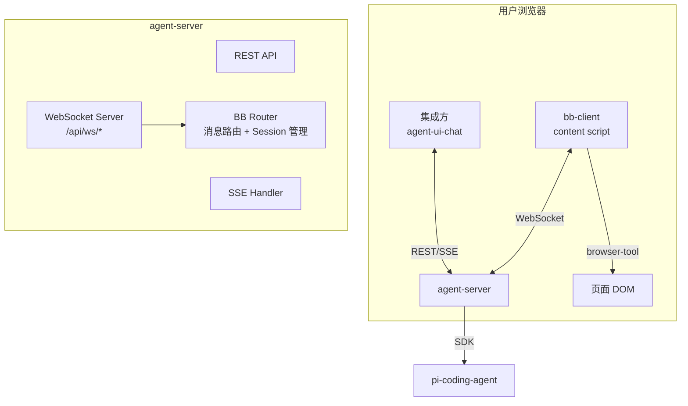
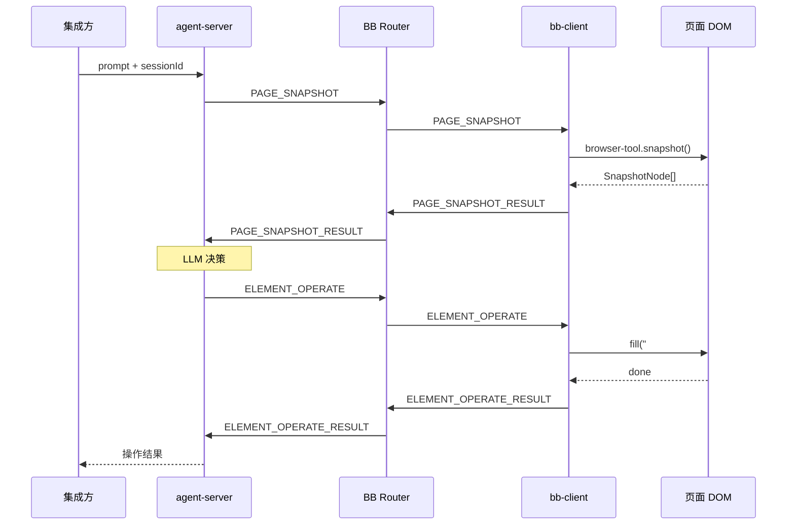
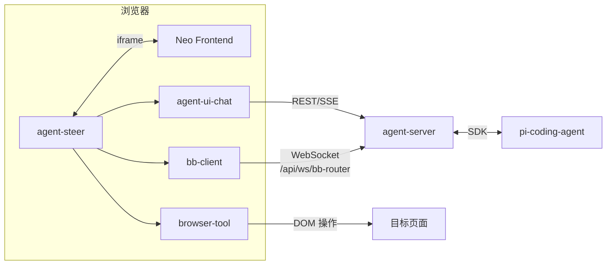

# Neo Agents 工程架构

## 1. 项目定位

Neo Agents 是 Neo 系统中封装 **pi-coding-agent SDK** 的 Web UI 桥接层，通过 REST API + SSE + Browser Bridge 为浏览器提供 AI 编程智能体能力。

## 2. 架构概览



**核心设计约束**：

| 约束 | 说明 |
|------|------|
| **1:1:1 关系** | 一个 agent session = 一个 bb-client 连接 |
| **sessionId 关联** | bb-client 和 agent-server 通过 sessionId 匹配 |
| **BB Router 内置** | bb-router 作为模块集成在 agent-server 内 |

## 3. 核心组件

### 3.1 agent-server (端口 30141)

Next.js 16 API Server，封装 pi-coding-agent SDK：

| 组件 | 职责 |
|------|------|
| **rpc-manager.ts** | AgentSession 包装 + 命令派发 |
| **BB Router** | WebSocket 消息路由 + Session 管理 + 心跳保活 |
| **session-reader.ts** | 会话文件系统读写 |

### 3.2 BB Router

内置于 agent-server 的 WebSocket 路由模块：

- **消息路由**：根据 URL 前缀（如 `/api/ws/bb-router`）分发到对应服务
- **Session 管理**：维护 session → bb-client 映射
- **心跳保活**：客户端定时 ping，检测离线
- **生命周期**：Session 创建 / 闲置超时（30分钟）/ 主动销毁

### 3.3 bb-client (npm 包)

独立 npm 包 `@agegr/bb-client`，运行在浏览器环境中：

- 连接 `/api/ws/bb-router`（携带 sessionId）
- 调用 browser-tool 获取 DOM 快照
- 执行页面操作（click / fill 等）
- 监听页面事件（URL 变化、DOM 变化）

### 3.4 browser-tool

LLM 友好的 DOM 工具库：

| 模块 | 职责 |
|------|------|
| **snapshot.ts** | DOM → 扁平节点数组（id 按 DFS 顺序） |
| **operations.ts** | click / fill 操作（兼容 React/Vue） |
| **role.ts / name.ts** | ARIA role + accessible name 计算 |

## 4. 模块结构

```
neo-agents/
├── agent-server/              # Next.js API Server (30141)
│   ├── app/api/              # 纯 API 路由
│   │   ├── agent/            # prompt / events / state
│   │   ├── auth/             # OAuth / API Key
│   │   ├── sessions/         # 会话管理
│   │   └── skills/           # 技能搜索
│   ├── lib/
│   │   ├── rpc-manager.ts    # 命令派发
│   │   ├── bb-router.ts     # WebSocket 路由 + Session 管理
│   │   └── session-reader.ts
│   └── server.ts             # WebSocket Server 入口
│
├── agent-ui-chat/            # 可复用聊天组件库
│   ├── ChatWindow.tsx        # 顶级组件
│   ├── useAgentSession.ts    # SSE 订阅 + 流式状态机
│   └── ChatInput.tsx         # 输入框
│
├── agent-ui-demo/            # agent-ui-chat 测试应用 (30145)
│   └── src/App.tsx           # 集成演示
│
└── browser-tool/            # DOM 工具库
    └── src/browser-tool/
        ├── snapshot.ts       # DOM → 扁平节点
        ├── operations.ts     # click / fill
        └── role.ts / name.ts

# 独立 npm 包
├── @agegr/agent-ui-chat      # 聊天 UI + 通信
├── @agegr/browser-tool       # DOM 工具
└── @agegr/bb-client         # bb-router 客户端 (content script + Shadow DOM)
```

## 5. WebSocket 路由

统一入口 `/api/ws/*`，通过 URL 前缀区分不同服务：

| 端点 | 服务 | 说明 |
|------|------|------|
| `/api/ws/bb-router` | BB Router | bb-client 连接入口 |
| `/api/ws/*` | (预留) | 未来可扩展其他 WebSocket 服务 |

## 6. Session 生命周期

| 事件 | 处理 |
|------|------|
| bb-client 首次连接 | 创建 session（携带 sessionId） |
| bb-client 离线 | 清理连接，session 进入等待状态 |
| agent 关闭 | 清理所有关联 session |
| 30分钟闲置 | 自动销毁 session |
| 任意一方主动断开 | 清理 session + 通知对方 |

## 7. 消息流转



## 8. 端口分配

| 组件 | 端口 | 说明 |
|------|------|------|
| agent-server | **30141** | REST + SSE + WebSocket |
| agent-ui-demo | **30145** | 库测试应用 |
| browser-tool demo | **30147** | DOM 工具演示 |

## 9. 与 Neo 其他模块的集成



- **agent-steer** (Chrome Extension) 通过 iframe 与 Neo Frontend 通信
- **agent-ui-chat** 为 agent-steer 提供聊天 UI + 通信能力
- **bb-client** 直连 agent-server 的 `/api/ws/bb-router`
- **agent-server** 封装 pi SDK，统一提供 REST + SSE + WebSocket

## 🔗 相关文档

- [Neo 技术架构总览](./arch-overview)
- [Neo Agents 工程架构](../agent-steer/neo-agents)
- [Browser Bridge 详细设计](../agent-steer/browser-bridge)
- [Browser Bridge 消息协议](../agent-steer/browser-bridge-protocol)
- [agent-steer 工程架构](../agent-steer)
