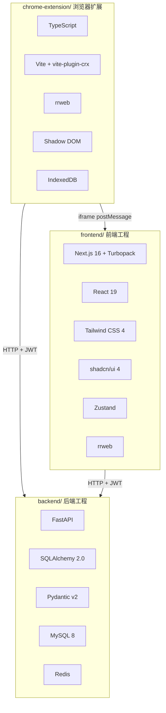
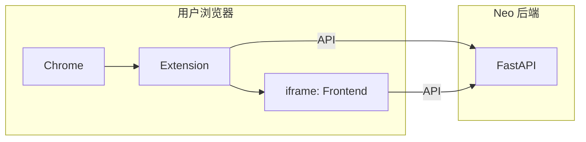
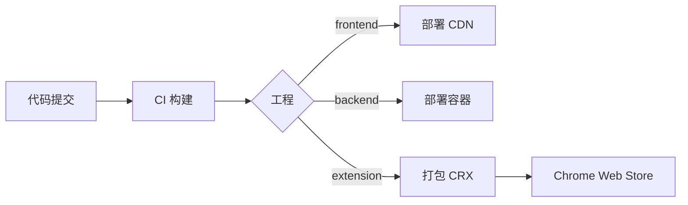

# Neo Agent 技术架构总览

本文档定义 Neo Agent 系统的技术架构，涵盖 frontend、backend、chrome-extension 三个独立工程的架构设计与技术选型。

## 1. 技术栈总览

### 1.1 三工程技术栈



### 1.2 技术选型决策表

| 模块 | 技术选型 | 状态 | 说明 |
|------|---------|------|------|
| **前端框架** | Next.js 16 (App Router) + Turbopack | ✅ | 复用 ui 项目，端口 3300 |
| **前端状态管理** | Zustand | ✅ | 轻量，API 简洁，适合 iframe 通信 |
| **rrweb** | @rrweb/record + rrweb-player | ✅ | ui 项目已集成 |
| **后端框架** | FastAPI | ✅ | 高性能，AI 集成方便 |
| **后端 ORM** | SQLAlchemy 2.0 + Alembic | ✅ | 复用 cdp/backend 架构 |
| **AI 服务** | 多 Provider 架构 | ✅ | 支持 OpenAI/Claude/本地模型可切换 |
| **数据库** | MySQL 8 | ✅ | 文档指定 |
| **缓存** | Redis | ✅ | 缓存、Session、AI 限流 |
| **扩展构建** | Vite + vite-plugin-crx | ✅ | Chrome MV3 构建 |
| **代码共享** | 独立维护 types | ✅ | 各自维护，无共享包 |

---

## 2. 项目结构

### 2.1 整体目录结构

```
neo/
├── design/                     # 设计文档 (Docusaurus)
│   └── docs/
│       └── technical/
│           └── arch/          # 架构文档
│
├── frontend/                   # 前端工程（独立项目）
│   └── Makefile               # 前端 Makefile
│
├── backend/                    # 后端工程（独立项目）
│   └── Makefile               # 后端 Makefile
│
└── chrome-extension/           # Chrome 扩展工程（独立项目）
    └── Makefile               # 扩展 Makefile
```

### 2.2 三工程独立性

三个工程为**同级独立目录**，可单独开发、部署、发布：

| 工程 | 目录 | 部署方式 | 开发命令 |
|------|------|---------|---------|
| **frontend** | `frontend/` | 静态 CDN | `pnpm dev` (port 3300) |
| **backend** | `backend/` | Docker / Serverless | `make dev` (port 8000) |
| **chrome-extension** | `chrome-extension/` | Chrome Web Store | `make dev` |

---

## 3. 模块依赖关系

### 3.1 运行时依赖



### 3.2 模块通信协议

| 通信路径 | 协议 | 说明 |
|---------|------|------|
| Extension → Frontend | postMessage + BroadcastChannel | iframe 内外通信 |
| Extension → Backend | HTTP + JWT | 录像上传、任务 API |
| Frontend → Backend | HTTP + JWT | 独立模式访问 |

---

## 4. 构建与发布

### 4.1 构建工具链

| 工程 | 构建工具 | 开发服务器 | 生产构建 |
|------|---------|-----------|---------|
| **frontend** | Next.js + Turbopack | `pnpm dev` (port 3300) | `pnpm build` |
| **backend** | FastAPI + uvicorn | `make dev` (port 8000) | `docker build` |
| **chrome-extension** | Vite + vite-plugin-crx | `make dev` | `make build` |

### 4.2 发布流程



### 4.3 开发模式

| 环境 | 配置 |
|------|------|
| **前端开发** | `cd frontend && pnpm dev` |
| **后端开发** | `cd backend && make dev` |
| **扩展开发** | `cd chrome-extension && make dev` |
| **CORS** | backend 配置允许 frontend 和 extension 域名 |
| **Extension 调试** | Chrome 开发者模式加载 `chrome-extension/dist` |

---

## 5. 代码共享策略

三个工程**独立维护**各自类型定义，无共享包。

---

## 6. 开发规范

### 6.1 通用规范（所有工程）

| 规范 | 工具 |
|------|------|
| **Git Hooks** | Husky + lint-staged |
| **提交规范** | Conventional Commits |

### 6.2 工程特定规范

| 工程 | 框架规范 | 代码检查 | 测试 |
|------|---------|---------|------|
| **frontend** | Next.js 16 | ESLint | Vitest |
| **backend** | FastAPI | ruff + mypy | pytest |
| **extension** | TypeScript | ESLint | Vitest |

---

## 🔗 相关文档

- [ frontend 工程架构 ](./arch-frontend)
- [ backend 工程架构 ](./arch-backend)
- [ chrome-extension 工程架构 ](./arch-chrome-extension)
