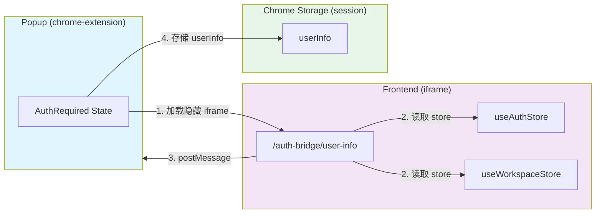
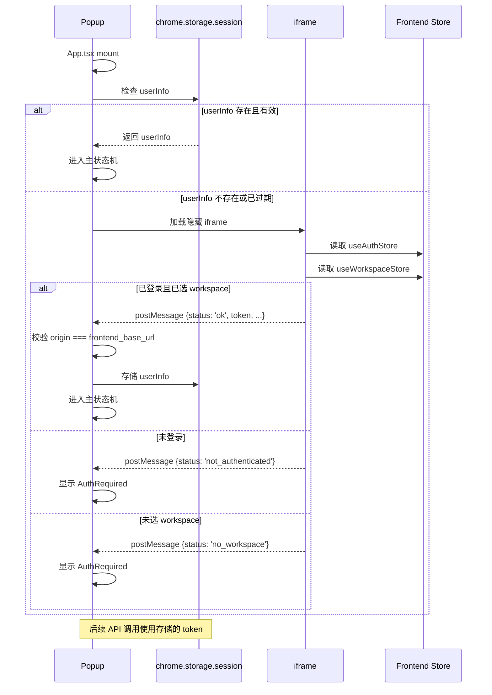

## 1. 背景

### 1.1 问题

Chrome Extension popup 需要调用后端 API，但面临两个认证挑战：

1. **独立认证成本高**：Extension 若要实现独立的登录/鉴权流程，需要维护用户体系、token 管理、刷新机制等，开发成本高
2. **跨域限制**：Extension 无法直接访问 frontend 的登录态 cookie 或 localStorage

### 1.2 现状

Neo 平台的用户认证体系已经完整运行在 frontend 中：
- 用户在 frontend 登录后，登录态存储在 frontend 的 store（`useAuthStore`、`useWorkspaceStore`）
- Workspace 选择状态存储在 `useWorkspaceStore`

Extension 已经在前端实现了完整的用户登录和 Workspace 选择流程。

### 1.3 约束

- Extension 运行的 origin 是 `chrome-extension://{id}`，与 frontend origin（`http://localhost:3000` 或生产域名）完全不同
- Extension 无法直接读取 frontend 的 cookie 或 localStorage（跨域限制）

---

## 2. 目标

1. **复用登录态**：Extension popup 通过 iframe 复用 frontend 的登录态，无需独立实现用户认证流程
2. **安全传输**：用户 token 通过 `postMessage` 安全传输，并在 Extension 端严格校验消息来源 origin
3. **透明切换**：用户无需在 popup 中再次登录，只需确保 frontend 已登录即可
4. **优雅降级**：未登录或未选 Workspace 时，提供清晰的引导文案和重试机制

---

## 3. 方案

### 3.1 整体架构



### 3.2 协议流程



### 3.3 前端页面返回

#### 3.3.1 访问地址和协议

http://localhost:3000/auth-bridge/user-info

```typescript
// 成功路径
interface UserInfoMessage {
  type: 'user_info';
  version: 1;
  status: 'ok';
  token: string;           // JWT token
  userId: number;
  username: string;
  workspaceCode: string;
  workspaceId: number;
  acquiredAt: number;      // Unix ms 时间戳
}

// 失败路径
interface AuthErrorMessage {
  type: 'user_info';
  version: 1;
  status: 'not_authenticated' | 'no_workspace';
}
```

### 3.4 AuthRequired UI 状态

#### 3.4.1 状态定义

| 状态值 | 触发条件 | 显示文案 |
|--------|----------|----------|
| `not_authenticated` | iframe 返回 `status: 'not_authenticated'` | "请先登录 Neo" |
| `no_workspace` | iframe 返回 `status: 'no_workspace'` | "请先选择工作区" |
| `error` | iframe 5s 超时 | "无法连接到 Neo，请检查网络" |


## 4. 安全考量

### 4.1 Origin 校验

- **严格相等**：使用 `e.origin === config.frontend_base_url`，而非 `startsWith` 或正则匹配
- **配置化**：frontend_base_url 从 `chrome.storage.local` 读取，允许针对开发和生产环境配置不同域名
- **防御性日志**：对非预期 origin 的消息仅记录 warning，不展示给用户

### 4.2 消息类型校验

- 要求 `type === 'user_info'` 且 `version === 1`
- 拒绝未知类型消息，避免处理其他 extension 或网页发送的消息

### 4.3 Token 安全

- Token 存储在 `chrome.storage.session`（非持久化，仅当前浏览器会话有效）
- Token 不写入 localStorage 或 IndexedDB
- 401 响应时立即清除存储的 userInfo

---

## 5. 相关文档

