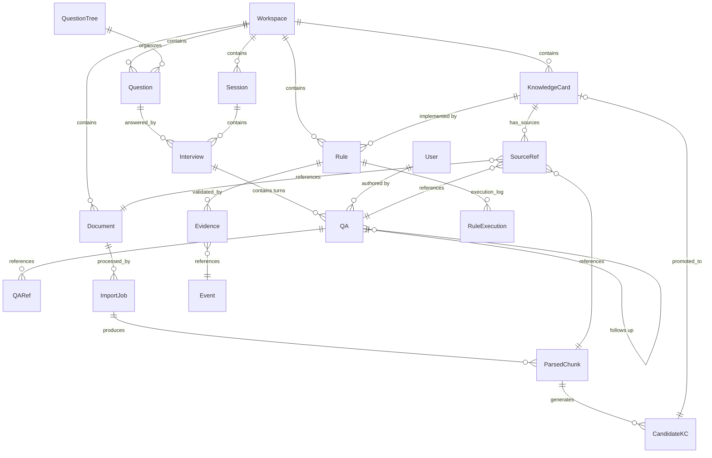

## 1. 概述

本文档定义 Neo 平台**知识库与问答库子系统**的数据库 schema 设计。

**数据库**：MySQL 8
**字符集**：`utf8mb4` / `utf8mb4_unicode_ci`
**ORM**：SQLAlchemy 2.0

### 1.1 命名规范

| 类型 | 规范 | 示例 |
| --- | --- | --- |
| 表名 | `kb_` / `qa_` / `rule_` / `import_` 前缀 + 小写下划线 | `kb_knowledge_card` |
| 主键 | `id` BIGINT AUTO_INCREMENT | `id` |
| 外键 | `{关联表名}_id` | `workspace_id` |
| 时间字段 | `created_at` / `updated_at` / `deleted_at` | - |
| 布尔字段 | `is_` 前缀 | `is_active` |
| 枚举字段 | `_type` 后缀 | `source_type` |
| 索引 | `idx_{表名}_{字段}` | `idx_kb_kc_workspace` |

---

## 2. 实体关系图（ER）

### 2.1 整体 ER



### 2.2 表关系说明

| 关系 | 一对多 | 说明 |
| --- | --- | --- |
| Workspace → Question/KC/Rule | 1:N | 强隔离，跨 Workspace 不可访问 |
| Question → Interview | 1:N | 一个问题可被多次访谈 |
| Interview → QA | 1:N | 一次访谈包含多轮问答 |
| QA → QARef | 1:N | 一个 QA 可引用多个其他 QA |
| Document → CandidateKC | 1:N | 一个文档可生成多个候选知识 |
| KnowledgeCard → Rule | 1:N | 一个知识可转化为多个规则 |
| Rule → Evidence | 1:N | 一个规则可有多个证据 |

---

## 3. 问答库（L1）

### 3.1 qa_question_tree（问题树模板）

存储访谈问题树模板。

| 字段 | 类型 | 约束 | 说明 |
| --- | --- | --- | --- |
| `id` | BIGINT AUTO_INCREMENT | PK | 主键 |
| `name` | VARCHAR(255) | NOT NULL | 模板名称 |
| `domain` | VARCHAR(64) | NOT NULL, INDEX | 适用领域 |
| `description` | TEXT | NULL | 模板说明 |
| `questions` | JSON | NOT NULL | 问题列表（含层级、追问） |
| `version` | VARCHAR(32) | NOT NULL | 版本号 |
| `is_active` | BOOLEAN | NOT NULL, DEFAULT TRUE | 是否启用 |
| `workspace_id` | BIGINT | FK → workspace.id, NOT NULL, INDEX | 所属 workspace |
| `created_by` | BIGINT | FK → user.id, NOT NULL | 创建人 |
| `created_at` | TIMESTAMP | NOT NULL, DEFAULT CURRENT_TIMESTAMP | 创建时间 |
| `updated_at` | TIMESTAMP | NOT NULL, DEFAULT CURRENT_TIMESTAMP ON UPDATE | 更新时间 |

**索引**：

| 索引名 | 字段 | 类型 |
| --- | --- | --- |
| `idx_qt_workspace` | `workspace_id` | INDEX |
| `idx_qt_domain` | `domain` | INDEX |
| `idx_qt_active` | `is_active` | INDEX |

### 3.2 qa_question（问题）

| 字段 | 类型 | 约束 | 说明 |
| --- | --- | --- | --- |
| `id` | BIGINT AUTO_INCREMENT | PK | 主键 |
| `text` | TEXT | NOT NULL | 问题内容 |
| `domain` | VARCHAR(64) | NOT NULL, INDEX | 领域 |
| `tags` | JSON | NULL | 标签列表 |
| `parent_question_id` | BIGINT | FK → qa_question.id, NULL | 上级问题 |
| `tree_id` | BIGINT | FK → qa_question_tree.id, NULL | 所属问题树 |
| `priority` | INT | DEFAULT 0 | 优先级 |
| `status` | VARCHAR(32) | NOT NULL, DEFAULT 'pending' | `pending` / `in_progress` / `answered` / `archived` |
| `workspace_id` | BIGINT | FK → workspace.id, NOT NULL, INDEX | 所属 workspace |
| `created_by` | BIGINT | FK → user.id, NOT NULL | 创建人 |
| `created_at` | TIMESTAMP | NOT NULL | 创建时间 |
| `updated_at` | TIMESTAMP | NOT NULL | 更新时间 |

**索引**：

| 索引名 | 字段 | 类型 |
| --- | --- | --- |
| `idx_q_workspace` | `workspace_id` | INDEX |
| `idx_q_domain` | `domain` | INDEX |
| `idx_q_status` | `status` | INDEX |
| `idx_q_tree` | `tree_id` | INDEX |
| `idx_q_parent` | `parent_question_id` | INDEX |

### 3.3 qa_session（会话）

| 字段 | 类型 | 约束 | 说明 |
| --- | --- | --- | --- |
| `id` | BIGINT AUTO_INCREMENT | PK | 主键 |
| `expert_id` | BIGINT | FK → user.id, NOT NULL, INDEX | 受访专家 |
| `topic` | VARCHAR(255) | NOT NULL | 会话主题 |
| `mode` | VARCHAR(32) | NOT NULL | `ai_agent` / `manual` |
| `started_at` | DATETIME | NULL | 开始时间 |
| `ended_at` | DATETIME | NULL | 结束时间 |
| `workspace_id` | BIGINT | FK → workspace.id, NOT NULL, INDEX | 所属 workspace |
| `created_at` | TIMESTAMP | NOT NULL | 创建时间 |

### 3.4 qa_interview（访谈）

| 字段 | 类型 | 约束 | 说明 |
| --- | --- | --- | --- |
| `id` | BIGINT AUTO_INCREMENT | PK | 主键 |
| `session_id` | BIGINT | FK → qa_session.id, NOT NULL, INDEX | 所属会话 |
| `question_id` | BIGINT | FK → qa_question.id, NOT NULL, INDEX | 起始问题 |
| `expert_id` | BIGINT | FK → user.id, NOT NULL, INDEX | 受访专家 |
| `mode` | VARCHAR(32) | NOT NULL | `ai_agent` / `manual` |
| `summary` | TEXT | NULL | AI 总结 |
| `started_at` | DATETIME | NULL | 开始时间 |
| `ended_at` | DATETIME | NULL | 结束时间 |
| `workspace_id` | BIGINT | FK → workspace.id, NOT NULL, INDEX | 所属 workspace |
| `created_at` | TIMESTAMP | NOT NULL | 创建时间 |

### 3.5 qa_qa（一问一答）

访谈中的单个问答单元。

| 字段 | 类型 | 约束 | 说明 |
| --- | --- | --- | --- |
| `id` | BIGINT AUTO_INCREMENT | PK | 主键 |
| `interview_id` | BIGINT | FK → qa_interview.id, NOT NULL, INDEX | 所属访谈 |
| `sequence` | INT | NOT NULL | 在访谈中的顺序 |
| `question` | TEXT | NOT NULL | 问题/追问 |
| `answer` | TEXT | NOT NULL | 专家回答 |
| `type` | VARCHAR(32) | NOT NULL, DEFAULT 'initial' | `initial` / `followup` / `counter_example` / `clarification` |
| `confidence` | FLOAT | DEFAULT 0.5 | 置信度 0-1 |
| `parent_qa_id` | BIGINT | FK → qa_qa.id, NULL, INDEX | 上一轮 QA（追问链） |
| `source_case_ids` | JSON | NULL | 引用的真实案例 ID 列表 |
| `tags` | JSON | NULL | 标签列表 |
| `expert_id` | BIGINT | FK → user.id, NOT NULL, INDEX | 回答专家 |
| `metadata` | JSON | NULL | 扩展数据（含信号、反例标记等） |
| `workspace_id` | BIGINT | FK → workspace.id, NOT NULL, INDEX | 所属 workspace |
| `created_at` | TIMESTAMP | NOT NULL | 创建时间 |
| `updated_at` | TIMESTAMP | NOT NULL | 更新时间 |

**索引**：

| 索引名 | 字段 | 类型 |
| --- | --- | --- |
| `idx_qa_interview` | `interview_id` | INDEX |
| `idx_qa_expert` | `expert_id` | INDEX |
| `idx_qa_type` | `type` | INDEX |
| `idx_qa_parent` | `parent_qa_id` | INDEX |
| `idx_qa_workspace` | `workspace_id` | INDEX |
| `idx_qa_created` | `created_at` | INDEX |
| `ft_qa_text` | `question`, `answer` | FULLTEXT |

### 3.6 qa_qa_ref（QA 引用）

问答之间的引用关系。

| 字段 | 类型 | 约束 | 说明 |
| --- | --- | --- | --- |
| `id` | BIGINT AUTO_INCREMENT | PK | 主键 |
| `source_qa_id` | BIGINT | FK → qa_qa.id, NOT NULL, INDEX | 源 QA |
| `target_qa_id` | BIGINT | FK → qa_qa.id, NOT NULL, INDEX | 目标 QA |
| `relation` | VARCHAR(32) | NOT NULL | `support` / `counter_example` / `refine` / `derived_from` / `replaced_by` |
| `note` | TEXT | NULL | 备注 |
| `created_by` | BIGINT | FK → user.id, NOT NULL | 创建人 |
| `created_at` | TIMESTAMP | NOT NULL | 创建时间 |

**约束**：

```sql
UNIQUE KEY uk_qa_ref_source_target (source_qa_id, target_qa_id, relation)
```

---

## 4. 知识库（L2）

### 4.1 kb_knowledge_card（知识卡片）

| 字段 | 类型 | 约束 | 说明 |
| --- | --- | --- | --- |
| `id` | BIGINT AUTO_INCREMENT | PK | 主键 |
| `title` | VARCHAR(255) | NOT NULL | 标题 |
| `statement` | TEXT | NOT NULL | 核心陈述 |
| `domain` | VARCHAR(64) | NOT NULL, INDEX | 领域 |
| `tags` | JSON | NULL | 标签 |
| `type` | VARCHAR(32) | NOT NULL | `judgement` / `risk` / `opportunity` / `process` / `communication` / `competitive` |
| `key_signals` | JSON | NULL | 关键信号列表 |
| `conditions` | TEXT | NULL | 适用条件（自然语言） |
| `exceptions` | TEXT | NULL | 例外与边界 |
| `confidence` | FLOAT | NOT NULL, DEFAULT 0.5 | 置信度 |
| `confidence_breakdown` | JSON | NULL | 多维置信度分解 |
| `validation_status` | VARCHAR(32) | NOT NULL, DEFAULT 'pending_validation' | `pending_validation` / `partially_validated` / `validated` / `auto_published` |
| `source_qa_ids` | JSON | NULL | 来源 QA 列表 |
| `source_doc_ids` | JSON | NULL | 来源文档列表 |
| `source_pattern_ids` | JSON | NULL | 来源数据模式列表 |
| `expert_ids` | JSON | NULL | 贡献专家列表 |
| `status` | VARCHAR(32) | NOT NULL, DEFAULT 'draft' | `draft` / `reviewing` / `published` / `deprecated` |
| `version` | VARCHAR(32) | NOT NULL, DEFAULT '1.0' | 版本号 |
| `published_at` | DATETIME | NULL | 发布时间 |
| `workspace_id` | BIGINT | FK → workspace.id, NOT NULL, INDEX | 所属 workspace |
| `created_by` | BIGINT | FK → user.id, NOT NULL | 创建人 |
| `created_at` | TIMESTAMP | NOT NULL | 创建时间 |
| `updated_at` | TIMESTAMP | NOT NULL | 更新时间 |

**索引**：

| 索引名 | 字段 | 类型 |
| --- | --- | --- |
| `idx_kc_workspace` | `workspace_id` | INDEX |
| `idx_kc_domain` | `domain` | INDEX |
| `idx_kc_type` | `type` | INDEX |
| `idx_kc_status` | `status` | INDEX |
| `idx_kc_validation` | `validation_status` | INDEX |
| `idx_kc_confidence` | `confidence` | INDEX |
| `ft_kc_text` | `title`, `statement`, `conditions`, `exceptions` | FULLTEXT |

### 4.2 kb_source_ref（来源关联）

统一的来源关联表，把 KnowledgeCard 与原始来源绑定。

| 字段 | 类型 | 约束 | 说明 |
| --- | --- | --- | --- |
| `id` | BIGINT AUTO_INCREMENT | PK | 主键 |
| `kc_id` | BIGINT | FK → kb_knowledge_card.id, NOT NULL, INDEX | 关联知识卡片 |
| `source_type` | VARCHAR(32) | NOT NULL | `expert_interview` / `document` / `data_pattern` |
| `source_id` | BIGINT | NOT NULL | 来源实体 ID |
| `source_excerpt` | TEXT | NULL | 来源片段 |
| `contribution_weight` | FLOAT | DEFAULT 1.0 | 对 confidence 的贡献权重 |
| `workspace_id` | BIGINT | FK → workspace.id, NOT NULL, INDEX | 所属 workspace |
| `created_at` | TIMESTAMP | NOT NULL | 创建时间 |

**索引**：

| 索引名 | 字段 | 类型 |
| --- | --- | --- |
| `idx_sr_kc` | `kc_id` | INDEX |
| `idx_sr_source` | `source_type`, `source_id` | INDEX |
| `idx_sr_workspace` | `workspace_id` | INDEX |

### 4.3 kb_knowledge_card_version（知识卡片版本）

知识卡片的历史版本。

| 字段 | 类型 | 约束 | 说明 |
| --- | --- | --- | --- |
| `id` | BIGINT AUTO_INCREMENT | PK | 主键 |
| `kc_id` | BIGINT | FK → kb_knowledge_card.id, NOT NULL, INDEX | 关联知识卡片 |
| `version` | VARCHAR(32) | NOT NULL | 版本号 |
| `snapshot` | JSON | NOT NULL | 完整快照 |
| `change_note` | TEXT | NULL | 变更说明 |
| `changed_by` | BIGINT | FK → user.id, NOT NULL | 变更人 |
| `workspace_id` | BIGINT | FK → workspace.id, NOT NULL, INDEX | 所属 workspace |
| `created_at` | TIMESTAMP | NOT NULL | 变更时间 |

---

## 5. 候选知识卡片（L2 候选）

### 5.1 import_document（源文档）

| 字段 | 类型 | 约束 | 说明 |
| --- | --- | --- | --- |
| `id` | BIGINT AUTO_INCREMENT | PK | 主键 |
| `name` | VARCHAR(255) | NOT NULL | 文档名称 |
| `type` | VARCHAR(32) | NOT NULL | `wiki` / `confluence` / `pdf` / `docx` / `md` / `csv` / `email` / `meeting_notes` |
| `source_url` | VARCHAR(1024) | NULL | 来源 URL |
| `file_path` | VARCHAR(1024) | NULL | 文件路径（RustFs） |
| `file_size` | BIGINT | NULL | 文件大小（字节） |
| `hash` | VARCHAR(64) | INDEX | 内容哈希（用于检测更新） |
| `metadata` | JSON | NULL | 元数据（作者、版本、最后更新时间） |
| `workspace_id` | BIGINT | FK → workspace.id, NOT NULL, INDEX | 所属 workspace |
| `imported_by` | BIGINT | FK → user.id, NOT NULL | 导入人 |
| `imported_at` | TIMESTAMP | NOT NULL | 导入时间 |

**索引**：

| 索引名 | 字段 | 类型 |
| --- | --- | --- |
| `idx_doc_workspace` | `workspace_id` | INDEX |
| `idx_doc_type` | `type` | INDEX |
| `idx_doc_hash` | `hash` | INDEX |

### 5.2 import_job（导入任务）

| 字段 | 类型 | 约束 | 说明 |
| --- | --- | --- | --- |
| `id` | BIGINT AUTO_INCREMENT | PK | 主键 |
| `document_id` | BIGINT | FK → import_document.id, NOT NULL, INDEX | 源文档 |
| `status` | VARCHAR(32) | NOT NULL, DEFAULT 'pending' | `pending` / `parsing` / `classifying` / `extracting` / `completed` / `failed` |
| `progress` | FLOAT | DEFAULT 0.0 | 进度 0-1 |
| `started_at` | DATETIME | NULL | 开始时间 |
| `finished_at` | DATETIME | NULL | 结束时间 |
| `result_summary` | JSON | NULL | 处理结果摘要 |
| `error_message` | TEXT | NULL | 失败原因 |
| `workspace_id` | BIGINT | FK → workspace.id, NOT NULL, INDEX | 所属 workspace |
| `created_at` | TIMESTAMP | NOT NULL | 创建时间 |
| `updated_at` | TIMESTAMP | NOT NULL | 更新时间 |

### 5.3 import_parsed_chunk（解析片段）

| 字段 | 类型 | 约束 | 说明 |
| --- | --- | --- | --- |
| `id` | BIGINT AUTO_INCREMENT | PK | 主键 |
| `job_id` | BIGINT | FK → import_job.id, NOT NULL, INDEX | 所属任务 |
| `content` | TEXT | NOT NULL | 内容 |
| `category` | VARCHAR(32) | NOT NULL | `decision_experience` / `general_knowledge` / `mixed` |
| `key_signals` | JSON | NULL | 提取的信号 |
| `confidence_hint` | FLOAT | DEFAULT 0.5 | AI 评估置信度 |
| `chunk_order` | INT | NOT NULL | 在文档中的顺序 |
| `workspace_id` | BIGINT | FK → workspace.id, NOT NULL, INDEX | 所属 workspace |
| `created_at` | TIMESTAMP | NOT NULL | 创建时间 |

### 5.4 kb_candidate_kc（候选知识卡片）

| 字段 | 类型 | 约束 | 说明 |
| --- | --- | --- | --- |
| `id` | BIGINT AUTO_INCREMENT | PK | 主键 |
| `job_id` | BIGINT | FK → import_job.id, NOT NULL, INDEX | 来源任务 |
| `chunk_id` | BIGINT | FK → import_parsed_chunk.id, NULL, INDEX | 来源片段 |
| `title` | VARCHAR(255) | NOT NULL | 候选标题 |
| `statement` | TEXT | NOT NULL | 候选陈述 |
| `key_signals` | JSON | NULL | 关键信号 |
| `candidate_confidence` | FLOAT | DEFAULT 0.5 | AI 评估置信度 |
| `confidence_breakdown` | JSON | NULL | 多维分解 |
| `validation_status` | VARCHAR(32) | NOT NULL, DEFAULT 'pending' | `pending` / `validating` / `validated` / `rejected` / `auto_published` / `abandoned` |
| `validation_sources` | JSON | NULL | 验证来源 |
| `triggered_interview_id` | BIGINT | FK → qa_interview.id, NULL, INDEX | 触发的访谈 |
| `promoted_kc_id` | BIGINT | FK → kb_knowledge_card.id, NULL, INDEX | 晋升后的 KC |
| `reviewer_id` | BIGINT | FK → user.id, NULL | 审核人 |
| `reviewed_at` | DATETIME | NULL | 审核时间 |
| `review_note` | TEXT | NULL | 审核备注 |
| `workspace_id` | BIGINT | FK → workspace.id, NOT NULL, INDEX | 所属 workspace |
| `created_at` | TIMESTAMP | NOT NULL | 创建时间 |
| `updated_at` | TIMESTAMP | NOT NULL | 更新时间 |

**索引**：

| 索引名 | 字段 | 类型 |
| --- | --- | --- |
| `idx_ck_job` | `job_id` | INDEX |
| `idx_ck_status` | `validation_status` | INDEX |
| `idx_ck_interview` | `triggered_interview_id` | INDEX |
| `idx_ck_promoted` | `promoted_kc_id` | INDEX |
| `idx_ck_workspace` | `workspace_id` | INDEX |
| `idx_ck_confidence` | `candidate_confidence` | INDEX |

---

## 6. 规则库（L3）

### 6.1 rule_rule（规则）

| 字段 | 类型 | 约束 | 说明 |
| --- | --- | --- | --- |
| `id` | BIGINT AUTO_INCREMENT | PK | 主键 |
| `name` | VARCHAR(255) | NOT NULL | 规则名称 |
| `description` | TEXT | NULL | 规则说明 |
| `source_kc_id` | BIGINT | FK → kb_knowledge_card.id, NOT NULL, INDEX | 来源知识卡片 |
| `scope` | JSON | NOT NULL | 适用作用域 |
| `trigger` | JSON | NOT NULL | **触发器**（订阅 Event） |
| `conditions` | JSON | NOT NULL | 评估条件 |
| `conclusion` | JSON | NOT NULL | 触发结论 |
| `exceptions` | JSON | NULL | 例外条件 |
| `confidence` | FLOAT | NOT NULL, DEFAULT 0.5 | 置信度 |
| `version` | VARCHAR(32) | NOT NULL, DEFAULT '1.0' | 版本号 |
| `status` | VARCHAR(32) | NOT NULL, DEFAULT 'draft' | `draft` / `testing` / `active` / `paused` / `deprecated` |
| `execution_stats` | JSON | NULL | 运行时统计 |
| `published_at` | DATETIME | NULL | 发布时间 |
| `workspace_id` | BIGINT | FK → workspace.id, NOT NULL, INDEX | 所属 workspace |
| `created_by` | BIGINT | FK → user.id, NOT NULL | 创建人 |
| `created_at` | TIMESTAMP | NOT NULL | 创建时间 |
| `updated_at` | TIMESTAMP | NOT NULL | 更新时间 |

**trigger schema 简化示例**：

```json
{
  "type": "event_subscription",
  "event_name": "opportunity.stage_changed",
  "filter": [
    {"field": "metadata.days_in_stage", "operator": ">=", "value": 60}
  ],
  "target_entity": {"from": "event.entity_name"}
}
```

**索引**：

| 索引名 | 字段 | 类型 |
| --- | --- | --- |
| `idx_r_workspace` | `workspace_id` | INDEX |
| `idx_r_kc` | `source_kc_id` | INDEX |
| `idx_r_status` | `status` | INDEX |
| `idx_r_confidence` | `confidence` | INDEX |

### 6.2 rule_evidence（证据）

| 字段 | 类型 | 约束 | 说明 |
| --- | --- | --- | --- |
| `id` | BIGINT AUTO_INCREMENT | PK | 主键 |
| `rule_id` | BIGINT | FK → rule_rule.id, NOT NULL, INDEX | 关联规则 |
| `case_source` | VARCHAR(64) | NOT NULL | `opportunity` / `ticket` / `event` |
| `case_id` | BIGINT | NOT NULL | 案例 ID |
| `case_data` | JSON | NULL | 案例数据快照 |
| `outcome` | VARCHAR(64) | NULL | 实际结果 |
| `matched_rule` | BOOLEAN | NOT NULL | 是否符合规则预测 |
| `support_score` | FLOAT | NOT NULL | 支持度（-1 到 1） |
| `validated_at` | DATETIME | NOT NULL | 验证时间 |
| `validator_type` | VARCHAR(32) | NOT NULL | `historical_backtest` / `expert_judgement` / `live_outcome` |
| `workspace_id` | BIGINT | FK → workspace.id, NOT NULL, INDEX | 所属 workspace |
| `created_at` | TIMESTAMP | NOT NULL | 创建时间 |

**索引**：

| 索引名 | 字段 | 类型 |
| --- | --- | --- |
| `idx_ev_rule` | `rule_id` | INDEX |
| `idx_ev_case` | `case_source`, `case_id` | INDEX |
| `idx_ev_workspace` | `workspace_id` | INDEX |

### 6.3 rule_execution（规则执行日志）

记录每次规则触发的执行情况（用于健康度监控）。

| 字段 | 类型 | 约束 | 说明 |
| --- | --- | --- | --- |
| `id` | BIGINT AUTO_INCREMENT | PK | 主键 |
| `rule_id` | BIGINT | FK → rule_rule.id, NOT NULL, INDEX | 触发的规则 |
| `entity_name` | VARCHAR(255) | NOT NULL, INDEX | 作用的实体 |
| `event_id` | BIGINT | NULL | 触发的 Event ID |
| `triggered_at` | DATETIME | NOT NULL | 触发时间 |
| `evaluation_result` | JSON | NOT NULL | 评估结果（条件是否满足） |
| `conclusion_executed` | JSON | NULL | 执行的结论 |
| `user_action` | VARCHAR(64) | NULL | 用户后续动作（采纳/忽略/未操作） |
| `user_action_at` | DATETIME | NULL | 用户动作时间 |
| `workspace_id` | BIGINT | FK → workspace.id, NOT NULL, INDEX | 所属 workspace |
| `created_at` | TIMESTAMP | NOT NULL | 创建时间 |

**索引**：

| 索引名 | 字段 | 类型 |
| --- | --- | --- |
| `idx_exec_rule` | `rule_id` | INDEX |
| `idx_exec_entity` | `entity_name` | INDEX |
| `idx_exec_triggered` | `triggered_at` | INDEX |

---

## 7. AI 配置表

### 7.1 llm_provider（LLM 提供方）

| 字段 | 类型 | 约束 | 说明 |
| --- | --- | --- | --- |
| `id` | BIGINT AUTO_INCREMENT | PK | 主键 |
| `name` | VARCHAR(64) | NOT NULL, UNIQUE | 提供方名称（openai, anthropic, qwen...） |
| `display_name` | VARCHAR(128) | NOT NULL | 显示名称 |
| `api_base_url` | VARCHAR(512) | NULL | API 基础 URL |
| `api_key_secret` | VARCHAR(128) | NOT NULL | API Key 引用（密钥管理） |
| `enabled` | BOOLEAN | NOT NULL, DEFAULT TRUE | 是否启用 |
| `config` | JSON | NULL | 提供方级配置 |
| `created_at` | TIMESTAMP | NOT NULL | - |
| `updated_at` | TIMESTAMP | NOT NULL | - |

### 7.2 llm_model（模型）

| 字段 | 类型 | 约束 | 说明 |
| --- | --- | --- | --- |
| `id` | BIGINT AUTO_INCREMENT | PK | 主键 |
| `provider_id` | BIGINT | FK → llm_provider.id, NOT NULL, INDEX | 提供方 |
| `name` | VARCHAR(128) | NOT NULL | 模型名（gpt-4, claude-3.5-sonnet...） |
| `display_name` | VARCHAR(128) | NOT NULL | 显示名称 |
| `max_tokens` | INT | NOT NULL | 最大 token |
| `cost_per_1k_input` | DECIMAL(10,6) | NULL | 输入成本（per 1K token） |
| `cost_per_1k_output` | DECIMAL(10,6) | NULL | 输出成本 |
| `capabilities` | JSON | NULL | 能力标签（chat, embedding, function_call） |
| `enabled` | BOOLEAN | NOT NULL, DEFAULT TRUE | - |
| `created_at` | TIMESTAMP | NOT NULL | - |

### 7.3 llm_prompt（Prompt 模板）

| 字段 | 类型 | 约束 | 说明 |
| --- | --- | --- | --- |
| `id` | BIGINT AUTO_INCREMENT | PK | 主键 |
| `name` | VARCHAR(128) | NOT NULL, UNIQUE | 模板名称 |
| `category` | VARCHAR(64) | NOT NULL, INDEX | 类别（interview/extract/extract_signal/classify/...） |
| `version` | VARCHAR(32) | NOT NULL | 版本号 |
| `template` | TEXT | NOT NULL | Prompt 模板 |
| `variables` | JSON | NOT NULL | 变量定义 |
| `model_id` | BIGINT | FK → llm_model.id, NOT NULL | 适用模型 |
| `parameters` | JSON | NULL | 模型参数（temperature 等） |
| `is_active` | BOOLEAN | NOT NULL, DEFAULT TRUE | 是否启用 |
| `workspace_id` | BIGINT | FK → workspace.id, NULL | 所属 workspace（NULL = 全局） |
| `created_by` | BIGINT | FK → user.id, NOT NULL | 创建人 |
| `created_at` | TIMESTAMP | NOT NULL | - |
| `updated_at` | TIMESTAMP | NOT NULL | - |

**索引**：

| 索引名 | 字段 | 类型 |
| --- | --- | --- |
| `idx_prompt_name_version` | `name`, `version` | UNIQUE |
| `idx_prompt_category` | `category` | INDEX |
| `idx_prompt_active` | `is_active` | INDEX |

---

## 8. 数据隔离与权限

### 8.1 多租户隔离

所有业务表**必须**包含 `workspace_id` 字段，并通过外键约束保证数据完整性。

### 8.2 查询约束

所有查询必须带 `WHERE workspace_id = ?`，由 SQLAlchemy 的 **Event Hook** 自动注入，防止遗漏。

```python
@event.listens_for(Session, "do_orm_execute")
def filter_by_workspace(execute_state):
    if not execute_state.is_select:
        return
    if execute_state.is_relationship_load:
        return
    workspace_id = get_current_workspace_id()
    if workspace_id is None:
        return
    # 注入 workspace_id 过滤
    ...
```

### 8.3 软删除策略

按 Neo 平台统一规范，使用 `status` 字段（不使用 `deleted_at`），状态值含 `archived` / `deprecated`。

---

## 9. 性能与扩展性

### 9.1 索引策略

| 表 | 重点索引 | 说明 |
| --- | --- | --- |
| `qa_qa` | `ft_qa_text` (FULLTEXT) | 问答全文检索 |
| `kb_knowledge_card` | `ft_kc_text` (FULLTEXT) | 知识卡片全文检索 |
| `kb_knowledge_card` | `idx_kc_domain` | 按领域筛选 |
| `rule_rule` | `idx_r_kc` | 按知识卡片查询规则 |
| `rule_execution` | `idx_exec_triggered` | 按时间范围分析 |

### 9.2 分区策略（v2）

| 表 | 分区键 | 策略 |
| --- | --- | --- |
| `rule_execution` | `created_at`（按月） | 时间分区 |
| `qa_qa` | `created_at`（按月） | 时间分区 |

### 9.3 向量化（v2）

| 用途 | 表 | 字段 |
| --- | --- | --- |
| 问答语义检索 | `qa_qa` | `embedding VECTOR(1536)` |
| 知识语义检索 | `kb_knowledge_card` | `embedding VECTOR(1536)` |

v1 使用 MySQL FULLTEXT；v2 迁移到 `pgvector` 或 `Qdrant`。

---

## 10. 迁移策略

### 10.1 初始化

使用 **Alembic** 管理迁移，初始版本包含：

```text
v1.0.0
  - 创建所有 knlg-base 业务表
  - 创建基础索引
  - 创建默认 LLM Provider 与 Prompt 模板
```

### 10.2 升级路径

| 版本 | 变更 |
| --- | --- |
| v1.1.0 | 增加 `kb_knowledge_card_version` |
| v1.2.0 | 增加 `llm_prompt` |
| v2.0.0 | 引入向量字段 |

---

## 🔗 相关文档

- [技术设计总览](./index)
- [02-后端 API 设计](./02-backend-api)
- [03-前端模块拆分](./03-frontend-modules)
- [前后端 API 接口规范](../index)
- [知识库与问答库产品设计（总览）](../../product/knlg-base/)

---

## ✅ 设计检查清单

- [x] 完整 ER 图
- [x] 所有表字段、类型、约束
- [x] 索引设计
- [x] 多租户隔离策略
- [x] 软删除策略
- [x] 性能与扩展性方案
- [x] 迁移策略
- [ ] 与 Agent Steer Event/Status 表的关联确认（依赖外部）
- [ ] 与 User / Workspace 表的关联确认（依赖外部）
