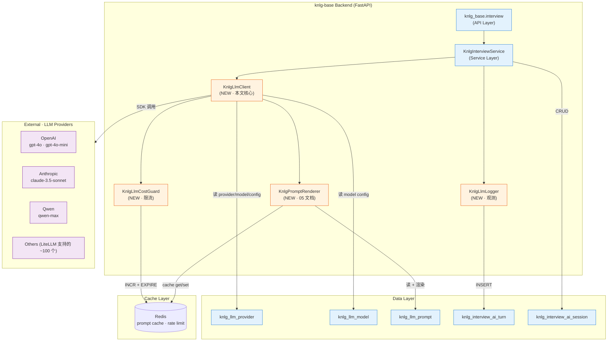
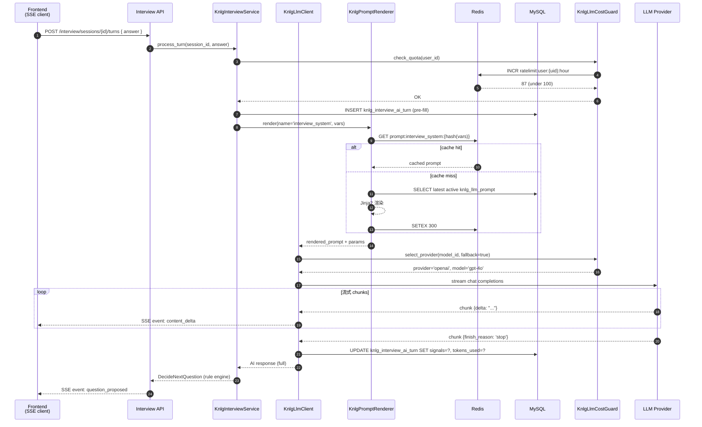
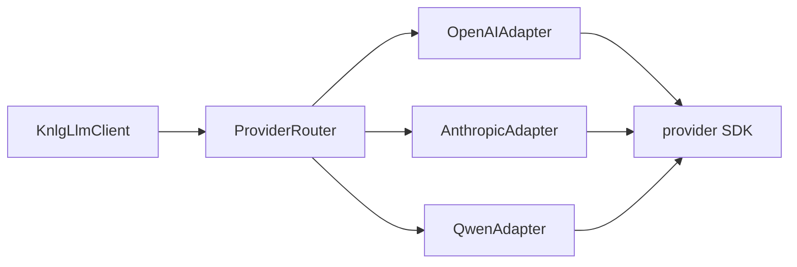

# 04-LLM Gateway 设计

> **受众**：后端工程师（实施 LLM 接入层）+ AI 工程师（构建 Prompt 与 Agent 调用）
> **目标**：在 knlg-base 后端建立一个**轻量级、Python 原生、可观测**的 LLM 客户端层，使 Phase 3 的 AI 访谈 Agent MVP 能调用多 provider 模型。
> **不重复**：错误码体系已在 [02-backend-api](./02-backend-api#12-错误码完整表) 第 12 节定义，LLM Provider / Model / Prompt 的管理端点已在 [02-backend-api](./02-backend-api#10-llm-管理-api管理员) 第 10 节定义。本文聚焦**内部运行时**设计。

---

## 1. 概述

### 1.1 设计目标

| # | 目标 | 度量 |
|---|---|---|
| G1 | 接入多 LLM Provider（OpenAI / Anthropic / 国内模型）| 至少 2 个 provider 可切换 |
| G2 | 支持同步与流式（SSE）两种调用模式 | Phase 3 MVP 必须有 SSE |
| G3 | 限流 + 降级，按预算可控 | 单 user ≤ 100 次/小时，季度预算 ≤ $X |
| G4 | 调用过程可观测、可回放 | 100% 请求落 `knlg_interview_ai_turn.log` |
| G5 | Prompt 版本生效无需重启 | DB 改动 → ≤ 30s 全集群生效 |
| G6 | 与 agent-server **解耦** | knlg-base 不依赖 `@agegr/*` workspace 包 |

### 1.2 非目标（Phase 3 不做）

| 不做 | 原因 | 何时考虑 |
|---|---|---|
| 统一所有 AI 调用于 agent-server | agent-server 当前面向 coding agent，业务模型不匹配 | v2（待用量评估）|
| 工具调用（Function Calling）| MVP 访谈为纯对话 | v2（需 Agent 时） |
| Embedding 服务 | Phase 1 已用 MySQL FULLTEXT 暂不上向量 | Phase 7/Phase 5+ |
| Prompt 模板市场（跨 workspace）| Phase 3 单 workspace 足够 | v3 |
| 自托管模型推理 | 基建成本太高 | 永不做 |

---

## 2. 决策论证：为何选 Option D（Python 轻量客户端）

### 2.1 三个候选方案对比

| 维度 | A. 复用 agent-server | B. 自建完整 Gateway | **D. Python 轻量客户端**（选定）|
|---|---|---|---|
| 工作量 | 1-2d | 5-7d | **2-3d** |
| 跨服务调用 | 是（HTTP）| 无 | 无 |
| 跨语言 | 是（TS→Py）| 无 | 无 |
| 实现位置 | knlg-base 调 agent-server | knlg-base backend 内 | knlg-base backend 内 `services/knlg_base/llm/` |
| Provider 配置 | 与 agent-server 共享 | 自有 | **自有**（复用 knlg_llm_* 表）|
| 与 coding agent 共享能力 | 是（models/skills/tools）| 否 | 否 |
| 业务模型匹配度 | ❌ 低（coding vs interview）| ✅ 高 | ✅ 高 |

### 2.2 为什么不选 A（复用 agent-server）

基于 2026-07-01 对 `/Volumes/data/working/ai/neo-agents/agent-server/` 的代码侦察，发现 6 个硬冲突：

| 冲突点 | agent-server 的现状 | knlg-base 的需求 |
|---|---|---|
| **cwd 必填** | `POST /api/agent/new` 要求 `cwd` 真实存在 | 访谈是纯对话流，无工作目录概念 |
| **Session 与文件系统绑定** | `resolveSessionPath()` 从磁盘读 header.cwd | knlg-base Session 存 MySQL |
| **工具面过重** | 14 个工具（bash/edit/browser...）| AI 访谈只要 chat + function_call（v2）|
| **命令面过宽** | `prompt/abort/steer/fork/compact/set_model/set_tools` | 只用 `prompt` + `abort` |
| **认证尚未实现** | `const userId = 0` 占位 | knlg-base 有完整 JWT + workspace 隔离 |
| **Session 闲置 10 分钟自动 destroy** | 写在 shutdown 路径 | AI 访谈可能跨多小时 |

强行复用需写一个"翻译层"，工作量 > 自建客户端，且引入循环依赖风险（knlg-base 改造会影响 agent-server 业务）。

### 2.3 为什么不选 B（自建完整 Gateway）

完整 Gateway 应包含：

- Provider 健康检测 + 自动切换（v2 才需要）
- 多租户计费 + 用量报表（v2 才需要）
- 多模型 A/B 灰度（v2 才需要）
- KV cache 优化（Phase 1+2 没这个量级）
- 统一鉴权代理（已由 FastAPI middleware 处理）

Phase 3 用量（< 100 turn/天/workspace）不需要上述能力，过度设计。

### 2.4 为什么 D 最优

- **业务一致**：knlg-base 全栈 Python，跨进程/跨语言是反模式
- **scope 最小**：2-3 天即可上线 MVP，验证访谈闭环
- **可观测**：直接拿 FastAPI 的 request_id + structured logging，无需额外协议
- **可演进而非降级**：未来若需要共享能力，**Option E（V2 迁移）** 比反向降级简单
- **风险可逆**：每个 Provider 调用独立封装，换 SDK 只需替换 adapter

### 2.5 决策锁定（2026-07-01 评审）

经技术评审会确认（参见 [PHASE3-DESIGN-HANDOFF §4 决策记录](./PHASE3-DESIGN-HANDOFF#4-决策记录)）：

- ✅ **Phase 3 选定 Option D**（Python 轻量客户端 + LiteLLM）
- ✅ **暂不考虑**未来统一到 agent-server（业务模型不同，knlg-base 与 agent-server 不做融合）
- ✅ **LiteLLM 跟随 latest 版本**（不锁版本；锁版本反而在快速迭代期带来不必要的升级摩擦）

---

## 3. 架构

### 3.1 整体架构



**关键设计点**：

| 模块 | 角色 | 本文是否详述 |
|---|---|---|
| `KnlgLlmClient` | 主入口，对外暴露 `chat()` / `stream()` / `embed()` | ✅ 第 5 节 |
| `KnlgPromptRenderer` | 读 + 渲染 + 缓存 Prompt 模板 | 见 [05-prompt-management](./05-prompt-management) |
| `KnlgLlmCostGuard` | 限流 + 降级决策 | ✅ 第 7 节 |
| `KnlgLlmLogger` | 全量请求审计 + 慢请求告警 | ✅ 第 9 节 |

### 3.2 模块协作时序（一次 AI 访谈 turn）



---

## 4. LiteLLM 选型

### 4.1 为何选 LiteLLM

| 维度 | 自接 OpenAI SDK | 自接 Anthropic SDK | **LiteLLM**（选定）|
|---|---|---|---|
| 多 provider 抽象 | ❶ 写一层 adapter | ❶ 写一层 adapter | ✅ 内置 ~100 个 provider |
| 流式响应统一 | ❷ SSE 格式逐家不同 | ❷ SSE 格式逐家不同 | ✅ OpenAI 兼容格式 |
| 错误码归一 | ❸ 各家自己定义 | ❸ 各家自己定义 | ✅ 统一分类（4 类错误）|
| 重试 + 退避 | ❹ 自己写 | ❹ 自己写 | ✅ 内置 |
| Token 计数 | ❺ 各家 tokenizers | ❺ 各家 tokenizers | ✅ 统一接口 |
| 锁定风险 | ❻ 高 | ❻ 高 | ✅ 可绕过直调原 SDK |
| 学习曲线 | 小 | 小 | 中（需熟悉 proxy 模式）|
| 依赖复杂度 | 低 | 低 | 中（~3MB 依赖）|
| 活跃度 | - | - | ⭐ GitHub 12k+ star，月度更新 |
| 版本策略 | 锁版本 / latest | 锁版本 / latest | **跟随 latest**（2026-07-01 决策）|

### 4.2 LiteLLM 在 knlg-base 中的集成模式

```python
# src/app/services/knlg_base/llm/client.py
from litellm import acompletion  # async completion

class KnlgLlmClient:
    """LLM client wrapper based on LiteLLM.

    使用 LiteLLM 的 OpenAI-兼容协议作为统一接口。
    每个 provider 的 knlg_llm_provider.api_base_url 直接透传给 LiteLLM。
    """

    async def chat(
        self,
        *,
        model: str,        # "openai/gpt-4o" | "anthropic/claude-3-5-sonnet" | ...
        messages: list[dict],
        **kwargs,
    ) -> LlmResponse:
        ...

    async def stream(
        self,
        *,
        model: str,
        messages: list[dict],
        **kwargs,
    ) -> AsyncIterator[LlmChunk]:
        response = await acompletion(
            model=model,
            messages=messages,
            stream=True,
            **kwargs,
        )
        async for chunk in response:
            yield LlmChunk.from_litellm(chunk)
```

### 4.3 版本策略 + 备选方案

**版本策略（2026-07-01 决策）**：跟随 latest，不锁版本。

理由：

- Phase 3 快速迭代期，锁版本反而带来不必要的升级摩擦
- LiteLLM 跟随 latest 受益于社区快速修复 bug
- 主要风险（重大版本 breaking change）通过**集成测试 + e2e 回归**覆盖，而不是锁版本
- 升级流程：CI 跑 §14 全部测试 → 通过即升级

LiteLLM 主要已知风险：

- 偶发 SSE 增量事件解析 bug（社区已修）
- 偶尔有新 provider 接入问题

如未来 LiteLLM 出现严重阻塞，可平滑切换到自写 adapter：



每个 Adapter 实现统一的 `chat()` / `stream()` 接口。**两套实现可并存**，LiteLLM 默认，自写 adapter 作为 fallback。

---

## 5. KnlgLlmClient 服务设计

### 5.1 文件结构

```
backend/src/app/services/knlg_base/llm/
├── __init__.py
├── client.py            # KnlgLlmClient 主入口
├── router.py            # 根据 model_id 选 provider + model + fallback
├── prompt.py            # KnlgPromptRenderer 接口（实现在 05）
├── cost_guard.py        # KnlgLlmCostGuard 限流
├── logger.py            # KnlgLlmLogger 观测
├── exceptions.py        # LlmError 等自定义异常
└── types.py             # Pydantic 类型定义
```

### 5.2 Pydantic 类型

```python
# types.py
from pydantic import BaseModel, Field

class LlmMessage(BaseModel):
    role: Literal["system", "user", "assistant"]
    content: str

class LlmRequest(BaseModel):
    model: str = Field(..., description="openai/gpt-4o 或 anthropic/claude-3-5-sonnet")
    messages: list[LlmMessage]
    temperature: float = 0.7
    max_tokens: int | None = None
    stop: list[str] | None = None
    response_format: dict | None = None  # JSON schema 强制
    workspace_id: int | None = None  # 注入用于计费
    user_id: int | None = None       # 注入用于限流

class LlmChunk(BaseModel):
    delta: str
    finish_reason: str | None = None

class LlmResponse(BaseModel):
    content: str
    finish_reason: str
    usage: LlmUsage
    model: str

class LlmUsage(BaseModel):
    prompt_tokens: int
    completion_tokens: int
    total_tokens: int
    cost_usd: float  # 按 knlg_llm_model.cost_per_1k 计算

class LlmSignal(BaseModel):
    """信号识别结果，与 06 文档配套"""
    type: Literal["pain_point", "opportunity", "counter_example", "boundary", "key_metric"]
    confidence: float = Field(..., ge=0, le=1)
    text: str
    linked_question_id: int | None = None
```

### 5.3 调用示例

```python
# 在 InterviewService 中
async def run_ai_turn(self, session_id: int, user_message: str) -> AsyncIterator[TurnEvent]:
    turn = await self.turn_repo.create(session_id=session_id, user_message=user_message)
    rendered = await self.prompt.render(
        name="interview_system",
        vars={"expert_role": "销售总监", "domain": "opportunity"},
    )
    request = LlmRequest(
        model="openai/gpt-4o",
        messages=[
            LlmMessage(role="system", content=rendered),
            LlmMessage(role="user", content=user_message),
        ],
        workspace_id=session.workspace_id,
        user_id=session.expert_id,
        response_format=SignalExtractionSchema.model_json_schema(),
    )

    accumulated = []
    signals = []
    try:
        async for chunk in self.llm_client.stream(request):
            accumulated.append(chunk.delta)
            yield TurnEvent(type="content_delta", delta=chunk.delta)
            if chunk.finish_reason == "stop":
                break
    finally:
        full_content = "".join(accumulated)
        signals = SignalExtractionSchema.model_validate_json(full_content)
        await self.turn_repo.complete(turn.id, content=full_content, signals=signals)
        await self.cost_guard.record(request, usage=chunk.usage)
```

---

## 6. Provider / Model / Prompt 配置复用

### 6.1 现有 3 张表的现状

截至 2026-07-01，三张 LLM 表的 schema 定义已存在于：

- `backend/src/app/models/knlg_llm_provider.py`
- `backend/src/app/models/knlg_llm_model.py`
- `backend/src/app/models/knlg_llm_prompt.py`

但 **migration 未生成**（Phase 1+2 都不依赖 LLM）。Phase 3 启动第一件事是建表。

### 6.2 表用法映射

| 表 | 在 LLM Gateway 中的角色 | 读取时机 |
|---|---|---|
| `knlg_llm_provider` | 存 Provider 元数据 + API Key 引用 | 每次请求 |
| `knlg_llm_model` | 存 Model 限速 + 成本 + capabilities | 每次请求 |
| `knlg_llm_prompt` | 存 Prompt 模板 + 变量定义 + 参数 | Prompt 渲染时 |

### 6.3 Provider 数据加载流程

```mermaid
graph LR
    A[KnlgLlmClient.stream] --> B[model = "openai/gpt-4o"]
    B --> C[router.resolve]
    C --> D[查 knlg_llm_model WHERE name=gpt-4o]
    D --> E[得 provider_id]
    E --> F[查 knlg_llm_provider WHERE id]
    F --> G[取 api_key_secret]
    G --> H[解密密钥]
    H --> I[调用 litellm.acompletion]
```

### 6.4 API Key 加密策略

`knlg_llm_provider.api_key_secret` 字段实际**只存 Secret Manager 的引用**，不是明文。

Phase 3 推荐使用 FastAPI Settings（pydantic-settings）从 `.env` 读取，DB 只存"哪个 Provider 用哪个环境变量名"：

```python
# config.py 补充
class LlmSettings(BaseSettings):
    openai_api_key: str | None = None
    anthropic_api_key: str | None = None
    qwen_api_key: str | None = None

    model_config = SettingsConfigDict(env_file=".env", extra="ignore")
```

`knlg_llm_provider.api_key_secret` 字段值为 `"env:OPENAI_API_KEY"` 这样的引用，由 `KeyResolver` 解析。

> **TODO（v2）**：接入 Vault / AWS Secrets Manager，Phase 3 先用环境变量。

---

## 7. 限流 + 降级策略

### 7.1 限流维度

| 维度 | 上限 | 实现 |
|---|---|---|
| 每 user 每小时调用次数 | 100 | Redis INCR + EXPIRE 3600 |
| 每 workspace 每小时调用次数 | 1000 | Redis INCR + EXPIRE 3600 |
| 每 turn tokens | 4000 input + 2000 output | LiteLLM 参数 |
| 每访谈时长 | 30 分钟 | App 层定时器 |
| 单访谈追问深度 | 5 层 | Interview 状态机 |

### 7.2 限流实现（Redis）

```python
# cost_guard.py
class KnlgLlmCostGuard:
    async def check_quota(self, user_id: int, workspace_id: int) -> bool:
        user_key = f"ratelimit:user:{user_id}:hour"
        ws_key = f"ratelimit:workspace:{workspace_id}:hour"

        user_count = await self.redis.incr(user_key)
        if user_count == 1:
            await self.redis.expire(user_key, 3600)
        if user_count > 100:
            raise LlmRateLimitError("USER_RATE_LIMIT")

        ws_count = await self.redis.incr(ws_key)
        if ws_count == 1:
            await self.redis.expire(ws_key, 3600)
        if ws_count > 1000:
            raise LlmRateLimitError("WORKSPACE_RATE_LIMIT")

        return True
```

### 7.3 降级策略（多模型 fallback）

每个 Prompt 模板可声明 `fallback_models`:

```yaml
# knlg_llm_prompt.parameters
{
  "primary_model": "openai/gpt-4o",
  "fallback_models": ["anthropic/claude-3-5-sonnet", "openai/gpt-4o-mini"],
  "fallback_on": ["timeout", "rate_limit", "context_overflow"]
}
```

```python
# router.py
class ProviderRouter:
    async def resolve(self, request: LlmRequest) -> ResolvedModel:
        candidates = [request.model] + request.fallback_models
        for candidate in candidates:
            try:
                model = await self._load_model(candidate)
                return ResolvedModel(model=model, attempted=candidate)
            except LlmModelUnavailable:
                continue
        raise LlmAllProvidersDownError()
```

### 7.4 错误分类（与 LiteLLM 对齐）

| 类别 | 触发 | knlg-base 错误码 | HTTP | 用户可读消息 |
|---|---|---|---|---|
| timeout | 请求 > 30s | ERR_LLM_TIMEOUT (1300) | 504 | "AI 暂时无响应，请重试" |
| rate_limit | Provider 429 | ERR_LLM_RATE_LIMIT (1301) | 429 | "调用太频繁，请稍候" |
| context_overflow | tokens > model 限制 | ERR_LLM_CONTEXT_OVERFLOW (1302) | 400 | "对话过长，请总结后继续" |
| auth_failed | API Key 无效 | ERR_LLM_AUTH (1303) | 500 | "服务配置错误"（不暴露细节）|
| provider_down | 5xx 连 > 3 次 | ERR_LLM_PROVIDER_DOWN (1304) | 503 | "AI 服务不可用" |

> 注：错误码 1300-1399 为 Phase 3 新增，与 [02-backend-api](./02-backend-api#12-错误码完整表) 第 12 节 1001-1005/5001/6001/9001 错开。

---

## 8. 错误码体系（与 02 对齐）

### 8.1 错误码归属

| 错误码 | 名称 | HTTP | 触发 |
|---|---|---|---|
| 1300 | `ERR_LLM_TIMEOUT` | 504 | Provider 30s 超时 |
| 1301 | `ERR_LLM_RATE_LIMIT` | 429 | Provider 429 或本地限流 |
| 1302 | `ERR_LLM_CONTEXT_OVERFLOW` | 400 | 上下文超模型 max_tokens |
| 1303 | `ERR_LLM_AUTH` | 500 | API Key 无效 |
| 1304 | `ERR_LLM_PROVIDER_DOWN` | 503 | Provider 5xx 持续失败 |
| 1305 | `ERR_LLM_INVALID_RESPONSE` | 502 | LLM 返回无法 parse |
| 1306 | `ERR_LLM_QUOTA_EXHAUSTED` | 402 | 月度预算耗尽 |
| 1307 | `ERR_LLM_CANCELLED` | 499 | 用户中断 SSE |
| 1308 | `ERR_LLM_CONFIG_ERROR` | 500 | knlg_llm_provider/model/prompt 配置缺失或冲突 |

### 8.2 错误响应格式（沿用 02 规范）

```json
{
  "code": 1300,
  "message": "AI 暂时无响应，请重试",
  "data": null,
  "traceId": "req-abc-123",
  "timestamp": 1713700000000,
  "errors": [
    {"field": "model", "reason": "openai/gpt-4o timeout after 30s"}
  ]
}
```

### 8.3 SSE 错误事件（前端处理）

前端 EventSource 收到 `error` 事件时：

```typescript
eventSource.addEventListener('error', (event) => {
  const err = JSON.parse(event.data);
  switch (err.code) {
    case 1300: // timeout
    case 1301: // rate_limit
      store.setConnectionStatus('retryable');
      scheduleReconnect();
      break;
    case 1303: // auth
    case 1304: // provider_down
      store.setConnectionStatus('fatal');
      toast.error('AI 服务暂时不可用');
      break;
    case 1302: // context_overflow
      store.setConnectionStatus('context_overflow');
      triggerSummarize();
      break;
    default:
      store.setConnectionStatus('error');
  }
});
```

---

## 9. 观测 + 日志

### 9.1 调用日志模型

每次 LLM 调用（含成功、失败、中断）必须落 `knlg_interview_ai_turn.log` 字段（JSON），包含：

```json
{
  "request": {
    "model": "openai/gpt-4o",
    "messages_count": 3,
    "messages_hash": "sha256:abc123...",
    "temperature": 0.7,
    "max_tokens": 2000
  },
  "response": {
    "finish_reason": "stop",
    "content_length": 1847,
    "content_hash": "sha256:def456..."
  },
  "usage": {
    "prompt_tokens": 842,
    "completion_tokens": 156,
    "total_tokens": 998,
    "cost_usd": 0.0247
  },
  "timing": {
    "start_at": 1713700000000,
    "first_token_at": 1713700001230,
    "end_at": 1713700004560,
    "duration_ms": 4560,
    "ttft_ms": 1230
  },
  "provider_response": {
    "request_id": "req_abc123",
    "cached_tokens": 256
  },
  "errors": []
}
```

### 9.2 关键指标

| 指标 | Prometheus 名称 | 告警阈值 |
|---|---|---|
| 请求计数 | `knlg_llm_request_total{model, status}` | - |
| P50/P95/P99 延迟 | `knlg_llm_duration_seconds_bucket` | P95 > 8s 告警 |
| 错误率 | `knlg_llm_error_total{code}` | > 5% 告警 |
| Token 用量 | `knlg_llm_tokens_total{direction}` | 月度预算 80% 告警 |
| 成本 | `knlg_llm_cost_usd_total` | 月度预算 80% 告警 |
| 缓存命中率 | `knlg_prompt_cache_hit_total / request_total` | - |
| 流式 TTFT | `knlg_llm_ttft_seconds_bucket` | P95 > 2s 告警 |

### 9.3 慢请求 + 异常请求 trace

- 所有请求带 `traceId`，从 FastAPI middleware 注入
- P95 > 8s 的请求自动附带完整 request body 入 daily log
- 异常请求（4xx/5xx）自动附带 + OpenTelemetry span

### 9.4 调用审计 API（调试用）

```http
GET /api/v1/workspaces/{code}/knlg-base/interview/llm-logs
```

参数：`session_id`、`turn_id`、`start_date`/`end_date`、`model`、`cost_min`

响应分页 `{items, total, page, page_size}`，每条 item 包含第 9.1 节的完整 log + 关联的 `knlg_interview_ai_turn.id`。

> 注：此端点已在 [02-backend-api](./02-backend-api#84-llm-调用日志调试用) 第 8.4 节定义。

---

## 10. 与 agent-server 的解耦原则

### 10.1 边界声明

```text
knlg-base  ─┬─→  LLM Provider (via LiteLLM)
             │
             └─→  否  ─→  agent-server（除 plan 工具）
```

knlg-base **不**：

- 不依赖 `@agegr/*` workspace 包
- 不调用 `agent-server` 的任何 endpoint
- 不复用 agent-server 的 sessions、models、skills 配置

knlg-base **可**：

- 独立部署在任意 Python 兼容环境
- 单独升级 LiteLLM 版本
- 单独更换 client 实现（自写 adapter fallback）

### 10.2 互通约定（如果未来需要）

如果 v2 真的演进到 Option E（统一到 agent-server），需做：

1. **共享 Provider/Model 配置**：通过 `knlg_llm_provider` 表单向同步到 agent-server（agent-server 只读）
2. **共享 Skill 元数据**：把 Phase 3 的几个 Prompt 写成 SKILL.md 格式
3. **共享认证**：knlg-base 的 JWT 与 agent-server 兼容

这些属于"v2 决策点"，本文不展开。

### 10.3 配置管理建议

agent-server 跑在 `:30141`，knlg-base 跑在 `:8000`。两套 LLM 配置独立管理：

| 项 | agent-server 配置方式 | knlg-base 配置方式 |
|---|---|---|
| Provider API Key | `~/.pi/auth.json` 或 OAuth | `knlg_llm_provider.api_key_secret` + 环境变量 |
| Model 列表 | `ModelRegistry.create()` | `knlg_llm_model` 表 + 后台管理 API |
| Prompt 模板 | 文件系统 SKILL.md | `knlg_llm_prompt` 表 + 渲染器 |

如团队希望"只在 agent-server 配置一次"，可加一个定时同步任务（v2），Phase 3 不做。

---

## 11. 迁移策略

### 11.1 Alembic Migration 清单

**新建**：

```
alembic/versions/2026_07_xx_001_create_knlg_llm_tables.py
```

内容：

- `CREATE TABLE knlg_llm_provider (...)` — 字段见 `backend/src/app/models/knlg_llm_provider.py`
- `CREATE TABLE knlg_llm_model (...)` — 字段见 `backend/src/app/models/knlg_llm_model.py`
- `CREATE TABLE knlg_llm_model CONSTRAINT uk_llm_provider_name`
- `CREATE TABLE knlg_llm_model INDEX idx_llm_model_provider`
- `CREATE TABLE knlg_llm_prompt (...)` — 字段见 `backend/src/app/models/knlg_llm_prompt.py`
- `CREATE TABLE knlg_llm_prompt CONSTRAINT idx_prompt_name_version`
- `CREATE TABLE knlg_llm_prompt INDEX idx_prompt_category`
- `CREATE TABLE knlg_llm_prompt INDEX idx_prompt_active`
- 3 张表的外键

**新建**（Phase 3 06 文档定义）：

```
alembic/versions/2026_07_xx_002_create_knlg_ai_interview_tables.py
```

内容：

- `knlg_interview_ai_session`
- `knlg_interview_ai_turn`
- `knlg_signal`

（详见 [06-interview-agent](./06-interview-agent)）

**新建**（种子数据）：

```
alembic/versions/2026_07_xx_003_seed_default_providers_and_prompts.py
```

插入默认 Provider：`openai` / `anthropic` / `qwen`（`enabled=false`）
插入默认 Model：`gpt-4o` / `gpt-4o-mini` / `claude-3-5-sonnet` / `qwen-max`
插入默认 Prompt 模板（见 [05-prompt-management](./05-prompt-management#8-种子-prompt-模板)）

### 11.2 配置变更

新增环境变量（`.env.example`）：

```bash
# LLM Gateway
LLM_DEFAULT_PROVIDER=openai
LLM_DEFAULT_MODEL=gpt-4o-mini
LLM_REQUEST_TIMEOUT_SECONDS=30
LLM_STREAM_CHUNK_TIMEOUT_SECONDS=10
LLM_MAX_RETRIES=3
LLM_RATE_LIMIT_USER_PER_HOUR=100
LLM_RATE_LIMIT_WORKSPACE_PER_HOUR=1000
LLM_MONTHLY_BUDGET_USD=2000  # 全平台月度预算

# Provider API Keys（实际值由运维在 .env 配置）
OPENAI_API_KEY=
ANTHROPIC_API_KEY=
QWEN_API_KEY=
```

### 11.3 不破坏现有数据

- 不动 Phase 1+2 已有的 19 张表
- 仅新增 6 张表（3 张 LLM + 3 张 AI 访谈）
- 所有现有 API 端点 100% 兼容

---

## 12. 测试策略

### 12.1 单元测试

| 测试目标 | 覆盖项 | 工具 |
|---|---|---|
| `KnlgLlmClient` | 模型路由、错误归一、参数透传 | pytest + pytest-asyncio + mock provider |
| `KnlgLlmCostGuard` | 限流逻辑、降级链 | pytest + fakeredis |
| `KnlgLlmLogger` | 日志写入、cost 计算 | pytest + SQLite |
| LiteLLM 集成 | 真实调用（按 provider）| vcrpy 录制真实响应后回放 |

### 12.2 集成测试

| 场景 | 验收 |
|---|---|
| 同步调用完整链路 | model → prompt render → call → DB log |
| 流式调用 + 错误中断 | 部分 chunks 已发出后客户端断开，DB 标记 `interrupted` |
| Provider failover | 主模型 timeout → 自动切到 fallback，用户无感 |
| 限流触发 | 模拟 101 次/小时，101st 应抛 1301 |
| 缓存命中 | 同一 prompt + vars 第二次请求命中 Redis |

### 12.3 端到端测试（Phase 3 收尾）

```text
场景：专家完整接受一次 AI 访谈
  Given 3 个 default prompt 模板已 seed
  And 1 个 valid Provider (openai)
  When 专家登录 knlg-base
  And 选择 "商机资格" 问题树模板
  And 点击 "AI 访谈"
  Then AI 在 5 秒内发出首个 SSE event: content_delta
  And 流式输出 ≥ 1 个 question
  And 每回答后追加追问
  And 5 轮后自动进入 ai_summarizing
  And 访谈关闭后, knlg_interview_ai_turn 表有 5 条记录 + 1 条 signal
  And 用户的月度 token 计数增加
```

---

## 13. 安全考虑

### 13.1 API Key 保护

- `knlg_llm_provider.api_key_secret` 字段值形如 `env:OPENAI_API_KEY`，明文密钥只存于部署环境的 `.env`
- DB 不允许任何角色直接读取 api_key_secret（仅 client service 内部读取）
- 日志中禁止打印 API Key
- 轮转策略：每季度（v2 用 Vault 自动）

### 13.2 输入校验

- `messages` 长度限制（单 message ≤ 50KB）
- 单 turn 总 tokens ≤ 6000（防爆炸）
- 用户输入使用 Pydantic 校验：长度、字符集、敏感词过滤

### 13.3 输出审核

- LLM 返回的 `content` 写入 DB 前过关键词过滤（v2 接内容审核服务）
- `signal` 输出过 Pydantic schema 校验（见 06 文档）

### 13.4 数据隔离

- 所有查询必须带 `workspace_id`（沿用 [01-database-schema](./01-database-schema#8-数据隔离与权限) 第 8.2 节 SQLAlchemy Event Hook）
- LLM Provider / Model / Prompt 表是**全局**（无 workspace_id），但调用时强制 `workspace_id` 落 audit log

---

## 14. 性能预算

| 指标 | 目标 | 备注 |
|---|---|---|
| 流式 TTFT（首个 token）| P95 ≤ 2s | 主模型 fallback 到 mini 后 ≤ 1s |
| 单 turn 总延迟 | P95 ≤ 8s | 1k input + 500 output tokens |
| 同步调用 P99 | ≤ 12s | timeout 30s |
| 并发限制 | 单 workspace ≤ 5 同时访谈 | 防 Provider rate limit |
| Cache hit 提升 | ≥ 30% | 高频 Prompt 模板 |

### 14.1 并发控制

```python
# 使用 semaphore 限制并发
self._sem = asyncio.Semaphore(5)  # 单 workspace

async def stream(self, request: LlmRequest):
    async with self._sem:
        async for chunk in self._litellm_stream(request):
            yield chunk
```

### 14.2 连接池

LiteLLM 内部用 httpx，启用 HTTP/2 + 连接池：

```python
import httpx
limits = httpx.Limits(max_connections=100, max_keepalive_connections=20)
timeout = httpx.Timeout(30.0, connect=5.0)
```

---

## 15. 开放问题与决策

### 15.1 已敲定（本设计稿采纳）

| 决策 | 选择 | 理由 |
|---|---|---|
| LLM 接入方式 | Option D（Python 轻量客户端）| 见第 2 节论证 |
| Python LLM 抽象库 | LiteLLM | 见第 4 节论证 |
| 限流存储 | Redis | 已有基础设施，无新依赖 |
| API Key 管理 | 环境变量 + 引用 | Phase 3 简化为 `.env` |

### 15.2 待敲定（需与 PM 对齐）

| 问题 | 候选 | 建议默认值 |
|---|---|---|
| 月度 LLM 预算上限 | $500 / $2000 / $5000 / 不限 | $2000（用 `LLM_MONTHLY_BUDGET_USD` 控制）|
| 主模型选型 | gpt-4o / claude-3-5-sonnet / qwen-max | **gpt-4o** + **claude-3-5-sonnet** 双备 |
| 是否启用国内模型兜底 | 是 / 否 | **是**（合规要求时自动切）|
| 输入审核策略 | 不审核 / 关键词过滤 / 接入审核 API | **关键词过滤**（v2 接 API）|
| 输出 JSON Schema 强约束范围 | 全部 / 仅 signal 类 / 不强制 | **仅 signal 类** |

### 15.3 v2 待办（Phase 3 不做）

- [ ] Provider 性能监控 + 自动健康切换
- [ ] 接入 Vault / Secrets Manager
- [ ] Function Calling / Tool Use 支持
- [ ] Embedding 端点（Phase 5/7 备用）
- [ ] 与 agent-server 的 Optional 配置同步
- [ ] 多租户精细计费与用量报表

---

## 16. 相关文档

### 16.1 项目内设计文档

- [02-backend-api](./02-backend-api) — API 端点 + 错误码 + SSE 基础协议
- [05-prompt-management](./05-prompt-management) — Prompt 模板管理（与本文的 `KnlgPromptRenderer` 接口配套）
- [06-interview-agent](./06-interview-agent) — AI 访谈 Agent（消费本文的 `KnlgLlmClient`）

### 16.2 项目内产品/技术参考

- [01-database-schema](./01-database-schema) — `knlg_llm_*` 3 张表的 schema 定义
- [Phase 3 Handoff](./PHASE3-DESIGN-HANDOFF) — Phase 3 整体 handoff
- [Agent Steer 技术总览](../agent-steer/index) — agent-server 架构（说明解耦理由）

### 16.3 外部依赖

- [LiteLLM 文档](https://docs.litellm.ai/) — Python SDK
- [OpenAI API Reference](https://platform.openai.com/docs/api-reference) — Provider 参考
- [Anthropic Claude API](https://docs.anthropic.com/claude/reference) — Provider 参考

---

## ✅ 设计检查清单

- [x] 整体架构图 + 时序图
- [x] LiteLLM 选型理由 + 替代方案
- [x] 复用现有 3 张 LLM 表
- [x] Python LLM Client 服务设计（含类型、调用示例）
- [x] 限流策略（多维度）
- [x] 降级策略（fallback models）
- [x] 错误码体系（1300-1399 范围）
- [x] SSE 错误事件定义
- [x] 观测与日志（落 DB + Prometheus 指标）
- [x] 与 agent-server 解耦原则
- [x] Alembic migration 清单
- [x] 环境变量配置
- [x] 单元/集成/E2E 测试策略
- [x] 安全考虑
- [x] 性能预算
- [x] 相关文档链接
