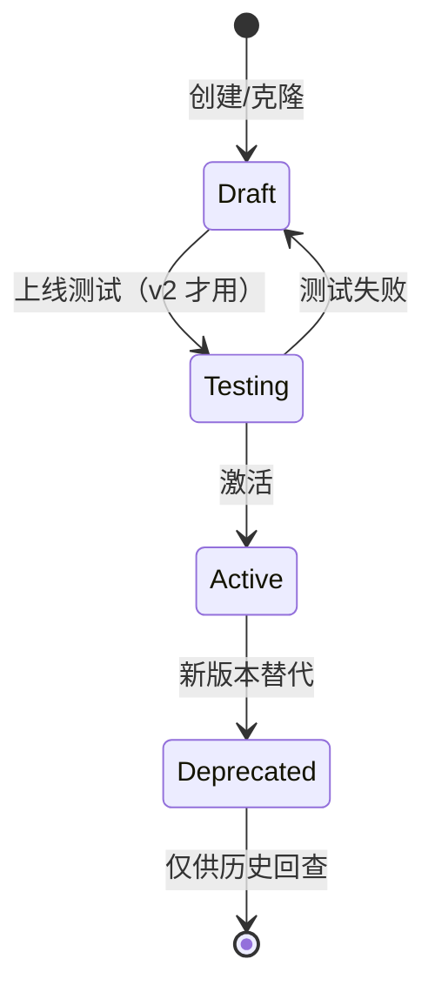

# 05-Prompt 模板管理

> **受众**：AI 工程师（设计 Prompt + 维护版本）+ 产品经理（运营模板 + A/B）+ 后端工程师（实现 `KnlgPromptRenderer`）
> **目标**：把 Phase 3 的所有 Prompt（系统提示、追问模板、信号抽取 Prompt）纳入**数据库管控**，支持版本回滚、A/B 灰度、产品可编辑。
> **配套阅读**：[04-llm-gateway](./04-llm-gateway#5-knlgllmclient-服务设计) 第 5 节定义了 `KnlgPromptRenderer` 接口契约；本文负责其实现设计。

---

## 1. 概述

### 1.1 设计目标

| # | 目标 | 验收 |
|---|---|---|
| G1 | 所有 LLM 调用走 DB 存储的 Prompt 模板 | 零 hardcoded prompt 字符串（除调试代码）|
| G2 | 版本可追溯、可回滚 | 任意 Prompt 可一键回到 v(N-1)|
| G3 | 业务人员可编辑（无需重启服务）| 后台 UI 编辑 → ≤ 30s 全集群生效 |
| G4 | 支持 A/B 测试（同一 Prompt 不同版本各 X% 流量）| 见第 5 节 |
| G5 | 渲染结果有缓存 | 重复调用 ≥ 50% 命中 Redis 缓存 |
| G6 | 模板语法可校验（变量必须声明）| 编辑器实时校验 |

### 1.2 与 04 / 06 的边界

| 文档 | 关注 |
|---|---|
| [04-llm-gateway](./04-llm-gateway) | LLM Provider 路由、限流降级、错误码 |
| **本文 05** | Prompt 模板存储、版本控制、编辑器、缓存、渲染 |
| [06-interview-agent](./06-interview-agent) | AI 访谈 Agent 状态机、追问决策、信号识别（消费 Prompt）|

---

## 2. KnlgLlmPrompt 表用法详解

### 2.1 现有字段（schema 已定义）

来自 `backend/src/app/models/knlg_llm_prompt.py`：

| 字段 | 类型 | 必填 | 用途 |
|---|---|---|---|
| `id` | BIGINT PK | auto | 主键 |
| `name` | VARCHAR(128) | ✅ | 逻辑名（业务标识，如 `interview_system`）|
| `category` | VARCHAR(64) | ✅ | 类别（`interview`/`extract`/`extract_signal`/`classify`/`summarize`）|
| `version` | VARCHAR(32) | ✅ | 版本号（`1.0` / `1.1` / `2026-07-01-a`）|
| `template` | TEXT | ✅ | Jinja2 模板 |
| `variables` | JSON | ✅ | 变量定义 `[{name, type, required, default}]` |
| `model_id` | BIGINT FK | ✅ | 适用模型（也间接决定 Provider）|
| `parameters` | JSON | - | 模型参数（`temperature` / `max_tokens` / `top_p`）|
| `is_active` | BOOLEAN | ✅ | 是否启用（与 `deprecated` 互斥）|
| `workspace_id` | BIGINT FK NULL | - | NULL = 全局，否则 workspace 私有覆盖 |
| `created_by` | BIGINT FK | ✅ | 创建人 |
| `created_at` | TIMESTAMP | ✅ | - |
| `updated_at` | TIMESTAMP | ✅ | - |

约束：

- `UNIQUE INDEX idx_prompt_name_version (name, version)` — 同名同版本唯一
- `INDEX idx_prompt_category (category)`
- `INDEX idx_prompt_active (is_active)`

### 2.2 Phase 3 扩展字段（A/B + traffic split）

为支持 A/B 测试，**评估后**决定是否加 2 个字段。本表 Phase 3 启动时的 **alembic migration**：

#### 方案 A（保守，本 MVP 推荐）

**不**加字段，依赖 `is_active` + `version` 实现"多版本共存"。

```python
# 同一 name 下多个 version：
knlg_llm_prompt:
  - name='interview_system', version='1.0', is_active=true   # 当前主版本
  - name='interview_system', version='1.1-beta', is_active=true  # 灰度版本（10% 流量）
  - name='interview_system', version='0.9', is_active=false   # 历史
```

Phase 3 前端选择规则：先取 `is_active=true` 中 `version` 数字最大者。灰度流量由 KnlgPromptRenderer 在 `parameters.traffic_weight` 中读取（A/B 决定后再加字段）。

#### 方案 B（激进，Phase 4+ 启用）

追加 2 列：

```sql
ALTER TABLE knlg_llm_prompt
  ADD COLUMN traffic_weight INT NOT NULL DEFAULT 100
    COMMENT '流量占比（千分制，100 = 10%）',
  ADD COLUMN is_control BOOLEAN NOT NULL DEFAULT false
    COMMENT '是否对照组';

-- 解除 idx_prompt_name_version UNIQUE 约束
ALTER TABLE knlg_llm_prompt DROP INDEX idx_prompt_name_version;
CREATE UNIQUE INDEX uk_prompt_active_control ON knlg_llm_prompt
  (name, version, is_control);
```

**本设计稿推荐方案 A**，原因：

- Phase 3 月度访谈量预计 < 5000 次，A/B 价值有限
- A/B 需要严格的统计学评估（流量分割 + 假设检验），工程复杂度高
- v2 若需要，**追加 migration 即可**，不破坏现有数据

### 2.3 如何"创建 v2"

产品在 UI 点击"复制为新版本"：

```http
POST /api/v1/workspaces/{code}/llm/prompts/{id}/clone
```

```json
// Request
{
  "new_version": "1.1",
  "changelog": "补充追问触发条件"
}

// Response
{
  "code": 0,
  "data": {
    "id": 42,
    "name": "interview_system",
    "version": "1.1",
    "template": "...",
    "is_active": false  // 默认草稿，需手动 activate
  }
}
```

后端 SQL 逻辑：

```sql
INSERT INTO knlg_llm_prompt (name, category, version, template, variables, model_id, parameters, is_active, workspace_id, created_by, created_at, updated_at)
SELECT name, category, :new_version, template, variables, model_id, parameters, false, workspace_id, :current_user_id, NOW(), NOW()
FROM knlg_llm_prompt WHERE id = :source_id;
```

### 2.4 如何"激活/弃用"

```http
PATCH /api/v1/workspaces/{code}/llm/prompts/{id}/activate
PATCH /api/v1/workspaces/{code}/llm/prompts/{id}/deprecate
```

`activate` 时若 `name + version` 已存在重复激活记录，报错 1005（资源冲突）。

激活/弃用不可逆（不进回收站），需新建版本取代。

### 2.5 工作区私有 Prompt（v2 启用）

`workspace_id IS NULL` = 全局模板（管理员维护）
`workspace_id = X` = workspace 私有覆盖（产品/业务自己写）

渲染时优先级：

```sql
SELECT * FROM knlg_llm_prompt
WHERE name = :name
  AND version = (SELECT MAX(version) FROM knlg_llm_prompt WHERE name = :name AND is_active = true)
  AND (workspace_id = :ws_id OR workspace_id IS NULL)
ORDER BY workspace_id IS NULL ASC  -- ws-private 优先于 global
LIMIT 1;
```

> **Phase 3 不实现 workspace 覆盖**，所有 Prompt 全局。`workspace_id` 字段保留为空。

---

## 3. Prompt 版本控制完整流程

### 3.1 模板生命周期



Phase 3 简化为：**Draft → Active → Deprecated** 三态（用 `is_active` 字段 + `version`）。

### 3.2 版本号约定

| 变更性质 | 版本号变化 | 示例 |
|---|---|---|
| 重大重构（语义变化）| 主版本 +1 | `1.0` → `2.0` |
| 新增追问触发 | 次版本 +1 | `1.0` → `1.1` |
| Bug 修复 / 措辞微调 | 次版本 +0.1 | `1.0` → `1.05` |
| 实验性版本 | 加后缀 | `1.0-exp-a` |

每次激活新版本时，**旧版本自动 `is_active=false`**（同时只允许一个 active）。

### 3.3 回滚操作

```sql
-- 回滚到 1.0（假设当前 active 是 2.0）
UPDATE knlg_llm_prompt SET is_active = false WHERE name = 'interview_system';
UPDATE knlg_llm_prompt SET is_active = true  WHERE name = 'interview_system' AND version = '1.0';
```

UI 提供"历史版本"下拉，回滚 = 激活旧版本。

---

## 4. Prompt 渲染器（KnlgPromptRenderer）

> 该服务被 06-interview-agent 的 `KnlgInterviewService` 调用。

### 4.1 接口契约

```python
# backend/src/app/services/knlg_base/llm/prompt.py
from typing import Any
from pydantic import BaseModel

class PromptRenderRequest(BaseModel):
    name: str                                      # 模板逻辑名
    variables: dict[str, Any]                      # 渲染变量
    workspace_id: int | None = None                # 用于 ws-private 覆盖
    version: str | None = None                     # 指定版本；None = 最新 active

class PromptRenderResult(BaseModel):
    template_id: int                               # 实际加载的模板 ID（用于 audit）
    template_version: str
    rendered: str                                  # 渲染后的最终文本
    parameters: dict[str, Any]                     # 已合并的 model parameters
    model_id: int
    cache_hit: bool                                # 是否命中 Redis 缓存
```

### 4.2 渲染实现

```python
class KnlgPromptRenderer:
    async def render(self, req: PromptRenderRequest) -> PromptRenderResult:
        # 1. 查 Redis 缓存
        cache_key = f"prompt:{req.name}:{req.version or 'latest'}:{hash(req.variables)}"
        cached = await self.redis.get(cache_key)
        if cached:
            return PromptRenderResult(**json.loads(cached), cache_hit=True)

        # 2. 查 DB（最新 active 版本）
        template = await self.template_repo.find_active(
            name=req.name,
            version=req.version,
            workspace_id=req.workspace_id,
        )
        if not template:
            raise PromptTemplateNotFound(f"Prompt {req.name} not found")

        # 3. 校验 variables
        for var_def in template.variables:
            if var_def.required and var_def.name not in req.variables:
                raise PromptVariableMissing(f"{var_def.name} required")

        # 4. Jinja2 渲染
        jinja = jinja2.Template(template.template)
        rendered = jinja.render(**req.variables)

        # 5. 合并 parameters（用户传入 < 模板默认）
        merged_params = {**template.parameters, **req.extras.get("params", {})}

        result = PromptRenderResult(
            template_id=template.id,
            template_version=template.version,
            rendered=rendered,
            parameters=merged_params,
            model_id=template.model_id,
            cache_hit=False,
        )

        # 6. 回写缓存（5 分钟）
        await self.redis.setex(cache_key, 300, result.model_dump_json())
        return result

    async def invalidate(self, name: str) -> None:
        """Prompt 模板更新时调用，清除所有版本缓存。"""
        pattern = f"prompt:{name}:*"
        keys = await self.redis.keys(pattern)
        if keys:
            await self.redis.delete(*keys)
```

### 4.3 Jinja2 模板示例

```text
{# knlg_llm_prompt.template #}
你是一名 {{ expert_role }}，擅长 {{ domain }} 领域判断。

当前访谈目标：{{ interview_topic }}
到目前为止，已经聊了 {{ turns_so_far }} 轮，检测到以下信号：

- [{{ signal.type }}] {{ signal.text }} (confidence: {{ signal.confidence }})


请基于这些上下文：
1. 决定下一步问什么（生成 question）
2. 评估信号（生成 signals 数组）

约束：
- 单次提问不超过 {{ max_question_length }} 字
- 不要重复已经问过的问题
- 答案模糊时主动要求举例

输出必须是严格 JSON：
{{ json_schema }}
```

---

## 5. A/B 流量分配（评估 + 设计）

### 5.1 Phase 3 是否启用 A/B？

**决策**：Phase 3 **不启用 A/B**，理由：

| 项 | 阶段评估 |
|---|---|
| 月度访谈量 | 预计 < 5000 次（每个 workspace 几十次）|
| 统计功效 | < 2000 次样本 A/B 检测不出中等效应 |
| 工程成本 | A/B 框架 + 统计评估 = 1.5 人天 |
| 价值 | Phase 3 主要是验证访谈闭环，单版本足够 |
| 风险 | A/B 配置错误可能导致个别用户体检混乱 |

### 5.2 保留扩展能力

为 Phase 4+ 准备，KnlgPromptRenderer 设计上预留 A/B 接口：

```python
async def render(self, req: PromptRenderRequest) -> PromptRenderResult:
    # ... 加载模板逻辑不变 ...

    # v2 A/B 决策点（Phase 3 直接返回 active 版本，不做 hash 分流）
    if self._ab_testing_enabled(name=template.name):
        version_to_use = self._select_by_traffic_weight(...)
    else:
        version_to_use = template.version  # 当前 active

    # ...
```

`_ab_testing_enabled()` 默认返回 `false`，可在配置中心一次性开启。

### 5.3 何时升级 A/B

| 触发 | 升级方案 |
|---|---|
| 月访谈量 > 5000 | 评估 A/B 框架 |
| 团队指定"必须 A/B 上 Prompt 重大变更" | 评估 A/B 框架 |
| 同名 Prompt 出现 ≥ 3 个 is_active=true 版本（数据异常）| 强制激活 A/B |

---

## 6. 编辑器 UI（shadcn）

### 6.1 页面结构

```
/workspace/{code}/knlg-base/settings/prompts/
├── list                            # 列表 + 搜索 + 分类筛选
├── {promptId}                      # 详情 + 编辑
├── {promptId}/history              # 版本历史 + diff
└── {promptId}/try                  # 试运行（输入 vars 看渲染结果）
```

### 6.2 关键组件

| 组件 | 来源 | 用途 |
|---|---|---|
| `<PromptListPage>` | 自定义 | Prompt 列表，按 `category` 过滤 |
| `<PromptEditor>` | 自定义 | Monaco Editor + 右侧实时预览 |
| `<VariablesEditor>` | 自定义 | 变量声明（JSON Schema 子集） |
| `<VersionDiffView>` | react-diff-viewer-continued | 两版本对比 |
| `<TryPlayground>` | 自定义 | 输入 vars → 看渲染 → 看 mock LLM 响应 |
| `<ActivationToggle>` | shadcn Switch | 一键激活/弃用 |

### 6.3 编辑器交互示意

```text
┌────────────────────────────────────────────────────────────────┐
│ Prompt: interview_system    v1.1 [Active] [Deprecated]          │
│                                                                │
│ ┌─ Templates ───────────────┐  ┌─ Variables ─────────────────┐ │
│ │     │  │ ● expert_role: string       │ │
│ │   {{ s.text }}            │  │ ● domain: string            │ │
│ │               │  │ ● interview_topic: string   │ │
│ │                           │  │ ● turns_so_far: number      │ │
│ │ 返回 JSON：{{ schema }}   │  │ ○ confidence: number = 0.5  │ │
│ └───────────────────────────┘  └────────────────────────────┘ │
│                                                                │
│ ┌─ Model Params ────────────┐  ┌─ Try Playground ───────────┐ │
│ │ temperature: 0.7          │  │ expert_role: 销售总监       │ │
│ │ max_tokens: 2000          │  │ domain: 商机                │ │
│ │ top_p: 0.9                │  │ [Run]                       │ │
│ └───────────────────────────┘  │ → 渲染结果（只读）          │ │
│                                └────────────────────────────┘ │
│                                                                │
│ [Save Draft] [Activate] [Clone as v1.2] [View History]         │
└────────────────────────────────────────────────────────────────┘
```

### 6.4 Monaco Editor 集成

```tsx
import Editor from '@monaco-editor/react';

<Editor
  height="400px"
  defaultLanguage="jinja"
  value={template}
  onChange={(v) => setTemplate(v ?? '')}
  options={{
    minimap: { enabled: false },
    fontSize: 13,
    wordWrap: 'on',
  }}
/>
```

> Monaco 的 Jinja2 语法高亮需手动注册（社区有现成 definition）。

### 6.5 变量定义编辑器

```typescript
type VariableDef = {
  name: string;
  type: 'string' | 'number' | 'boolean' | 'json';
  required: boolean;
  default?: unknown;
  description?: string;
};

// UI 用 react-hook-form + zod schema 校验
const variableSchema = z.object({
  name: z.string().regex(/^[a-z_][a-z0-9_]*$/),
  type: z.enum(['string', 'number', 'boolean', 'json']),
  required: z.boolean(),
  default: z.unknown().optional(),
});
```

---

## 7. Redis 缓存策略

### 7.1 缓存 Key 设计

```
prompt:{name}:{version_or_latest}:{workspace_id_or_global}:{sha256(variables_json)}
```

例：

```
prompt:interview_system:latest:global:a3f4b8c9...
prompt:interview_system:1.1:global:a3f4b8c9...
```

### 7.2 TTL 策略

| 场景 | TTL | 说明 |
|---|---|---|
| 默认 | 5 分钟（300s）| 平衡新鲜度与命中 |
| Dev 环境 | 1 分钟 | 调试响应快 |
| 编辑模板后 | 立即失效 | 见 7.3 |

### 7.3 缓存失效

| 触发 | 操作 |
|---|---|
| 编辑 Prompt 模板 | `DEL prompt:{name}:*`（批量删除）|
| 激活/弃用 | `DEL prompt:{name}:latest:*`（仅 latest 被影响）|
| 修改 Prompt variables schema | `DEL prompt:{name}:*`（任何 rendering 都可能 invalid）|
| 系统重启 | 不主动失效，由 TTL 自然过期 |

### 7.4 缓存填充

- **写穿透**：渲染成功后才 SETEX
- **不预热**：低频模板浪费内存
- **不分片**：缓存值已 JSON 压缩，单条 ≤ 50KB

### 7.5 缓存监控

| 指标 | 期望 |
|---|---|
| 命中率 | ≥ 50% |
| 平均 key 大小 | ≤ 10KB |
| Redis 内存占用 | ≤ 100MB（1000 个模板，每个 1000 vars 变体）|

---

## 8. 种子 Prompt 模板清单

### 8.1 内置模板（Phase 3 上线必备）

| name | category | version | 用途 | 关联 |
|---|---|---|---|---|
| `interview_opening` | interview | 1.0 | 访谈开场白 | 06 §追问流程 |
| `interview_ask_question` | interview | 1.0 | 主动问下一个问题 | 06 §追问决策 |
| `interview_process_answer` | interview | 1.0 | 处理专家回答 | 06 §turn 处理 |
| `extract_signals` | extract_signal | 1.0 | 从回答抽取信号 | 06 §信号识别 |
| `summarize_interview` | summarize | 1.0 | 访谈结束总结 | 06 §summarizing |
| `classify_chunk` | classify | 1.0 | 文档片段分类（Phase 5 备用）| - |
| `extract_kc_draft` | extract | 1.0 | 从 QA 提炼知识卡（Phase 4 备用）| - |

### 8.2 每个模板的精简示例

**`interview_opening`**：

```text
你是 {{ expert_role }}，擅长 {{ domain }} 领域的判断。

本次访谈主题：{{ interview_topic }}
预期时长：30 分钟
预期问题数：5-8 个

请用 2 句话开场：
1. 简短自我介绍
2. 抛出第一个问题（清晰、不带假设）

第一个问题：{{ first_question }}
```

**`extract_signals`**：

```text
给定专家访谈的一段回答，识别可作为判断依据的信号。

输出严格 JSON：
{
  "signals": [
    {
      "type": "pain_point" | "opportunity" | "counter_example" | "boundary" | "key_metric",
      "confidence": 0.0-1.0,
      "text": "信号描述",
      "linked_question_id": null
    }
  ],
  "summary": "一句话摘要"
}

约束：
- 只识别回答中显式提到的信号，不要编造
- confidence ≥ 0.7 才输出
- 若没有信号，返回 {"signals": [], "summary": "未识别出信号"}

回答内容：
{{ answer }}
```

**`summarize_interview`**：

```text
基于整次访谈的问答历史，生成结构化总结。

输出 JSON：
{
  "summary": "本次访谈主要讨论了...",
  "key_judgements": [...],
  "suggested_knowledge_cards": [
    {
      "title": "...",
      "statement": "...",
      "candidate_confidence": 0.0-1.0,
      "source_turn_ids": [...]
    }
  ],
  "open_questions": [...]
}

访谈历史：
{{ qa_history }}
```

### 8.3 种子 SQL（alembic data migration）

```python
# alembic/versions/2026_07_xx_003_seed_default_prompts.py
DEFAULT_PROMPTS = [
    {
        "name": "interview_opening", "category": "interview",
        "version": "1.0", "is_active": True,
        "variables": [
            {"name": "expert_role", "type": "string", "required": True},
            {"name": "domain", "type": "string", "required": True},
            {"name": "interview_topic", "type": "string", "required": True},
            {"name": "first_question", "type": "string", "required": True},
        ],
        "parameters": {"temperature": 0.7, "max_tokens": 500},
        "model_id": ":default_openai_model_id",
        "template": """你是 {{ expert_role }}，擅长 {{ domain }} 领域的判断。
本次访谈主题：{{ interview_topic }}
预期时长：30 分钟
预期问题数：5-8 个

请用 2 句话开场：
1. 简短自我介绍
2. 抛出第一个问题（清晰、不带假设）

第一个问题：{{ first_question }}""",
    },
    # ... 其他 6 个
]
```

完整 seed 文件约 200 行，与 [04-llm-gateway § 11.1](./04-llm-gateway#111-alembic-migration-清单) 第 3 个 migration 合并即可。

---

## 9. 内部 API 端点（与 02-backend-api 第 10 节一致）

| 端点 | 方法 | 备注 |
|---|---|---|
| `/api/v1/llm/prompts` | `GET` | 列表（按 name/version/category 过滤） |
| `/api/v1/llm/prompts` | `POST` | 创建新版本 |
| `/api/v1/llm/prompts/{id}` | `GET` / `PUT` / `DELETE` | 单个 CRUD |
| `/api/v1/llm/prompts/{id}/clone` | `POST` | 克隆为新版本 |
| `/api/v1/llm/prompts/{id}/activate` | `PATCH` | 激活 |
| `/api/v1/llm/prompts/{id}/deprecate` | `PATCH` | 弃用 |
| `/api/v1/llm/prompts/{id}/try` | `POST` | 试运行（输入 vars，返回 rendered + mock 调用） |
| `/api/v1/llm/prompts/{id}/history` | `GET` | 历史版本列表 |
| `/api/v1/llm/prompts/{id}/diff/{v1}/{v2}` | `GET` | 两版本 diff |

继承 [02-backend-api](./02-backend-api#10-llm-管理-api管理员) 第 10 节 API 通用规范：错误码 1001/1002/1003/1004/1005、响应格式 `{code, message, data, traceId, timestamp}`。

---

## 10. 测试策略

### 10.1 单元测试

| 目标 | 覆盖 |
|---|---|
| `KnlgPromptRenderer.render` | 缓存命中/未命中、Jinja2 错误、变量缺失、版本选择 |
| 模板 CRUD 服务 | 创建、克隆、激活、弃用 |
| Redis 缓存失效 | 任意变更后能查到 key 已被删 |

### 10.2 集成测试

| 场景 | 验收 |
|---|---|
| E2E Prompt 渲染 → LLM 调用 | 修改模板后 30s 内新调用生效 |
| 并发渲染（10 个并发同 name）| 缓存只写入一次（SETNX 等价）|
| 模板版本回滚 | 回滚后所有访谈立即用旧版本 |
| 试运行（不需要真 LLM）| 输入 vars，验证渲染输出符合预期 |

### 10.3 模板质量验证（人工）

模板上线前必须由 Prompt 工程师 review：

- 变量命名清晰、文档完整
- 至少在 3 个真实访谈样本上测试
- 边界 case（空回答、超长回答、敏感词）已处理

---

## 11. 安全与合规

### 11.1 敏感 Prompt

- 不允许 Prompt 模板硬编码 PII（个人邮箱、手机号、客户名）
- 模板内容不上传到任何外部 telemetry 服务
- 用户输入会作为变量传入，不应被 Prompt 自动拼接成完整的 PII

### 11.2 越权防护

- 全局 Prompt（`workspace_id IS NULL`）只有 Admin 可编辑
- Workspace 私有 Prompt（Phase 3 暂未启用）由该 workspace Owner 可编辑
- 普通 Member 只读

### 11.3 内容审核

- 模板保存时过关键词黑名单（如 API Key 模式、密码模式）
- 模板渲染结果在调用 LLM 前再过一遍过滤

---

## 12. 开放问题

| # | 问题 | 候选 | 建议默认值 |
|---|---|---|---|
| Q1 | 是否需要 LLM 端的 prompt render 加速（如 anthropic prompt cache）| 是 / 否 | **否**（Phase 3 量级不需要）|
| Q2 | 模板导入导出格式 | JSON / YAML / Markdown | **JSON**（与 API 响应一致）|
| Q3 | 模板 fork / copy 自其他 workspace | 启用 / 禁用 | **禁用**（v2 再说）|
| Q4 | 老版本模板保留多久 | 永久 / 1 年 / 3 个月 | **1 年**（按工作区配置可改）|

---

## 13. 相关文档

### 13.1 项目内设计文档

- [04-llm-gateway](./04-llm-gateway) — `KnlgPromptRenderer` 接口契约 + LiteLLM 集成
- [06-interview-agent](./06-interview-agent) — 消费 Prompt 的 AI 访谈 Agent
- [02-backend-api § 10](./02-backend-api#10-llm-管理-api管理员) — Prompt 管理 API 端点

### 13.2 项目内产品/技术参考

- [01-database-schema § 7.3](./01-database-schema#73-knlgllmpromptprompt-模板) — `knlg_llm_prompt` 表字段定义
- [Phase 3 Handoff](./PHASE3-DESIGN-HANDOFF) — 整体设计交接
- [实施路线图 Phase 3 W8](../../product/knlg-base/implementation-roadmap#phase-3ai-能力第-8-10-周)

### 13.3 外部参考

- [Jinja2 模板语法](https://jinja.palletsprojects.com/) — 模板引擎
- [Monaco Editor](https://microsoft.github.io/monaco-editor/) — 代码编辑器
- [JSON Schema 规范](https://json-schema.org/) — 变量与 LLM 输出强约束

---

## ✅ 设计检查清单

- [x] KnlgLlmPrompt 表字段详解
- [x] 版本控制流程（创建/克隆/激活/弃用）
- [x] A/B 评估（Phase 3 不启用，保留扩展能力）
- [x] 编辑器 UI 设计（shadcn + Monaco）
- [x] Redis 缓存策略（含 key 设计、TTL、失效）
- [x] Jinja2 渲染实现 + 代码示例
- [x] 7 个种子模板清单
- [x] API 端点（与 02 对齐）
- [x] 测试策略
- [x] 安全合规
- [x] 开放问题与决策
- [x] 相关文档链接
