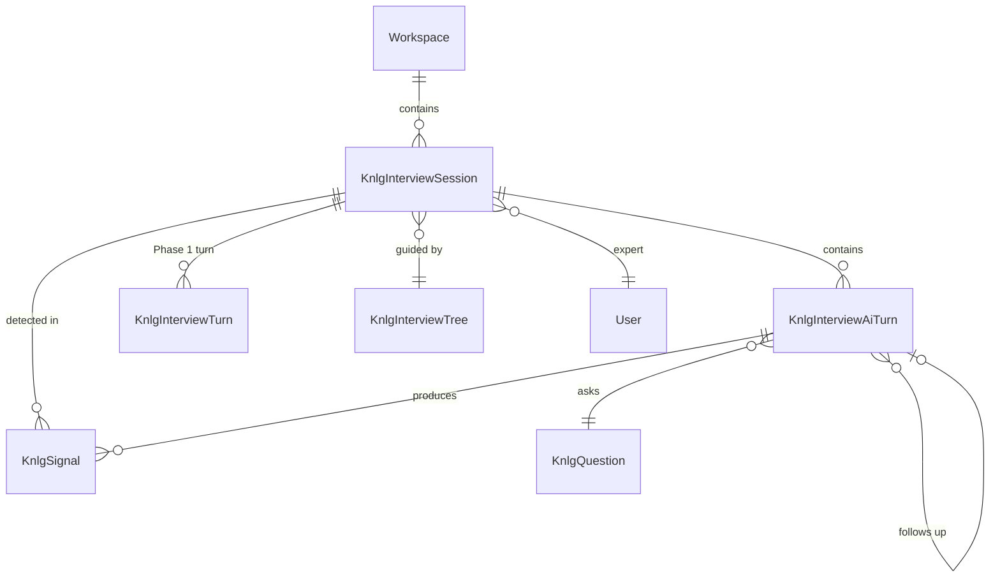
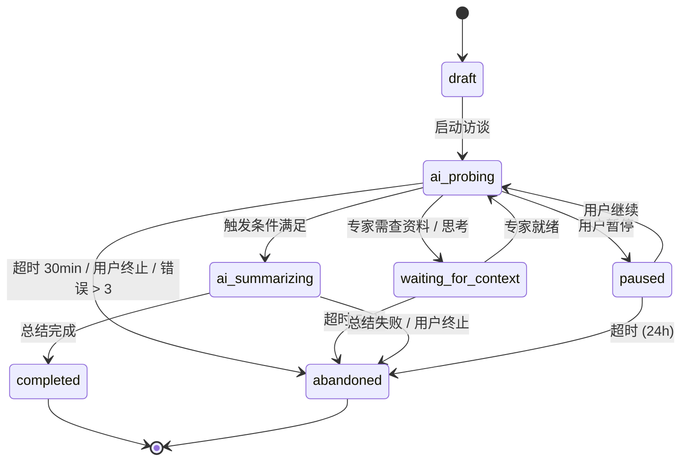
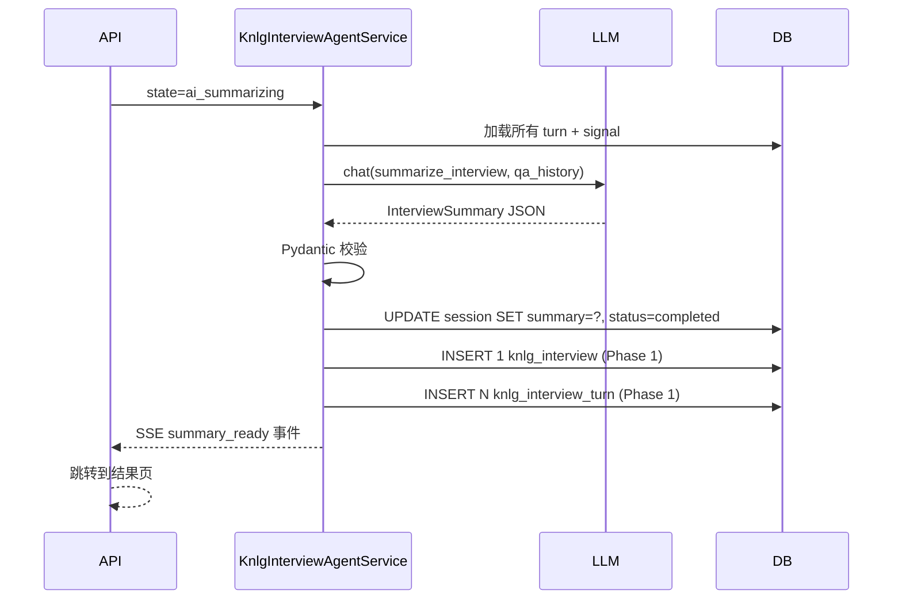

# 06-AI 访谈 Agent 状态机

> **受众**：AI 工程师（实现 Agent 决策 + Prompt）+ 后端工程师（状态机 + SSE）+ 前端工程师（流式 UI）
> **目标**：让 AI 主动发起访谈：根据问题树模板 + 专家回答动态追问，实时识别信号，SSE 流式返回对话与信号，访谈关闭后自动汇总。
> **配套阅读**：
>
> - [04-llm-gateway](./04-llm-gateway) — LLM 客户端（本文的 `KnlgLlmClient`）
> - [05-prompt-management](./05-prompt-management) — Prompt 模板（本文消费的 Prompt）
> - [02-backend-api § 8](./02-backend-api#8-ai-访谈-api) — 已有 AI 访谈 SSE 协议基础
> - [03-frontend-modules § 7](./03-frontend-modules#7-sse-流式响应处理ai-访谈) — 已有的 `useInterviewSSE` 代码骨架

---

## 1. 概述

### 1.1 设计目标

| # | 目标 | 验收 |
|---|---|---|
| G1 | AI 主动发起访谈，替代人工 PM 敲问题 | 选定问题树 → 自动按树 + 信号追问 |
| G2 | 单访谈 5-8 轮追问，时长 ≤ 30 分钟 | 状态机到 `ai_summarizing` 时长 P95 ≤ 30min |
| G3 | 实时信号识别（不阻断对话）| SSE `signal_detected` 事件 ≤ 1s 延迟 |
| G4 | 追问决策可追溯、可回放 | 每次追问的 `next_question_reason` 入 DB |
| G5 | SSE 流式对话体验 | TTFT ≤ 2s，端到端延迟 ≤ 8s |
| G6 | 异常崩溃可恢复（断线重连）| Last-Event-ID 重连 + DB 状态保证 |

### 1.2 与已有模块的边界

| 模块 | 关系 | 不做 |
|---|---|---|
| `knlg_interview_session` (Phase 1) | 与本文 `knlg_interview_ai_session` 关联（ai_session 是 ai 访谈专属）| 修改旧表 schema |
| `knlg_question_tree` + `knlg_question` (Phase 2) | 直接复用：问题树 + 问题列表 + followups | 重做问题树数据结构 |
| `knlg_interview` + `knlg_interview_turn` (Phase 1) | ai turn 完成后批量写回（手工/手动访谈共用同一表）| 修改旧表 schema |
| [04-llm-gateway](./04-llm-gateway) | `KnlgLlmClient` 是 LLM 调用唯一入口 | 自接 LLM Provider |
| [05-prompt-management](./05-prompt-management) | `KnlgPromptRenderer` 渲染所有 Prompt | 硬编码 Prompt |
| SSE 协议基础 | 扩展 [02-backend-api § 8.1](./02-backend-api#81-ai-访谈会话流式响应) | 重做协议 |

### 1.3 不做（Phase 3 边界）

| 不做 | 何时做 |
|---|---|
| 语音转文字输入 | Phase 5（多模态）|
| 自动反问（AI 挑衅式回应）| Phase 4（v2）|
| 跨访谈记忆（记住上次聊过什么）| v3 |
| 实时内容审核（违规词过滤）| v2（用第三方 API）|
| 多专家实时圆桌访谈 | v3 |

---

## 2. 决策记录

| # | 决策 | 选择 | 替代方案 | 拒绝理由 |
|---|---|---|---|---|
| D1 | LLM 接入 | [Option D：Python 轻量客户端](./04-llm-gateway#2-决策论证为何选-option-dpython-轻量客户端) | A. agent-server / B. 自建网关 | agent-server 的 cwd/Session 与访谈场景不匹配 |
| D2 | 追问决策 | **Option A：固定问题树 + 状态机** | B. LLM 动态 / C. 混合 | MVP 先验证闭环，可控优先 |
| D3 | 信号识别 | **Option A：LLM 实时 + JSON Schema 强约束** | B. 人工后置 / C. 关键词 | 实时体验 + Pydantic 强约束保证质量 |
| D4 | 状态机存储 | 数据库（MySQL） | Redis | 需要事务一致 + 审计追溯 |
| D5 | 流式协议 | SSE（与 02 一致） | WebSocket | SSE 是 AI 场景事实标准 |
| D6 | 重连机制 | Last-Event-ID + 服务端存储 | Token | 标准做法 |
| D7 | 追问决策 LLM 化 | 预留 `ask_decision_llm()` 接口 | - | 给 v2 留口 |
| D8 | Agent 架构形态 | **线性状态机（ai_probing / ai_summarizing）** | Observe-Execute 双模式（PARE 启发）| PARE 架构针对多 app 主动 agent 优化，knlg-base 是单访谈 session，强行拆 Observe/Execute 会增加复杂度（双 agent 通信成本 + 状态同步），与单 agent 线性状态机相比无明显收益。详见 §4.0 理论模型注解 |

---

## 3. 数据库新表设计

### 3.1 新增 3 张表 + 扩展 1 张表

> **2026-07-01 决策**：不分设 `knlg_interview_ai_session`，而是**复用 Phase 1 的 `knlg_interview_session`**，用 `mode` 字段区分 `manual` / `ai_agent`。详见 [§10 单表设计与两表方案的对比](./PHASE3-DESIGN-HANDOFF#4-决策记录)。

Phase 3 启动时：

1. **扩展** `knlg_interview_session` 表（加 AI 专属列）
2. **新增** `knlg_interview_ai_turn`、`knlg_signal`、`knlg_prompt_version_snapshot` 3 张表



#### 3.1.1 `knlg_interview_session`（Phase 1 扩展）

**Phase 1 已有字段**：id, expert_id, topic, mode, status（open/closed）, workspace_id, created_by, created_at, updated_at。

**Phase 3 新增列**（用 alembic migration 加）：

| 新增列 | 类型 | 约束 | 说明 |
|---|---|---|---|
| `tree_id` | BIGINT | FK `knlg_question_tree.id`, NULL | 引导问题树（NULL = 无模板自由访谈）|
| `waiting_reason` | VARCHAR(255) | NULL | `waiting_for_context` 状态时记录原因（如"专家需查资料"）|
| `current_turn_index` | INT | NOT NULL, DEFAULT 0 | 当前 turn 序号 |
| `max_turns` | INT | NOT NULL, DEFAULT 8 | 最大轮数（防失控）|
| `last_event_id` | VARCHAR(64) | NULL | SSE Last-Event-ID（按 turn 粒度更新）|
| `started_at` | DATETIME | NULL | 开始时间 |
| `ended_at` | DATETIME | NULL | 结束时间 |
| `summary` | TEXT | NULL | AI 自动总结（仅 `mode='ai_agent'` 时有值）|

**`mode` 字段扩展**（原 enum 已是 `manual / ai_agent`）：

| 值 | 含义 | 启用 Phase |
|---|---|---|
| `manual` | 手工访谈（Phase 1）| P1 ✅ |
| `ai_agent` | AI 主动访谈（Phase 3）| P3 ⏳ |

**`status` 字段扩展**（原 `open / closed`）：

| 值 | 适用 mode | 含义 |
|---|---|---|
| `open` | manual | 手工访谈进行中 |
| `closed` | manual | 手工访谈结束 |
| `draft` | ai_agent | AI 访谈未启动 |
| `ai_probing` | ai_agent | AI 主动追问中 |
| `waiting_for_context` | ai_agent | 等待外部上下文（如专家查资料）|
| `ai_summarizing` | ai_agent | AI 总结中 |
| `completed` | ai_agent | AI 访谈完成 |
| `paused` | ai_agent | 人工暂停 |
| `abandoned` | ai_agent | 超时/手动放弃 |

**新增索引**（仅 mode='ai_agent' 查询受益）：

| 索引名 | 字段 | 类型 |
|---|---|---|
| `idx_session_mode_status` | `mode, status` | INDEX |
| `idx_session_tree` | `tree_id` | INDEX |

#### 3.1.2 `knlg_interview_ai_turn`

AI 访谈的一个回合（专家回答 + AI 回应 + 信号）。

| 字段 | 类型 | 约束 | 说明 |
|---|---|---|---|
| `id` | BIGINT | PK AUTO_INCREMENT | 主键 |
| `session_id` | BIGINT | FK, NOT NULL, INDEX | 所属 session |
| `turn_index` | INT | NOT NULL | 在 session 中的序号（从 1 开始）|
| `user_question_text` | TEXT | NOT NULL | 本轮 AI 提出的问题 |
| `user_question_id` | BIGINT | FK `knlg_question.id`, NULL | 引用的 knlg_question（来自问题树）|
| `expert_answer_text` | TEXT | NULL | 专家回答（流式累积，结束时收尾）|
| `ai_response_text` | TEXT | NULL | AI 完整回应（流式累积）|
| `ai_response_streaming` | BOOLEAN | NOT NULL, DEFAULT TRUE | 是否还有未收到 chunk |
| `next_question_reason` | VARCHAR(64) | NULL | 追问原因（rule 决策的标签）|
| `followup_turn_id` | BIGINT | FK self, NULL | 追问来源 turn（如有）|
| `llm_request_log` | JSON | NULL | [§ 9.1 详细 schema](./04-llm-gateway#91-调用日志模型) |
| `prompt_id` | BIGINT | FK `knlg_llm_prompt.id`, NULL | 渲染 Prompt 的版本快照 ID |
| `prompt_version` | VARCHAR(32) | NULL | Prompt 版本（冗余便于审计）|
| `model_id` | BIGINT | FK `knlg_llm_model.id`, NULL | 使用的模型 |
| `tokens_used` | INT | NOT NULL, DEFAULT 0 | 总 token 数 |
| `cost_usd` | DECIMAL(10, 6) | NOT NULL, DEFAULT 0 | 调用成本 |
| `duration_ms` | INT | NOT NULL, DEFAULT 0 | 调用耗时 |
| `ttft_ms` | INT | NULL | 首个 token 延迟（流式）|
| `started_at` | DATETIME | NOT NULL | Turn 开始 |
| `completed_at` | DATETIME | NULL | Turn 完成 |
| `workspace_id` | BIGINT | FK, NOT NULL, INDEX | - |
| `created_at` | TIMESTAMP | NOT NULL | - |

**索引**：

| 索引名 | 字段 | 类型 |
|---|---|---|
| `idx_ai_turn_session` | `session_id` | INDEX |
| `idx_ai_turn_session_index` | `session_id, turn_index` | UNIQUE |
| `idx_ai_turn_streaming` | `ai_response_streaming` | INDEX |
| `idx_ai_turn_workspace` | `workspace_id` | INDEX |
| `idx_ai_turn_completed` | `completed_at` | INDEX |
| `ft_ai_turn_text` | `user_question_text, expert_answer_text` | FULLTEXT (ngram) |

#### 3.1.3 `knlg_signal`

被识别的信号实体。

| 字段 | 类型 | 约束 | 说明 |
|---|---|---|---|
| `id` | BIGINT | PK AUTO_INCREMENT | 主键 |
| `session_id` | BIGINT | FK, NOT NULL, INDEX | 所属 session |
| `source_turn_id` | BIGINT | FK `knlg_interview_ai_turn.id`, NULL, INDEX | 产生该信号的 turn |
| `type` | VARCHAR(32) | NOT NULL, INDEX | `pain_point` / `opportunity` / `counter_example` / `boundary` / `key_metric` |
| `confidence` | FLOAT | NOT NULL | 0-1 |
| `text` | TEXT | NOT NULL | 信号描述 |
| `linked_question_id` | BIGINT | FK `knlg_question.id`, NULL | 关联问题树节点 |
| `metadata` | JSON | NULL | 扩展字段 |
| `workspace_id` | BIGINT | FK, NOT NULL, INDEX | - |
| `created_at` | TIMESTAMP | NOT NULL | - |

**索引**：

| 索引名 | 字段 | 类型 |
|---|---|---|
| `idx_signal_session` | `session_id` | INDEX |
| `idx_signal_type` | `type` | INDEX |
| `idx_signal_confidence` | `confidence` | INDEX |
| `idx_signal_workspace` | `workspace_id` | INDEX |

#### 3.1.4 `knlg_prompt_version_snapshot`

Prompt 渲染时的完整快照（用于"为何 AI 这么问"追溯）。

| 字段 | 类型 | 约束 | 说明 |
|---|---|---|---|
| `id` | BIGINT | PK AUTO_INCREMENT | 主键 |
| `prompt_id` | BIGINT | FK `knlg_llm_prompt.id`, NOT NULL | 源 Prompt |
| `prompt_version` | VARCHAR(32) | NOT NULL | 版本 |
| `rendered_text` | TEXT | NOT NULL | 渲染后的完整文本 |
| `variables_json` | JSON | NOT NULL | 渲染所用变量（去敏感后）|
| `used_at` | TIMESTAMP | NOT NULL | 使用时间 |
| `workspace_id` | BIGINT | FK, NOT NULL, INDEX | - |

**索引**：

| 索引名 | 字段 | 类型 |
|---|---|---|
| `idx_snapshot_prompt` | `prompt_id, prompt_version` | INDEX |

### 3.2 不新增但需新增关联的表

`knlg_interview` 与 `knlg_interview_turn`（Phase 1 已有）**：AI 访谈可选择性同步写一份，作为"知识卡片来源追溯"。

是否同步写 `knlg_interview_*`：

- **是**：完整追溯链，但写操作翻倍
- **否**：依赖 `knlg_signal.source_turn_id` 间接关联

Phase 3 决策：**同步写**，理由：

- 知识卡片天然需要 turn 关联（Phase 1 已设计 SourceRef 指向 turn）
- AI 访谈和手工访谈共享同一份访谈记录，符合"访谈即访谈"的语义

### 3.3 信息不对称设计原则（PARE 启发）

参考 PARE 论文 (Nathani et al., 2026) 第 3.5 节"User and assistant observation asymmetry"，**专家（用户）和 AI Agent 看到的信息应当不对称**——这反映真实部署：用户受 UI 约束、Agent 有后端 API 全权。

| 角色 | 可观察对象（Observation Space） |
|---|---|
| **专家（用户）** | 当前 AI 问题、AI 提议的追问、可见的对话流、自己刚发的消息 |
| **AI Agent** | **所有**历史 turn、**所有**已识别 signals、问题树完整 context、专家历史访谈、workspace 知识卡、问题树的 followups 候选 |

**为什么这样设计**：

- **专家被限制**：只看到当前 UI 上呈现的内容（避免信息过载）
- **AI 拥有全局视角**：必须基于完整历史做决策（信号检测、追问决策需要跨 turn 模式识别）
- **避免泄露内部状态**：专家不应看到 signals（避免"刻意配合 AI"）
- **可解释性**：AI 决策时知道自己掌握的信息 vs 专家掌握的信息

**Pydantic 类型定义**：

```python
class ExpertObservation(BaseModel):
    """专家（用户）视角的 observation，受 UI 限制。"""
    current_ai_question: str                       # AI 当前的问题
    ai_suggested_followup: str | None = None      # AI 建议的追问
    visible_conversation: list[UiMessage]         # 可见的对话流
    # 看不到：signals、问题树、其他 turn 内部状态

class AgentObservation(BaseModel):
    """AI Agent 视角的 observation，拥有完整后端访问权。"""
    session: AiSession                            # 当前 session
    current_turn: AiTurn                          # 当前 turn
    all_turns: list[AiTurn]                       # 全部历史
    all_signals: list[Signal]                     # 全部已识别信号
    question_tree: QuestionTree                   # 引导问题树
    expert_history: list[Phase1Interview]         # 专家过往访谈
    workspace_knowledge_cards: list[KnowledgeCard] # workspace 知识库
    available_tools: list[Tool]                   # 后端工具（v2）
```

**前端实现约束**：

- 专家页面**不**显示 signals 列表（即使 SSE 推过来也不渲染）
- 专家页面**不**显示 next_question_reason（避免"专家被引导"）
- 专家只能看到自己的 input + AI 的 output

> **详细论文引用**：PARE §3.5 "User and assistant observation asymmetry" — 用户接收截断通知（如只显示邮件发件人和主题），Agent 接收完整序列化内容。我们的设计是该模式在 AI 访谈场景的体现。

---

## 4.0 理论模型（Stackelberg POMDP 简化版）

参考 PARE 论文 (Nathani et al., 2026) Appendix D，本设计可形式化为 **Stackelberg POMDP**（Leader-Follower 部分可观察马尔可夫决策过程）。

### 4.0.1 形式化定义

```math
\mathcal{M} = \langle \mathcal{N}, \mathcal{S}, \{\mathcal{A}_i\}_{i \in \mathcal{N}}, T, R, \{\mathcal{O}_i\}_{i \in \mathcal{N}}, \mathcal{I} \rangle
```

| 元素 | 本设计的实例 |
|---|---|
| `$\mathcal{N} = \{\mathbf{U}, \mathbf{A}\}$` | U = 专家（leader），A = AI Agent（follower） |
| `$\mathcal{S}$` | Session 状态（draft / ai_probing / waiting_for_context / ai_summarizing / completed / paused / abandoned）+ 全部 turn 状态 |
| `$\mathcal[A]_\mathbf{U}$` | 专家行动：[`answer`, `interrupt`, `pause`, `abandon`, `mark_signal`]（state-dependent）|
| `$\mathcal{A}_\mathbf{A}$` | Agent 行动：[`ask_followup`, `next_question`, `summarize`, `wait_expert`]（state-dependent，见 §6.1 `NextAction`）|
| `$T$` | 状态转移函数（由状态机白名单定义）|
| `$R$` | 复合奖励：`$R = (R_{\text{complete}}, R_{\text{engage}}, R_{\text{coverage}})$`，见 §14.4 |
| `$\mathcal{O}_\mathbf{U}$` | 专家可见的有限 UI（见 §3.3 `ExpertObservation`）|
| `$\mathcal{O}_\mathbf{A}$` | Agent 可见的完整 DB + 历史（见 §3.3 `AgentObservation`）|
| `$\mathcal{I}$` | 初始指令：Agent 收到 persona + tree，User 收到 topic |

### 4.0.2 与 PARE 框架的关键差异

| 维度 | PARE | 本设计 |
|---|---|---|
| 交互场景 | 多 app（Email/Calendar/Shopping...）| 单访谈 session |
| Agent 行动空间 | flat API（cross-app）| 受限（仅 prompt 追问）|
| Observe-Execute 架构 | **采用**：观察态与执行态分离 | **不采用**（D8）：单 agent 线性状态机更简洁 |
| 用户模拟 | 必选（用于 benchmark）| 必选（用于 CI 测试，见 §14.5）|
| POMDP 形式化 | 主要贡献 | 借鉴作为理论注解 |

### 4.0.3 为何不采用 Observe-Execute 架构

PARE 提出的 Observe-Execute 双模式适合**主动执行任务的 agent**（如帮用户加购物车），需要：

- **Observe** 阶段：监听用户行为，发现可主动介入的时机
- **Execute** 阶段：调用后端 API 完成多步任务
- **Awaiting confirmation** 阶段：等用户确认

但本设计是**主动提问的访谈 agent**：

- 没有"等合适时机主动介入"的需求（AI 永远在 ai_probing 状态）
- 没有"调用多步 API"的需求（仅生成 prompt）
- 没有"等用户确认执行"的需求（专家回答即确认）

强行套用会引入双 agent 通信成本、状态同步问题，与单 agent 线性状态机相比无明显收益。因此**保留单 agent 线性状态机**（详见 §4）。

> **何时重新评估**：当 Phase 4+ 引入"AI 自动转知识卡"或"AI 自动写规则"等执行型能力时，可考虑引入 Observe-Execute 模式。

---

## 4. AI 访谈 Session 状态机

### 4.1 状态定义



### 4.2 状态详解

| 状态 | 触发进入 | 副作用 | 退出条件 |
|---|---|---|---|
| `draft` | 创建 session | - | 用户点击"开始访谈"|
| `ai_probing` | start_session | `started_at = now()`，推送首个问题 | a) 触发 summarize 条件 b) waiting_for_context c) paused d) abandoned |
| `waiting_for_context` | 专家说"等一下" / 表达需查资料 | 记录 `waiting_reason`，推送 SSE `state_changed` | a) 专家就绪 5 分钟内 b) 超时 5 分钟 abandoned |
| `paused` | 用户点击暂停 | SSE 暂停推送 | 用户点击继续 |
| `ai_summarizing` | 触发条件 | 调用 `summarize_interview` Prompt | a) summary 写入 DB b) abandoned |
| `completed` | summary 写入 | `ended_at = now()`，写一条 Phase 1 的 `knlg_interview` | - |
| `abandoned` | 终止 | `ended_at = now()`，标记 `abandon_reason` | - |

### 4.3 `ai_probing → ai_summarizing` 触发条件

```python
def should_summarize(session, last_turn, signals):
    if session.current_turn_index >= session.max_turns:
        return ("max_turns_reached", True)

    signal_count = len(signals)
    if signal_count >= 5:
        return ("enough_signals", True)

    if last_turn and last_turn.next_question_reason == "tree_exhausted":
        return ("tree_exhausted", True)

    avg_confidence = sum(s.confidence for s in signals) / max(1, len(signals))
    if signal_count >= 3 and avg_confidence > 0.75:
        return ("high_confidence_signals", True)

    return (None, False)
```

### 4.4 `ai_probing → abandoned` 触发条件

- 会话时长 > 30 分钟（`now() - started_at > 30min`）
- 连续 3 次 LLM 调用失败
- 用户主动点击"终止访谈"
- 连续 5 轮专家无回答

### 4.5 状态机实现

```python
# backend/src/app/services/knlg_base/agent/state_machine.py
from enum import Enum

class InterviewAiStatus(str, Enum):
    DRAFT = "draft"
    AI_PROBING = "ai_probing"
    WAITING_FOR_CONTEXT = "waiting_for_context"  # 专家需查资料/思考（PARE 启发）
    AI_SUMMARIZING = "ai_summarizing"
    COMPLETED = "completed"
    PAUSED = "paused"
    ABANDONED = "abandoned"

# 转移白名单（防状态机错乱）
ALLOWED_TRANSITIONS = {
    InterviewAiStatus.DRAFT: {InterviewAiStatus.AI_PROBING, InterviewAiStatus.ABANDONED},
    InterviewAiStatus.AI_PROBING: {
        InterviewAiStatus.PAUSED,
        InterviewAiStatus.WAITING_FOR_CONTEXT,
        InterviewAiStatus.AI_SUMMARIZING,
        InterviewAiStatus.ABANDONED,
    },
    InterviewAiStatus.WAITING_FOR_CONTEXT: {
        InterviewAiStatus.AI_PROBING,  # 专家就绪
        InterviewAiStatus.ABANDONED,    # 超时 5 分钟
    },
    InterviewAiStatus.PAUSED: {InterviewAiStatus.AI_PROBING, InterviewAiStatus.ABANDONED},
    InterviewAiStatus.AI_SUMMARIZING: {InterviewAiStatus.COMPLETED, InterviewAiStatus.ABANDONED},
    InterviewAiStatus.COMPLETED: set(),
    InterviewAiStatus.ABANDONED: set(),
}

def transition(session, new_status: InterviewAiStatus) -> None:
    if new_status not in ALLOWED_TRANSITIONS[session.status]:
        raise InvalidTransition(f"{session.status} -> {new_status} not allowed")
    session.status = new_status
```

---

## 5. SSE 协议（完整事件）

### 5.1 端点

```http
POST /api/v1/workspaces/{code}/knlg-base/interview/ai/sessions/{session_id}/stream
Content-Type: application/json
Accept: text/event-stream
```

继承 [02-backend-api § 8.1](./02-backend-api#81-ai-访谈会话流式响应) 协议，扩展事件类型。

### 5.2 事件清单

| event 名 | 触发时机 | data 字段 | 客户端处理 |
|---|---|---|---|
| `connected` | SSE 连接建立 | `{sessionId, lastEventId}` | 记录 lastEventId 备重连 |
| `message_start` | AI 消息开始（turn 首 chunk 前）| `{turnIndex, model, promptVersion}` | 显示"AI 正在思考..." |
| `content_delta` | 流式文字片段（每个 chunk）| `{turnIndex, delta}` | 追加到气泡 |
| `signal_detected` | 检测到信号 | `{turnIndex, signal: {type, confidence, text, linkedQuestionId?}}` | 高亮显示 + 入 store |
| `question_proposed` | AI 准备发起追问 | `{turnIndex, question, questionId, reason}` | 替换问题，显示追问原因 |
| `message_end` | AI 一条消息结束 | `{turnIndex, finishReason, usage}` | 隐藏"thinking" |
| `session_state_changed` | 状态机转移 | `{fromStatus, toStatus, reason}` | 全局状态指示器更新 |
| `turn_completed` | 一轮 turn 完整完成 | `{turnIndex, signalCount, tokensUsed}` | 进度条更新 |
| `summary_ready` | 总结完成 | `{summary, suggestedKcCount, signalCount}` | 跳到结果页 |
| `error` | 错误 | `{code, message, recoverable}` | 决定重连还是中止 |
| `done` | 整个 SSE 流结束 | `{status: "completed"\|"abandoned"}` | 关闭 EventSource |

### 5.3 Last-Event-ID 协议（断线重连，**按 turn 粒度**）

> **2026-07-01 决策**：**按 turn 粒度**持久化 Last-Event-ID，**不按 event 粒度**。理由：长访谈 × 多 event × 高并发会导致 DB 写压力过大；按 turn 写是更合适的粗粒度。

服务端在每个 turn 完成时更新 `knlg_interview_session.last_event_id`（仅针对关键事件：`turn_completed` / `message_end` / `session_state_changed`）。客户端断线重连时发送 `Last-Event-ID` header，服务端从该 ID 后继续推送。

```http
GET /api/v1/workspaces/{code}/knlg-base/interview/ai/sessions/{id}/stream
Last-Event-ID: evt_1_2_5
```

服务端从 `knlg_interview_session.last_event_id`（按 turn 粒度）查找对应已完成的 turn，重新推送该 turn 之后的所有事件。

事件 ID 生成：`evt_{session_id}_{turn_index}_{seq_within_turn}`（seq 单调递增）。

**事件持久化粒度**：

| 事件类型 | 是否持久化 | 说明 |
|---|---|---|
| `connected` / `done` | ❌ | 连接管理类事件，重连时不需要重推 |
| `content_delta` | ❌ | 流式 fragment，重连时直接从 LLM 重新拉 |
| `message_start` / `message_end` / `turn_completed` | ✅ | turn 边界标记，重连定位点 |
| `signal_detected` | ✅ | 已落 DB，重连不需要重推 |
| `question_proposed` | ✅ | 已落 DB |
| `session_state_changed` | ✅ | 状态机变更点 |
| `summary_ready` | ✅ | 总结完成 |
| `error` | ✅ | 错误点（可重试参考）|

**性能预算**：

- 长访谈 ~8 turn × ~7 持久化事件 = **~56 次 DB 写**
- vs event 粒度：8 turn × ~30 events = **~240 次 DB 写**（4 倍下降）

### 5.4 完整事件流示例

```text
event: connected
id: evt_1_0_0
data: {"sessionId": 1, "lastEventId": "evt_1_0_0"}

event: session_state_changed
id: evt_1_0_1
data: {"fromStatus": "draft", "toStatus": "ai_probing", "reason": "user_started"}

event: message_start
id: evt_1_0_2
data: {"turnIndex": 1, "model": "openai/gpt-4o", "promptVersion": "1.0"}

event: content_delta
id: evt_1_0_3
data: {"turnIndex": 1, "delta": "您好"}

event: content_delta
id: evt_1_0_4
data: {"turnIndex": 1, "delta": "，我是这次访谈的 AI"}

...

event: message_end
id: evt_1_0_50
data: {"turnIndex": 1, "finishReason": "stop", "usage": {"totalTokens": 342}}

event: signal_detected
id: evt_1_0_51
data: {"turnIndex": 1, "signal": {"type": "pain_point", "confidence": 0.78, "text": "客户改会 3 次以上识别不出来", "linkedQuestionId": null}}

event: question_proposed
id: evt_1_0_52
data: {"turnIndex": 2, "question": "您提到改会是核心信号，那改会几次算不正常？", "questionId": 100, "reason": "expand_signal"}

event: done
id: evt_1_8_999
data: {"status": "completed"}
```

### 5.5 SSE 错误处理

| 错误码 | 含义 | 客户端处理 |
|---|---|---|
| 1006（资源不存在）| session 不存在 | 显示错误，跳到首页 |
| 1300（LLM timeout）| Provider 30s 超时 | 重连，标记 recoverable |
| 1301（LLM rate limit）| 超过限流 | 等待 30s 后重连 |
| 1302（context overflow）| 上下文超模型限制 | 触发 summarize |
| 1304（provider down）| Provider 不可用 | 暂停访谈，提示用户切换模型 |
| 1399（session 已结束）| session.status != ai_probing | 显示原状态 |

---

## 6. 追问决策逻辑（决策 #2 = Option A）

> **当前 MVP 实现**：纯规则（确定性）。**v2 扩展位**：`ask_decision_llm()` 可被替换为 LLM 决策。

### 6.1 决策接口

```python
# backend/src/app/services/knlg_base/agent/followup_decider.py
from dataclasses import dataclass
from enum import Enum

class NextAction(str, Enum):
    ASK_FOLLOWUP = "ask_followup"
    NEXT_QUESTION = "next_question"
    SUMMARIZE = "summarize"
    WAIT_EXPERT = "wait_expert"  # 留给前端：等待用户输入

@dataclass
class Decision:
    next_action: NextAction
    question_text: str | None = None
    question_id: int | None = None
    next_question_reason: str = ""  # "expand_signal" / "vague_answer" / "request_example" / ...

class FollowupDecider:
    """规则驱动的追问决策器。

    Phase 3 MVP：纯规则
    Phase 4 v2 扩展：可替换为 ask_decision_llm() 调用 LLM
    """

    def decide(
        self,
        *,
        session: AiSession,
        last_turn: AiTurn | None,
        signals_so_far: list[Signal],
        tree: QuestionTree,
    ) -> Decision:
        # 1. 检查全局终止条件
        decision = self._check_summarize_condition(session, last_turn, signals_so_far)
        if decision:
            return decision

        # 2. 没有上一轮 → 取问题树第一题
        if last_turn is None or last_turn.expert_answer_text is None:
            return self._first_question_from_tree(tree)

        # 3. 规则优先级（从最严格到最宽松）
        answer_text = last_turn.expert_answer_text

        # 3.1 回答太短 → 追问
        if len(answer_text) < 10:
            return Decision(
                next_action=NextAction.ASK_FOLLOWUP,
                question_text="能再详细说说吗？或者举个具体例子？",
                next_question_reason="vague_answer",
            )

        # 3.2 检测到强信号 → 扩展信号
        last_turn_signals = [s for s in signals_so_far if s.source_turn_id == last_turn.id]
        if any(s.type == "pain_point" and s.confidence > 0.75 for s in last_turn_signals):
            return Decision(
                next_action=NextAction.ASK_FOLLOWUP,
                question_text="这个痛点有多严重？影响多少客户？",
                next_question_reason="expand_signal",
            )
        if any(s.type == "counter_example" for s in last_turn_signals):
            return Decision(
                next_action=NextAction.ASK_FOLLOWUP,
                question_text="这种情况多久发生一次？通常怎么补救？",
                next_question_reason="expand_counter_example",
            )
        if any(s.type == "key_metric" for s in last_turn_signals):
            return Decision(
                next_action=NextAction.ASK_FOLLOWUP,
                question_text=f"这个数字是平均还是极值？样本量多大？",
                next_question_reason="expand_metric",
            )

        # 3.3 问题树 followups（knlg_question.questions[].followups）
        current_q = self._get_current_question(tree, last_turn.user_question_id)
        if current_q and current_q.followups:
            next_q = current_q.followups[0]
            return Decision(
                next_action=NextAction.ASK_FOLLOWUP,
                question_text=next_q.text,
                question_id=current_q.id,
                next_question_reason="tree_followup",
            )

        # 3.4 问题树下一题
        next_q = self._get_next_question_in_tree(tree, last_turn.user_question_id)
        if next_q:
            return Decision(
                next_action=NextAction.NEXT_QUESTION,
                question_text=next_q.text,
                question_id=next_q.id,
                next_question_reason="next_in_tree",
            )

        # 3.5 树走完 → 触发 summarize
        return Decision(
            next_action=NextAction.SUMMARIZE,
            next_question_reason="tree_exhausted",
        )
```

### 6.2 决策可视化（流程图）

```mermaid
flowchart TD
    A[Turn 完成] --> B{触发 summarize 条件?}
    B -- 是 --> Z1[MoveToSummarizing]
    B -- 否 --> C{上一轮有回答?}
    C -- 无 --> D[取问题树第一题]
    C -- 有 --> E{回答 < 10 字?}
    E -- 是 --> F[追问: '能再详细说说吗?']
    E -- 否 --> G{包含强信号?}
    G -- pain_point --> H[追问: 痛点严重程度]
    G -- counter_example --> I[追问: 例子边界]
    G -- key_metric --> J[追问: 数据来源]
    G -- 无 --> K{当前问题有 followups?}
    K -- 有 --> L[取 followup[0]]
    K -- 无 --> M{问题树还有下一题?}
    M -- 有 --> N[取问题树下一题]
    M -- 无 --> Z1
```

### 6.3 追问原因 `next_question_reason` 枚举

| 值 | 触发 | 含义 |
|---|---|---|
| `vague_answer` | 回答 < 10 字 | 主动要求细节 |
| `expand_signal` | 检测到强痛点 | 信号扩展（严重度 / 影响范围）|
| `expand_counter_example` | 检测到反例 | 反例挖掘（典型场景 / 频率）|
| `expand_metric` | 检测到量化数据 | 数据可信度（样本 / 极值）|
| `request_example` | 抽象回答 | 强制要求案例 |
| `tree_followup` | 问题树预设 followup | 模板路径 |
| `next_in_tree` | 切换到下一题 | 模板路径 |
| `tree_exhausted` | 走完所有问题 | 触发 summarize |
| `max_turns_reached` | 达到 max_turns | 强制 summarize |
| `enough_signals` | 信号数 ≥ 5 | 主动 summarize |

DB 用 `VARCHAR(64)` 保存，前端展示时映射到人类可读标签。

### 6.4 v2 扩展点：LLM 动态决策

为保留扩展能力，定义抽象接口：

```python
class FollowupDecider(Protocol):
    def decide(self, *, session, last_turn, signals_so_far, tree) -> Decision: ...

class RuleBasedDecider:
    """Phase 3 实现。"""

class LlmBasedDecider:
    """Phase 4+ 实现，使用 ask_decision_llm() 调用 LLM 决定追问方向。

    计划支持的 LLM Prompt（v2 启用）：
    - 输入：当前 turn + signals + tree（path）+ 历史摘要
    - 输出 JSON：{ action, question_text, reason }
    - 与 RuleBasedDecider 同样的接口签名
    """

# 切换：DI 配置 followup_decider = RuleBasedDecider() 或 LlmBasedDecider()
```

### 6.5 决策的可追溯性

每次 `Decision` 必须：

1. 入 `knlg_interview_ai_turn.next_question_reason` 字段（这是为什么问这个问题的唯一追溯）
2. 前端 UI 显示追问原因标签（"AI 在追问 - 因为：检测到痛点信号"）

这是"AI 决策可解释"的产品需求，比黑盒 LLM 友好得多。

---

## 7. 信号识别（决策 #3 = Option A）

### 7.1 信号 Schema（Pydantic 强约束）

```python
# backend/src/app/services/knlg_base/agent/signal_extractor.py
from pydantic import BaseModel, Field, conlist
from typing import Literal

SignalType = Literal[
    "pain_point",       # 痛点
    "opportunity",      # 商机
    "counter_example",  # 反例
    "boundary",         # 边界条件
    "key_metric",       # 关键量化数据
]

class SignalItem(BaseModel):
    type: SignalType
    confidence: float = Field(..., ge=0.0, le=1.0)
    text: str = Field(..., min_length=1, max_length=500)
    linked_question_id: int | None = None
    reasoning: str = Field(..., max_length=300, description="为何识别为该信号")

class SignalExtractionResult(BaseModel):
    signals: conlist(SignalItem, max_length=10) = Field(default_factory=list)
    summary: str = Field(..., max_length=300, description="本轮回答一句话摘要")
    no_signals_reason: str | None = Field(None, description="若 signals 为空，说明为何")

    class Config:
        extra = "forbid"  # 强制 LLM 不返回多余字段
```

### 7.2 信号识别 Prompt

```text
你是 CRM 知识萃取助手。

给定专家访谈的一段回答，识别其中可作为判断依据的信号。

【必须输出严格的 JSON，schema 如下】
{{ json_schema }}

【识别规则】
- 只识别回答中显式提到的信号，不要编造
- 给出 confidence（0-1），confidence ≥ 0.7 才输出
- 每个信号配 reasoning（一句话为何这么判断）
- 如果没有信号，signals=[]，并在 no_signals_reason 说明

【信号类型定义】
- pain_point：痛点（"客户改会 3 次"、"决策人不出面"）
- opportunity：商机/正面信号（"对方案很认可"、"决策链清晰"）
- counter_example：反例（"这种情况有 1 例最终成了"）
- boundary：边界条件（"政府客户不适用"、"大集团另说"）
- key_metric：量化数据（"60 天"、"3 次"、"80% 客户"）

【回答内容】
{{ answer }}

请输出 JSON：
```

### 7.3 信号识别服务

```python
class SignalExtractor:
    async def extract(
        self,
        *,
        expert_answer: str,
        session: AiSession,
        last_turn: AiTurn,
    ) -> list[SignalItem]:
        rendered = await self.prompt_renderer.render(
            PromptRenderRequest(
                name="extract_signals",
                variables={"answer": expert_answer},
                workspace_id=session.workspace_id,
            )
        )

        request = LlmRequest(
            model=rendered.parameters.get("model_id", "openai/gpt-4o"),
            messages=[
                LlmMessage(role="system", content=rendered.rendered),
                LlmMessage(role="user", content=expert_answer),
            ],
            response_format=SignalExtractionResult.model_json_schema(),
            workspace_id=session.workspace_id,
            user_id=session.expert_id,
        )

        response = await self.llm_client.chat(request)

        # Pydantic 强校验（LLM 没法绕过）
        try:
            result = SignalExtractionResult.model_validate_json(response.content)
        except ValidationError as e:
            raise LlmInvalidResponse(f"Signal JSON parse failed: {e}")

        # 持久化
        for sig in result.signals:
            await self.signal_repo.create(
                session_id=session.id,
                source_turn_id=last_turn.id,
                type=sig.type,
                confidence=sig.confidence,
                text=sig.text,
                linked_question_id=sig.linked_question_id,
                metadata={"reasoning": sig.reasoning},
                workspace_id=session.workspace_id,
            )

        return result.signals
```

### 7.4 信号后处理（前端实时）

每条产生的信号都通过 SSE `signal_detected` 事件实时推给前端：

```typescript
eventSource.addEventListener('signal_detected', (event) => {
  const { signal } = JSON.parse(event.data);
  signalStore.append({
    type: signal.type,
    confidence: signal.confidence,
    text: signal.text,
    linkedQuestionId: signal.linked_question_id,
  });
  toast.info(`检测到${getSignalLabel(signal.type)}信号`, { autoClose: 3000 });
});
```

UI 上：

- 信号类型用图标 + 颜色区分
- confidence > 0.8 高亮，0.7-0.8 普通显示
- 点击信号 → 弹出详情 + 关联 turn

---

## 8. 总结阶段（ai_summarizing）

### 8.1 总结 Prompt

`knlg_llm_prompt.name = "summarize_interview"`，模板见 [05-prompt-management § 8.2](./05-prompt-management#82-每个模板的精简示例)

输出 Pydantic Schema：

```python
class SuggestedKC(BaseModel):
    title: str = Field(..., max_length=200)
    statement: str = Field(..., max_length=500)
    candidate_confidence: float = Field(..., ge=0, le=1)
    source_turn_ids: list[int] = Field(default_factory=list)

class InterviewSummary(BaseModel):
    summary: str = Field(..., min_length=50, max_length=2000)
    key_judgements: list[str] = Field(default_factory=list, max_length=10)
    suggested_knowledge_cards: list[SuggestedKC] = Field(default_factory=list, max_length=5)
    open_questions: list[str] = Field(default_factory=list, max_length=5)

    class Config:
        extra = "forbid"
```

### 8.2 总结流程



---

## 9. 后端服务设计

### 9.1 服务目录结构

```
backend/src/app/services/knlg_base/agent/
├── __init__.py
├── service.py              # KnlgInterviewAgentService 主入口
├── state_machine.py        # 状态机
├── followup_decider.py     # 追问决策
├── signal_extractor.py     # 信号识别
├── summarizer.py           # 总结
├── stream.py               # SSE 流编排
├── session_repo.py         # AI session 仓储
├── turn_repo.py            # AI turn 仓储
├── signal_repo.py          # Signal 仓储
└── types.py                # Pydantic 类型
```

### 9.2 核心服务接口

```python
class KnlgInterviewAgentService:
    async def start_session(self, *, workspace_id, expert_id, tree_id=None, topic) -> AiSession: ...

    async def process_expert_answer(
        self,
        *,
        session_id: int,
        expert_answer: str,
        last_event_id: str | None = None,
    ) -> AsyncIterator[SseEvent]:
        """主 SSE 入口。

        处理：
        1. 加载 session + tree + last_turn
        2. 写 expert_answer 到 last_turn
        3. 调用 LLM 处理（处理答案 + 抽取信号 + 决定下一问）
        4. 流式推送 SSE events
        5. 写 next turn 到 DB
        """

    async def summarize(self, *, session_id: int) -> InterviewSummary: ...

    async def pause(self, *, session_id: int) -> None: ...
    async def resume(self, *, session_id: int, last_event_id: str) -> AsyncIterator[SseEvent]: ...
    async def abandon(self, *, session_id: int, reason: str) -> None: ...
```

### 9.3 一次 turn 的完整处理流程

```mermaid
sequenceDiagram
    autonumber
    participant FE
    participant API as POST /stream
    participant SVC as AgentService
    participant LLM as LlmClient
    participant SIG as SignalExtractor
    participant DEC as FollowupDecider
    participant DB

    FE->>API: SSE 连接 + 提交 answer
    API->>SVC: process_expert_answer(session_id, answer)
    SVC->>DB: UPDATE turn SET expert_answer_text=?
    SVC->>SVC: state == ai_probing 校验
    SVC->>DEC: decide(...)  # 先决定下一步
    DEC-->>SVC: Decision { next_action, question_text, reason }

    alt next_action == WAIT_EXPERT
        SVC-->>FE: SSE session_state_changed (回到等回答)
    else next_action in [ASK_FOLLOWUP, NEXT_QUESTION]
        SVC->>LLM: stream render(interview_ask_question)
        loop 流式 chunks
            LLM-->>SVC: chunk
            SVC-->>FE: SSE content_delta
        end
        LLM-->>SVC: done
        SVC->>SIG: extract(expert_answer, last_turn)  # 后台并行
        SIG->>LLM: extract_signals chat
        LLM-->>SIG: SignalExtractionResult
        SIG->>DB: INSERT knlg_signal
        SIG-->>SVC: signals
        loop 每个信号
            SVC-->>FE: SSE signal_detected
        end
        SVC->>DB: INSERT next turn + UPDATE last_turn.next_question_reason
        SVC-->>FE: SSE question_proposed
    else next_action == SUMMARIZE
        SVC->>SVC: transition(ai_summarizing)
        SVC->>LLM: summarize
        LLM-->>SVC: InterviewSummary
        SVC->>DB: UPDATE session SET summary=?, status=completed
        SVC-->>FE: SSE summary_ready
        SVC-->>FE: SSE done
```

---

## 10. Session 表设计：单表 + mode 字段

> **2026-07-01 决策**：**不分设两套 session 表**，而是复用 Phase 1 的 `knlg_interview_session`，用 `mode` 字段区分 `manual` / `ai_agent`。详见 [PHASE3-DESIGN-HANDOFF §4 决策记录](./PHASE3-DESIGN-HANDOFF#4-决策记录)。

### 10.1 单表 + mode 字段方案

`knlg_interview_session` 一张表，用 `mode` 字段做模式区分：

| 模式 | 状态字段含义 | API 路径 | 创建入口 |
|---|---|---|---|
| `manual` | open / closed | `/interview/sessions` | 手工录入页（Phase 1）|
| `ai_agent` | draft / ai_probing / waiting_for_context / ai_summarizing / completed / paused / abandoned | `/interview/ai/sessions` | AI 启动页（Phase 3）|

**AI 专属列**（用 migration 加到 Phase 1 表）：

- `tree_id`（引导问题树，NULL 表示无模板）
- `current_turn_index`（当前 turn 序号）
- `max_turns`（防失控上限）
- `last_event_id`（SSE 断线重连，按 turn 粒度）
- `waiting_reason`（仅 `waiting_for_context` 状态有值）
- `started_at` / `ended_at` / `summary`

详见 [§ 3.1.1](./06-interview-agent#311-knlg_interview_sessionphase-1-扩展) 字段定义。

### 10.2 Turn 同步策略

AI 访谈每个 turn 在写入 `knlg_interview_ai_turn` 的同时，**同步写一份到 Phase 1 的 `knlg_interview_turn`**，保证 Phase 4 知识卡片消费侧的 SourceRef 链路完整。

```python
async def write_turn(self, session_id: int, turn_data: dict) -> tuple[AiTurn, Phase1Turn]:
    """双写：AI turn + Phase 1 turn（同一事务）。"""
    ai_turn = await self.ai_turn_repo.create(
        session_id=session_id,
        turn_index=turn_data["turn_index"],
        user_question_text=turn_data["ai_question"],
        expert_answer_text=turn_data["expert_answer"],
        ai_response_text=turn_data["ai_response"],
        tokens_used=turn_data["tokens"],
        cost_usd=turn_data["cost"],
        prompt_id=turn_data["prompt_id"],
        model_id=turn_data["model_id"],
        workspace_id=turn_data["workspace_id"],
    )
    phase1_turn = await self.phase1_turn_repo.create(
        interview_id=session_id,  # Phase 1 直接复用 session_id
        sequence=turn_data["turn_index"],
        question=turn_data["ai_question"],
        answer=turn_data["expert_answer"],
        type="initial" if turn_data["turn_index"] == 1 else "followup",
        confidence=turn_data.get("avg_signal_confidence", 0.5),
        metadata={"ai_source_turn_id": ai_turn.id},
    )
    return ai_turn, phase1_turn
```

**双写保证**：同一事务，任一失败回滚。

### 10.3 AI turn 表为何独立（不合并到 Phase 1 turn）

| 原因 | 详述 |
|---|---|
| AI 特有字段 | `prompt_id` / `tokens_used` / `cost_usd` / `ttft_ms` / `llm_request_log` 是 AI 专属 |
| FULLTEXT 优化 | AI turn 加 ngram FULLTEXT 用于信号检索，独立表能独立优化 |
| 二级索引 | AI turn 的 `(session_id, turn_index)` UNIQUE / `ai_response_streaming` 等是 AI 特有访问模式 |
| 读写分离 | 知识卡片生成读 Phase 1，AI 调试读 AI turn，不混在同表减少锁竞争 |

---

## 11. 前端流式 UI

### 11.1 复用 03-frontend-modules § 7 已有骨架

```typescript
// hooks/useInterviewSSE.ts (扩展)
import { useQaStore } from '@/lib/knlg-base/stores/qaStore';
import { useInterviewStore } from '@/lib/knlg-base/stores/interviewStore';
import { useSignalStore } from '@/lib/knlg-base/stores/signalStore'; // NEW

export function useInterviewSSE(sessionId: string) {
  const queryClient = useQueryClient();
  const interviewStore = useInterviewStore();
  const qaStore = useQaStore();
  const signalStore = useSignalStore(); // NEW

  useEffect(() => {
    if (!sessionId) return;

    let reconnectAttempts = 0;
    let es: EventSource | null = null;

    const connect = (lastEventId?: string) => {
      const url = new URL(
        `/api/v1/workspaces/${workspaceCode}/knlg-base/interview/ai/sessions/${sessionId}/stream`,
        window.location.origin
      );
      if (lastEventId) {
        url.searchParams.set('last_event_id', lastEventId);
      }
      es = new EventSource(url.toString());

      // 通用 SSE 监听
      es.addEventListener('connected', (event) => {
        reconnectAttempts = 0;
        interviewStore.setConnectionStatus('streaming');
        interviewStore.setLastEventId(JSON.parse(event.data).lastEventId);
      });

      es.addEventListener('content_delta', (event) => {
        const { turnIndex, delta } = JSON.parse(event.data);
        qaStore.appendAIDelta(turnIndex, delta);
      });

      es.addEventListener('message_end', (event) => {
        const { turnIndex } = JSON.parse(event.data);
        qaStore.completeAIMessage(turnIndex);
      });

      es.addEventListener('signal_detected', (event) => {
        const { signal } = JSON.parse(event.data);
        signalStore.append(signal);  // NEW
        toast.info(`检测到${getSignalLabel(signal.type)}信号`);
      });

      es.addEventListener('question_proposed', (event) => {
        const { turnIndex, question, reason } = JSON.parse(event.data);
        qaStore.setCurrentQuestion(turnIndex, question, reason);
      });

      es.addEventListener('summary_ready', (event) => {
        const data = JSON.parse(event.data);
        interviewStore.setSummary(data.summary);
        router.push(`/workspace/${workspaceCode}/knlg-base/interview/sessions/${sessionId}/result`);
      });

      es.addEventListener('session_state_changed', (event) => {
        const { toStatus, reason } = JSON.parse(event.data);
        interviewStore.setStatus(toStatus, reason);
      });

      es.addEventListener('error', (event) => {
        const data = event.data ? JSON.parse(event.data) : null;
        handleError(data, interviewStore, () => {
          // 重连逻辑（沿用 03 § 7.2）
          if (reconnectAttempts < 3) {
            reconnectAttempts++;
            const lastEventId = interviewStore.lastEventId;
            setTimeout(() => connect(lastEventId), 1000 * reconnectAttempts);
          } else {
            interviewStore.setConnectionStatus('error');
            toast.error('连接中断，请刷新页面重试');
          }
        });
      });

      es.addEventListener('done', () => {
        es?.close();
        queryClient.invalidateQueries({ queryKey: qk.qa.interview(workspaceId, sessionId) });
      });
    };

    connect();
    return () => es?.close();
  }, [sessionId]);
}
```

### 11.2 新增 `useSignalStore`（Zustand）

```typescript
// lib/knlg-base/stores/signalStore.ts
import { create } from 'zustand';

export type SignalType = 'pain_point' | 'opportunity' | 'counter_example' | 'boundary' | 'key_metric';

export interface DetectedSignal {
  id: string;  // 客户端生成
  type: SignalType;
  confidence: number;
  text: string;
  linkedQuestionId?: number;
  sourceTurnId: number;
  detectedAt: number;
}

interface SignalStoreState {
  signals: DetectedSignal[];

  append: (signal: Omit<DetectedSignal, 'id' | 'detectedAt'>) => void;
  clear: () => void;
}

export const useSignalStore = create<SignalStoreState>((set) => ({
  signals: [],

  append: (signal) => set((state) => ({
    signals: [
      ...state.signals,
      { ...signal, id: crypto.randomUUID(), detectedAt: Date.now() },
    ],
  })),

  clear: () => set({ signals: [] }),
}));
```

### 11.3 实时 UI 组件：`<SignalChip>`

```tsx
// components/knlg-base/SignalChip.tsx
import { Badge } from '@/components/ui/badge';

const SIGNAL_LABELS: Record<SignalType, { label: string; emoji: string; variant: any }> = {
  pain_point: { label: '痛点', emoji: '⚠️', variant: 'destructive' },
  opportunity: { label: '商机', emoji: '✨', variant: 'default' },
  counter_example: { label: '反例', emoji: '🔄', variant: 'secondary' },
  boundary: { label: '边界', emoji: '🚧', variant: 'outline' },
  key_metric: { label: '关键数据', emoji: '📊', variant: 'secondary' },
};

export function SignalChip({ signal }: { signal: DetectedSignal }) {
  const meta = SIGNAL_LABELS[signal.type];
  const isHighConfidence = signal.confidence > 0.8;

  return (
    <Badge
      variant={meta.variant}
      className={isHighConfidence ? 'ring-2 ring-primary' : ''}
      title={signal.text}
    >
      {meta.emoji} {meta.label}
      <span className="ml-1 text-xs opacity-70">{Math.round(signal.confidence * 100)}%</span>
    </Badge>
  );
}
```

### 11.4 追问原因展示

```tsx
// components/knlg-base/FollowupReasonBadge.tsx
const REASON_LABELS: Record<string, string> = {
  vague_answer: '回答模糊，请补充',
  expand_signal: '检测到关键信号，深入追问',
  expand_counter_example: '识别到反例，挖掘边界',
  expand_metric: '检测到量化数据，验证准确度',
  request_example: '需要具体例子',
  tree_followup: '模板预设追问',
  next_in_tree: '模板下一题',
  tree_exhausted: '问题树走完，进入总结',
};

export function FollowupReasonBadge({ reason }: { reason: string }) {
  return (
    <div className="flex items-center gap-2 text-xs text-muted-foreground">
      <span>💡</span>
      <span>{REASON_LABELS[reason] || reason}</span>
    </div>
  );
}
```

### 11.5 页面布局（基于 03 § 4.4 扩展）

复用 [03-frontend-modules § 4.4](./03-frontend-modules#44-ai-访谈实时交互页最复杂) 已有布局，扩展：

- 顶部新增"信号统计"：`pain_point: 3 | opportunity: 1 | key_metric: 2`
- 右侧 Signal 流面板
- 追问原因解释面板紧贴每个 question
- 进度条：5/8 → 实时更新

---

## 12. 错误处理

### 12.1 服务端错误处理清单

| 错误 | 触发 | 行为 |
|---|---|---|
| LLM 不可用 | provider 503 / timeout | 转 fallback model，3 次失败后转 abandoned |
| JSON Schema 校验失败 | LLM 返回非法 JSON | 重试 1 次，失败则放弃 signal 但继续 turn |
| 追问决策超时 | decide > 100ms | 直接 NEXT_QUESTION FROM TREE（保底）|
| DB 错误 | SQLAlchemy exception | 状态机转 abandoned，记录 error log |
| SSE 连接断开 | client close | DB 保留 current state，`last_event_id` 更新 |
| 用户主动关闭 | 浏览器刷新 | DB 30 分钟后自动 abandoned |

### 12.2 客户端错误处理

```typescript
function handleError(error, store, retry) {
  switch (error.code) {
    case 1300: // timeout
    case 1301: // rate_limit
      store.setConnectionStatus('retryable');
      retry();
      break;
    case 1304: // provider_down
      store.setConnectionStatus('fatal');
      toast.error('AI 服务暂时不可用，请稍后再试');
      break;
    case 1307: // cancelled
      store.setConnectionStatus('cancelled');
      break;
    default:
      store.setConnectionStatus('error');
  }
}
```

### 12.3 恢复保证

- **断线 30 分钟内重连**：靠 `last_event_id` 重放所有未确认事件
- **断线 > 30 分钟**：session 自动 abandoned，提示用户"上次的访谈因超时被中断"
- **服务端崩溃**：数据库状态保留，下一次 SSE 连接从 `last_event_id` 继续

---

## 13. 性能预算

| 指标 | 目标 | 备注 |
|---|---|---|
| 单 turn 端到端 P50 | ≤ 4s | 1k input + 500 output tokens |
| 单 turn 端到端 P95 | ≤ 8s | 同上 |
| 流式 TTFT P95 | ≤ 2s | 首个 token 时间 |
| 信号抽取 P95 | ≤ 3s | 与 turn 并行，不影响流式 |
| 并发支持 | 单 server 50 个 session | 资源允许情况下 |
| 总结延迟 P95 | ≤ 12s | 1w token 输入 + 2k token 输出 |
| DB 写入 | 单 turn INSERT < 10ms | 索引设计 |

### 13.1 关键优化

- **信号抽取并行化**：在 AI 流式输出 `message_end` 后立即并行调用 signal extractor，不阻塞下一步动作
- **批量写入**：邻近 turn 的 signal 在 commit 时合并 INSERT
- **DB 连接池**：SQLAlchemy 池大小 ≥ 20
- **SSE keep-alive**：注释帧 30s 间隔（同 agent-server 模式）

---

## 14. 测试策略

### 14.1 单元测试

| 目标 | 覆盖 |
|---|---|
| 状态机 | 转移白名单（合法/非法）|
| 追问决策器 | 各分支 |
| 信号抽取 Pydantic 校验 | 合法/非法 JSON |
| 总结 | 输入输出转换 |

### 14.2 集成测试（Mock LLM）

| 场景 | 验收 |
|---|---|
| 完整 5 轮访谈 | AI → expert 交替，最终自动 summarize |
| 流式中断（client 断开）| 重连后从 `last_event_id` 继续 |
| 追问决策各分支 | 8 个 `next_question_reason` 都被触发 |
| 信号识别 Pydantic 校验 | LLM 返回非法 JSON → 重试 + 降级 |
| 状态机非法转移 | 抛 `InvalidTransition` |

### 14.3 E2E 测试（真实 LLM，用 gpt-4o-mini 省钱）

```text
场景：完整 AI 访谈 → 自动转知识卡
  Given CRM workspace 有 1 个问题树（5 题）
  And 1 个 enable 的 openai provider
  And 1 个专家账号
  When 专家选择问题树并开始 AI 访谈
  And 回答 5 轮
  Then 在 30 分钟内进入 completed 状态
  And DB 中 ≥ 1 条 knlg_signal (pain_point)
  And DB 中 ≥ 1 条 Phase 1 knlg_interview
  And DB 中 ≥ 5 条 knlg_interview_turn
  And summary 文本 ≥ 50 字
  And 全部 SSE event ids 连续
```

### 14.4 评估指标（人工）

Phase 3 完成后的人工评估：

| 指标 | 目标 | 评估方式 |
|---|---|---|
| 访谈完成率 | ≥ 70% | 完成的 session / 总启动 session |
| 信号识别准确率 | ≥ 60% | 人工抽样 100 条 signal |
| 追问相关性 | ≥ 75% | 专家评分 1-5 |
| 总结实用性 | ≥ 70% | 知识提炼员评估 |

#### 14.4.1 主动平衡指标（PARE 启发）

参考 PARE 论文 §6.1 "Proposal Quality and Efficiency"，Agent 的**主动程度**必须有量化指标，避免过度追问（专家疲劳）或追问不足（访谈流于表面）：

| 指标 | 目标 | 计算方式 | 含义 |
|---|---|---|---|
| **Proposal Rate** | 0.40 - 0.60 | 追问 turn 数 / 总 turn 数 | AI 主动追问的频率，过高=专家疲劳，过低=访谈表面 |
| **Answer Engagement** | ≥ 0.80 | 回答字数 ≥ 10 字的 turn 数 / 总 turn 数 | 专家是否认真回答，过低=问题设计有问题 |
| **Interview Efficiency** | ≥ 3.0 | 信号数 / turn 数 | 单位 turn 萃取信号的效率 |
| **Goal Coverage** | ≥ 0.85 | 走完的问题树节点数 / 总节点数 | 是否覆盖了预定的访谈范围 |

**Proposal Rate 案例**（来自 PARE 实验）：

- Claude 4.5 Sonnet: 12.8% proposal / 78.2% accept（节制+精准）
- GPT-5: 28.1% proposal / 70.2% accept（过度提议）
- 我们的目标：40-60%（比 GPT-5 节制，比 Claude 4.5 主动）|

**Answer Engagement 案例**：

- 健康访谈：80% turn 专家回答 ≥ 10 字
- 警告：< 60% 表明问题设计或 AI 语气让专家不想答
- 监控告警阈值：< 50% 触发 P2 告警

#### 14.4.2 信号质量指标

| 指标 | 目标 | 计算方式 |
|---|---|---|
| **Signal Yield** | ≥ 0.6 | turn 数 / signal 数（4 turn 出 2.4 个信号）|
| **Signal Precision** | ≥ 0.6 | 人工确认的真实信号数 / 总 signal 数 |
| **Signal Diversity** | ≥ 3 | unique signal types per interview |

#### 14.4.3 成本指标

| 指标 | 目标 | 监控方式 |
|---|---|---|
| **Avg Tokens/turn** | ≤ 1500 | 日志聚合 |
| **Cost per Interview** | ≤ $0.50 | 4o-mini $0.15/1M, 4o $5/1M |
| **Monthly Budget Utilization** | ≤ 80% | 月度报表 |

### 14.5 自动化 E2E 测试：LLM 模拟专家 ⭐

> **设计来源**：PARE 论文第 4.1 节"User Simulator Agent"——用 LLM 模拟用户，规模化测试主动 Agent。**该方法同样适用于 knlg-base**。

#### 14.5.1 问题

Phase 3 之前的测试策略瓶颈：

- E2E 测试需要真实专家回答（瓶颈：等待 + 不可重复）
- 单元测试覆盖决策器、信号提取（粒度细但缺端到端）
- 人工评估只能抽样 100 条信号（统计功效不足）

#### 14.5.2 解决方案：KnlgExpertSimulator

```python
# backend/src/app/services/knlg_base/agent/testing/expert_simulator.py
from pydantic import BaseModel, Field

class ExpertPersona(BaseModel):
    """专家角色定义。"""
    name: str                                    # "王总监"
    role: str                                    # "销售总监"
    background: str                              # "10 年 CRM 销售经验，擅长大客户"
    communication_style: str                     # "直接、给数据、举例"
    patience: int = Field(ge=1, le=5, default=3) # 1=容易走神, 5=极耐心

class ExpertSimulator:
    """基于 LLM 的专家模拟器，代替真实专家参与 E2E 测试。

    用途：
    1. CI 自动跑完整访谈闭环（无需真实专家）
    2. 回归测试：固定 persona + knowledge 验证 agent 行为
    3. 压力测试：100 并发访谈，验证 token 限流
    4. 决策器 A/B：用同一 persona 测试不同决策器
    """

    def __init__(self, llm_client: KnlgLlmClient, persona: ExpertPersona, knowledge: list[str]):
        self.llm_client = llm_client
        self.persona = persona
        self.knowledge = knowledge
        self.model = "openai/gpt-4o-mini"  # 用便宜模型（参见 PARE 实验：simulator 不需要最强模型）

    async def simulate_answer(
        self,
        *,
        ai_question: str,
        turn_history: list[AiTurn],
        detected_signals: list[Signal],
    ) -> str:
        """生成符合 persona + knowledge 的回答。"""
        prompt = f"""你正在模拟一位{self.persona.role}，参与 AI 访谈。

【你的背景】
{self.persona.background}

【沟通风格】
{self.persona.communication_style}

【耐心等级】{self.persona.patience}/5（1=容易走神，5=极耐心）

【你可以使用的知识】
{chr(10).join(f'- {k}' for k in self.knowledge)}

【历史对话摘要】
{self._summarize_history(turn_history)}

【已识别的信号】（仅供你参考，避免重复提到）
{[s.text for s in detected_signals]}

【AI 当前问的问题】
{ai_question}

【要求】
1. 回答必须基于你掌握的知识，可以从不同角度展开
2. 保持真实的口语化（不是"作为销售总监，我认为..."的官腔）
3. 长度 50-150 字
4. 如果 AI 问的问题你"不知道"，回答"这个我没特别关注"
5. 如果耐心值低 + AI 重复问相同问题，简短回答或表示不耐烦

请输出回答（不含任何元说明）："""
        response = await self.llm_client.chat(
            LlmRequest(
                model=self.model,
                messages=[LlmMessage(role="user", content=prompt)],
                temperature=0.8,  # 略高温度让回答多样化
                max_tokens=300,
            )
        )
        return response.content.strip()

    def _summarize_history(self, turns: list[AiTurn]) -> str:
        if not turns:
            return "（访谈刚开始）"
        lines = []
        for t in turns[-3:]:  # 只看最近 3 轮
            lines.append(f"AI: {t.user_question_text[:50]}")
            lines.append(f"专家: {(t.expert_answer_text or '')[:80]}")
        return "\n".join(lines)
```

#### 14.5.3 E2E 测试场景

```python
# tests/e2e/test_interview_agent.py
import pytest

@pytest.mark.asyncio
async def test_full_interview_with_crm_expert():
    """CRM 销售总监的完整 AI 访谈闭环。"""

    # 1. 准备 persona + 知识
    persona = ExpertPersona(
        name="王总监",
        role="销售总监",
        background="10 年 CRM 销售经验，擅长大客户商机判断",
        communication_style="直接、给数据、举例",
        patience=4,
    )
    knowledge = [
        "制造业客户更好成，采购流程规范",
        "客户连续 3 次改会大概率是假商机",
        "决策人不露面是核心风险信号",
        "政府客户节奏天然慢，不能套用民营标准",
        "改会 1-2 次正常，5 次以上基本丢了",
    ]

    # 2. 启动真实 agent
    llm_client = KnlgLlmClient(...)
    agent = KnlgInterviewAgentService(llm_client=llm_client, ...)
    simulator = ExpertSimulator(llm_client=llm_client, persona=persona, knowledge=knowledge)

    # 3. 启动 session
    session = await agent.start_session(
        workspace_id=1, expert_id=0,  # 0 = 模拟用户
        tree_id=crm_opportunity_qualification_tree_id,
        topic="商机资格判断",
    )

    # 4. 模拟 8 轮访谈
    signals_collected = []
    for turn_idx in range(8):
        # 4.1 拉取 AI 当前问题
        ai_question = await agent.get_current_question(session.id)
        assert ai_question is not None

        # 4.2 模拟专家回答
        answer = await simulator.simulate_answer(
            ai_question=ai_question,
            turn_history=await agent.get_turns(session.id),
            detected_signals=signals_collected,
        )

        # 4.3 提交给 agent
        events = []
        async for event in agent.process_expert_answer(session.id, answer):
            events.append(event)
            if event.type == "signal_detected":
                signals_collected.append(event.signal)

        # 4.4 检查状态机没卡住
        status = await agent.get_status(session.id)
        assert status in ["ai_probing", "ai_summarizing", "completed"]

        # 4.5 模拟等待时间（真实对话间隔）
        await asyncio.sleep(0.5)

    # 5. 验证结果
    final_status = await agent.get_status(session.id)
    assert final_status == "completed", f"应该进入 completed，实际：{final_status}"

    # 信号质量
    assert len(signals_collected) >= 3, f"应至少 3 个信号，实际 {len(signals_collected)}"

    # 总结质量
    summary = await agent.get_summary(session.id)
    assert len(summary) >= 50, f"总结应 ≥ 50 字，实际 {len(summary)}"

    # 主动平衡（PARE 启发）
    total_turns = 8
    followup_turns = sum(1 for e in events if e.type == "question_proposed" and e.reason != "next_in_tree")
    proposal_rate = followup_turns / total_turns
    assert 0.3 <= proposal_rate <= 0.7, f"Proposal rate {proposal_rate:.2f} 超出合理范围"

    # 成本
    cost = await agent.get_total_cost(session.id)
    assert cost < 0.50, f"单访谈成本 ${cost:.2f} 超出预算"
```

#### 14.5.4 回归测试矩阵

```python
PERSONAS = [
    ("高耐心销售总监", ExpertPersona(patience=5, communication_style="详细")),
    ("低耐心客服经理", ExpertPersona(patience=2, communication_style="简短")),
    ("数据驱动专家", ExpertPersona(communication_style="给数据")),
    ("理论派专家", ExpertPersona(communication_style="抽象不举例")),
    ("反例偏多专家", ExpertPersona(communication_style="常提反例")),
]

@pytest.mark.parametrize("persona_name,persona", PERSONAS)
async def test_persona_handling(persona_name, persona):
    """5 种典型 persona 都应被 agent 正确处理。"""
    # ...
```

#### 14.5.5 CI 集成

```yaml
# .github/workflows/phase3-e2e.yml
name: Phase 3 E2E (LLM Simulated)
on: [push, pull_request]
jobs:
  e2e:
    runs-on: ubuntu-latest
    steps:
      - uses: actions/checkout@v4
      - name: Run E2E
        env:
          OPENAI_API_KEY: ${{ secrets.OPENAI_API_KEY_TEST }}
        run: |
          pytest tests/e2e/test_interview_agent.py \
            --maxfail=3 \
            -v 2>&1 | tee e2e.log
      - name: Upload results
        if: always()
        uses: actions/upload-artifact@v3
        with:
          name: e2e-results
          path: e2e.log
```

**CI 跑通标志**：

- ✅ 5 个 persona 全部通过
- ✅ 每次跑 < 10 分钟
- ✅ 单访谈成本 < $0.50（用 4o-mini + 4o 混合）
- ✅ 月度 CI 成本 < $200（每天 10 跑）|

#### 14.5.6 局限性（与 PARE 论文的发现一致）

PARE 论文 Appendix C 显示，**用户模拟器的选择会影响绝对数值但不影响相对排序**。我们的 KnlgExpertSimulator 也有同样的局限：

- 模拟专家**不会**真正疲劳（但可通过 `patience` 参数模拟）
- 模拟专家**不会**情绪化
- 模拟专家**不会**完全模拟"读资料查数据"的延迟

**因此**：自动化 E2E 是**回归保护和规模化测试**工具，**不是**最终质量指标。Phase 3 上线后仍需 4.4 节的人工评估作为最终验收。|

---

## 15. Migration 文件

### 15.1 新增 migration

```
alembic/versions/2026_07_xx_004_create_knlg_ai_interview_tables.py
```

内容（伪 SQL）：

```sql
-- 1) 扩展 Phase 1 的 knlg_interview_session（加 AI 专属列）
ALTER TABLE knlg_interview_session
    ADD COLUMN tree_id BIGINT NULL,
    ADD COLUMN waiting_reason VARCHAR(255) NULL,
    ADD COLUMN current_turn_index INT NOT NULL DEFAULT 0,
    ADD COLUMN max_turns INT NOT NULL DEFAULT 8,
    ADD COLUMN last_event_id VARCHAR(64) NULL,
    ADD COLUMN started_at DATETIME NULL,
    ADD COLUMN ended_at DATETIME NULL,
    ADD COLUMN summary TEXT NULL,
    ADD CONSTRAINT fk_session_tree FOREIGN KEY (tree_id)
        REFERENCES knlg_question_tree(id) ON DELETE SET NULL,
    ADD INDEX idx_session_mode_status (mode, status),
    ADD INDEX idx_session_tree (tree_id);

-- 2) knlg_interview_ai_turn（独立表，FK 指向 knlg_interview_session）
CREATE TABLE knlg_interview_ai_turn (
    id BIGINT AUTO_INCREMENT PRIMARY KEY,
    session_id BIGINT NOT NULL,
    turn_index INT NOT NULL,
    user_question_text TEXT NOT NULL,
    user_question_id BIGINT NULL,
    expert_answer_text TEXT NULL,
    ai_response_text TEXT NULL,
    ai_response_streaming BOOLEAN NOT NULL DEFAULT TRUE,
    next_question_reason VARCHAR(64) NULL,
    followup_turn_id BIGINT NULL,
    llm_request_log JSON NULL,
    prompt_id BIGINT NULL,
    prompt_version VARCHAR(32) NULL,
    model_id BIGINT NULL,
    tokens_used INT NOT NULL DEFAULT 0,
    cost_usd DECIMAL(10, 6) NOT NULL DEFAULT 0,
    duration_ms INT NOT NULL DEFAULT 0,
    ttft_ms INT NULL,
    started_at DATETIME NOT NULL,
    completed_at DATETIME NULL,
    workspace_id BIGINT NOT NULL,
    created_at TIMESTAMP NOT NULL DEFAULT CURRENT_TIMESTAMP,
    FOREIGN KEY (session_id) REFERENCES knlg_interview_session(id) ON DELETE CASCADE,
    FOREIGN KEY (user_question_id) REFERENCES knlg_question(id),
    FOREIGN KEY (followup_turn_id) REFERENCES knlg_interview_ai_turn(id),
    FOREIGN KEY (prompt_id) REFERENCES knlg_llm_prompt(id),
    FOREIGN KEY (model_id) REFERENCES knlg_llm_model(id),
    FOREIGN KEY (workspace_id) REFERENCES workspaces(id),
    UNIQUE KEY uk_session_turn (session_id, turn_index),
    INDEX idx_ai_turn_streaming (ai_response_streaming),
    INDEX idx_ai_turn_workspace (workspace_id),
    INDEX idx_ai_turn_completed (completed_at),
    FULLTEXT INDEX ft_ai_turn_text (user_question_text, expert_answer_text) WITH PARSER ngram
) ENGINE=InnoDB DEFAULT CHARSET=utf8mb4;

-- 3) knlg_signal
CREATE TABLE knlg_signal (
    id BIGINT AUTO_INCREMENT PRIMARY KEY,
    session_id BIGINT NOT NULL,
    source_turn_id BIGINT NULL,
    type VARCHAR(32) NOT NULL,
    confidence FLOAT NOT NULL,
    text TEXT NOT NULL,
    linked_question_id BIGINT NULL,
    metadata JSON NULL,
    workspace_id BIGINT NOT NULL,
    created_at TIMESTAMP NOT NULL DEFAULT CURRENT_TIMESTAMP,
    FOREIGN KEY (session_id) REFERENCES knlg_interview_session(id) ON DELETE CASCADE,
    FOREIGN KEY (source_turn_id) REFERENCES knlg_interview_ai_turn(id) ON DELETE SET NULL,
    FOREIGN KEY (linked_question_id) REFERENCES knlg_question(id),
    FOREIGN KEY (workspace_id) REFERENCES workspaces(id),
    INDEX idx_signal_session (session_id),
    INDEX idx_signal_type (type),
    INDEX idx_signal_confidence (confidence),
    INDEX idx_signal_workspace (workspace_id)
) ENGINE=InnoDB DEFAULT CHARSET=utf8mb4;

-- 4) knlg_prompt_version_snapshot
CREATE TABLE knlg_prompt_version_snapshot (
    id BIGINT AUTO_INCREMENT PRIMARY KEY,
    prompt_id BIGINT NOT NULL,
    prompt_version VARCHAR(32) NOT NULL,
    rendered_text TEXT NOT NULL,
    variables_json JSON NOT NULL,
    used_at TIMESTAMP NOT NULL,
    workspace_id BIGINT NOT NULL,
    FOREIGN KEY (prompt_id) REFERENCES knlg_llm_prompt(id),
    FOREIGN KEY (workspace_id) REFERENCES workspaces(id),
    INDEX idx_snapshot_prompt (prompt_id, prompt_version)
) ENGINE=InnoDB DEFAULT CHARSET=utf8mb4;
```

**改动要点**：

- ✅ **不分设** `knlg_interview_ai_session` 表
- ✅ `knlg_interview_session.mode = 'ai_agent'` 区分 AI 模式
- ✅ `knlg_interview_ai_turn.session_id` FK 指向 `knlg_interview_session`（不是被删的 ai_session）
- ✅ `knlg_signal.session_id` FK 同样指向 `knlg_interview_session`

### 3.3 信息不对称设计原则（PARE 启发，**Phase 3 暂不实施**）

> **2026-07-01 决策**：MVP 阶段**不实施**信息不对称原则。理由：
>
> 1. 实现复杂度高（权限矩阵 / UI 过滤逻辑）
> 2. 业务价值在 MVP 阶段不显著
> 3. 真实访谈流程中专家能看到 signals 通常是**正反馈**而非负担
> 4. v2 再根据真实访谈反馈决定

参考 PARE 论文 (Nathani et al., 2026) 第 3.5 节"User and assistant observation asymmetry"的设计思路**留作 v2 候选**。本节保留为参考文档，待 v2 评估。

| 角色 | 可观察对象（Observation Space） |
|---|---|
| **专家（用户）** | 当前 AI 问题、AI 提议的追问、可见的对话流、自己刚发的消息 |
| **AI Agent** | **所有**历史 turn、**所有**已识别 signals、问题树完整 context、专家历史访谈、workspace 知识卡、问题树的 followups 候选 |

**v2 实现路径**（如果决定实施）：

- 专家页面**不**显示 signals 列表（即使 SSE 推过来也不渲染）
- 专家页面**不**显示 next_question_reason（避免"专家被引导"）
- 专家只能看到自己的 input + AI 的 output

**Pydantic 类型定义**（v2 准备）：

```python
class ExpertObservation(BaseModel):
    """专家（用户）视角的 observation，受 UI 限制。"""
    current_ai_question: str
    ai_suggested_followup: str | None = None
    visible_conversation: list[UiMessage]

class AgentObservation(BaseModel):
    """AI Agent 视角的 observation，拥有完整后端访问权。"""
    session: AiSession
    current_turn: AiTurn
    all_turns: list[AiTurn]
    all_signals: list[Signal]
    question_tree: QuestionTree
    expert_history: list[Phase1Interview]
    workspace_knowledge_cards: list[KnowledgeCard]
    available_tools: list[Tool]
```

> **论文引用**：PARE §3.5 — v2 评估时参考。

### 15.2 同时建议增加 knlg_interview_session.mode 字段检查

Phase 1 的 `knlg_interview_session.mode` 是 `manual / ai_agent` 枚举。**Phase 3 不修改**该字段，而是通过 `knlg_interview_ai_session.id` 关联（在 Phase 1 interview.session_id 上加 `ai_session_id` 可选 FK）。

是否做：v2 再决定。Phase 3 仅通过 `knlg_interview_ai_session` 独立追踪。

---

## 16. 开放问题

| # | 问题 | 候选 | 建议默认值 |
|---|---|---|---|
| Q1 | Last-Event-ID 持久化粒度 | event 粒度 / turn 粒度 | **turn 粒度**（2026-07-01 决策；DB 单写，Redis 仅 audit）|
| Q2 | 追问决策 LLM 化的触发条件 | 月访谈 > 10000 / 信号准确率 < 50% | **暂不实现**（v2）|
| Q3 | 是否支持多人多议题并行 AI 访谈 | 是 / 否 | **是**（max_concurrent_per_user=2）|
| Q4 | 是否需要 abuse 检测（防刷）| 频率限制 / 行为分析 | **频率限制**（与 04 复用）|
| Q5 | 是否需要国际化 Prompt 模板 | 是 / 否 | **否**（Phase 3 中文）|
| Q6 | 是否做实时 PII 检测 | 是 / 否 | **否**（v2 接入第三方）|

---

## 17. 相关文档

### 17.1 项目内设计文档

- [04-llm-gateway](./04-llm-gateway) — LLM 客户端 + 错误码 + 限流降级
- [05-prompt-management](./05-prompt-management) — Prompt 模板 + 版本控制
- [02-backend-api § 8](./02-backend-api#8-ai-访谈-api) — AI 访谈 API + SSE 基础协议
- [03-frontend-modules § 7](./03-frontend-modules#7-sse-流式响应处理ai-访谈) — EventSource Hook + Zustand

### 17.2 项目内技术参考

- [01-database-schema § 3.3-3.5](./01-database-schema#33-knlginterview_session访谈会话) — Phase 1 访谈表结构（与本文 ai_session 配合）
- [Phase 3 Handoff](./PHASE3-DESIGN-HANDOFF) — 整体设计交接

### 17.3 产品设计参考

- [问答库产品设计 § 4.2 AI 访谈 Agent](../../product/knlg-base/q-a-library#42-ai-访谈-agent) — 主动访谈 + 追问机制的产品要求
- [知识萃取流程 § 2.2 决策回溯](../../product/knlg-base/extraction-flow#22-决策回溯decision-retrospective) — 五要素挖法
- [实现路线图 Phase 3 W8-W10](../../product/knlg-base/implementation-roadmap#phase-3ai-能力第-8-10-周) — 任务与验收标准

### 17.4 学术参考（PARE 论文启发）

- **PARE**: Nathani, D., Zhang, C., Huan, C. et al. *Proactive Agent Research Environment: Simulating Active Users to Evaluate Proactive Assistants*. arXiv:2604.00842 (2026). [https://arxiv.org/abs/2604.00842](https://arxiv.org/abs/2604.00842)
  - §3.5 信息不对称设计原则 → 本文 §3.3
  - §4.1 用户模拟器 → 本文 §14.5
  - §6.1 Proposal Rate / Acceptance Rate → 本文 §14.4.1
  - Appendix D Stackelberg POMDP → 本文 §4.0

---

## ✅ 设计检查清单

- [x] 4 张新表完整 schema（字段+索引+外键）
- [x] 6 态状态机（含 mermaid 图 + 转移白名单 + 副作用）
- [x] 11 个 SSE 事件类型完整定义
- [x] Last-Event-ID 重连协议
- [x] 追问决策器（10 种 next_question_reason）
- [x] 信号识别 Pydantic Schema + Prompt + 服务
- [x] 总结阶段（Summary Pydantic Schema）
- [x] 与 Phase 1 knlg_interview_* 同步策略
- [x] 后端服务目录 + 接口 + 流程时序图
- [x] 前端 Store + Hook + 组件
- [x] 错误处理（服务端 + 客户端 + 恢复保证）
- [x] 性能预算
- [x] 测试策略（单元 + 集成 + E2E + 人工评估）
- [x] alembic migration 清单
- [x] 开放问题
- [x] 相关文档双向链接
