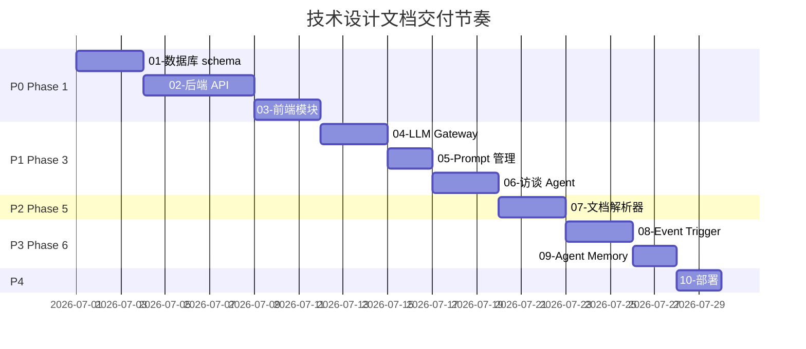

## 1. 概述

本文档是 Neo 平台**知识库与问答库子系统**的技术设计总览。

---

## 2. 文档清单

### 2.1 P0 - 基础设施（Phase 1 必需）

| # | 文档 | 说明 |
| --- | --- | --- |
| 01 | [数据库 schema 设计](./01-database-schema) | 所有表结构、ER 图、索引、约束 |
| 02 | [后端 API 设计](./02-backend-api) | 所有端点、请求/响应、错误码 |
| 03 | [前端模块拆分](./03-frontend-modules) | 路由结构、组件层次、状态管理 |

### 2.2 P1 - AI 能力（Phase 3 必需）

| # | 文档 | 说明 |
| --- | --- | --- |
| 04 | [LLM Gateway 设计](./04-llm-gateway) ✅ 已完成 | LLM 接入、限流、降级 — 实施：`services/knlg_base/llm/{client,router,cost_guard,logger,types,exceptions,provider_cache}.py` |
| 05 | [Prompt 模板管理](./05-prompt-management) 🟡 部分 | Prompt 存储、版本、A/B — 实施：`frontend/lib/api/knlg-base/prompts.ts`；后端 renderer 待 5.x 补 |
| 06 | [AI 访谈 Agent 状态机](./06-interview-agent) ✅ 已完成 | 追问决策、信号识别 — 实施：`services/knlg_base/agent/{state_machine,followup_decider,signal_extractor,summarizer,types}.py` + `agent_service.py`；6/7 API endpoint（`/sessions` `/{id}` `/{id}/pause` `/{id}/resume` `/{id}/abandon` `/{id}/stream`） |

### 2.3 P2 - 文档导入与多源融合（Phase 5 必需）

| # | 文档 | 说明 |
| --- | --- | --- |
| 07 | [文档解析器设计](./07-document-parser) | PDF/Word/MD 解析、分类 |

### 2.4 P3 - 规则化与 Agent 集成（Phase 6 必需）

| # | 文档 | 说明 |
| --- | --- | --- |
| 08 | [Event 订阅与 Trigger 引擎](./08-event-trigger) | Event 流订阅、规则触发 |
| 09 | [Agent Memory 加载接口](./09-agent-memory) | Rule 加载、反馈回流 |

### 2.5 P4 - 部署

| # | 文档 | 说明 |
| --- | --- | --- |
| 10 | [部署架构](./10-deployment) | 容器化、扩缩容、监控 |

---

## 3. 模块边界

### 3.1 在 Neo 平台中的位置

```text
┌─────────────────────────────────────────────┐
│              Neo Platform                   │
│  ┌──────────┐  ┌──────────┐  ┌──────────┐  │
│  │Frontend  │  │Backend   │  │Agent Steer│ │
│  │(Next.js) │  │(FastAPI) │  │(Chrome)   │ │
│  └─────┬────┘  └─────┬────┘  └─────┬─────┘  │
│        │             │              │        │
│        │      ┌──────┴──────┐       │        │
│        │      │             │       │        │
│        │   ┌──┴────┐  ┌─────┴────┐  │        │
│        │   │knlg-base│  │Agent Mem│  │        │
│        │   │MySQL   │  │Runtime  │  │        │
│        │   └────────┘  └─────────┘  │        │
└─────────────────────────────────────────────┘
```

### 3.2 数据流

```text
用户 (Chrome)
   ↓ Agent Steer 拦截操作
Event/Status 写入 Neo 后端
   ↓ Event 流
knlg-base Trigger 引擎订阅
   ↓ Rule 匹配
Rule conclusion 执行
   ↓ 执行反馈
Evidence 写回 knlg-base
```

### 3.3 不做哪些事

| 不做 | 由谁做 |
| --- | --- |
| Event 生成与采集 | Agent Steer（已有） |
| 用户操作拦截 | Interceptor（已有） |
| 实体命名规范定义 | Agent Steer（已定义 `{type}_{id}`） |
| 跨 Workspace 数据同步 | Workspace 隔离机制 |

---

## 4. 关键设计决策

### 4.1 数据库

| 决策 | 选择 | 理由 |
| --- | --- | --- |
| 主数据库 | MySQL 8 | Neo 平台统一栈 |
| 全文检索 | MySQL FULLTEXT（v1）/ Elasticsearch（v2） | MVP 阶段降低运维成本 |
| 知识图谱存储 | MySQL JSON（v1）/ Neo4j（v2） | MVP 阶段不上图数据库 |
| 向量化（v2） | pgvector 或 Qdrant | 留待 v2 |

### 4.2 后端

| 决策 | 选择 | 理由 |
| --- | --- | --- |
| 框架 | FastAPI | Neo 平台统一栈 |
| ORM | SQLAlchemy 2.0 | 异步友好，类型安全 |
| 校验 | Pydantic v2 | FastAPI 原生 |
| 异步任务 | Celery + Redis | AI 调用慢，必须异步 |
| 缓存 | Redis | Session、限流、Prompt 缓存 |

### 4.3 前端

| 决策 | 选择 | 理由 |
| --- | --- | --- |
| 框架 | Next.js 16 App Router | Neo 平台统一栈 |
| UI 组件 | shadcn/ui + Tailwind 4 | 与现有 UI 风格一致 |
| 状态管理 | Zustand | 轻量、API 简洁 |
| 数据获取 | TanStack Query (React Query) | 缓存、乐观更新 |
| 表单 | React Hook Form + Zod | 类型安全 |

### 4.4 AI

| 决策 | 选择 | 理由 |
| --- | --- | --- |
| LLM 接入 | 多 Provider 架构 | 避免锁定、可降级 |
| 主模型 | GPT-4 / Claude 3.5（待选） | 质量优先 |
| Prompt 管理 | 数据库 + 版本控制 | 产品可调、可追溯 |
| 异步调用 | Celery | 避免阻塞 |
| 流式响应 | SSE (Server-Sent Events) | AI 访谈实时反馈 |

---

## 5. 与现有模块的集成

### 5.1 复用模块

| 模块 | 复用方式 |
| --- | --- |
| **Workspace** | 所有表带 `workspace_id`，严格隔离 |
| **User** | 关联 `user_id`，使用全局用户池 |
| **Agent Steer Event/Status** | **消费**已定义的 schema，不重新定义 |
| **Interceptor** | 通过 Event 间接关联，不直接依赖 |
| **Agent Memory** | 通过 Rule 加载接口对接 |

### 5.2 新增模块

| 模块 | 路径 |
| --- | --- |
| `app.knlg_base` | 后端主模块 |
| `app.knlg_base.qa` | 问答库 |
| `app.knlg_base.knowledge` | 知识库 |
| `app.knlg_base.rule` | 规则库 |
| `app.knlg_base.import` | 知识导入 |
| `app.knlg_base.trigger` | 规则触发引擎 |
| `app.knlg_base.llm` | LLM Gateway |

---

## 6. 实施节奏



---

## 7. 评审与修订

- 所有技术设计文档**先评审后实施**
- 与产品设计文档保持双向追溯
- 数据库 schema 必须有 ER 图
- API 设计必须符合 [前后端 API 接口规范](../index)

---

## 🔗 相关文档

### 7.1 产品设计

- [知识库与问答库产品设计（总览）](../../product/knlg-base/)
- [实现路线图](../../product/knlg-base/implementation-roadmap)
- [问答库产品设计](../../product/knlg-base/q-a-library)
- [知识导入模块设计](../../product/knlg-base/knowledge-import)
- [知识萃取流程设计](../../product/knlg-base/extraction-flow)
- [知识库与规则库产品设计](../../product/knlg-base/knowledge-and-rule)

### 7.2 平台架构

- [技术架构总览](../arch/arch-overview)
- [前端工程架构](../arch/arch-frontend)
- [后端工程架构](../arch/arch-backend)
- [前后端 API 接口规范](../index)
- [Workspace 技术设计](../workspaces/)
