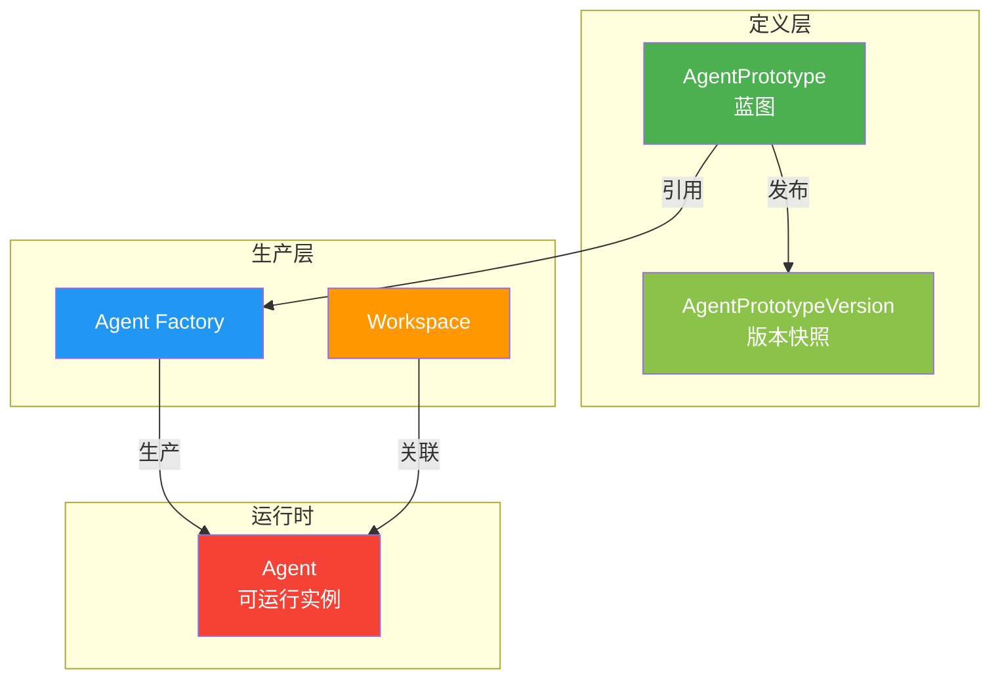
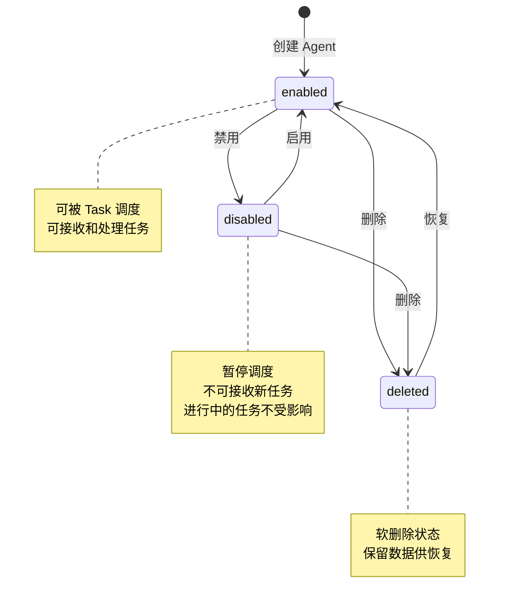

## 1. 概述

本文档描述 Agent Factory 功能的技术设计，包括数据模型、API 设计、状态机实现等。

### 1.1 背景

Agent Factory 用于生产、维护 Agent，Agent 只能在某个 workspace 下生成。Factory 注重生产阶段，将 Agent 的生产逻辑与运行逻辑分离。

### 1.2 关联产品文档

- [Agent Factory 产品设计](../../product/workspaces/agent-factory) - 产品功能概述
- [Agent 数据库设计](../agents/agent-database-design) - Agent 数据模型详细说明

---

## 2. 数据模型

### 2.1 实体关系图



### 2.2 Agent 表设计

> 详细字段定义见 [Agent 数据库设计](../agents/agent-database-design)

| 字段                | 类型/格式                  | 约束                              | 说明                         |
| ------------------- | -------------------------- | --------------------------------- | ---------------------------- |
| `id`                | BIGINT AUTO_INCREMENT      | PK, NOT NULL                      | 主键，唯一标识               |
| `name`              | VARCHAR(32)                | UK (workspace 内), NOT NULL, INDEX| Agent 名称标识符             |
| `description`       | TEXT                       | NULL                              | 描述信息                     |
| `prototype_id`      | BIGINT                     | FK → agent_prototype.id, NOT NULL | 引用的 Prototype ID          |
| `prototype_version` | VARCHAR(32)                | NOT NULL                          | 基于的 Prototype 版本号       |
| `workspace_id`      | BIGINT                     | FK → workspace.id, NOT NULL, INDEX | 所属 Workspace               |
| `model`             | VARCHAR(64)                | NOT NULL                          | 模型配置                     |
| `skills`            | JSON                       | NOT NULL, DEFAULT '[]'            | 启用的技能列表               |
| `config`            | JSON                       | NOT NULL, DEFAULT '{}'            | 运行时配置                   |
| `status`            | ENUM('draft','enabled','disabled','deleted') | NOT NULL, DEFAULT 'enabled' | 状态 |
| `created_by`        | BIGINT                     | FK → users.id, NOT NULL           | 创建人                       |
| `created_at`        | TIMESTAMP                  | NOT NULL                          | 创建时间                     |
| `updated_at`        | TIMESTAMP                  | NOT NULL                          | 更新时间                     |

**索引设计**：

| 索引名                 | 字段           | 类型      | 说明                      |
| ---------------------- | -------------- | --------- | ------------------------- |
| `idx_agent_name`       | `name`         | UNIQUE    | 按 name 快速查找          |
| `idx_agent_workspace`  | `workspace_id` | INDEX     | 按 Workspace 筛选         |
| `idx_agent_prototype`  | `prototype_id` | INDEX     | 按 Prototype 筛选         |
| `idx_agent_status`     | `status`       | INDEX     | 按状态筛选                |
| `idx_agent_created_by` | `created_by`   | INDEX     | 按创建人筛选              |

**约束设计**：

| 约束名                     | 字段                  | 类型       | 说明                        |
| -------------------------- | --------------------- | ---------- | --------------------------- |
| `uk_agent_workspace_name`  | `workspace_id, name`  | UNIQUE     | 同一 Workspace 下 name 唯一 |
| `fk_agent_workspace`       | `workspace_id`        | FOREIGN KEY| 关联 Workspace              |
| `fk_agent_prototype`      | `prototype_id`        | FOREIGN KEY| 关联 Agent Prototype        |
| `fk_agent_creator`        | `created_by`          | FOREIGN KEY| 关联创建用户                |

### 2.3 AgentConfig 运行时配置

`config` 字段 JSON 结构：

```json
{
  "temperature": 0.7,
  "max_tokens": 4096,
  "thinking": "high",
  "timeout": 60,
  "retry": {
    "max_attempts": 3,
    "backoff": "exponential"
  }
}
```

| 属性                 | 类型     | 默认值  | 说明                           |
| -------------------- | -------- | ------- | ------------------------------ |
| `temperature`        | FLOAT    | 0.7     | 模型温度参数                   |
| `max_tokens`         | INTEGER  | 4096    | 最大输出 token 数              |
| `thinking`           | ENUM     | "low"   | 思考深度: low / medium / high |
| `timeout`            | INTEGER  | 60      | 单次执行超时（秒）             |
| `retry.max_attempts` | INTEGER  | 3       | 最大重试次数                   |
| `retry.backoff`      | ENUM     | "linear"| 重试策略: linear / exponential|

---

## 3. API 设计

### 3.1 API 概览

| 类别     | 方法   | 端点                                                            | 说明                   |
| -------- | ------ | -------------------------------------------------------------- | ---------------------- |
| **列表** | GET    | `/api/v1/workspaces/{workspace_code}/agents`                   | 获取 Agent 列表        |
| **详情** | GET    | `/api/v1/workspaces/{workspace_code}/agents/{id}`              | 获取单个 Agent 详情    |
| **创建** | POST   | `/api/v1/workspaces/{workspace_code}/agents`                   | 基于 Prototype 创建 Agent |
| **更新** | PUT    | `/api/v1/workspaces/{workspace_code}/agents/{id}`              | 更新 Agent 配置        |
| **删除** | DELETE | `/api/v1/workspaces/{workspace_code}/agents/{id}`              | 删除 Agent（软删除）   |
| **启用** | PATCH  | `/api/v1/workspaces/{workspace_code}/agents/{id}/enable`       | 启用 Agent             |
| **禁用** | PATCH  | `/api/v1/workspaces/{workspace_code}/agents/{id}/disable`       | 禁用 Agent             |

### 3.2 标准响应结构

```json
{
  "code": 0,
  "message": "ok",
  "data": {},
  "traceId": "abc-123",
  "timestamp": 1716969600000
}
```

| 字段      | 类型   | 必填 | 含义                       |
| --------- | ------ | ---- | -------------------------- |
| `code`    | int    | 是   | 业务状态码（0 = 成功）     |
| `message` | string | 是   | 给人类 / AI 的错误说明     |
| `data`    | any    | 否   | 返回数据                   |
| `traceId` | string | 是   | 请求链路ID（用于排查问题） |
| `timestamp` | number | 是 | 服务端时间戳（毫秒）      |

### 3.3 列表 API

```
GET /api/v1/workspaces/{workspace_code}/agents
```

**查询参数**：

| 参数        | 类型    | 必填 | 说明                           |
| ----------- | ------- | ---- | ------------------------------ |
| `page`      | integer | 否   | 页码，默认 1                   |
| `page_size` | integer | 否   | 每页数量，默认 20              |
| `status`    | string  | 否   | 过滤状态：enabled / disabled   |
| `prototype_id` | bigint | 否   | 按 Prototype 筛选              |
| `search`    | string  | 否   | 搜索 name / description        |

**响应**：

```json
{
  "code": 0,
  "message": "ok",
  "data": {
    "items": [
      {
        "id": 1,
        "name": "my-first-agent",
        "description": "我的第一个 Agent",
        "prototype_id": 1,
        "prototype_version": "1.0.0",
        "workspace_id": 1,
        "model": "gpt-4",
        "skills": [{"id": 1, "version": "1.0.0"}],
        "config": {
          "temperature": 0.7,
          "max_tokens": 4096
        },
        "status": "enabled",
        "created_by": 1,
        "created_at": "2026-05-29T10:00:00Z",
        "updated_at": "2026-05-29T10:00:00Z"
      }
    ],
    "total": 100,
    "page": 1,
    "page_size": 20,
    "total_pages": 5
  },
  "traceId": "xxx",
  "timestamp": 1716969600000
}
```

### 3.4 创建 API

```
POST /api/v1/workspaces/{workspace_code}/agents
```

**前置条件**：
- Prototype 必须处于 `enabled` 状态

**请求体**：

```json
{
  "name": "my-first-agent",
  "description": "我的第一个 Agent",
  "prototype_id": 1,
  "prototype_version": "1.0.0",
  "model": "gpt-4",
  "skills": [{"id": 1, "version": "1.0.0"}],
  "config": {
    "temperature": 0.8,
    "max_tokens": 4096
  }
}
```

**字段验证**：

| 字段              | 规则                                        | 错误信息                 |
| ----------------- | ------------------------------------------- | ------------------------ |
| `name`            | 必填，32 字符内，workspace 内唯一            | "Agent 名称已存在"       |
| `prototype_id`    | 必填，必须引用已发布状态的 Prototype         | "Prototype 不存在或未发布" |
| `prototype_version` | 必填，必须是 Prototype 的有效版本           | "版本不存在"             |
| `model`           | 可选，若不填则继承 Prototype 配置            | -                        |
| `config`          | 可选，JSON 格式                             | "配置格式错误"           |

**响应**：

```json
{
  "code": 0,
  "message": "ok",
  "data": {
    "id": 1,
    "name": "my-first-agent",
    "description": "我的第一个 Agent",
    "prototype_id": 1,
    "prototype_version": "1.0.0",
    "workspace_id": 1,
    "model": "gpt-4",
    "skills": [{"id": 1, "version": "1.0.0"}],
    "config": {
      "temperature": 0.8,
      "max_tokens": 4096
    },
    "status": "enabled",
    "created_by": 1,
    "created_at": "2026-05-29T10:00:00Z",
    "updated_at": "2026-05-29T10:00:00Z"
  },
  "traceId": "xxx",
  "timestamp": 1716969600000
}
```

### 3.5 更新 API

```
PUT /api/v1/workspaces/{workspace_code}/agents/{id}
```

**请求体**：

```json
{
  "name": "my-agent-v2",
  "description": "更新后的 Agent",
  "model": "gpt-4-turbo",
  "skills": [{"id": 1, "version": "1.0.0"}, {"id": 2, "version": "1.0.0"}],
  "config": {
    "temperature": 0.9,
    "max_tokens": 8192
  }
}
```

**说明**：
- `prototype_id` 和 `prototype_version` 不可修改
- 仅 `enabled` / `disabled` 状态的 Agent 可更新

### 3.6 删除 API

```
DELETE /api/v1/workspaces/{workspace_code}/agents/{id}
```

**说明**：
- 执行软删除，设置 `status = 'deleted'`
- 删除前检查是否有进行中的 Task
- 删除后可恢复（恢复为 disabled 状态）

### 3.7 启用/禁用 API

```
PATCH /api/v1/workspaces/{workspace_code}/agents/{id}/enable
PATCH /api/v1/workspaces/{workspace_code}/agents/{id}/disable
```

**响应**：

```json
{
  "code": 0,
  "message": "ok",
  "data": {
    "id": 1,
    "status": "enabled",
    "updated_at": "2026-05-29T10:00:00Z"
  },
  "traceId": "xxx",
  "timestamp": 1716969600000
}
```

---

## 4. 状态机

### 4.1 状态定义

| 状态      | 说明                          | 允许的操作           |
| --------- | ----------------------------- | -------------------- |
| `draft`   | 草稿（仅 Agent Prototype 使用）| -                    |
| `enabled` | 启用状态，可被 Task 调度      | disable              |
| `disabled`| 禁用状态，暂停调度            | enable               |
| `deleted` | 已删除，软删除状态            | enable (恢复)        |

### 4.2 状态流转



### 4.3 状态操作权限

| 操作   | 前置状态           | 后置状态 | 权限要求       |
| ------ | ------------------ | -------- | -------------- |
| **创建** | -                  | enabled  | workspace 成员 |
| **启用** | disabled / deleted | enabled  | workspace 成员 |
| **禁用** | enabled            | disabled | workspace 成员 |
| **删除** | enabled / disabled | deleted  | workspace 管理员 |

### 4.4 状态影响说明

| 状态       | Task 调度 | 接收新任务 | 正在执行的任务 |
| ---------- | --------- | ---------- | -------------- |
| `enabled`  | ✅ 允许   | ✅ 允许    | ✅ 继续执行    |
| `disabled` | ❌ 暂停   | ❌ 拒绝    | ✅ 继续执行    |
| `deleted`  | ❌ 禁止   | ❌ 拒绝    | ❌ 中断执行    |

---

## 5. 验证规则

### 5.1 业务约束

| 约束                     | 说明                                   |
| ------------------------ | -------------------------------------- |
| ** Workspace 归属**      | Agent 必须属于某个 Workspace            |
| ** Prototype 引用**     | Agent 必须基于已发布的 Prototype       |
| ** 命名空间**            | name 在 Workspace 内唯一               |
| ** 配置继承**            | 若未指定 config，默认继承 Prototype    |
| ** 删除限制**            | 删除前需确保无进行中的 Task            |

### 5.2 配置验证

| 字段        | 规则                                        |
| ----------- | ------------------------------------------- |
| `temperature` | 范围 0-2，步进 0.1                       |
| `max_tokens`  | 范围 1-128000，根据模型限制              |
| `timeout`     | 范围 1-3600 秒                            |
| `skills`      | 每个 skill 必须存在且版本匹配             |

---

## 6. 错误码设计

### 6.1 错误码范围

| 范围      | 用途     |
| --------- | -------- |
| 0         | 成功     |
| 1000-1999 | 通用错误 |
| 2000-2999 | Agent 相关错误 |
| 9000-9999 | 系统错误 |

### 6.2 错误码定义

| 错误码 | 说明                     | HTTP 状态码 |
| ------ | ------------------------ | ----------- |
| 0      | 成功                     | 200         |
| 1001   | 参数验证失败             | 400         |
| 1002   | 未授权                   | 401         |
| 1003   | 禁止访问                 | 403         |
| 1004   | 资源不存在               | 404         |
| 2001   | Agent 不存在             | 404         |
| 2002   | Agent 名称已存在         | 409         |
| 2003   | Agent 状态不允许此操作   | 409         |
| 2004   | 存在进行中的 Task        | 409         |
| 2011   | Prototype 不存在         | 404         |
| 2012   | Prototype 未发布         | 400         |
| 2013   | Prototype 版本不存在     | 400         |
| 3001   | Workspace 不存在         | 404         |
| 9001   | 服务器内部错误           | 500         |
| 9002   | 数据库错误               | 500         |

---

## 🔗 相关文档

- [Agent Factory 产品设计](../../product/workspaces/agent-factory) - 产品功能概述
- [Agent 数据库设计](../agents/agent-database-design) - Agent 数据模型详细说明
- [Agent Prototype 管理](../../product/admin/agent-prototype-management) - Prototype 定义和版本管理