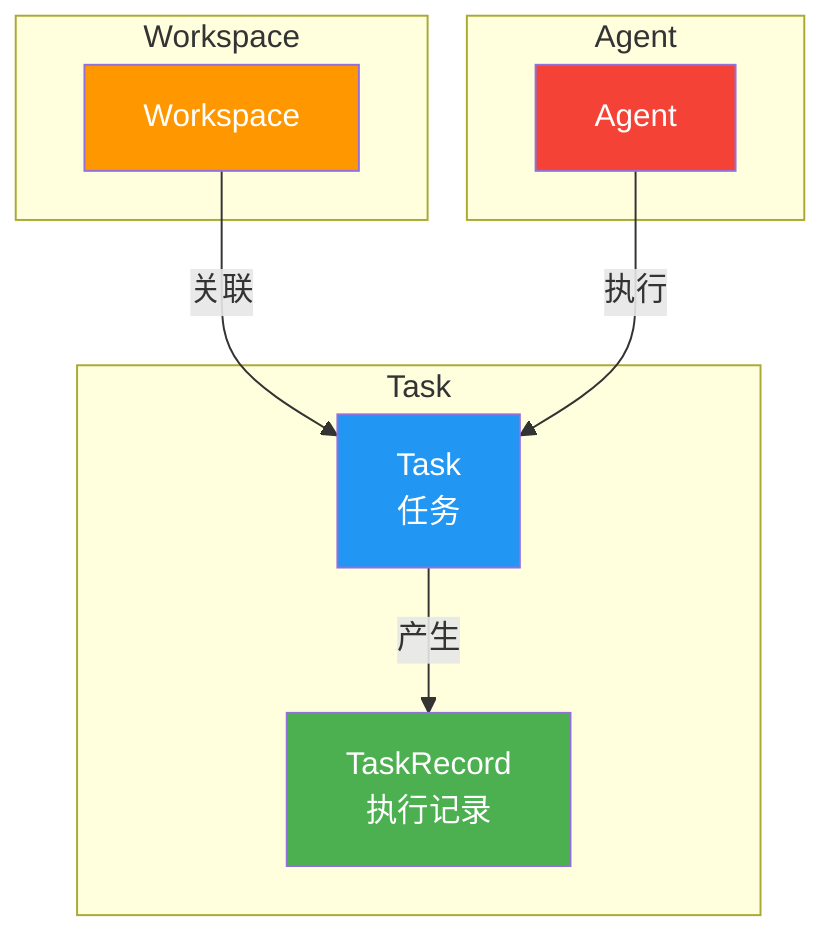
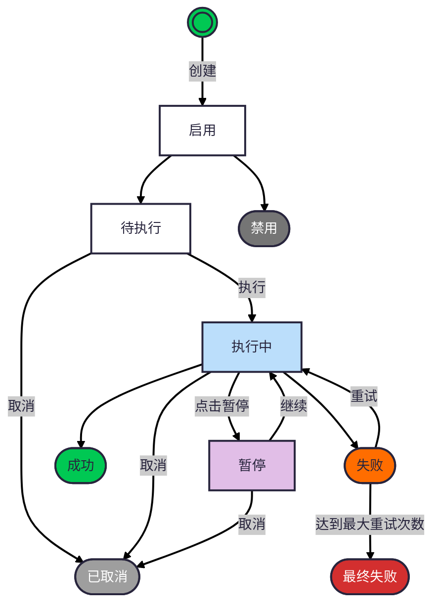

## 1. 概述

本文档描述 Agent 任务管理功能的技术设计，包括数据模型、API 设计等。

### 1.1 背景

Agent 任务管理是管理 Agent 执行任务的平台，提供任务的查看、筛选、操作（取消/禁用/暂停/继续）等功能。

### 1.2 核心设计原则

- **不可新增**：任务由其他模块创建（如 Agent 嵌入、Agent Factory），不在此处创建
- **不可修改**：任务一旦创建，内容不可变更，保证审计可追溯
- **不可删除**：所有任务记录必须保留，用于完整追踪
- **可查询**：支持多维度筛选和搜索
- **可操作**：支持取消、禁用、暂停、继续等状态管理操作

### 1.3 关联产品文档

- [Agent 任务管理 产品设计](../../product/workspaces/agent-task-manager) - 产品功能概述
- [Agent 任务系统设计](../../product/agents/agent-task) - 任务定义、属性、约束、状态机
- [Agent 数据库设计](../agents/agent-database-design) - Agent 数据模型详细说明

### 1.4 实现进度

| 功能 | 状态 | 说明 |
| ---- | ---- | ---- |
| 任务列表查询 | ✅ 已实现 | 支持分页、筛选、搜索 |
| 任务详情查看 | ✅ 已实现 | 展示任务完整信息 |
| 执行记录列表 | ✅ 已实现 | 展示任务执行记录 |
| 执行记录详情 | ✅ 已实现 | 展示执行结果和过程 |
| 取消任务 | ✅ 已实现 | 更新任务状态为已取消 |
| 禁用任务 | ✅ 已实现 | 更新任务状态为禁用 |
| 启用任务 | ✅ 已实现 | 更新任务状态为启用 |
| 暂停任务 | ⏳ 待实现 | 需 Agent 支持暂停能力 |
| 继续任务 | ⏳ 待实现 | 需 Agent 支持继续能力 |
| 执行录像回放 | ⏳ 待实现 | 需 rrweb 录像集成 |

---

## 2. 数据模型

### 2.1 实体关系图



### 2.2 Task 任务表

| 属性 | 类型/格式 | 约束 | 说明 |
| ---- | --------- | ---- | ---- |
| `id` | BIGINT AUTO_INCREMENT | PK, NOT NULL | 主键，唯一标识 |
| `name` | VARCHAR(128) | NOT NULL, INDEX | 任务名称 |
| `description` | TEXT | NULL | 任务简要描述 |
| `content` | TEXT | NULL | 任务详细内容（Markdown） |
| `workspace_id` | BIGINT | FK → workspace.id, NOT NULL, INDEX | 所属 Workspace |
| `agent_id` | BIGINT | FK → agent.id, NOT NULL, INDEX | 关联的 Agent |
| `owner_id` | BIGINT | FK → users.id, NOT NULL, INDEX | 创建人（任务归属者） |
| `priority` | ENUM('high','medium','low') | NOT NULL, DEFAULT 'medium' | 优先级 |
| `task_type` | ENUM('temporary','periodic','dispatch') | NOT NULL | 任务类型：临时/周期/派发 |
| `exec_status` | ENUM('pending','running','paused','success','failed','final_failed','cancelled') | NOT NULL, DEFAULT 'pending' | 执行状态 |
| `status` | ENUM('enabled','disabled') | NOT NULL, DEFAULT 'enabled' | 启用/禁用状态 |
| `max_retry` | INT | NOT NULL, DEFAULT 3 | 最大重试次数 |
| `retry_interval` | INT | NOT NULL, DEFAULT 60 | 重试间隔（秒） |
| `webhook_url` | VARCHAR(512) | NULL | 反馈 Webhook URL |
| `webhook_secret` | VARCHAR(128) | NULL | Webhook 签名密钥 |
| `cron_expression` | VARCHAR(64) | NULL | Cron 表达式（周期任务） |
| `created_at` | TIMESTAMP | NOT NULL | 创建时间 |
| `updated_at` | TIMESTAMP | NOT NULL | 更新时间 |

**索引设计**：

| 索引名 | 字段 | 类型 | 说明 |
| ------ | ---- | ---- | ---- |
| `idx_task_workspace` | `workspace_id` | INDEX | 按 Workspace 筛选 |
| `idx_task_agent` | `agent_id` | INDEX | 按 Agent 筛选 |
| `idx_task_owner` | `owner_id` | INDEX | 按创建人筛选 |
| `idx_task_exec_status` | `exec_status` | INDEX | 按执行状态筛选 |
| `idx_task_status` | `status` | INDEX | 按启用/禁用筛选 |
| `idx_task_type` | `task_type` | INDEX | 按任务类型筛选 |
| `idx_task_priority` | `priority` | INDEX | 按优先级筛选 |
| `idx_task_created_at` | `created_at` | INDEX | 按创建时间排序 |

**约束设计**：

| 约束名 | 字段 | 类型 | 说明 |
| ------ | ---- | ---- | ---- |
| `fk_task_workspace` | `workspace_id` | FOREIGN KEY | 关联 Workspace |
| `fk_task_agent` | `agent_id` | FOREIGN KEY | 关联 Agent |
| `fk_task_owner` | `owner_id` | FOREIGN KEY | 关联创建用户 |

### 2.3 TaskRecord 执行记录表

| 属性 | 类型/格式 | 约束 | 说明 |
| ---- | --------- | ---- | ---- |
| `id` | BIGINT AUTO_INCREMENT | PK, NOT NULL | 主键，唯一标识 |
| `task_id` | BIGINT | FK → task.id, NOT NULL, INDEX | 关联的任务 |
| `started_at` | TIMESTAMP | NOT NULL | 执行开始时间 |
| `ended_at` | TIMESTAMP | NULL | 执行结束时间 |
| `duration` | INT | NULL | 执行时长（秒） |
| `exec_status` | ENUM('success','failed') | NOT NULL | 执行状态 |
| `result` | TEXT | NULL | 任务结果（Markdown/JSON） |
| `process` | JSON | NULL | 执行过程数据 |
| `failure_reason` | TEXT | NULL | 失败原因 |
| `recording_url` | VARCHAR(512) | NULL | rrweb 录像 URL |
| `created_at` | TIMESTAMP | NOT NULL | 创建时间 |

**索引设计**：

| 索引名 | 字段 | 类型 | 说明 |
| ------ | ---- | ---- | ---- |
| `idx_record_task` | `task_id` | INDEX | 按任务查找记录 |
| `idx_record_started` | `started_at` | INDEX | 按开始时间排序 |

**约束设计**：

| 约束名 | 字段 | 类型 | 说明 |
| ------ | ---- | ---- | ---- |
| `fk_record_task` | `task_id` | FOREIGN KEY | 关联 Task |

---

## 3. API 设计

### 3.1 API 概览

| 类别 | 方法 | 端点 | 说明 | 状态 |
| ---- | ---- | ---- | ---- | ---- |
| **列表** | GET | `/api/v1/workspaces/{workspace_code}/tasks` | 获取任务列表 | ✅ 已实现 |
| **详情** | GET | `/api/v1/workspaces/{workspace_code}/tasks/{task_id}` | 获取任务详情 | ✅ 已实现 |
| **执行记录列表** | GET | `/api/v1/workspaces/{workspace_code}/tasks/{task_id}/records` | 获取执行记录列表 | ✅ 已实现 |
| **执行记录详情** | GET | `/api/v1/workspaces/{workspace_code}/tasks/{task_id}/records/{record_id}` | 获取执行记录详情 | ✅ 已实现 |
| **取消任务** | POST | `/api/v1/workspaces/{workspace_code}/tasks/{task_id}/cancel` | 取消任务 | ✅ 已实现 |
| **暂停任务** | POST | `/api/v1/workspaces/{workspace_code}/tasks/{task_id}/pause` | 暂停任务 | ⏳ 待实现 |
| **继续任务** | POST | `/api/v1/workspaces/{workspace_code}/tasks/{task_id}/resume` | 继续任务 | ⏳ 待实现 |
| **禁用任务** | PATCH | `/api/v1/workspaces/{workspace_code}/tasks/{task_id}/disable` | 禁用任务 | ✅ 已实现 |
| **启用任务** | PATCH | `/api/v1/workspaces/{workspace_code}/tasks/{task_id}/enable` | 启用任务 | ✅ 已实现 |

### 3.2 标准响应结构

```json
{
  "code": 0,
  "message": "ok",
  "data": {},
  "traceId": "abc-123",
  "timestamp": 1716969600000
}
```

| 字段 | 类型 | 必填 | 含义 |
| ---- | ---- | ---- | ---- |
| `code` | int | 是 | 业务状态码（0 = 成功） |
| `message` | string | 是 | 给人类 / AI 的错误说明 |
| `data` | any | 否 | 返回数据 |
| `traceId` | string | 是 | 请求链路ID（用于排查问题） |
| `timestamp` | number | 是 | 服务端时间戳（毫秒） |

### 3.3 任务列表 API

```
GET /api/v1/workspaces/{workspace_code}/tasks
```

**查询参数**：

| 参数 | 类型 | 必填 | 说明 |
| ---- | ---- | ---- | ---- |
| `page` | integer | 否 | 页码，默认 1 |
| `page_size` | integer | 否 | 每页数量，默认 20 |
| `exec_status` | string | 否 | 过滤执行状态 |
| `task_type` | string | 否 | 过滤任务类型 |
| `priority` | string | 否 | 过滤优先级 |
| `agent_id` | bigint | 否 | 按 Agent 筛选 |
| `owner_id` | bigint | 否 | 按创建人筛选 |
| `status` | string | 否 | 过滤启用/禁用状态 |
| `created_after` | datetime | 否 | 创建时间起始 |
| `created_before` | datetime | 否 | 创建时间截止 |
| `search` | string | 否 | 搜索名称/ID |

**执行状态可选值**：

| 值 | 说明 |
| ---- | ---- |
| `pending` | 待执行 |
| `running` | 执行中 |
| `paused` | 暂停 |
| `success` | 成功 |
| `failed` | 失败 |
| `final_failed` | 最终失败 |
| `cancelled` | 已取消 |

**任务类型可选值**：

| 值 | 说明 |
| ---- | ---- |
| `temporary` | 临时任务 |
| `periodic` | 周期任务 |
| `dispatch` | 派发任务 |

**响应**：

```json
{
  "code": 0,
  "message": "ok",
  "data": {
    "items": [
      {
        "id": 1,
        "name": "每日数据报告",
        "description": "生成每日数据报告",
        "task_type": "periodic",
        "priority": "high",
        "exec_status": "pending",
        "status": "enabled",
        "agent_id": 1,
        "agent_name": "报告生成器",
        "owner_id": 1,
        "owner_name": "张三",
        "created_at": "2026-06-08T10:00:00Z",
        "updated_at": "2026-06-08T10:00:00Z"
      }
    ],
    "total": 100,
    "page": 1,
    "page_size": 20,
    "total_pages": 5
  },
  "traceId": "xxx",
  "timestamp": 1716969600000
}
```

### 3.4 任务详情 API

```
GET /api/v1/workspaces/{workspace_code}/tasks/{task_id}
```

**响应**：

```json
{
  "code": 0,
  "message": "ok",
  "data": {
    "id": 1,
    "name": "每日数据报告",
    "description": "生成每日数据报告",
    "content": "## 任务内容\n请生成昨日的数据报告...",
    "task_type": "periodic",
    "priority": "high",
    "exec_status": "running",
    "status": "enabled",
    "max_retry": 3,
    "retry_interval": 60,
    "webhook_url": "https://example.com/callback",
    "cron_expression": "0 8 * * *",
    "agent_id": 1,
    "agent_name": "报告生成器",
    "owner_id": 1,
    "owner_name": "张三",
    "created_at": "2026-06-08T10:00:00Z",
    "updated_at": "2026-06-08T10:00:00Z",
    "record_count": 15,
    "recent_records": [
      {
        "id": 15,
        "started_at": "2026-06-08T08:00:00Z",
        "ended_at": "2026-06-08T08:05:00Z",
        "duration": 300,
        "exec_status": "success"
      }
    ]
  },
  "traceId": "xxx",
  "timestamp": 1716969600000
}
```

### 3.5 执行记录列表 API

```
GET /api/v1/workspaces/{workspace_code}/tasks/{task_id}/records
```

**查询参数**：

| 参数 | 类型 | 必填 | 说明 |
| ---- | ---- | ---- | ---- |
| `page` | integer | 否 | 页码，默认 1 |
| `page_size` | integer | 否 | 每页数量，默认 20 |
| `exec_status` | string | 否 | 过滤执行状态 |

**响应**：

```json
{
  "code": 0,
  "message": "ok",
  "data": {
    "items": [
      {
        "id": 15,
        "started_at": "2026-06-08T08:00:00Z",
        "ended_at": "2026-06-08T08:05:00Z",
        "duration": 300,
        "exec_status": "success"
      },
      {
        "id": 14,
        "started_at": "2026-06-07T08:00:00Z",
        "ended_at": "2026-06-07T08:03:00Z",
        "duration": 180,
        "exec_status": "failed",
        "failure_reason": "网络超时"
      }
    ],
    "total": 15,
    "page": 1,
    "page_size": 20,
    "total_pages": 1
  },
  "traceId": "xxx",
  "timestamp": 1716969600000
}
```

### 3.6 执行记录详情 API

```
GET /api/v1/workspaces/{workspace_code}/tasks/{task_id}/records/{record_id}
```

**响应**：

```json
{
  "code": 0,
  "message": "ok",
  "data": {
    "id": 15,
    "task_id": 1,
    "started_at": "2026-06-08T08:00:00Z",
    "ended_at": "2026-06-08T08:05:00Z",
    "duration": 300,
    "exec_status": "success",
    "result": "报告已生成，共处理 1000 条数据",
    "process": [
      {"step": 1, "action": "获取昨日数据", "status": "success", "time": 10},
      {"step": 2, "action": "分析数据", "status": "success", "time": 120},
      {"step": 3, "action": "生成报告", "status": "success", "time": 170}
    ],
    "failure_reason": null,
    "recording_url": null,
    "created_at": "2026-06-08T08:00:00Z"
  },
  "traceId": "xxx",
  "timestamp": 1716969600000
}
```

> ⚠️ **注意**：`recording_url` 字段暂未启用，录像回放功能待实现。

### 3.7 取消任务 API

```
POST /api/v1/workspaces/{workspace_code}/tasks/{task_id}/cancel
```

**适用状态**：待执行、执行中、暂停

**响应**：

```json
{
  "code": 0,
  "message": "ok",
  "data": {
    "id": 1,
    "exec_status": "cancelled",
    "updated_at": "2026-06-08T10:30:00Z"
  },
  "traceId": "xxx",
  "timestamp": 1716969600000
}
```

### 3.8 暂停任务 API

```
POST /api/v1/workspaces/{workspace_code}/tasks/{task_id}/pause
```

> ⚠️ **待实现**：此 API 需 Agent 支持暂停能力，当前 Agent 模块尚未实现此功能。

**适用状态**：执行中

**响应**：

```json
{
  "code": 0,
  "message": "ok",
  "data": {
    "id": 1,
    "exec_status": "paused",
    "updated_at": "2026-06-08T10:30:00Z"
  },
  "traceId": "xxx",
  "timestamp": 1716969600000
}
```

**待实现说明**：
- 需要 Agent 模块支持暂停指令
- 需设计 Agent 与 Task 系统的通信机制
- 需处理暂停状态的持久化

### 3.9 继续任务 API

```
POST /api/v1/workspaces/{workspace_code}/tasks/{task_id}/resume
```

> ⚠️ **待实现**：此 API 需 Agent 支持继续能力，当前 Agent 模块尚未实现此功能。

**适用状态**：暂停

**响应**：

```json
{
  "code": 0,
  "message": "ok",
  "data": {
    "id": 1,
    "exec_status": "running",
    "updated_at": "2026-06-08T10:35:00Z"
  },
  "traceId": "xxx",
  "timestamp": 1716969600000
}
```

**待实现说明**：
- 需要 Agent 模块支持继续/恢复指令
- 需处理任务状态的恢复和同步
- 需考虑断点续传等场景

### 3.10 禁用任务 API

```
PATCH /api/v1/workspaces/{workspace_code}/tasks/{task_id}/disable
```

**适用状态**：任意状态

**响应**：

```json
{
  "code": 0,
  "message": "ok",
  "data": {
    "id": 1,
    "status": "disabled",
    "updated_at": "2026-06-08T10:30:00Z"
  },
  "traceId": "xxx",
  "timestamp": 1716969600000
}
```

### 3.11 启用任务 API

```
PATCH /api/v1/workspaces/{workspace_code}/tasks/{task_id}/enable
```

**适用状态**：禁用状态

**响应**：

```json
{
  "code": 0,
  "message": "ok",
  "data": {
    "id": 1,
    "status": "enabled",
    "updated_at": "2026-06-08T10:30:00Z"
  },
  "traceId": "xxx",
  "timestamp": 1716969600000
}
```

---

## 4. 状态机

### 4.1 执行状态流转

任务执行状态机详见 [Agent 任务系统设计 - 任务状态机](../../product/agents/agent-task#任务状态机)。



### 4.2 操作约束

| 操作 | 适用状态 | 前置条件 | 约束 |
| ---- | -------- | -------- | ---- |
| 取消 | pending / running / paused | - | 已成功的任务不可取消 |
| 暂停 | running | 需 Agent 支持 | ⏳ 待 Agent 实现 |
| 继续 | paused | 需 Agent 支持 | ⏳ 待 Agent 实现 |
| 禁用 | 任意状态 | - | - |
| 启用 | disabled | - | - |

---

## 5. 错误码设计

### 5.1 错误码范围

| 范围 | 用途 |
| ---- | ---- |
| 0 | 成功 |
| 1000-1999 | 通用错误 |
| 3000-3999 | Task 相关错误 |
| 9000-9999 | 系统错误 |

### 5.2 错误码定义

| 错误码 | 说明 | HTTP 状态码 |
| ------ | ---- | ----------- |
| 0 | 成功 | 200 |
| 1001 | 参数验证失败 | 400 |
| 1002 | 未授权 | 401 |
| 1003 | 禁止访问 | 403 |
| 1004 | 资源不存在 | 404 |
| 3001 | Task 不存在 | 404 |
| 3002 | Task 状态不允许此操作 | 409 |
| 3003 | Task 已成功，不可取消 | 409 |
| 3004 | Task 正在执行中 | 409 |
| 3011 | TaskRecord 不存在 | 404 |
| 3012 | 暂停功能暂未实现 | 501 |
| 3013 | 继续功能暂未实现 | 501 |
| 3021 | Agent 不存在 | 404 |
| 4001 | Workspace 不存在 | 404 |
| 9001 | 服务器内部错误 | 500 |
| 9002 | 数据库错误 | 500 |

---

## 6. 权限设计

### 6.1 操作权限矩阵

| 操作 | Agent 拥有者 | Workspace 管理员 | 系统管理员 |
| ---- | ------------ | ---------------- | ---------- |
| 查看任务列表 | ✅ 自己创建的 | ✅ 本 Workspace | ✅ 全部 |
| 查看任务详情 | ✅ 自己创建的 | ✅ 本 Workspace | ✅ 全部 |
| 查看执行记录 | ✅ 自己创建的 | ✅ 本 Workspace | ✅ 全部 |
| 取消任务 | ✅ 自己创建的 | ✅ 本 Workspace | ✅ 全部 |
| 暂停任务 | ✅ 自己创建的 | ✅ 本 Workspace | ✅ 全部 |
| 继续任务 | ✅ 自己创建的 | ✅ 本 Workspace | ✅ 全部 |
| 禁用任务 | ✅ 自己创建的 | ✅ 本 Workspace | ✅ 全部 |
| 启用任务 | ✅ 自己创建的 | ✅ 本 Workspace | ✅ 全部 |

---

## 7. 待实现功能

### 7.1 暂停/继续功能

**依赖**：Agent 模块需实现暂停/继续能力

**需要设计**：
- Agent 与 Task 系统之间的通信协议
- 暂停状态的持久化和恢复机制
- 用户接管后的任务状态同步

**预计实现方式**：
1. Agent 接收 `pause` 指令后，将当前执行状态保存到 Redis
2. Task 系统更新任务状态为 `paused`
3. 用户触发 `resume` 时，Agent 从 Redis 恢复执行状态
4. 支持断点续传

### 7.2 执行录像功能

**依赖**：rrweb 录像集成

**需要设计**：
- 录像录制和存储机制
- 录像回放界面
- 录像访问权限控制

**预计实现方式**：
1. Agent 执行任务时，启动 rrweb 录制
2. 任务完成后，上传录像到对象存储
3. 将 `recording_url` 保存到 TaskRecord
4. 提供录像回放页面

---

## 🔗 相关文档

- [Agent 任务管理 产品设计](../../product/workspaces/agent-task-manager) - 产品功能概述
- [Agent 任务系统设计](../../product/agents/agent-task) - 任务定义、属性、约束、状态机
- [Agent 数据库设计](../agents/agent-database-design) - Agent 数据模型详细说明