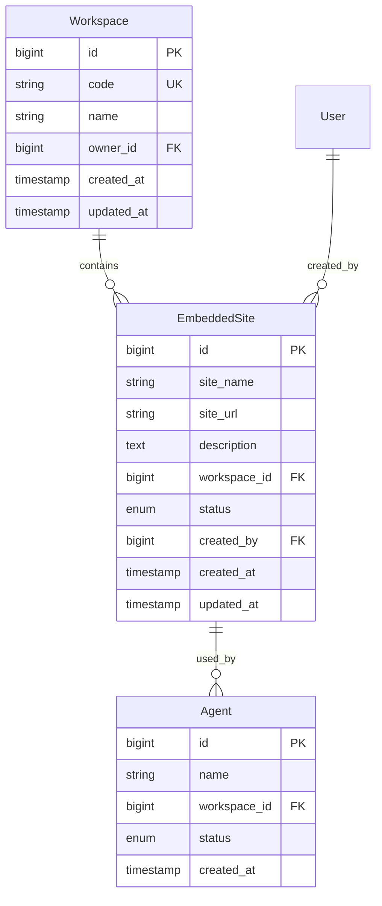
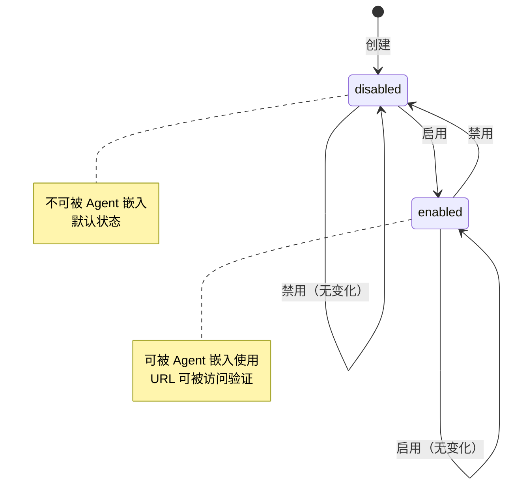

## 1. 概述

本文档描述嵌入网站（Embedded Site）功能的技术设计，包括数据模型、API 设计、状态机实现等。

### 1.1 背景

嵌入网站是指可以被 Agents 嵌入进行学习和操作的外部网站系统。

### 1.2 关联产品文档

- [嵌入网站管理](./embedded-site) - 产品功能概述

---

## 2. 数据模型

### 2.1 实体关系图



### 2.2 EmbeddedSite 表设计

| 字段名       | 类型/格式                  | 约束                              | 说明                   |
| ------------ | -------------------------- | --------------------------------- | ---------------------- |
| `id`         | BIGINT AUTO_INCREMENT      | PK, NOT NULL                      | 主键，唯一标识         |
| `site_name`  | VARCHAR(255)               | NOT NULL, INDEX                   | 网站名称               |
| `site_url`   | VARCHAR(512)               | NOT NULL                          | 网站地址               |
| `description`| TEXT                       | NULL                              | 网站描述               |
| `workspace_id` | BIGINT                    | FK → workspace.id, NOT NULL, INDEX | 关联的 Workspace      |
| `status`     | ENUM('enabled','disabled') | NOT NULL, DEFAULT 'disabled'      | 状态：启用/禁用        |
| `created_by` | BIGINT                     | FK → users.id, NOT NULL           | 创建人                 |
| `created_at` | TIMESTAMP                  | NOT NULL, DEFAULT CURRENT_TIMESTAMP | 创建时间             |
| `updated_at` | TIMESTAMP                  | NOT NULL, DEFAULT CURRENT_TIMESTAMP ON UPDATE CURRENT_TIMESTAMP | 更新时间 |

**索引设计**：

| 索引名                        | 字段           | 类型      | 说明                      |
| ----------------------------- | -------------- | --------- | ------------------------- |
| `idx_es_workspace`           | `workspace_id` | INDEX     | 按 Workspace 快速筛选      |
| `idx_es_site_name`           | `site_name`    | INDEX     | 按网站名称搜索            |
| `idx_es_status`              | `status`       | INDEX     | 按状态筛选                |
| `idx_es_created_by`          | `created_by`   | INDEX     | 按创建人筛选              |

**约束设计**：

| 约束名                | 字段           | 类型       | 说明                        |
| --------------------- | -------------- | ---------- | --------------------------- |
| `uk_es_workspace_name`| `workspace_id, site_name` | UNIQUE | 同一 Workspace 下 site_name 唯一 |

---

## 3. API 设计

### 3.1 API 概览

| 类别 | 方法  | 端点                                              | 说明                     |
| ---- | ----- | ------------------------------------------------- | ------------------------ |
| **列表** | GET   | `/api/v1/workspaces/{workspace_code}/embedded-sites` | 获取 embedded-site 列表 |
| **详情** | GET   | `/api/v1/workspaces/{workspace_code}/embedded-sites/{id}` | 获取单个详情       |
| **创建** | POST  | `/api/v1/workspaces/{workspace_code}/embedded-sites` | 创建新的 embedded-site |
| **更新** | PUT   | `/api/v1/workspaces/{workspace_code}/embedded-sites/{id}` | 更新 embedded-site   |
| **删除** | DELETE | `/api/v1/workspaces/{workspace_code}/embedded-sites/{id}` | 删除 embedded-site    |
| **启用** | PATCH | `/api/v1/workspaces/{workspace_code}/embedded-sites/{id}/enable` | 启用 embedded-site |
| **禁用** | PATCH | `/api/v1/workspaces/{workspace_code}/embedded-sites/{id}/disable` | 禁用 embedded-site |

### 3.2 列表 API

```
GET /api/v1/workspaces/{workspace_code}/embedded-sites
```

**查询参数**：

| 参数          | 类型    | 必填 | 说明                        |
| ------------- | ------- | ---- | --------------------------- |
| `page`        | integer | 否   | 页码，默认 1                |
| `page_size`   | integer | 否   | 每页数量，默认 20           |
| `status`      | string  | 否   | 过滤状态：enabled / disabled |
| `search`      | string  | 否   | 搜索 site_name / site_url   |

**响应**：

```json
{
  "code": 0,
  "message": "ok",
  "data": {
    "items": [
      {
        "id": 1,
        "site_name": "CRM系统",
        "site_url": "https://crm.example.com",
        "description": "客户关系管理系统",
        "workspace_id": 1,
        "status": "enabled",
        "created_by": 1,
        "created_at": "2026-05-29T10:00:00Z",
        "updated_at": "2026-05-29T10:00:00Z"
      }
    ],
    "total": 100,
    "page": 1,
    "page_size": 20,
    "total_pages": 5
  },
  "traceId": "xxx",
  "timestamp": 1716969600000
}
```

### 3.3 创建 API

```
POST /api/v1/workspaces/{workspace_code}/embedded-sites
```

**请求体**：

```json
{
  "site_name": "CRM系统",
  "site_url": "https://crm.example.com",
  "description": "客户关系管理系统"
}
```

**字段验证**：

| 字段       | 规则                                        | 错误信息           |
| ---------- | ------------------------------------------- | ------------------ |
| `site_name` | 必填，最大 255 字符                          | "网站名称不能为空" |
| `site_url`  | 必填，有效 URL 格式，最大 512 字符          | "网站地址格式不正确" |
| `description` | 可选，最大 65535 字符                      | -                  |

**响应**：

```json
{
  "code": 0,
  "message": "ok",
  "data": {
    "id": 1,
    "site_name": "CRM系统",
    "site_url": "https://crm.example.com",
    "description": "客户关系管理系统",
    "workspace_id": 1,
    "status": "disabled",
    "created_by": 1,
    "created_at": "2026-05-29T10:00:00Z",
    "updated_at": "2026-05-29T10:00:00Z"
  },
  "traceId": "xxx",
  "timestamp": 1716969600000
}
```

### 3.4 更新 API

```
PUT /api/v1/workspaces/{workspace_code}/embedded-sites/{id}
```

**请求体**：

```json
{
  "site_name": "CRM系统v2",
  "site_url": "https://crm-v2.example.com",
  "description": "客户关系管理系统v2"
}
```

### 3.5 删除 API

```
DELETE /api/v1/workspaces/{workspace_code}/embedded-sites/{id}
```

**说明**：
- 执行软删除
- 删除前检查是否有关联的 Agent

### 3.6 启用/禁用 API

```
PATCH /api/v1/workspaces/{workspace_code}/embedded-sites/{id}/enable
PATCH /api/v1/workspaces/{workspace_code}/embedded-sites/{id}/disable
```

**响应**：

```json
{
  "code": 0,
  "message": "ok",
  "data": {
    "id": 1,
    "status": "enabled",
    "updated_at": "2026-05-29T10:00:00Z"
  },
  "traceId": "xxx",
  "timestamp": 1716969600000
}
```

---

## 4. 状态机

### 4.1 状态定义

| 状态      | 说明                   | 允许的操作           |
| --------- | ---------------------- | -------------------- |
| `disabled`| 禁用状态（初始状态）  | enable               |
| `enabled` | 启用状态，可被使用     | disable              |

### 4.2 状态流转



### 4.3 状态操作权限

| 操作     | 前置状态 | 后置状态 | 权限要求           |
| -------- | -------- | -------- | ------------------ |
| **创建** | -        | disabled | workspace 成员    |
| **启用** | disabled | enabled  | workspace 管理员   |
| **禁用** | enabled  | disabled | workspace 管理员   |

---

## 5. 验证规则

### 5.1 URL 验证

| 规则                | 说明                                        |
| ------------------ | ------------------------------------------- |
| 有效的 URL 格式    | 必须包含协议 (http:// 或 https://)         |
| URL 长度限制       | 最大 512 字符                               |
| URL 可访问性验证   | 创建/启用时可选择是否验证 URL 可访问        |

### 5.2 业务约束

| 约束                         | 说明                                |
| ---------------------------- | ----------------------------------- |
| 同一 Workspace 下名称唯一     | site_name 在同一 workspace 内唯一    |
| 创建者必须是 Workspace 成员   | created_by 必须是 workspace 的成员   |
| 删除前检查关联               | 有关联 Agent 时不允许删除            |

---

## 6. 错误码设计

| 错误码 | 说明                  | HTTP 状态码 |
| ------ | --------------------- | ----------- |
| 0      | 成功                  | 200         |
| 1001   | 参数验证失败          | 400         |
| 1002   | 未授权                | 401         |
| 1003   | 禁止访问              | 403         |
| 2001   | EmbeddedSite 不存在   | 404         |
| 2002   | EmbeddedSite 名称已存在 | 409        |
| 2003   | 存在关联的 Agent      | 409         |
| 3001   | Workspace 不存在      | 404         |
| 9001   | 服务器内部错误        | 500         |

---

## 🔗 相关文档

- [嵌入网站管理](../../product/workspaces/embedded-site) - 产品功能概述
- [Agent 数据库设计](../agents/agent-database-design) - Agent 实体设计