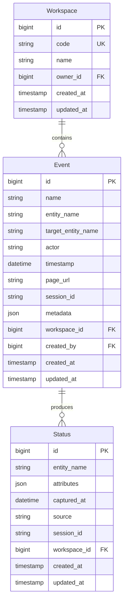

## 1. 概述

本文档描述事件（Event）功能的技术设计，包括数据模型、API 设计等。

### 1.1 背景

事件描述谁在什么时间做了什么，是知识库的基础数据。事件由 sati 等系统自动生成，同时支持用户手动管理。

### 1.2 关联产品文档

- [事件管理](../../product/workspaces/events) - 产品功能概述
- [状态管理](./status) - 状态管理（关联实体）

---

## 2. 数据模型

### 2.1 实体关系图



### 2.2 Event 表设计

| 字段名              | 类型/格式          | 约束                                        | 说明                       |
| ------------------- | ------------------ | ------------------------------------------- | -------------------------- |
| `id`                | BIGINT AUTO_INCREMENT | PK, NOT NULL                              | 主键，唯一标识             |
| `name`              | VARCHAR(255)       | NOT NULL, INDEX                             | 事件名称，如 `lead.assigned` |
| `entity_name`       | VARCHAR(255)       | NOT NULL, INDEX                             | 关联实体（主语），格式 `{type}_{id}` |
| `target_entity_name`| VARCHAR(255)       | NULL                                        | 目标实体（宾语），如 `user_zhangsan` |
| `actor`             | VARCHAR(255)       | NOT NULL, INDEX                             | 触发者，如 `user_john`     |
| `timestamp`         | DATETIME           | NOT NULL, INDEX                             | 事件发生时间               |
| `page_url`          | VARCHAR(512)       | NULL                                        | 页面 URL（来源上下文）     |
| `session_id`        | VARCHAR(64)        | INDEX                                       | 会话 ID                    |
| `metadata`          | JSON               | NULL                                        | 扩展数据                   |
| `workspace_id`      | BIGINT             | FK → workspace.id, NOT NULL, INDEX          | 关联的 Workspace           |
| `created_by`        | BIGINT             | FK → users.id, NOT NULL                      | 创建人                     |
| `created_at`        | TIMESTAMP          | NOT NULL, DEFAULT CURRENT_TIMESTAMP         | 创建时间                   |
| `updated_at`        | TIMESTAMP          | NOT NULL, DEFAULT CURRENT_TIMESTAMP ON UPDATE CURRENT_TIMESTAMP | 更新时间 |

**索引设计**：

| 索引名                  | 字段           | 类型      | 说明                      |
| ----------------------- | -------------- | --------- | ------------------------- |
| `idx_ev_workspace`      | `workspace_id` | INDEX     | 按 Workspace 快速筛选      |
| `idx_ev_name`           | `name`         | INDEX     | 按事件名称搜索            |
| `idx_ev_entity_name`    | `entity_name`  | INDEX     | 按实体名称筛选            |
| `idx_ev_actor`          | `actor`        | INDEX     | 按触发者筛选              |
| `idx_ev_timestamp`      | `timestamp`    | INDEX     | 按时间范围筛选            |
| `idx_ev_session_id`     | `session_id`   | INDEX     | 按会话 ID 筛选            |
| `idx_ev_created_by`       | `created_by`  | INDEX     | 按创建人筛选              |

**约束设计**：

| 约束名                 | 字段                           | 类型     | 说明                     |
| ---------------------- | ------------------------------ | -------- | ------------------------ |
| 无唯一约束             | -                              | -        | 事件允许重复（同一动作多次触发） |

---

## 3. API 设计

### 3.1 API 概览

| 类别   | 方法   | 端点                                              | 说明                     |
| ------ | ------ | ------------------------------------------------- | ------------------------ |
| **列表** | GET   | `/api/v1/workspaces/{workspace_code}/events`      | 获取 event 列表          |
| **详情** | GET   | `/api/v1/workspaces/{workspace_code}/events/{id}` | 获取单个 event 详情      |
| **创建** | POST  | `/api/v1/workspaces/{workspace_code}/events`      | 创建新的 event           |
| **更新** | PUT   | `/api/v1/workspaces/{workspace_code}/events/{id}` | 更新 event               |
| **删除** | DELETE | `/api/v1/workspaces/{workspace_code}/events/{id}` | 删除 event（硬删除）     |

### 3.2 列表 API

```
GET /api/v1/workspaces/{workspace_code}/events
```

**查询参数**：

| 参数          | 类型    | 必填 | 说明                        |
| ------------- | ------- | ---- | --------------------------- |
| `page`        | integer | 否   | 页码，默认 1                |
| `page_size`   | integer | 否   | 每页数量，默认 20，最大 100 |
| `name`        | string  | 否   | 事件名称搜索（模糊匹配）    |
| `entity_name` | string  | 否   | 实体名称搜索（精确匹配）    |
| `actor`       | string  | 否   | 触发者搜索（模糊匹配）      |
| `timestamp_start` | datetime | 否 | 开始时间（ISO 8601 格式） |
| `timestamp_end`   | datetime | 否 | 结束时间（ISO 8601 格式） |

**响应**：

```json
{
  "code": 0,
  "message": "ok",
  "data": {
    "items": [
      {
        "id": 1,
        "name": "lead.assigned",
        "entity_name": "lead_123",
        "target_entity_name": "user_zhangsan",
        "actor": "user_john",
        "timestamp": "2026-06-25T10:00:00Z",
        "page_url": "https://crm.example.com/leads/123",
        "session_id": "sess_abc123",
        "metadata": {"key": "value"},
        "workspace_id": 1,
        "created_by": 1,
        "created_at": "2026-06-25T10:00:00Z",
        "updated_at": "2026-06-25T10:00:00Z"
      }
    ],
    "total": 100,
    "page": 1,
    "page_size": 20,
    "total_pages": 5
  },
  "traceId": "xxx",
  "timestamp": 1716969600000
}
```

### 3.3 创建 API

```
POST /api/v1/workspaces/{workspace_code}/events
```

**请求体**：

```json
{
  "name": "lead.assigned",
  "entity_name": "lead_123",
  "target_entity_name": "user_zhangsan",
  "actor": "user_john",
  "timestamp": "2026-06-25T10:00:00Z",
  "page_url": "https://crm.example.com/leads/123",
  "session_id": "sess_abc123",
  "metadata": {"key": "value"},
  "created_by": 1
}
```

**字段验证**：

| 字段              | 规则                                          | 错误信息           |
| ----------------- | --------------------------------------------- | ------------------ |
| `name`            | 必填，最大 255 字符                            | "事件名称不能为空" |
| `entity_name`     | 必填，最大 255 字符，格式 `{type}_{id}`       | "实体名称格式不正确" |
| `target_entity_name` | 可选，最大 255 字符                        | -                  |
| `actor`           | 必填，最大 255 字符                            | "触发者不能为空"   |
| `timestamp`       | 必填，有效 datetime 格式                       | "时间格式不正确"   |
| `page_url`        | 可选，最大 512 字符，有效 URL 格式            | "页面 URL 格式不正确" |
| `session_id`      | 可选，最大 64 字符                             | -                  |
| `metadata`        | 可选，有效 JSON 对象                           | "元数据格式不正确" |
| `created_by`      | 必填，有效用户 ID                              | "创建人信息不正确" |

**响应**：

```json
{
  "code": 0,
  "message": "ok",
  "data": {
    "id": 1,
    "name": "lead.assigned",
    "entity_name": "lead_123",
    "target_entity_name": "user_zhangsan",
    "actor": "user_john",
    "timestamp": "2026-06-25T10:00:00Z",
    "page_url": "https://crm.example.com/leads/123",
    "session_id": "sess_abc123",
    "metadata": {"key": "value"},
    "workspace_id": 1,
    "created_by": 1,
    "created_at": "2026-06-25T10:00:00Z",
    "updated_at": "2026-06-25T10:00:00Z"
  },
  "traceId": "xxx",
  "timestamp": 1716969600000
}
```

### 3.4 更新 API

```
PUT /api/v1/workspaces/{workspace_code}/events/{id}
```

**请求体**：

```json
{
  "name": "lead.assigned.v2",
  "entity_name": "lead_123",
  "target_entity_name": "user_lisi",
  "actor": "user_john",
  "timestamp": "2026-06-25T11:00:00Z",
  "page_url": "https://crm.example.com/leads/123/edit",
  "session_id": "sess_abc123",
  "metadata": {"key": "updated_value"}
}
```

**说明**：

- 所有字段均可更新
- 字段验证规则同创建 API

### 3.5 删除 API

```
DELETE /api/v1/workspaces/{workspace_code}/events/{id}
```

**说明**：

- 执行硬删除
- 删除后数据不可恢复

**响应**：

```json
{
  "code": 0,
  "message": "ok",
  "data": null,
  "traceId": "xxx",
  "timestamp": 1716969600000
}
```

---

## 4. 业务规则

### 4.1 实体名称格式

| 格式要求 | 说明                              |
| -------- | --------------------------------- |
| 格式     | `{type}_{id}`                     |
| 示例     | `lead_123`, `user_zhangsan`       |
| type     | 小写字母、数字、下划线             |
| id       | 数字或字符串（业务 ID）            |

### 4.2 事件名称命名规范

| 类型     | 格式                    | 示例                |
| -------- | ----------------------- | ------------------- |
| 系统事件 | `{module}.{action}`     | `lead.assigned`     |
| 用户事件 | `{module}.{action}`     | `user.login`        |
| 自定义   | `{prefix}.{description}` | `custom.sync_done` |

### 4.3 数据保留策略

| 策略     | 说明                                           |
| -------- | ---------------------------------------------- |
| 硬删除   | 用户删除后数据立即物理删除，不可恢复           |
| 建议保留 | 重要事件建议通过归档策略处理，而非直接删除     |

---

## 5. 错误码设计

| 错误码 | 说明                  | HTTP 状态码 |
| ------ | --------------------- | ----------- |
| 0      | 成功                  | 200         |
| 1001   | 参数验证失败          | 400         |
| 1002   | 未授权                | 401         |
| 1003   | 禁止访问              | 403         |
| 2001   | Event 不存在          | 404         |
| 3001   | Workspace 不存在      | 404         |
| 3002   | Workspace 无访问权限  | 403         |
| 9001   | 服务器内部错误        | 500         |

---

## 🔗 相关文档

- [事件管理](../../product/workspaces/events) - 产品功能概述
- [状态管理](./status) - 状态管理技术设计
- [状态机设计](../state-machine) - 状态机设计规范
