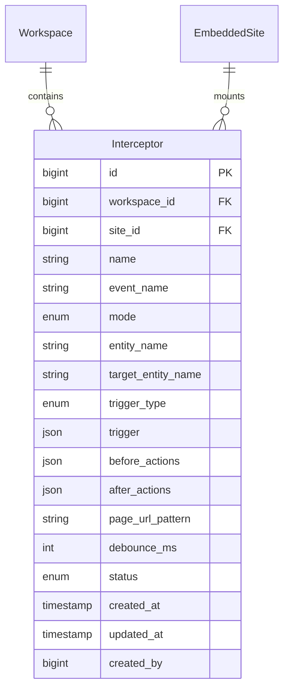
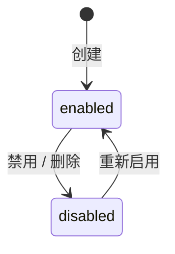

## 1. 概述

本文档描述拦截器(Interceptor)功能的技术设计,包括数据模型、API 设计、状态机、业务规则等。

### 1.1 背景

拦截器是 agent-steer Chrome Extension 在目标页面上"捕获 DOM / 网络事件,触发 before/after action"的规则。管理员在 Neo 前端配置,业务人员打开目标软件时 extension 自动加载并执行。

拦截器的业务执行链路(产品视角)见 [拦截器管理产品文档](../../product/workspaces/interceptor)。拦截器的 API 形态 / 内部架构 / Action 编排见 [Intercept 拦截器技术设计](../agent-steer/interceptor)。

### 1.2 关联产品文档

- [拦截器管理产品文档](../../product/workspaces/interceptor) - 产品功能概述、用户故事、业务流程

---

## 2. 数据模型

### 2.1 实体关系图



### 2.2 字段表

| 字段名 | 类型/格式 | 说明 | 是否可编辑 |
| ------ | --------- | ---- | ---------- |
| id | BIGINT AUTO_INCREMENT | 主键 | 否 |
| workspace_id | BIGINT | FK → workspaces.id | 否 |
| site_id | BIGINT | FK → embedded_sites.id,挂载到哪个网站 | 是 |
| name | VARCHAR(255) | 拦截器名称(业务名,如 "分配线索") | 是 |
| event_name | VARCHAR(255) | 触发后上报的 Event 名(如 `lead.assigned`) | 是 |
| mode | ENUM('observe', 'intercept') | 拦截模式 | 是 |
| entity_name | VARCHAR(255) | 必填,被拦截/操作的实体名(主语) | 是 |
| target_entity_name | VARCHAR(255) | 选填,操作的目标实体名(宾语) | 是 |
| trigger_type | ENUM('dom.click', 'network.fetch', 'network.xhr') | 从 trigger.type 同步,便于按类型查询 | 否(自动同步) |
| trigger | JSON | 完整 trigger 配置,见 §2.3 | 是 |
| before_actions | JSON | before 动作列表(`Action[]`) | 是 |
| after_actions | JSON | after 动作列表(`Action[]`) | 是 |
| page_url_pattern | VARCHAR(512) | 限定生效页面 URL 正则(留空 = 不限) | 是 |
| debounce_ms | INT | 防重入时间(ms),默认 1000 | 是 |
| status | ENUM('enabled', 'disabled') | 软删除状态 | 是 |
| created_at | DATETIME | 创建时间 | 否 |
| updated_at | DATETIME | 更新时间 | 否 |
| created_by | BIGINT | 创建者 user_id | 否 |

### 2.3 trigger 字段格式

`trigger` 是 JSON,跟 [Intercept 拦截器技术设计 §4.3](../agent-steer/interceptor) 对齐:

```json
// dom.click 模式
{ "type": "dom.click", "xpath": "//button[@id='assign']" }

// network.fetch 模式
{ "type": "network.fetch", "urlPattern": "/api/leads/{id}/assign", "method": "POST" }

// network.xhr 模式
{ "type": "network.xhr", "urlPattern": "/api/leads/*", "method": "GET" }
```

`trigger_type` 字段从 `trigger.type` 同步,写 trigger 时由 service 层自动同步。

### 2.4 状态机



**DELETE 软删**:`DELETE` API **不真删**,改为 `status = disabled`,保留记录用于审计和恢复。真要清理由数据保留策略处理。

---

## 3. API 设计

所有 API 走 workspace 维度,前缀 `/workspaces/{workspace_code}/interceptors`。

### 3.1 POST 创建

```
POST /workspaces/{workspace_code}/interceptors
```

**Body**:

| 字段 | 必填 | 说明 |
|------|------|------|
| site_id | ✅ | 挂载到哪个 site |
| name | ✅ | 拦截器名称 |
| event_name | ✅ | 触发后 Event 名 |
| mode | ❌ | 默认 `observe` |
| entity_name | ✅ | 必填 |
| target_entity_name | ❌ | 选填 |
| trigger | ✅ | JSON,见 §2.3 |
| before_actions | ❌ | JSON Action[] |
| after_actions | ❌ | JSON Action[] |
| page_url_pattern | ❌ | 默认 null |
| debounce_ms | ❌ | 默认 1000 |

**响应**:`201 Created` + 完整实体。

### 3.2 GET 列表(extension 主用)

```
GET /workspaces/{workspace_code}/interceptors?site_id={X}&status=enabled&trigger_type=dom.click&page=1&page_size=50
```

**Query 参数**:

| 参数 | 必填 | 说明 |
|------|------|------|
| site_id | ❌ | 按 site 过滤(extension 主用) |
| status | ❌ | `enabled` / `disabled`,默认全部 |
| trigger_type | ❌ | 按 trigger 类型过滤 |
| name | ❌ | 名称模糊搜索 |
| page | ❌ | 默认 1 |
| page_size | ❌ | 默认 50,最大 200 |

**响应**(标准分页格式):

```json
{
  "items": [{ "id": 1, "site_id": 2, "name": "分配线索", ... }],
  "total": 100,
  "page": 1,
  "page_size": 50,
  "total_pages": 2
}
```

### 3.3 GET 详情

```
GET /workspaces/{workspace_code}/interceptors/{id}
```

返回完整实体(含 trigger / before_actions / after_actions JSON)。

### 3.4 PUT 更新

```
PUT /workspaces/{workspace_code}/interceptors/{id}
```

Body 同 POST(全部可编辑字段)。

**业务规则**:`trigger.type` 变更时,自动同步 `trigger_type` 字段。

### 3.5 DELETE 软删

```
DELETE /workspaces/{workspace_code}/interceptors/{id}
```

**不真删**,改为 `status = disabled`。返回 `204 No Content`。

> 重新启用:调 PUT 把 `status` 改回 `enabled`,或前端 UI 提供"启用"按钮。

---

## 4. 业务规则

### 4.1 trigger_type 自动同步

`trigger_type` 字段跟 `trigger.type` 必须保持一致:

- 写入时:由 service 层从 `trigger.type` 提取并写入 `trigger_type`
- 更新 trigger.type 时:自动更新 `trigger_type`
- 不允许直接通过 API 修改 `trigger_type`(字段不可编辑)

### 4.2 DELETE 软删

- `DELETE` 操作改为 `status = disabled`,不真删
- 重新启用:PUT 把 `status` 改回 `enabled`
- 永久删除:数据保留策略(待定)

### 4.3 status 默认值

- 创建时 `status` 默认 `enabled`
- 列表查询默认返回所有 status(可显式过滤 `enabled` 或 `disabled`)

### 4.4 extension 查询场景

extension 加载拦截器时固定调用:

```
GET /workspaces/{code}/interceptors?site_id=X&status=enabled
```

- 必传 `site_id`(extension 已经匹配过 site)
- 必传 `status=enabled`(只拉启用的)
- 不传 `trigger_type`(extension 自己按 trigger.type 路由)

---

## 5. 错误码设计

| 错误码 | HTTP | 触发场景 |
|--------|------|----------|
| `INTERCEPTOR_NOT_FOUND` | 404 | GET/PUT/DELETE 不存在的 ID |
| `INTERCEPTOR_DUPLICATE` | 409 | 同 site + name 重复 |
| `SITE_NOT_FOUND` | 404 | site_id 不存在或不属于当前 workspace |
| `TRIGGER_INVALID` | 400 | trigger JSON 缺 type 或字段类型不对 |
| `ENTITY_NAME_REQUIRED` | 400 | entity_name 为空 |

---

## 🔗 相关文档

- [拦截器管理产品文档](../../product/workspaces/interceptor) - 产品功能概述
- [Intercept 拦截器技术设计](../agent-steer/interceptor) - API 形态、内部架构、Action 编排
- [Action Player 技术设计](../agent-steer/action-player) - before/after action 执行
- [嵌入网站管理技术设计](./embedded-site) - site_id 外键关联
- [事件管理技术设计](./events) - Event 上报接口(after action 用)
- [状态管理技术设计](./status) - Status 上报接口(before/after action 用)
