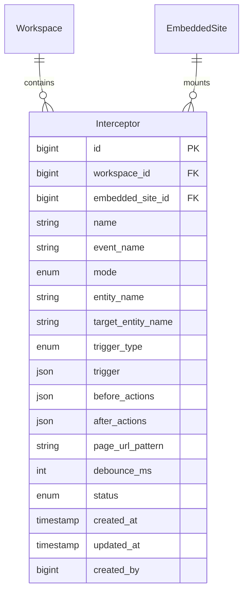
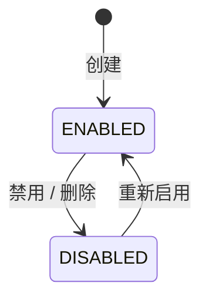

## 1. 概述

本文档描述拦截器(Interceptor)功能的技术设计,包括数据模型、API 设计、状态机、业务规则等。

### 1.1 背景

拦截器是配置在特定网站(EmbeddedSite)上的规则,用于 agent-steer Chrome Extension 在目标页面上捕获事件并触发 action。

> **本期范围**：仅实现拦截器的 CRUD 管理 + API 暴露。Extension 执行、Action Player 等在后续阶段实现。

### 1.2 关联文档

- [拦截器管理产品文档](../../product/workspaces/interceptor) - 产品功能概述、用户故事
- [嵌入网站管理](./embedded-site) - interceptor 绑定的 site
- [事件管理](./events) - interceptor 触发的 Event
- [状态管理](./status) - interceptor 触发的 Status

---

## 2. 数据模型

### 2.1 实体关系图



### 2.2 字段表

| 字段名 | 类型/格式 | 说明 | 是否可编辑 |
| ------ | --------- | ---- | ---------- |
| id | BIGINT AUTO_INCREMENT | 主键 | 否 |
| workspace_id | BIGINT | FK → workspaces.id | 否 |
| embedded_site_id | BIGINT | FK → embedded_sites.id,挂载到哪个网站 | 是 |
| name | VARCHAR(255) | 拦截器名称(如"分配线索确认") | 是 |
| event_name | VARCHAR(255) | 触发后上报的 Event 名(如`lead.assigned`) | 是 |
| mode | ENUM('observe', 'intercept') | 拦截模式 | 是 |
| entity_name | VARCHAR(255) | 必填,被拦截/操作的实体名(主语) | 是 |
| target_entity_name | VARCHAR(255) | 选填,操作的目标实体名(宾语) | 是 |
| trigger_type | ENUM('dom', 'network') | 从 trigger.type 同步,便于按类型查询 | 否(自动同步) |
| trigger | JSON | 完整 trigger 配置,见 §2.3 | 是 |
| before_actions | JSON | before 动作列表(Action[]) | 是 |
| after_actions | JSON | after 动作列表(Action[]) | 是 |
| page_url_pattern | VARCHAR(512) | 限定生效页面 URL 正则(留空=不限) | 是 |
| debounce_ms | INT | 防重入时间(ms),默认 1000 | 是 |
| status | ENUM('ENABLED', 'DISABLED') | 状态 | 是 |
| created_at | DATETIME | 创建时间 | 否 |
| updated_at | DATETIME | 更新时间 | 否 |
| created_by | BIGINT | 创建者 user_id | 否 |

### 2.3 trigger 字段格式

```json
// DOM 模式
{ "type": "dom", "selector": "#assign-btn" }

// Network 模式
{ "type": "network", "urlPattern": "/api/leads/*/assign", "method": "POST" }
```

`trigger_type` 字段从 `trigger.type` 同步,写 trigger 时由 service 层自动同步。

### 2.4 status 状态机



**软删除**:`DELETE` API 改为 `status = DISABLED`,不真删。

---

## 3. API 设计

所有 API 走 workspace 维度,前缀 `/api/v1/workspaces/{workspace_code}/interceptors`。

### 3.1 POST 创建

```
POST /api/v1/workspaces/{workspace_code}/interceptors
```

**Body**:

| 字段 | 必填 | 说明 |
|------|------|------|
| embedded_site_id | ✅ | 挂载到哪个 site |
| name | ✅ | 拦截器名称 |
| event_name | ✅ | 触发后 Event 名 |
| entity_name | ✅ | 必填 |
| target_entity_name | ❌ | 选填 |
| mode | ❌ | 默认 `observe` |
| trigger | ✅ | JSON,见 §2.3 |
| before_actions | ❌ | JSON Action[] |
| after_actions | ❌ | JSON Action[] |
| page_url_pattern | ❌ | 默认 null |
| debounce_ms | ❌ | 默认 1000 |

**响应**:`201 Created` + InterceptorResponse

### 3.2 GET 列表

```
GET /api/v1/workspaces/{workspace_code}/interceptors?embedded_site_id={X}&status=ENABLED&page=1&page_size=50
```

**Query 参数**:

| 参数 | 必填 | 说明 |
|------|------|------|
| embedded_site_id | ❌ | 按 site 过滤 |
| status | ❌ | `ENABLED` / `DISABLED`,默认全部 |
| name | ❌ | 名称模糊搜索 |
| page | ❌ | 默认 1 |
| page_size | ❌ | 默认 50,最大 200 |

**响应** (标准分页格式):

```json
{
  "code": 0,
  "message": "ok",
  "data": {
    "items": [{ "id": 1, "embedded_site_id": 2, "name": "分配线索", ... }],
    "total": 100,
    "page": 1,
    "page_size": 50
  },
  "traceId": "abc-123",
  "timestamp": 1713700000000
}
```

### 3.3 GET 详情

```
GET /api/v1/workspaces/{workspace_code}/interceptors/{id}
```

**响应**: InterceptorResponse (完整实体)

### 3.4 PUT 更新

```
PUT /api/v1/workspaces/{workspace_code}/interceptors/{id}
```

Body 同 POST。`trigger.type` 变更时自动同步 `trigger_type` 字段。

### 3.5 DELETE 软删

```
DELETE /api/v1/workspaces/{workspace_code}/interceptors/{id}
```

改为 `status = DISABLED`。返回 `204 No Content`。

### 3.6 POST 启用/禁用

```
POST /api/v1/workspaces/{workspace_code}/interceptors/{id}/enable
POST /api/v1/workspaces/{workspace_code}/interceptors/{id}/disable
```

---

## 4. 业务规则

| 规则 | 说明 |
|------|------|
| 创建时 status 默认 `ENABLED` | 新拦截器默认启用 |
| trigger_type 自动同步 | 从 trigger.type 提取并写入 trigger_type |
| DELETE 软删 | 改为 status = DISABLED |
| embedded_site_id 必填 | 拦截器必须绑定到某个 site |

---

## 5. 错误码

| 错误码 | HTTP | 触发场景 |
|--------|------|----------|
| `INTERCEPTOR_NOT_FOUND` | 404 | ID 不存在 |
| `EMBEDDED_SITE_NOT_FOUND` | 404 | embedded_site_id 不存在 |
| `TRIGGER_INVALID` | 400 | trigger JSON 格式错误 |
| `ENTITY_NAME_REQUIRED` | 400 | entity_name 为空 |

---

## 6. Schema 定义

### InterceptorResponse

```json
{
  "id": 1,
  "workspace_id": 1,
  "embedded_site_id": 2,
  "name": "分配线索确认",
  "event_name": "lead.assigned",
  "mode": "observe",
  "entity_name": "lead",
  "target_entity_name": "user",
  "trigger_type": "dom",
  "trigger": { "type": "dom", "selector": "#assign-btn" },
  "before_actions": [],
  "after_actions": [{ "type": "collect_event", "config": { "actor": "{{actor}}", "metadata": {} } }],
  "page_url_pattern": "https://crm.example.com/leads/*",
  "debounce_ms": 1000,
  "status": "ENABLED",
  "created_at": "2026-06-28T10:00:00Z",
  "updated_at": "2026-06-28T10:00:00Z",
  "created_by": 1
}
```

### Action 类型 (定义,未来扩展)

```json
{ "type": "collect_event", "config": { "actor": "...", "metadata": {} } }
{ "type": "collect_status", "config": { "entity_name": "...", "attributes": {} } }
{ "type": "call_agent", "config": { "endpoint": "...", "timeoutMs": 30000 } }
{ "type": "show_confirm", "config": { "title": "...", "body": "..." } }
```
