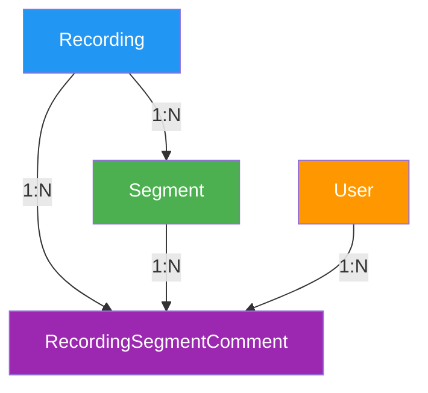

## 1. 概述

### 1.1 背景

在录像回放场景下，用户希望对录像片段（segment）的某个时段添加说明性标注，用于：

- 解释某步骤的决策依据（如用户画像时"为什么选择该人群"）
- 标记关键节点 / 错误操作
- 帮助其他回放者理解录像内容

当回放播放到标注的 `[show_time, hide_time]` 区间内时，画布气泡浮现并高亮侧栏对应列表项；走出区间则隐藏。

### 1.2 设计原则

1. **松耦合**：标注作为独立的资源（`recording-segment-comment`），通过 `recording_id` + `segment_id` 与现有 Recording/Segment 关联，不侵入原有数据模型
2. **时序一致性**：标注时间使用**相对 segment 起点的偏移秒数（浮点）**，便于跨片段迁移、未来拼接合并
3. **权限继承**：标注继承 Workspace 权限（Viewer 只读，Editor 创建 / 编辑自己的，Owner 全权）
4. **作者可改可删**：标注的编辑/删除权限与 `creator_id` 强绑定，避免误改他人标注

### 1.3 关联产品文档

- [Recording 产品设计 - 7. 标注](../../product/workspaces/recording#7-标注) - 产品功能概述、线框图

### 1.4 术语

| 术语 | 含义 |
|------|------|
| Recording | 录像，由一个或多个 Segment 组成 |
| Segment | 录像片段，对应一个独立的 rrweb 文件 |
| Comment（标注） | 附着在 Segment 某个时段上的说明性卡片 |
| `show_time` / `hide_time` | 标注的展示/隐藏时间，相对 Segment 起点的偏移（秒） |

---

## 2. 数据模型

### 2.1 实体关系图



> **关键关系**：
>
> - `Comment` 既属于 `Recording`（用于权限校验、级联删除），也属于 `Segment`（用于加载该 segment 的标注列表）
> - 删除 `Recording` 时级联删除所有 `Comment`（与 Segment 相同的级联策略）

### 2.2 `recording_segment_comment` 表设计

| 字段           | 类型/格式                       | 约束                                              | 说明                          |
| -------------- | ------------------------------ | ------------------------------------------------- | ----------------------------- |
| `id`           | BIGINT AUTO_INCREMENT          | PK, NOT NULL                                       | 主键                          |
| `uid`          | VARCHAR(36)                    | UK, NOT NULL                                       | UUID，用于外部引用            |
| `recording_id` | INT                            | FK → recording.id, NOT NULL, INDEX                | 所属 Recording                |
| `segment_id`   | BIGINT                         | FK → segment.id, NOT NULL, INDEX                  | 所属 Segment                  |
| `show_time`    | DECIMAL(10,3)                  | NOT NULL, CHECK (show_time >= 0)                  | 展示时间（秒，相对 segment 起点） |
| `hide_time`    | DECIMAL(10,3)                  | NOT NULL, CHECK (hide_time > show_time)           | 隐藏时间（秒，相对 segment 起点） |
| `abstract`     | VARCHAR(255)                   | NOT NULL                                           | 摘要（≤255 字符，列表/气泡标题）|
| `content`      | TEXT                           | NULL                                               | 详情（选填，完整说明）        |
| `creator_id`   | INT                            | FK → users.id, NOT NULL, INDEX                    | 创建人                        |
| `created_at`   | TIMESTAMP                      | NOT NULL, DEFAULT CURRENT_TIMESTAMP                | 创建时间                      |
| `updated_at`   | TIMESTAMP                      | NOT NULL, DEFAULT CURRENT_TIMESTAMP ON UPDATE CURRENT_TIMESTAMP | 更新时间 |

**索引设计**：

| 索引名                                | 字段                          | 类型     | 说明                              |
| ------------------------------------- | ----------------------------- | -------- | --------------------------------- |
| `uk_recording_segment_comment_uid`    | `uid`                         | UNIQUE   | 按 UID 快速查找                   |
| `idx_recording_segment_comment_seg`   | `segment_id`, `show_time`    | INDEX    | 按 segment 查 + 按时间排序（核心查询路径）|
| `idx_recording_segment_comment_rec`   | `recording_id`                | INDEX    | 按 Recording 筛选、级联删除       |
| `idx_recording_segment_comment_creator` | `creator_id`                | INDEX    | 按创建人筛选                      |

**约束设计**：

| 约束名                                       | 字段                | 类型         | 说明                          |
| -------------------------------------------- | ------------------- | ------------ | ----------------------------- |
| `fk_recording_segment_comment_recording`     | `recording_id`      | FOREIGN KEY  | 关联 Recording                |
| `fk_recording_segment_comment_segment`       | `segment_id`        | FOREIGN KEY  | 关联 Segment                  |
| `fk_recording_segment_comment_creator`       | `creator_id`        | FOREIGN KEY  | 关联创建用户                  |
| `chk_recording_segment_comment_time_range`   | `hide_time > show_time` | CHECK     | 保证时段合法                  |

**删除策略**：

- `recording_id` 和 `segment_id` 使用 `ON DELETE CASCADE`，删除 Recording 时级联删除标注
- `creator_id` 使用 `ON DELETE RESTRICT`，防止误删用户导致标注丢失

---

## 3. API 设计

### 3.1 API 概览

| 类别       | 方法   | 端点                                                                                       | 说明                       |
| ---------- | ------ | ------------------------------------------------------------------------------------------ | -------------------------- |
| **创建**   | POST   | `/api/v1/workspaces/{workspace_code}/recordings/{recordingUid}/segment-comments`         | 创建标注                   |
| **列表**   | GET    | `/api/v1/workspaces/{workspace_code}/recordings/{recordingUid}/segment-comments`         | 获取某录像的所有标注       |
| **列表**   | GET    | `/api/v1/workspaces/{workspace_code}/recordings/{recordingUid}/segments/{segmentUid}/comments` | 获取某 segment 的标注 |
| **更新**   | PUT    | `/api/v1/workspaces/{workspace_code}/recordings/{recordingUid}/segment-comments/{commentUid}` | 更新标注               |
| **删除**   | DELETE | `/api/v1/workspaces/{workspace_code}/recordings/{recordingUid}/segment-comments/{commentUid}` | 删除标注               |
| **批量删除**| DELETE | `/api/v1/workspaces/{workspace_code}/recordings/{recordingUid}/segment-comments/batch`     | 批量删除标注               |

### 3.2 标准响应结构

```json
{
  "code": 0,
  "message": "ok",
  "data": {},
  "traceId": "abc-123",
  "timestamp": 1716969600000
}
```

### 3.3 API 详细设计

#### 3.3.1 创建标注

```
POST /api/v1/workspaces/{workspace_code}/recordings/{recordingUid}/segment-comments
```

**Request Body**：

```json
{
  "segment_uid": "seg-abc123",
  "show_time": 12.5,
  "hide_time": 27.5,
  "abstract": "为什么选择这群人？",
  "content": "此处详细说明选择逻辑..."
}
```

| 字段         | 类型    | 必填 | 说明                                       |
| ------------ | ------- | ---- | ------------------------------------------ |
| `segment_uid`| string  | 是   | Segment UID                                |
| `show_time`  | float   | 是   | 展示时间（秒，相对 segment 起点，≥0）     |
| `hide_time`  | float   | 是   | 隐藏时间（秒，必须 > show_time）          |
| `abstract`   | string  | 是   | 摘要（≤255 字符）                          |
| `content`    | string  | 否   | 详情（≤5000 字符，建议）                  |

**成功响应**：

```json
{
  "code": 0,
  "message": "ok",
  "data": {
    "uid": "cmt-xyz789",
    "recording_uid": "rec-abc123",
    "segment_uid": "seg-abc123",
    "show_time": 12.5,
    "hide_time": 27.5,
    "abstract": "为什么选择这群人？",
    "content": "此处详细说明选择逻辑...",
    "creator": {
      "id": 42,
      "name": "张三"
    },
    "created_at": "2026-06-19T14:23:00Z",
    "updated_at": "2026-06-19T14:23:00Z"
  },
  "traceId": "abc-123",
  "timestamp": 1716969600000
}
```

**权限要求**：Editor 及以上。

#### 3.3.2 获取录像的所有标注

```
GET /api/v1/workspaces/{workspace_code}/recordings/{recordingUid}/segment-comments
```

**Query 参数**：

| 参数     | 类型     | 必填 | 说明                                       |
| -------- | -------- | ---- | ------------------------------------------ |
| `segment_uid` | string | 否   | 限定到某个 segment                         |
| `creator_id`  | int   | 否   | 仅返回指定创建人的标注                     |
| `sort`   | string   | 否   | 排序字段：`show_time` / `created_at`（默认 `show_time`）|
| `order`  | string   | 否   | 排序方向：`asc` / `desc`（默认 `asc`）     |
| `page`   | int      | 否   | 页码（默认 1）                             |
| `size`   | int      | 否   | 每页数量（默认 50，最大 200）              |

> **性能注意**：通常前端一次性加载整个录像的所有标注（一般 < 100 条），不需要分页；分页是为未来大体量录像预留。

**成功响应**：

```json
{
  "code": 0,
  "message": "ok",
  "data": {
    "items": [
      {
        "uid": "cmt-xyz789",
        "recording_uid": "rec-abc123",
        "segment_uid": "seg-abc123",
        "show_time": 12.5,
        "hide_time": 27.5,
        "abstract": "为什么选择这群人？",
        "content": "...",
        "creator": { "id": 42, "name": "张三" },
        "created_at": "2026-06-19T14:23:00Z",
        "updated_at": "2026-06-19T14:23:00Z"
      }
    ],
    "pagination": {
      "page": 1,
      "size": 50,
      "total": 4,
      "total_pages": 1
    }
  },
  "traceId": "abc-123",
  "timestamp": 1716969600000
}
```

#### 3.3.3 获取某 Segment 的标注列表（侧栏快捷查询）

```
GET /api/v1/workspaces/{workspace_code}/recordings/{recordingUid}/segments/{segmentUid}/comments
```

**Query 参数**：

| 参数   | 类型   | 必填 | 说明                                       |
| ------ | ------ | ---- | ------------------------------------------ |
| `sort` | string | 否   | 排序字段：`show_time` / `created_at`（默认 `show_time`）|
| `order`| string | 否   | 排序方向：`asc` / `desc`（默认 `asc`）     |

**成功响应**：同 3.3.2，但 `data` 直接为数组（不分页，单个 segment 标注数量极少）。

```json
{
  "code": 0,
  "message": "ok",
  "data": [
    {
      "uid": "cmt-xyz789",
      "segment_uid": "seg-abc123",
      "show_time": 12.5,
      "hide_time": 27.5,
      "abstract": "为什么选择这群人？",
      "creator": { "id": 42, "name": "张三" },
      "created_at": "2026-06-19T14:23:00Z"
    }
  ],
  "traceId": "abc-123",
  "timestamp": 1716969600000
}
```

#### 3.3.4 更新标注

```
PUT /api/v1/workspaces/{workspace_code}/recordings/{recordingUid}/segment-comments/{commentUid}
```

**Request Body**（所有字段可选，但至少传一个）：

```json
{
  "show_time": 10.0,
  "hide_time": 25.0,
  "abstract": "更新后的摘要",
  "content": "更新后的详情"
}
```

**成功响应**：同 3.3.1。

**权限要求**：

- 创建者本人：可编辑全部字段
- Owner：可编辑全部字段
- 其他用户：拒绝（403）

#### 3.3.5 删除标注

```
DELETE /api/v1/workspaces/{workspace_code}/recordings/{recordingUid}/segment-comments/{commentUid}
```

**成功响应**：

```json
{
  "code": 0,
  "message": "ok",
  "data": null,
  "traceId": "abc-123",
  "timestamp": 1716969600000
}
```

**权限要求**：

- 创建者本人：可删除
- Owner：可删除
- 其他用户：拒绝（403）

#### 3.3.6 批量删除标注

```
DELETE /api/v1/workspaces/{workspace_code}/recordings/{recordingUid}/segment-comments/batch
```

**Request Body**：

```json
{
  "comment_uids": ["cmt-xyz789", "cmt-abc456"]
}
```

**成功响应**：

```json
{
  "code": 0,
  "message": "ok",
  "data": {
    "deleted_count": 2
  },
  "traceId": "abc-123",
  "timestamp": 1716969600000
}
```

**权限要求**：同 3.3.5（逐条校验 creator_id，失败的标注跳过并返回失败列表）。

### 3.4 错误码补充

在 [recording.md 错误码设计](./recording#44-错误码设计) 基础上新增：

| 错误码 | 说明                              |
| ------ | --------------------------------- |
| 0      | OK                                |
| 1001   | Invalid Parameter                 |
| 1002   | Unauthorized                      |
| 1003   | Forbidden（无权操作他人标注）     |
| 2001   | Recording Not Found               |
| 2003   | Segment Not Found                 |
| 2010   | Segment Comment Not Found         |
| 2011   | Invalid Time Range（hide_time ≤ show_time）|
| 2012   | Abstract Too Long（>255 字符）    |
| 9001   | Internal Server Error             |

---

## 4. 前端状态管理

### 4.1 状态结构

标注相关的状态并入现有 `RecordingState`，新增 `comments` 子树：

```typescript
interface RecordingState {
  // ... 现有字段
  comments: {
    /** 当前录像下所有标注，按 segment_uid 分组缓存 */
    bySegment: Record<string, SegmentComment[]>;
    /** 当前回放 active 的标注 ID 集合（currentTime 落在 [show, hide] 内的）*/
    activeIds: Set<string>;
    /** 侧栏 hover / 跳转时的临时选中 ID */
    highlightedId: string | null;
    /** 当前打开的弹窗模式 */
    dialog: {
      mode: 'closed' | 'create' | 'edit';
      commentUid?: string;
      segmentUid: string;
      defaultShowTime: number;
      defaultHideTime: number;
    };
  };
}

interface SegmentComment {
  uid: string;
  recordingUid: string;
  segmentUid: string;
  showTime: number;
  hideTime: number;
  abstract: string;
  content: string | null;
  creator: { id: number; name: string };
  createdAt: string;
  updatedAt: string;
}
```

### 4.2 API 调用封装

```typescript
// frontend/lib/api/recording-comment.ts
import { request } from '@/lib/request';

export const recordingCommentApi = {
  /** 创建标注 */
  create: (
    workspaceCode: string,
    recordingUid: string,
    data: {
      segment_uid: string;
      show_time: number;
      hide_time: number;
      abstract: string;
      content?: string;
    }
  ) =>
    request.post<SegmentComment>(
      `/api/v1/workspaces/${workspaceCode}/recordings/${recordingUid}/segment-comments`,
      data
    ),

  /** 获取录像的所有标注 */
  listByRecording: (
    workspaceCode: string,
    recordingUid: string,
    params?: { segment_uid?: string; creator_id?: number; sort?: string; order?: string; page?: number; size?: number }
  ) =>
    request.get<{ items: SegmentComment[]; pagination: Pagination }>(
      `/api/v1/workspaces/${workspaceCode}/recordings/${recordingUid}/segment-comments`,
      { params }
    ),

  /** 获取某 segment 的标注列表 */
  listBySegment: (
    workspaceCode: string,
    recordingUid: string,
    segmentUid: string
  ) =>
    request.get<SegmentComment[]>(
      `/api/v1/workspaces/${workspaceCode}/recordings/${recordingUid}/segments/${segmentUid}/comments`
    ),

  /** 更新标注 */
  update: (
    workspaceCode: string,
    recordingUid: string,
    commentUid: string,
    data: Partial<Pick<SegmentComment, 'showTime' | 'hideTime' | 'abstract' | 'content'>>
  ) =>
    request.put<SegmentComment>(
      `/api/v1/workspaces/${workspaceCode}/recordings/${recordingUid}/segment-comments/${commentUid}`,
      data
    ),

  /** 删除标注 */
  delete: (workspaceCode: string, recordingUid: string, commentUid: string) =>
    request.delete(
      `/api/v1/workspaces/${workspaceCode}/recordings/${recordingUid}/segment-comments/${commentUid}`
    ),

  /** 批量删除标注 */
  batchDelete: (
    workspaceCode: string,
    recordingUid: string,
    commentUids: string[]
  ) =>
    request.delete<{ deleted_count: number }>(
      `/api/v1/workspaces/${workspaceCode}/recordings/${recordingUid}/segment-comments/batch`,
      { data: { comment_uids: commentUids } }
    ),
};
```

### 4.3 播放联动逻辑

在播放组件中订阅 `currentTime`，计算当前 active 的标注集合：

```typescript
// frontend/app/workspace/[code]/agent-steer/recording/play/page.tsx
const activeIds = useMemo(() => {
  const ids = new Set<string>();
  for (const cmt of currentSegmentComments) {
    if (currentTime >= cmt.showTime && currentTime <= cmt.hideTime) {
      ids.add(cmt.uid);
    }
  }
  return ids;
}, [currentTime, currentSegmentComments]);
```

> **性能优化**：`currentSegmentComments` 只在 segment 切换时变更，播放期间稳定。
> `currentTime` 由 rrweb-player 提供，建议使用 `requestAnimationFrame` 节流到 ~10fps 触发状态更新。

---

## 5. 数据库 DDL

### 5.1 `recording_segment_comment` 表

```sql
CREATE TABLE `recording_segment_comment` (
  `id` BIGINT AUTO_INCREMENT PRIMARY KEY,
  `uid` VARCHAR(36) NOT NULL,
  `recording_id` INT NOT NULL,
  `segment_id` BIGINT NOT NULL,
  `show_time` DECIMAL(10,3) NOT NULL,
  `hide_time` DECIMAL(10,3) NOT NULL,
  `abstract` VARCHAR(255) NOT NULL,
  `content` TEXT NULL,
  `creator_id` INT NOT NULL,
  `created_at` TIMESTAMP NOT NULL DEFAULT CURRENT_TIMESTAMP,
  `updated_at` TIMESTAMP NOT NULL DEFAULT CURRENT_TIMESTAMP ON UPDATE CURRENT_TIMESTAMP,

  UNIQUE KEY `uk_recording_segment_comment_uid` (`uid`),
  INDEX `idx_recording_segment_comment_seg` (`segment_id`, `show_time`),
  INDEX `idx_recording_segment_comment_rec` (`recording_id`),
  INDEX `idx_recording_segment_comment_creator` (`creator_id`),

  CONSTRAINT `fk_recording_segment_comment_recording`
    FOREIGN KEY (`recording_id`) REFERENCES `recording` (`id`) ON DELETE CASCADE,
  CONSTRAINT `fk_recording_segment_comment_segment`
    FOREIGN KEY (`segment_id`) REFERENCES `segment` (`id`) ON DELETE CASCADE,
  CONSTRAINT `fk_recording_segment_comment_creator`
    FOREIGN KEY (`creator_id`) REFERENCES `users` (`id`),
  CONSTRAINT `chk_recording_segment_comment_time_range`
    CHECK (`hide_time` > `show_time`),
  CONSTRAINT `chk_recording_segment_comment_show_time_non_negative`
    CHECK (`show_time` >= 0)
) ENGINE=InnoDB DEFAULT CHARSET=utf8mb4 COLLATE=utf8mb4_unicode_ci;
```

### 5.2 Alembic 迁移脚本要点

```python
# alembic/versions/2026_06_19_create_recording_segment_comment_table.py
"""create recording_segment_comment table

Revision ID: xxxx
Revises: <recording_and_segment_tables_revision>
Create Date: 2026-06-19
"""

def upgrade() -> None:
    op.create_table(
        "recording_segment_comment",
        sa.Column("id", sa.BigInteger, primary_key=True, autoincrement=True),
        sa.Column("uid", sa.String(36), nullable=False, unique=True),
        sa.Column("recording_id", sa.Integer, nullable=False),
        sa.Column("segment_id", sa.BigInteger, nullable=False),
        sa.Column("show_time", sa.Numeric(10, 3), nullable=False),
        sa.Column("hide_time", sa.Numeric(10, 3), nullable=False),
        sa.Column("abstract", sa.String(255), nullable=False),
        sa.Column("content", sa.Text, nullable=True),
        sa.Column("creator_id", sa.Integer, nullable=False),
        sa.Column("created_at", sa.TIMESTAMP, server_default=sa.func.current_timestamp(), nullable=False),
        sa.Column(
            "updated_at",
            sa.TIMESTAMP,
            server_default=sa.func.current_timestamp(),
            onupdate=sa.func.current_timestamp(),
            nullable=False,
        ),
        sa.ForeignKeyConstraint(
            ["recording_id"], ["recording.id"],
            ondelete="CASCADE", name="fk_recording_segment_comment_recording",
        ),
        sa.ForeignKeyConstraint(
            ["segment_id"], ["segment.id"],
            ondelete="CASCADE", name="fk_recording_segment_comment_segment",
        ),
        sa.ForeignKeyConstraint(
            ["creator_id"], ["users.id"],
            name="fk_recording_segment_comment_creator",
        ),
        sa.CheckConstraint("hide_time > show_time", name="chk_recording_segment_comment_time_range"),
        sa.CheckConstraint("show_time >= 0", name="chk_recording_segment_comment_show_time_non_negative"),
    )

    op.create_index(
        "idx_recording_segment_comment_seg", "recording_segment_comment",
        ["segment_id", "show_time"],
    )
    op.create_index(
        "idx_recording_segment_comment_rec", "recording_segment_comment", ["recording_id"],
    )
    op.create_index(
        "idx_recording_segment_comment_creator", "recording_segment_comment", ["creator_id"],
    )


def downgrade() -> None:
    op.drop_table("recording_segment_comment")
```

---

## 6. 待确认问题

1. **content 字段长度上限**：是否需要限制？建议 ≤5000 字符，过长建议拆到独立的 `comment_revision` 表做版本管理
2. **标注编辑历史**：是否需要保留编辑轨迹？当前设计只保留最新版本
3. **跨 segment 标注**：是否允许一个标注跨越多个 segment？当前设计强制标注必须归属单个 segment
4. **标注互动**：是否需要支持 @提及、点赞、回复？当前未涉及
5. **批量删除失败处理**：当前策略是"逐条校验失败的跳过并返回失败列表"，是否改为"全部成功才提交"
6. **show_time 精度**：当前使用 `DECIMAL(10,3)`（毫秒级），rrweb 是否提供毫秒级时间戳？需要前端确认
