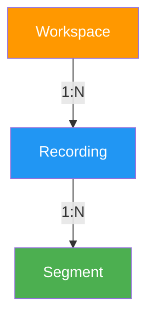

## 1. 概述

### 1.1 背景

Recording 是 Workspace 下的录像资源，用于存储用户在浏览器中的操作录制数据（rrweb 格式）。

### 1.2 设计原则

**松耦合设计**：录像管理作为一个独立的服务/模块存在，Agent Steer 只是通过 API 调用来创建和管理录像。这种设计允许：

1. **多来源录入**：除了 Agent Steer 录制，用户也可以手工上传录像文件
2. **独立演进**：录像管理功能可以独立于 Agent Steer 开发和迭代
3. **统一管理**：所有录像（无论来源）都通过统一的 API 进行管理

### 1.3 关联产品文档

- [Recording 产品设计](../../product/workspaces/recording) - 产品功能概述

---

## 2. 数据模型

### 2.1 实体关系图



### 2.2 Recording 表设计

| 字段            | 类型/格式                    | 约束                          | 说明                     |
| --------------- | --------------------------- | ----------------------------- | ------------------------ |
| `id`            | INT AUTO_INCREMENT          | PK, NOT NULL                  | 主键，唯一标识           |
| `uid`           | VARCHAR(36)                 | UK, NOT NULL, INDEX           | UUID，用于外部引用       |
| `workspace_id`  | INT                         | FK → workspace.id, NOT NULL, INDEX | 所属 Workspace         |
| `name`          | VARCHAR(128)                | NOT NULL                      | 录像名称                 |
| `tags`          | JSON                        | NOT NULL, DEFAULT '[]'        | 标签列表                 |
| `status`        | ENUM                       | NOT NULL, DEFAULT 'recording' | 状态：recording/completed/failed |
| `enter_url`     | VARCHAR(2048)              | NULL                          | 进入 URL                 |
| `exit_url`      | VARCHAR(2048)              | NULL                          | 退出 URL                 |
| `total_duration` | INT UNSIGNED              | NOT NULL, DEFAULT 0           | 总时长（秒）             |
| `total_size`    | BIGINT UNSIGNED            | NOT NULL, DEFAULT 0           | 总大小（字节）           |
| `source`        | ENUM                       | NOT NULL, DEFAULT 'agent'     | 来源：agent/upload       |
| `created_by`    | INT                        | FK → users.id, NOT NULL       | 创建人                   |
| `created_at`    | TIMESTAMP                  | NOT NULL                      | 创建时间                 |
| `updated_at`    | TIMESTAMP                  | NOT NULL                      | 更新时间                 |

**索引设计**：

| 索引名                       | 字段           | 类型     | 说明                   |
| ---------------------------- | -------------- | -------- | ---------------------- |
| `idx_recording_uid`          | `uid`          | UNIQUE   | 按 UID 快速查找        |
| `idx_recording_workspace`    | `workspace_id` | INDEX    | 按 Workspace 筛选      |
| `idx_recording_status`      | `status`       | INDEX    | 按状态筛选             |
| `idx_recording_created_at`   | `created_at`   | INDEX    | 按创建时间排序/筛选    |
| `idx_recording_name`         | `name`         | INDEX    | 按名称搜索             |

**约束设计**：

| 约束名                     | 字段                  | 类型       | 说明                    |
| -------------------------- | --------------------- | ---------- | ----------------------- |
| `fk_recording_workspace`   | `workspace_id`       | FOREIGN KEY| 关联 Workspace          |
| `fk_recording_creator`     | `created_by`         | FOREIGN KEY| 关联创建用户            |

### 2.3 Segment 表设计

| 字段           | 类型/格式                    | 约束                          | 说明                     |
| -------------- | --------------------------- | ----------------------------- | ------------------------ |
| `id`           | INT AUTO_INCREMENT          | PK, NOT NULL                  | 主键，唯一标识           |
| `uid`          | VARCHAR(36)                 | UK, NOT NULL                  | UUID，用于外部引用       |
| `recording_id` | INT                         | FK → recording.id, NOT NULL, INDEX | 所属 Recording       |
| `sequence`     | INT UNSIGNED               | NOT NULL                      | 段序号（从1开始）        |
| `start_time`   | TIMESTAMP                  | NOT NULL                      | 段开始时间               |
| `end_time`     | TIMESTAMP                  | NULL                          | 段结束时间               |
| `page_urls`    | JSON                       | NOT NULL, DEFAULT '[]'        | 该段涉及的页面 URL 列表  |
| `storage_key`  | VARCHAR(512)               | NOT NULL                      | S3 存储路径              |
| `size`         | BIGINT UNSIGNED            | NOT NULL, DEFAULT 0           | 文件大小（字节）         |
| `created_at`   | TIMESTAMP                  | NOT NULL                      | 创建时间                 |

**索引设计**：

| 索引名                     | 字段           | 类型     | 说明                   |
| -------------------------- | -------------- | -------- | ---------------------- |
| `idx_segment_recording`    | `recording_id` | INDEX    | 按 Recording 筛选     |
| `idx_segment_sequence`     | `recording_id, sequence` | UNIQUE | 确保段序号唯一       |

**约束设计**：

| 约束名                     | 字段                  | 类型       | 说明                    |
| -------------------------- | --------------------- | ---------- | ----------------------- |
| `fk_segment_recording`     | `recording_id`       | FOREIGN KEY| 关联 Recording          |

---

## 3. 存储方案

### 3.1 S3 存储结构

按 `s3 使用规范`，存储目录遵循 `neo/workspace_{code}/recording/` 三层结构，内部按 `recording_id` 和 `segment_uid` 进一步细分：

```
neo/
└── workspace_{workspace_code}/
    └── recording/
        └── {recording_id}/
            └── {segment_uid}.rrweb.json
```

**示例**（workspace_code 为 `wsp_demo`，recording_id 为 `456`）：

```
neo/
└── workspace_wsp_demo/
    └── recording/
        └── 456/
            ├── segment-abc123.rrweb.json
            ├── segment-def456.rrweb.json
            └── segment-ghi789.rrweb.json
```

### 3.2 上传流程

#### 3.2.1 Agent Steer 录制场景

```
1. Agent Steer 开始录制
   → 调用 POST /api/v1/workspaces/{code}/recordings 创建 Recording
   → 返回 recordingUid

2. 每 10 分钟自动生成新 Segment
   → 调用 POST /api/v1/recordings/{uid}/segments 上传 Segment
   → 返回 segmentUid + storage_key

3. Agent Steer 停止录制
   → 调用 PATCH /api/v1/recordings/{uid} 更新 status=completed
   → 更新 total_duration, exit_url 等字段
```

#### 3.2.2 手工上传场景

```
1. 用户选择要上传的 rrweb 文件
2. 前端创建 Recording（source='upload'）
3. 前端上传文件到 Presigned URL
4. 前端创建 Segment 记录
5. 重复步骤 2-4 上传多个文件
6. 前端更新 Recording 完成状态
```

### 3.3 存储操作

#### 获取上传 Presigned URL

```
POST /api/v1/recordings/{uid}/segments/presigned
Request: { "filename": "segment-001.rrweb.json", "content_type": "application/json" }
Response: { "upload_url": "https://s3...", "storage_key": "neo/workspace_wsp_demo/recording/456/segment-001.rrweb.json" }
```

#### 获取下载 Presigned URL

```
GET /api/v1/recordings/{uid}/segments/{segmentUid}/download-url
Response: { "download_url": "https://s3..." }
```

---

## 4. API 设计

### 4.1 API 概览

| 类别       | 方法   | 端点                                                                        | 说明                 |
| ---------- | ------ | --------------------------------------------------------------------------- | -------------------- |
| **列表**   | GET    | `/api/v1/workspaces/{workspace_code}/recordings`                          | 获取录像列表         |
| **详情**   | GET    | `/api/v1/workspaces/{workspace_code}/recordings/{uid}`                   | 获取录像详情         |
| **创建**   | POST   | `/api/v1/workspaces/{workspace_code}/recordings`                           | 创建录像（录制/上传）|
| **更新**   | PUT    | `/api/v1/workspaces/{workspace_code}/recordings/{uid}`                     | 更新录像信息         |
| **删除**   | DELETE | `/api/v1/workspaces/{workspace_code}/recordings/{uid}`                     | 删除录像             |
| **上传段** | POST   | `/api/v1/workspaces/{workspace_code}/recordings/{uid}/segments`           | 创建录像段           |
| **获取段** | GET    | `/api/v1/workspaces/{workspace_code}/recordings/{uid}/segments`           | 获取录像段列表       |
| **上传URL**| POST   | `/api/v1/workspaces/{workspace_code}/recordings/{uid}/segments/presigned` | 获取上传 Presigned URL |
| **下载URL**| GET    | `/api/v1/workspaces/{workspace_code}/recordings/{uid}/segments/{segmentUid}/download-url` | 获取下载 Presigned URL |
| **批量标签**| PUT   | `/api/v1/workspaces/{workspace_code}/recordings/batch/tags`                | 批量更新标签         |
| **批量删除**| DELETE| `/api/v1/workspaces/{workspace_code}/recordings/batch`                     | 批量删除录像         |

### 4.2 追加片段流程

Segment 的追加是 Recording 的标准生命周期操作：

```
1. 创建 Recording（status: recording）
   → POST /api/v1/workspaces/{code}/recordings

2. 追加 Segment（可多次调用）
   → POST /api/v1/recordings/{uid}/segments
   → 每次调用自动分配 sequence 序号（从 1 开始递增）
   → 追加操作不会改变 Recording 的 status

3. 手动更新状态为完成
   → PUT /api/v1/workspaces/{code}/recordings/{uid}
   → 设置 status: completed, exit_url, total_duration 等
```

> **注意**：追加 Segment 是异步的松耦合操作，Agent Steer 每 10 分钟生成一段后，调用 API 上传到 S3 并创建 Segment 记录。整个录制过程 Recording 状态保持为 `recording`，直到用户手动完成录制。

### 4.3 标准响应结构

```json
{
  "code": 0,
  "message": "ok",
  "data": {},
  "traceId": "abc-123",
  "timestamp": 1716969600000
}
```

### 4.3 API 详细设计

#### 4.3.1 获取录像列表

```
GET /api/v1/workspaces/{workspace_code}/recordings
```

**Query 参数**：

| 参数     | 类型    | 必填 | 说明                                     |
| -------- | ------- | ---- | ---------------------------------------- |
| `q`      | string  | 否   | 搜索关键词（匹配名称）                   |
| `tags`   | string  | 否   | 标签筛选（多个用逗号分隔）              |
| `status` | string  | 否   | 状态筛选：recording/completed/failed    |
| `from`   | datetime| 否   | 创建时间起始                             |
| `to`     | datetime| 否   | 创建时间截止                             |
| `sort`   | string  | 否   | 排序字段：created_at/name/duration       |
| `order`  | string  | 否   | 排序方向：asc/desc（默认 desc）          |
| `page`   | int     | 否   | 页码（默认 1）                           |
| `size`   | int     | 否   | 每页数量（默认 20，最大 100）            |

**成功响应**：

```json
{
  "code": 0,
  "message": "ok",
  "data": {
    "items": [
      {
        "uid": "rec-abc123",
        "name": "演示-注册流程",
        "tags": ["演示", "学习"],
        "status": "completed",
        "enter_url": "https://example.com/register",
        "exit_url": "https://example.com/success",
        "total_duration": 932,
        "total_size": 1024000,
        "segment_count": 2,
        "created_at": "2026-06-10T14:30:00Z"
      }
    ],
    "pagination": {
      "page": 1,
      "size": 20,
      "total": 45,
      "total_pages": 3
    }
  },
  "traceId": "abc-123",
  "timestamp": 1716969600000
}
```

#### 4.3.2 获取录像详情

```
GET /api/v1/workspaces/{workspace_code}/recordings/{uid}
```

**成功响应**：

```json
{
  "code": 0,
  "message": "ok",
  "data": {
    "uid": "rec-abc123",
    "name": "演示-注册流程",
    "tags": ["演示", "学习"],
    "status": "completed",
    "enter_url": "https://example.com/register",
    "exit_url": "https://example.com/success",
    "total_duration": 932,
    "total_size": 1024000,
    "source": "agent",
    "segments": [
      {
        "uid": "seg-001",
        "sequence": 1,
        "start_time": "2026-06-10T14:30:00Z",
        "end_time": "2026-06-10T14:40:00Z",
        "page_urls": ["https://example.com/register"],
        "size": 512000
      },
      {
        "uid": "seg-002",
        "sequence": 2,
        "start_time": "2026-06-10T14:40:00Z",
        "end_time": "2026-06-10T14:45:32Z",
        "page_urls": ["https://example.com/register", "https://example.com/verify"],
        "size": 512000
      }
    ],
    "created_at": "2026-06-10T14:30:00Z",
    "updated_at": "2026-06-10T14:45:32Z"
  },
  "traceId": "abc-123",
  "timestamp": 1716969600000
}
```

#### 4.3.3 创建录像

```
POST /api/v1/workspaces/{workspace_code}/recordings
```

**Request Body**：

```json
{
  "name": "录像-2026-06-10 14:30",
  "tags": ["学习"],
  "enter_url": "https://example.com/page1",
  "source": "agent"
}
```

| 字段      | 类型     | 必填 | 说明                                           |
| --------- | -------- | ---- | ---------------------------------------------- |
| `name`    | string   | 否   | 录像名称（默认自动生成）                       |
| `tags`    | string[] | 否   | 标签列表                                       |
| `enter_url`| string   | 否   | 进入 URL                                       |
| `source`  | string   | 否   | 来源：agent（默认）/upload                     |

**成功响应**：

```json
{
  "code": 0,
  "message": "ok",
  "data": {
    "uid": "rec-abc123",
    "name": "录像-2026-06-10 14:30",
    "status": "recording",
    "created_at": "2026-06-10T14:30:00Z"
  },
  "traceId": "abc-123",
  "timestamp": 1716969600000
}
```

#### 4.3.4 更新录像

```
PUT /api/v1/workspaces/{workspace_code}/recordings/{uid}
```

**Request Body**：

```json
{
  "name": "新的录像名称",
  "tags": ["演示", "测试"],
  "status": "completed",
  "exit_url": "https://example.com/success",
  "total_duration": 932,
  "total_size": 1024000
}
```

> **说明**：此接口用于完成录制时更新录像状态和统计信息，也用于重命名和标签管理。

#### 4.3.5 删除录像

```
DELETE /api/v1/workspaces/{workspace_code}/recordings/{uid}
```

**成功响应**：

```json
{
  "code": 0,
  "message": "ok",
  "data": null,
  "traceId": "abc-123",
  "timestamp": 1716969600000
}
```

> **说明**：删除录像时，应同时删除 S3 上的所有 Segment 文件。

#### 4.3.6 创建录像段

```
POST /api/v1/workspaces/{workspace_code}/recordings/{uid}/segments
```

**Request Body**：

```json
{
  "start_time": "2026-06-10T14:30:00Z",
  "end_time": "2026-06-10T14:40:00Z",
  "page_urls": ["https://example.com/page1"],
  "storage_key": "neo/workspace_wsp_demo/recording/456/segment-001.rrweb.json",
  "size": 512000
}
```

**成功响应**：

```json
{
  "code": 0,
  "message": "ok",
  "data": {
    "uid": "seg-001",
    "sequence": 1
  },
  "traceId": "abc-123",
  "timestamp": 1716969600000
}
```

#### 4.3.7 获取上传 Presigned URL

```
POST /api/v1/workspaces/{workspace_code}/recordings/{uid}/segments/presigned
```

**Request Body**：

```json
{
  "filename": "segment-001.rrweb.json",
  "content_type": "application/json"
}
```

**成功响应**：

```json
{
  "code": 0,
  "message": "ok",
  "data": {
    "upload_url": "https://s3.example.com/...?X-Amz-...",
    "storage_key": "neo/workspace_wsp_demo/recording/456/segment-001.rrweb.json",
    "expires_in": 3600
  },
  "traceId": "abc-123",
  "timestamp": 1716969600000
}
```

#### 4.3.8 获取下载 Presigned URL

```
GET /api/v1/workspaces/{workspace_code}/recordings/{uid}/segments/{segmentUid}/download-url
```

**成功响应**：

```json
{
  "code": 0,
  "message": "ok",
  "data": {
    "download_url": "https://s3.example.com/...?X-Amz-...",
    "expires_in": 3600
  },
  "traceId": "abc-123",
  "timestamp": 1716969600000
}
```

#### 4.3.9 批量更新标签

```
PUT /api/v1/workspaces/{workspace_code}/recordings/batch/tags
```

**Request Body**：

```json
{
  "uids": ["rec-abc123", "rec-def456"],
  "action": "add",
  "tags": ["演示"]
}
```

| 字段    | 类型     | 必填 | 说明                           |
| ------- | -------- | ---- | ------------------------------ |
| `uids`  | string[] | 是   | 要更新的录像 UID 列表          |
| `action`| string   | 是   | 操作：add（添加）/remove（移除）|
| `tags`  | string[] | 是   | 标签列表                       |

#### 4.3.10 批量删除

```
DELETE /api/v1/workspaces/{workspace_code}/recordings/batch
```

**Request Body**：

```json
{
  "uids": ["rec-abc123", "rec-def456"]
}
```

### 4.4 错误码设计

| 错误码 | 说明                           |
| ------ | ------------------------------ |
| 0      | OK                             |
| 1001   | Invalid Parameter              |
| 1002   | Unauthorized                   |
| 2001   | Recording Not Found            |
| 2002   | Recording Already Completed    |
| 2003   | Segment Not Found              |
| 2004   | Invalid Recording Status       |
| 9001   | Internal Server Error          |

---

## 5. Agent Steer 集成

### 5.1 调用流程

```
┌──────────────┐     ┌──────────────┐     ┌──────────────┐
│  Agent Steer  │────▶│  后端 API     │────▶│     S3       │
│  (Chrome Ext) │     │  (Recording) │     │   (Storage)  │
└──────────────┘     └──────────────┘     └──────────────┘
```

1. **开始录制**
   ```
   Agent Steer → POST /api/v1/workspaces/{code}/recordings
   → 获取 recordingUid
   → 存储到 Content Script 内存
   ```

2. **定时上传 Segment**（每 10 分钟）
   ```
   Agent Steer → POST /api/v1/workspaces/{code}/recordings/{uid}/segments/presigned
   → 获取 upload_url
   → 上传 rrweb 数据到 S3
   → POST /api/v1/workspaces/{code}/recordings/{uid}/segments 创建记录
   ```

3. **停止录制**
   ```
   Agent Steer → PUT /api/v1/workspaces/{code}/recordings/{uid} 更新状态
   → 清理内存中的 recordingUid
   ```

### 5.2 松耦合实现

Agent Steer 与 Recording 服务通过 API 解耦：

- Agent Steer 只需调用标准 API，不依赖内部实现
- Recording 服务可以独立部署和扩展
- 前端页面（Workspace）也通过相同 API 管理录像

---

## 6. 前端状态管理

### 6.1 状态结构

```typescript
interface RecordingState {
  currentRecording: {
    uid: string | null;
    status: 'idle' | 'recording' | 'paused';
    start_time: Date | null;
    segment_count: number;
  };
  recordings: Recording[];
  selectedIds: Set<string>;
  filters: {
    search: string;
    tags: string[];
    status: string | null;
    dateRange: [Date, Date] | null;
  };
}
```

### 6.2 API 调用封装

```typescript
// 封装 Recording API 调用
export const recordingApi = {
  list: (workspaceCode: string, params: ListParams) =>
    request.get(`/api/v1/workspaces/${workspaceCode}/recordings`, { params }),

  create: (workspaceCode: string, data: CreateRecording) =>
    request.post(`/api/v1/workspaces/${workspaceCode}/recordings`, data),

  update: (workspaceCode: string, uid: string, data: UpdateRecording) =>
    request.put(`/api/v1/workspaces/${workspaceCode}/recordings/${uid}`, data),

  delete: (workspaceCode: string, uid: string) =>
    request.delete(`/api/v1/workspaces/${workspaceCode}/recordings/${uid}`),

  getPresignedUploadUrl: (workspaceCode: string, uid: string, filename: string) =>
    request.post(`/api/v1/workspaces/${workspaceCode}/recordings/${uid}/segments/presigned`, { filename }),

  getDownloadUrl: (workspaceCode: string, uid: string, segmentUid: string) =>
    request.get(`/api/v1/workspaces/${workspaceCode}/recordings/${uid}/segments/${segmentUid}/download-url`),
};
```

---

## 7. 数据库 DDL

### 7.1 Recording 表

```sql
CREATE TABLE `recording` (
  `id` INT AUTO_INCREMENT PRIMARY KEY,
  `uid` VARCHAR(36) NOT NULL,
  `workspace_id` INT NOT NULL,
  `name` VARCHAR(128) NOT NULL,
  `tags` JSON NOT NULL DEFAULT '[]',
  `status` ENUM('recording', 'completed', 'failed') NOT NULL DEFAULT 'recording',
  `enter_url` VARCHAR(2048) NULL,
  `exit_url` VARCHAR(2048) NULL,
  `total_duration` INT UNSIGNED NOT NULL DEFAULT 0,
  `total_size` BIGINT UNSIGNED NOT NULL DEFAULT 0,
  `source` ENUM('agent', 'upload') NOT NULL DEFAULT 'agent',
  `created_by` INT NOT NULL,
  `created_at` TIMESTAMP NOT NULL DEFAULT CURRENT_TIMESTAMP,
  `updated_at` TIMESTAMP NOT NULL DEFAULT CURRENT_TIMESTAMP ON UPDATE CURRENT_TIMESTAMP,
  
  UNIQUE KEY `uk_recording_uid` (`uid`),
  INDEX `idx_recording_workspace` (`workspace_id`),
  INDEX `idx_recording_status` (`status`),
  INDEX `idx_recording_created_at` (`created_at`),
  INDEX `idx_recording_name` (`name`),
  
  CONSTRAINT `fk_recording_workspace` FOREIGN KEY (`workspace_id`) REFERENCES `workspace` (`id`),
  CONSTRAINT `fk_recording_creator` FOREIGN KEY (`created_by`) REFERENCES `users` (`id`)
) ENGINE=InnoDB DEFAULT CHARSET=utf8mb4 COLLATE=utf8mb4_unicode_ci;
```

### 7.2 Segment 表

```sql
CREATE TABLE `segment` (
  `id` BIGINT AUTO_INCREMENT PRIMARY KEY,
  `uid` VARCHAR(36) NOT NULL,
  `recording_id` INT NOT NULL,
  `sequence` INT UNSIGNED NOT NULL,
  `start_time` TIMESTAMP NOT NULL,
  `end_time` TIMESTAMP NULL,
  `page_urls` JSON NOT NULL DEFAULT '[]',
  `storage_key` VARCHAR(512) NOT NULL,
  `size` BIGINT UNSIGNED NOT NULL DEFAULT 0,
  `created_at` TIMESTAMP NOT NULL DEFAULT CURRENT_TIMESTAMP,
  
  UNIQUE KEY `uk_segment_uid` (`uid`),
  UNIQUE KEY `uk_segment_recording_sequence` (`recording_id`, `sequence`),
  INDEX `idx_segment_recording` (`recording_id`),
  
  CONSTRAINT `fk_segment_recording` FOREIGN KEY (`recording_id`) REFERENCES `recording` (`id`) ON DELETE CASCADE
) ENGINE=InnoDB DEFAULT CHARSET=utf8mb4 COLLATE=utf8mb4_unicode_ci;
```

---

## 8. 待确认问题

1. **S3 凭证管理**：使用 Presigned URL 还是 Service Account？
2. **文件大小限制**：单个 Segment 最大多少？单个 Recording 最大多少段？
3. **清理策略**：失败的 Recording 是否需要自动清理？
4. **回放 API**：是否需要提供合并后的回放数据接口？