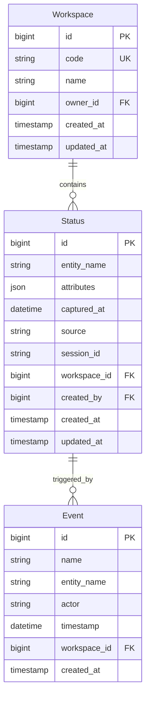

## 1. 概述

本文档描述状态（Status）功能的技术设计，包括数据模型、API 设计等。

### 1.1 背景

状态是实体的属性快照，通过 `entity_name` 和 `captured_at` 与事件关联。状态记录了实体在特定时间点的完整属性信息。

### 1.2 关联产品文档

- [状态管理](../../product/workspaces/status) - 产品功能概述
- [事件管理](./events) - 事件管理（关联实体）

---

## 2. 数据模型

### 2.1 实体关系图



### 2.2 Status 表设计

| 字段名         | 类型/格式          | 约束                                        | 说明                       |
| -------------- | ------------------ | ------------------------------------------- | -------------------------- |
| `id`           | BIGINT AUTO_INCREMENT | PK, NOT NULL                              | 主键，唯一标识             |
| `entity_name`  | VARCHAR(255)       | NOT NULL, INDEX                             | 关联实体，格式 `{type}_{id}` |
| `attributes`   | JSON               | NOT NULL                                    | 属性快照                   |
| `captured_at`  | DATETIME           | NOT NULL, INDEX                             | 状态采集时间               |
| `source`       | VARCHAR(128)       | INDEX                                       | 来源，如 `crm_page_view`   |
| `session_id`   | VARCHAR(64)        | INDEX                                       | 会话 ID                    |
| `workspace_id` | BIGINT             | FK → workspace.id, NOT NULL, INDEX         | 关联的 Workspace           |
| `created_by`   | BIGINT             | FK → users.id, NOT NULL                      | 创建人                     |
| `created_at`   | TIMESTAMP          | NOT NULL, DEFAULT CURRENT_TIMESTAMP         | 创建时间                   |
| `updated_at`   | TIMESTAMP          | NOT NULL, DEFAULT CURRENT_TIMESTAMP ON UPDATE CURRENT_TIMESTAMP | 更新时间 |

**索引设计**：

| 索引名                 | 字段           | 类型      | 说明                      |
| ---------------------- | -------------- | --------- | ------------------------- |
| `idx_st_workspace`     | `workspace_id` | INDEX     | 按 Workspace 快速筛选      |
| `idx_st_entity_name`   | `entity_name`  | INDEX     | 按实体名称筛选            |
| `idx_st_captured_at`  | `captured_at`  | INDEX     | 按采集时间筛选            |
| `idx_st_source`       | `source`       | INDEX     | 按来源筛选                |
| `idx_st_session_id`   | `session_id`   | INDEX     | 按会话 ID 筛选            |
| `idx_st_created_by`     | `created_by`  | INDEX     | 按创建人筛选              |

**约束设计**：

| 约束名                              | 字段                               | 类型      | 说明                       |
| ----------------------------------- | ---------------------------------- | --------- | -------------------------- |
| `uk_st_entity_captured`             | `entity_name, captured_at`         | UNIQUE    | 同一实体在同一时间点唯一   |

---

## 3. API 设计

### 3.1 API 概览

| 类别   | 方法   | 端点                                              | 说明                     |
| ------ | ------ | ------------------------------------------------- | ------------------------ |
| **列表** | GET   | `/api/v1/workspaces/{workspace_code}/status`      | 获取 status 列表         |
| **详情** | GET   | `/api/v1/workspaces/{workspace_code}/status/{id}` | 获取单个 status 详情      |
| **创建** | POST  | `/api/v1/workspaces/{workspace_code}/status`      | 创建新的 status           |
| **更新** | PUT   | `/api/v1/workspaces/{workspace_code}/status/{id}` | 更新 status               |
| **删除** | DELETE | `/api/v1/workspaces/{workspace_code}/status/{id}` | 删除 status（硬删除）     |

### 3.2 列表 API

```
GET /api/v1/workspaces/{workspace_code}/status
```

**查询参数**：

| 参数            | 类型    | 必填 | 说明                        |
| --------------- | ------- | ---- | --------------------------- |
| `page`          | integer | 否   | 页码，默认 1                |
| `page_size`     | integer | 否   | 每页数量，默认 20，最大 100 |
| `entity_name`   | string  | 否   | 实体名称搜索（精确匹配）    |
| `captured_start`| datetime | 否   | 开始时间（ISO 8601 格式）  |
| `captured_end`  | datetime | 否   | 结束时间（ISO 8601 格式）   |
| `source`        | string  | 否   | 来源筛选（精确匹配）        |

**响应**：

```json
{
  "code": 0,
  "message": "ok",
  "data": {
    "items": [
      {
        "id": 1,
        "entity_name": "lead_123",
        "attributes": {
          "name": "张三",
          "phone": "13800138000",
          "status": "跟进中"
        },
        "captured_at": "2026-06-25T10:00:00Z",
        "source": "crm_page_view",
        "session_id": "sess_abc123",
        "workspace_id": 1,
        "created_by": 1,
        "created_at": "2026-06-25T10:00:00Z",
        "updated_at": "2026-06-25T10:00:00Z"
      }
    ],
    "total": 100,
    "page": 1,
    "page_size": 20,
    "total_pages": 5
  },
  "traceId": "xxx",
  "timestamp": 1716969600000
}
```

### 3.3 创建 API

```
POST /api/v1/workspaces/{workspace_code}/status
```

**请求体**：

```json
{
  "entity_name": "lead_123",
  "attributes": {
    "name": "张三",
    "phone": "13800138000",
    "status": "跟进中"
  },
  "captured_at": "2026-06-25T10:00:00Z",
  "source": "crm_page_view",
  "session_id": "sess_abc123",
  "created_by": 1
}
```

**字段验证**：

| 字段           | 规则                                          | 错误信息             |
| -------------- | --------------------------------------------- | ------------------ |
| `entity_name`  | 必填，最大 255 字符，格式 `{type}_{id}`       | "实体名称格式不正确" |
| `attributes`  | 必填，有效 JSON 对象                          | "属性不能为空"       |
| `captured_at` | 必填，有效 datetime 格式                      | "采集时间格式不正确" |
| `source`       | 可选，最大 128 字符                           | -                  |
| `session_id`   | 可选，最大 64 字符                            | -                  |
| `created_by`   | 必填，有效用户 ID                             | "创建人信息不正确"  |

**响应**：

```json
{
  "code": 0,
  "message": "ok",
  "data": {
    "id": 1,
    "entity_name": "lead_123",
    "attributes": {
      "name": "张三",
      "phone": "13800138000",
      "status": "跟进中"
    },
    "captured_at": "2026-06-25T10:00:00Z",
    "source": "crm_page_view",
    "session_id": "sess_abc123",
    "workspace_id": 1,
    "created_by": 1,
    "created_at": "2026-06-25T10:00:00Z",
    "updated_at": "2026-06-25T10:00:00Z"
  },
  "traceId": "xxx",
  "timestamp": 1716969600000
}
```

### 3.4 更新 API

```
PUT /api/v1/workspaces/{workspace_code}/status/{id}
```

**请求体**：

```json
{
  "entity_name": "lead_123",
  "attributes": {
    "name": "张三",
    "phone": "13800138001",
    "status": "已成交"
  },
  "captured_at": "2026-06-25T12:00:00Z",
  "source": "crm_page_view",
  "session_id": "sess_abc123"
}
```

**说明**：

- 所有字段均可更新
- 字段验证规则同创建 API

### 3.5 删除 API

```
DELETE /api/v1/workspaces/{workspace_code}/status/{id}
```

**说明**：

- 执行硬删除
- 删除后数据不可恢复

**响应**：

```json
{
  "code": 0,
  "message": "ok",
  "data": null,
  "traceId": "xxx",
  "timestamp": 1716969600000
}
```

---

## 4. 业务规则

### 4.1 实体名称格式

与 Event 保持一致：

| 格式要求 | 说明                              |
| -------- | --------------------------------- |
| 格式     | `{type}_{id}`                     |
| 示例     | `lead_123`, `user_zhangsan`       |
| type     | 小写字母、数字、下划线             |
| id       | 数字或字符串（业务 ID）            |

### 4.2 属性快照设计

`attributes` 是一个 JSON 对象，存储实体的完整属性：

```json
{
  "name": "张三",
  "phone": "13800138000",
  "email": "zhangsan@example.com",
  "company": "示例公司",
  "status": "跟进中",
  "tags": ["VIP", "重点客户"]
}
```

**设计原则**：

- 属性是全量快照，而非增量更新
- 每次状态变更都记录完整属性
- 通过 `captured_at` 区分不同时间点的状态

### 4.3 来源标识

| 来源           | 说明                              |
| -------------- | --------------------------------- |
| `crm_page_view` | CRM 页面浏览                      |
| `form_submit`   | 表单提交                         |
| `api_sync`      | API 同步                         |
| `manual`        | 手动创建                         |
| `event_trigger` | 事件触发                         |

### 4.4 数据保留策略

| 策略   | 说明                                           |
| ------ | ---------------------------------------------- |
| 硬删除 | 用户删除后数据立即物理删除，不可恢复           |
| 唯一性 | 同一 `entity_name + captured_at` 组合唯一       |

---

## 5. 错误码设计

| 错误码 | 说明                  | HTTP 状态码 |
| ------ | --------------------- | ----------- |
| 0      | 成功                  | 200         |
| 1001   | 参数验证失败          | 400         |
| 1002   | 未授权                | 401         |
| 1003   | 禁止访问              | 403         |
| 2001   | Status 不存在          | 404         |
| 2002   | 状态已存在            | 409         |
| 3001   | Workspace 不存在      | 404         |
| 3002   | Workspace 无访问权限  | 403         |
| 9001   | 服务器内部错误        | 500         |

---

## 🔗 相关文档

- [状态管理](../../product/workspaces/status) - 产品功能概述
- [事件管理](./events) - 事件管理技术设计
- [状态机设计](../state-machine) - 状态机设计规范
